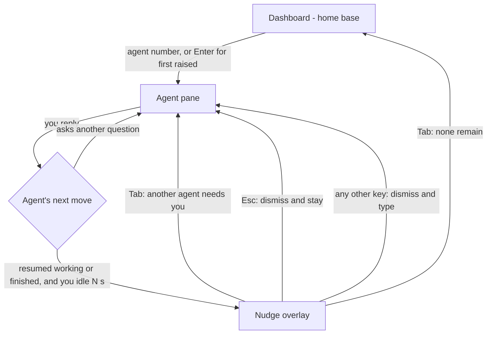

# Dashboard as Home Base — Requirements

## Summary

Make the dashboard fly's home base and the hub of an attention-triage loop. The
app opens to it and rests on it; you jump to an agent that needs you by its
number (or Enter for the first one raised); and once you've handled that agent, a
permeable nudge overlay rotates you with Tab to the next agent needing attention,
or back home when none remain.

---

## Problem Frame

The working pattern is 3–5 agents running at once, and the only reason to return
to any one of them is that it needs attention. The rest of the time, watching an
individual pane is wasted effort.

Today the dashboard is a surface you summon with a hotkey and that hides the
terminal grid while it's up. Nothing brings you *to* it — after you answer an
agent, you're left sitting in that pane with no signal to move on, so finding the
next agent that needs you is manual hunting across tabs and workspaces. The
dashboard is treated as a side panel you visit, not the place you operate from.

The shift is to make the dashboard the center: the resting state you launch into
and return to, with the app actively routing you between the agents that are
calling for you and back home when the queue is clear.

---

## Key Decisions

- **Dashboard is the home base, not a toggled panel.** It is the launch view, the
  resting state when nothing needs you, and the terminus of the rotation. It stays
  summonable/dismissable as it is today, but its default role flips from "side
  surface you open" to "place you operate from."

- **The nudge fires only when the agent stops needing you.** After you reply, the
  nudge waits until the agent has clearly moved on — it resumed working *or* it
  finished/went idle — and you've been idle for N seconds. It stays silent if the
  agent instead comes back with another question, so it never pulls you out of an
  active exchange. Covering the finished/idle case too means you're never stranded
  on a completed agent.

- **Type-through capture over a true modal.** The nudge captures the keyboard so
  bare Tab can rotate, but it is permeable: any real keystroke drops you straight
  back into the agent with no lost input. This keeps Tab's normal in-pane meaning
  intact — Tab only means "rotate" during the brief nudge window — and means the
  nudge can never trap you.

- **Stable per-agent numbers, raised agents highlighted.** Each agent's jump
  number reflects its fixed position in the flattened workspace→tab→pane order, so
  muscle memory works; the agents needing attention are highlighted rather than
  renumbered into a compact list.

---

## Key Flows

- F1. Triage from mission control.
  - **Trigger:** You're at the dashboard and one or more agents need attention.
  - **Steps:** Scan the highlighted agents; press an agent's number to jump to it,
    or press Enter to jump to the first one needing attention.
  - **Outcome:** You're focused on that agent, ready to respond.
  - **Covers:** R4, R5, R6, R7, R8

- F2. Handle and advance.
  - **Trigger:** You're focused on an agent and send it a reply.
  - **Steps:** The agent stops needing you (resumes working or finishes); after N
    idle seconds the nudge appears; you press Tab to rotate onward, type to stay
    with this agent, or Esc to dismiss the nudge.
  - **Outcome:** You move to the next agent needing attention — or back to the
    dashboard when the queue is clear — without hunting for it.
  - **Covers:** R9, R10, R11, R12, R13, R14, R15

- F3. Resting and launch.
  - **Trigger:** App launch, or the rotation finds no agent needing attention.
  - **Steps:** The dashboard is shown; agents keep running in the background; their
    attention states surface as highlights on the dashboard.
  - **Outcome:** The dashboard is your home base between interactions.
  - **Covers:** R1, R2, R3

---

## Requirements

**Dashboard home base & triage launchpad**

- R1. fly opens to the dashboard on launch, not to the last active pane; restored
  panes still spawn and run hidden behind it.
- R2. The dashboard is the resting state — shown whenever you're not in a pane and
  no navigation is active — and the rotation returns to it when no agent needs
  attention.
- R3. The dashboard stays summonable and dismissable via its existing toggle.
- R4. Each agent shown on the dashboard has a number reflecting its fixed position
  in the flattened workspace→tab→pane order; an agent's number does not change as
  attention states change.
- R5. Agents currently needing attention are visually distinguished from the rest
  on the dashboard.
- R6. Pressing an agent's number from the dashboard moves focus to that agent,
  wherever it lives (its workspace, tab, and pane).
- R7. Pressing Enter from the dashboard moves focus to the first agent needing
  attention in rotation order; it is a no-op when no agent needs attention.
- R8. Numbers cover the first ten agents (1–9 then 0); any agents beyond that are
  reachable by click or by Tab rotation rather than a number key.

**Attention nudge & rotation**

- R9. After you engage the focused agent, once it stops needing you — it resumed
  working or it finished/went idle — and you have not typed for N seconds, a nudge
  overlay appears on that pane.
- R10. The nudge does not appear if the agent instead comes back needing you
  (re-raises with a question or permission prompt); you answer it in place.
- R11. The nudge appears only for the pane you are currently viewing; agents that
  raise attention in the background do not trigger a nudge — they surface on the
  dashboard and enter the rotation.
- R12. While the nudge is showing, Tab rotates to the next agent needing attention
  in stable rotation order, or to the dashboard when none remain.
- R13. While the nudge is showing, Esc dismisses it and keeps you on the current
  agent.
- R14. While the nudge is showing, any key other than Tab or Esc dismisses it and
  passes through to the agent, with no keystroke lost.
- R15. Outside the nudge window, Tab passes through to the PTY as normal; the
  rotate-on-Tab behavior is scoped to the nudge.
- R16. The idle delay N before the nudge appears has a sensible default and is
  configurable.

---

## Acceptance Examples

- AE1. **Covers R9.** Given you're focused on an agent and just sent a reply; when
  the agent starts working and you don't type for N seconds; then the nudge appears
  on that pane.
- AE2. **Covers R9.** Given you replied "ship it" and the agent finishes with no
  further work; when N seconds pass with no typing; then the nudge still appears,
  so you aren't stranded on a completed agent.
- AE3. **Covers R10.** Given you replied and the agent immediately comes back with
  a follow-up question; then no nudge appears and you answer it in place.
- AE4. **Covers R12.** Given the nudge is showing and two other agents also need
  attention; when you press Tab; then focus moves to the next one in rotation
  order.
- AE5. **Covers R12.** Given the nudge is showing and no other agent needs
  attention; when you press Tab; then you land on the dashboard.
- AE6. **Covers R14.** Given the nudge is showing; when you start typing a
  follow-up to the same agent; then the nudge dismisses and your keystrokes reach
  the agent with none lost.
- AE7. **Covers R13.** Given the nudge is showing; when you press Esc; then the
  nudge dismisses and you stay on the current agent.

---

## Scope Boundaries

- An always-docked / ambient attention rail alongside the panes — the choice is a
  full-surface home base you switch to, not a persistent strip.
- Auto-advance: the nudge never rotates you on its own. It waits for your Tab; the
  loop is always keypress-driven.
- No changes to the OS-notification behavior, the suppression matrix, or the
  backend attention/lifecycle pipeline — this is a frontend navigation layer built
  on the signals those already emit.

---

## Dependencies / Assumptions

- The nudge trigger needs the focused pane's activity/lifecycle signal (busy↔idle,
  finished) while the dashboard is closed. Today the per-pane activity poll runs
  only while the dashboard is open, whereas attention transitions stream
  continuously. Planning sources the trigger from the streamed attention signal
  and/or extends polling to the focused pane when the dashboard is closed — the
  needed signals already exist (`workingForMs`, `lastOutputAgoMs`,
  `AttentionReason` including `finished`, `AgentStatus`).
- Reuses existing primitives: the flattened raised-pane ordering, the stale-ping
  downgrade that already keeps parked agents out of the "waiting" set, and the
  existing focus-routing into a workspace/tab/pane.
- The existing dashboard toggle and cycle-attention hotkey remain; this builds on
  them rather than replacing them.

---

## Outstanding Questions

**Deferred to planning**

- The default value of N and its config key.
- Whether Esc should also pass through to the agent (e.g. as an interrupt) instead
  of only dismissing-and-staying; the current decision is dismiss-and-stay, worth
  revisiting if interrupting an agent right after replying turns out to be common.
- Number overflow handling for more than ten concurrent agents (click/Tab only, or
  a paging scheme).
- The exact trigger source while the dashboard is closed (lean on the attention
  stream vs. extend the activity poll to the focused pane).
- Whether the rotation set should include agents whose attention has gone stale,
  or strictly the currently-raised set.

---

## Sources / Research

Current behavior confirmed against the codebase (breadcrumbs for planning):

- Dashboard toggle and full-surface render: `toggleHome` and the `homeViewOpen`
  render block in `src/App.svelte`; grid hidden via `class:hidden={homeViewOpen}`
  with panes kept mounted; hotkey in `src/lib/keymap.ts`.
- No auto-return / no view-routing reaction to attention exists today: `onAttention`
  in `src/App.svelte` only updates attention/engagement state; the only effects
  referencing `homeViewOpen` gate polling and usage fetch.
- Cross-pane attention cycling: `cycleAttention` in `src/App.svelte` over
  `flattenRaised` in `src/lib/workspaces.ts` (stable workspace→tab→leaf order),
  bound to the cycle-attention hotkey in `src/lib/keymap.ts`.
- Trigger signals: `PaneActivity` (`workingForMs`, `lastOutputAgoMs`,
  `liveTaskCount`) and `AttentionState` / `AttentionReason` in `src/ipc.ts`;
  per-row `AgentStatus` computed in `src/lib/home.ts`; stale-ping downgrade in
  `effectiveAttention` (`src/lib/home.ts`).
- Launch view: `homeViewOpen` initializes false and `restore()` in `src/App.svelte`
  does not set it, so launch shows the grid (`src/lib/serialize.ts` has no such
  field).
- Activity poll gated on the dashboard being open in `src/App.svelte`.
- Tab is unbound in `BINDINGS` (`src/lib/keymap.ts`) and passes through to the PTY,
  so a nudge-scoped Tab interception needs no global binding change.
- Focus routing: `focusPane` / `focusActivePane` in `src/App.svelte`.
