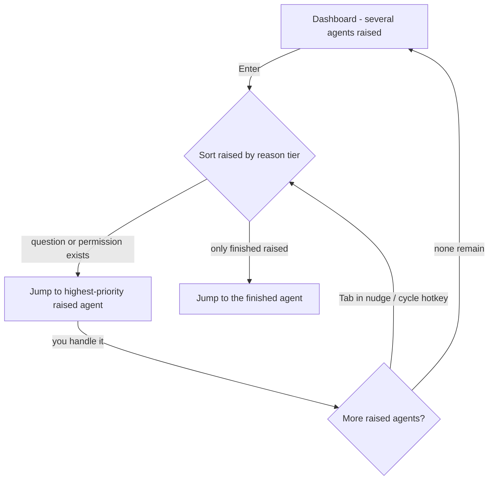

# Reason-Typed Attention Triage — Requirements

## Summary

Teach fly to tell *why* an agent needs you — question, permission, or finished —
and drive triage from it. Each raised agent shows a reason badge, and the default
landing (Enter) and rotation visit the fast-unlock reasons (question, permission)
before the slow-turnaround one (finished). Stable jump numbers are unchanged.

---

## Problem Frame

The working pattern is 3–5 agents running at once, and when several need you at
the same time, the right one to attend to first depends on *why* it's calling.
A question or a permission prompt is a fast unlock — a few seconds of your input
and the agent is moving again, so answering it sooner recovers the most value. A
finished agent is a longer turnaround: reviewing the work and handing over the
next task is a bigger context switch you don't want to be forced into first.

Today fly can't make that distinction. It installs only the `Notification` and
`Stop` hooks and collapses every `Notification` to a single "permission" reason,
so a waiting-for-input question and a permission prompt are indistinguishable,
and the dashboard tells you *that* an agent needs you but never *why*. When three
agents are raised you have to open each one to find out which is the cheap unlock.
The `Reason` enum already carries `Question`/`Permission`/`Finished`/`Error`
variants — the machinery exists, but nothing feeds the distinction and nothing
surfaces it.

---

## Key Decisions

- **Reason-typed triage, not an activity feed.** The pain is *why* an agent needs
  you, not *what it has been doing*. fly surfaces the reason and orders triage by
  it; it does not build a per-agent event timeline. The external observability
  repo that prompted this inspires the reason-richness (its `notification_type`
  split), not its architecture.

- **Smart default jump over labels-only.** Reasons drive ordering, not just
  display: Enter and rotation go payoff-first. But jump numbers stay positional
  so muscle memory holds — the ordering changes where the *default* lands, never
  what a given number means.

- **Priority: question ≈ permission, then finished.** Question and permission are
  co-equal at the top (both fast unlocks); finished sits below. Within a tier,
  order falls back to the existing stable workspace→tab→pane position.

- **Derive the reason from the hook payload.** The permission-vs-question split
  comes from the `Notification` payload's `notification_type` (`permission_prompt`
  vs `idle_prompt`) rather than a fixed per-event reason wired at hook-setup time;
  `Stop` still yields finished. This is the one enabling change the rest sits on,
  and the split is reliable — `notification_type` is a first-class field.

- **Defer Error.** No Claude Code hook cleanly means "the agent errored and is
  stuck waiting on you" — the candidates (a single tool failure, or a stall
  timeout) are noisy or heuristic. Ship the three reliably-distinguishable
  reasons; leave the `Error` variant unfed until there's a trustworthy signal.

- **This edits the home-base brainstorm.** Two decisions in
  `docs/brainstorms/2026-06-30-dashboard-home-base-requirements.md` change from
  positional to payoff order: R7 (Enter → first raised) and R12 (nudge
  Tab-rotation). R4 (stable numbers) is preserved unchanged.

---

## Key Flows

- F1. Payoff-ordered triage from the dashboard.
  - **Trigger:** You're at the dashboard and two or more agents are raised with
    mixed reasons.
  - **Steps:** Each raised agent shows its reason badge; you press Enter (or a
    stable number to override), landing on the highest-priority reason first.
  - **Outcome:** You spend your first attention on the cheapest, highest-value
    unlock rather than hunting for it.
  - **Covers:** R4, R7, R8, R10

- F2. Reason-aware rotation onward.
  - **Trigger:** You've handled the focused agent and other agents are still raised.
  - **Steps:** Rotation (Tab in the nudge overlay, or the cross-pane cycle hotkey)
    advances to the next raised agent in triage order — questions and permissions
    before finished — or back to the dashboard when none remain.
  - **Outcome:** You clear the raised set fast-unlocks-first without manual hunting.
  - **Covers:** R7, R9

---

## Requirements

**Reason detection**

- R1. fly distinguishes three attention reasons for a raised agent: question (the
  agent is waiting for your input), permission (the agent is requesting
  permission), and finished (the agent ended its turn or went idle).
- R2. The permission-vs-question split is derived from the `Notification`
  payload's `notification_type` (`permission_prompt` → permission, `idle_prompt` →
  question) rather than a fixed reason wired at setup time; the `Stop` event yields
  finished.
- R3. Error is not produced in v1; the reasons surfaced are question, permission,
  and finished only. The `Reason::Error` variant remains unfed.

**Reason on the dashboard**

- R4. Each raised agent on the dashboard shows a badge identifying its reason,
  visually distinct across question, permission, and finished.
- R5. An agent's jump number still reflects its fixed workspace→tab→pane position
  and does not change as its reason changes (preserves home-base R4).
- R6. Only raised agents carry a reason badge; non-raised agents show none.

**Payoff-ordered triage**

- R7. Triage priority ranks question and permission (co-equal, fast unlock) ahead
  of finished (slow turnaround); within a tier, order falls back to stable
  positional order.
- R8. Pressing Enter from the dashboard jumps to the highest-priority raised agent
  in triage order (updates home-base R7 from positional to payoff order); it is a
  no-op when no agent is raised.
- R9. Rotation — Tab in the nudge overlay and the cross-pane attention cycle —
  visits raised agents in triage order rather than positional order (updates
  home-base R12 and the existing cycle behavior).
- R10. A number key still jumps to that agent by its stable number regardless of
  reason or triage priority.

---

## Acceptance Examples

- AE1. **Covers R7, R8.** Given two agents are raised, one with a question and one
  finished; when you press Enter; then focus lands on the agent with the question.
- AE2. **Covers R7.** Given a question and a permission are both raised; when you
  press Enter; then focus lands on whichever comes first in stable positional
  order, since the two reasons are co-equal.
- AE3. **Covers R9.** Given the nudge overlay is showing and both a question and a
  finished agent are raised elsewhere; when you press Tab; then focus advances to
  the question before the finished agent.
- AE4. **Covers R4.** Given one agent is waiting for your input and another is
  requesting permission; then the dashboard shows a distinct question badge on the
  first and a permission badge on the second.
- AE5. **Covers R5, R10.** Given an agent's reason changes from finished to
  question; then its jump number is unchanged and that number key still lands on it.
- AE6. **Covers R3.** Given a focused agent's tool call fails but the agent
  recovers on its own; then no error badge appears and no attention is raised from
  the failure.

---

## Scope Boundaries

**Deferred for later**

- A per-agent activity timeline — the tool-emoji event stream, live pulse chart,
  and chat-transcript viewer from the external repo. Reason-typing is the win here;
  the activity feed is a separate, heavier direction.
- Error as a produced reason, pending a trustworthy signal (tool-failure noise vs.
  a stall heuristic).
- Enriching the OS desktop notification or pane-ring text with the reason. The
  core surface is the dashboard badge and triage ordering; carrying the reason into
  the ring/notification is a cheap follow-on, not part of v1.

**Outside this product's identity**

- A central observability server — HTTP event ingest, SQLite storage, WebSocket
  broadcast, multi-app/multi-machine aggregation. fly is a local single-user
  desktop terminal that already aggregates its agents in-process over the
  authenticated Unix socket; rebuilding that client-server layer duplicates what
  fly has and mismatches its model.

---

## Dependencies / Assumptions

- **Notification payload distinguishes permission from waiting-for-input
  (confirmed).** The permission-vs-question split (R2) rests on the `Notification`
  payload's `notification_type` field, whose values include `permission_prompt` and
  `idle_prompt`. Confirmed against the Claude Code hooks guide and corroborated by
  the external repo; this is no longer an open assumption.
- **Question can only be told from finished via the idle Notification (confirmed).**
  The `Stop` payload carries no field indicating whether a turn ended with a
  question or a completed task. So a question ends as finished on `Stop` and only
  becomes question when the later `idle_prompt` `Notification` arrives after an idle
  delay — meaning a question sits as finished until then. This is structural, not a
  tunable; assumed acceptable.
- **Builds on existing primitives.** The `Reason` enum, the Hook-tier signal path,
  `flattenRaised` stable ordering, the cross-pane cycle, the home-base dashboard
  rows/badges, and the nudge overlay all exist; this feeds and orders them rather
  than adding new pipeline stages.
- **`fly notify` already receives the piped hook JSON** via its `--claude` path;
  deriving the reason from that payload rather than a hardcoded per-event reason is
  the enabling change.

---

## Outstanding Questions

**Deferred to planning**

- The finished→question latency is inherent (`Stop` has no completion-type field,
  so only the later `idle_prompt` upgrades the reason). Planning decides whether to
  live with it or add a heuristic (e.g. inspect the last message at `Stop`) — the
  heuristic is brittle and optional, not required for the feature to work.
- Whether the reason badge should also tint the pane ring / tab indicator for
  consistency (likely yes, low cost, but outside the core).
- Confirmation that within-tier tie-break should stay stable-positional (assumed).

---

## Sources / Research

- **External inspiration:**
  `github.com/disler/claude-code-hooks-multi-agent-observability` — captures all 12
  Claude Code hook events (its `Notification` carries `notification_type` with
  `permission_prompt` vs `idle_prompt`), POST → Bun/SQLite → WebSocket → Vue
  dashboard with a tool-emoji event timeline, session swim lanes, and a live pulse
  chart. fly borrows the reason-richness (the notification-type split), not the
  server architecture.
- **Hook setup and events:** `src-tauri/src/cli/hooks.rs` — `CLAUDE_HOOK_EVENTS`
  installs only `Notification` → `Permission` and `Stop` → `Finished`; hook command
  is `"<fly>" notify <reason> --claude`, with the reason fixed per event at setup.
- **Payload parsing (enabling change lives here):** fly already parses the piped
  Claude payload in `src-tauri/src/cli/notify.rs` (`parse_claude_payload()`); today
  it maps to the fixed reason. Deriving the reason from `notification_type` is the
  change. The Claude Code hooks guide (`code.claude.com/docs/en/hooks-guide`)
  documents `notification_type` (`permission_prompt` / `idle_prompt`) on
  `Notification` and confirms `Stop` has no completion-type field.
- **Reason enum, tiers, state machine:** `src-tauri/src/state/attention.rs` —
  `Reason::{Question,Permission,Finished,Error}`; `Tier::{Hook,Cli,Bel,Osc}`;
  `AttentionState` Idle→Raised→Acknowledged.
- **Hook socket payload:** `src-tauri/src/hooks/protocol.rs` — `token` + `reason`
  plus optional `title`/`body`/`session_id`/`cwd`.
- **Dashboard model:** `src/lib/home.ts` — `AgentRow` with `status` /
  `workingForMs` / `liveTaskCount` / `num`; status precedence raised → "waiting".
- **Triage ordering and rotation:** `flattenRaised` in `src/lib/workspaces.ts`;
  `cycleAttention`, `focusPane`, `homeViewOpen` in `src/App.svelte`; bindings in
  `src/lib/keymap.ts`.
- **Home-base brainstorm this modifies:**
  `docs/brainstorms/2026-06-30-dashboard-home-base-requirements.md` — R7 (Enter →
  first raised), R12 (nudge Tab-rotation), R4 (stable numbers).
- **No persistent event history today:** the hook socket processes and emits
  notifications but does not log the event stream — context for why the activity-
  timeline direction is deferred rather than nearly-free.
</content>
</invoke>
