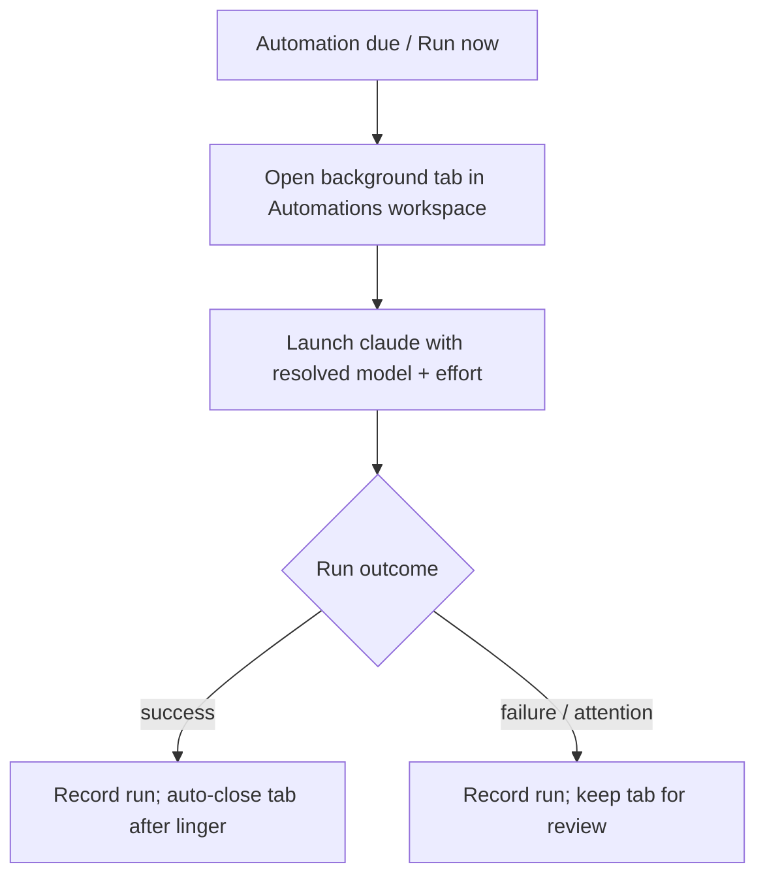

# Automations: dedicated workspace + configurable model

## Summary

Give automation agent runs a dedicated home and a pinned model. Runs open in a
single, persistent Automations workspace instead of littering task-focused
workspaces, tidy themselves up when they finish cleanly, and launch with a model
and reasoning effort configured per automation — rather than inheriting whatever
model was last selected in Claude Code.

---

## Problem Frame

Automation agent runs open as background tabs, and they land in the workspace
where each automation was *created* (its stored origin), falling back to the
first workspace when that origin no longer resolves. Workspace ids are in-memory
only, so that fallback is common after a restart — which is why placement feels
random. The tabs are never removed on their own: a finished run's tab stays open
until the user closes it or restarts the app. As a handful of automations
accumulate, their runs pile into workspaces that were focused on unrelated
tasks.

Separately, a run launches `claude` with no model flag, so it inherits whatever
model was last selected in the Claude Code UI. A routine nightly automation can
silently run on an expensive model, or an important one on a cheap model, with
no per-automation control and no visible record of which model a given run used.

---

## Key Decisions

- **Dedicated Automations workspace, keyed by a durable marker.** All agent runs
  land in one Automations workspace instead of the origin workspace. Because the
  runtime workspace id is in-memory only, the workspace is identified by a
  persistent role marker that survives restart, not by its id. This same
  workspace also hosts the automation alerts-log tab and manually-triggered runs,
  so it is the single home for automation activity.

- **Auto-close successful runs, keep failures.** A run that finishes cleanly
  removes its own tab after a brief linger; a run that fails or raises attention
  keeps its tab for review. This resolves a product decision the code currently
  parks (auto-close-on-Stop, kept until manual close). Combined with quarantining
  runs out of task workspaces, it keeps the Automations workspace navigable as
  volume grows.

- **Deterministic model, resolved in a fixed order.** Model and reasoning effort
  resolve per-automation first, then a shared automations default, then Claude
  Code's own configured default. The resolved values are always passed explicitly
  at launch, so a run never inherits the last interactive model pick. The model
  and effort a run actually used are recorded and shown, so the choice is never a
  surprise.

- **Model and reasoning are Agent-mode only.** Script-mode automations run no
  agent, so there is nothing to configure there.

- **Graceful degradation for unattended runs.** Because no human is present to
  re-pick, an over-quota or unavailable model falls back through a model chain
  rather than failing the run silently.

---

## Requirements

### Dedicated Automations workspace

- R1. Every automation agent run opens its tab in a single dedicated Automations
  workspace, not the workspace the automation was created in.
- R2. The Automations workspace is identified by a durable marker that survives
  app restart, not by the in-memory workspace id, so runs land there reliably
  across sessions.
- R3. The Automations workspace is provisioned automatically when a run needs it
  and none exists, and re-created if the user has deleted it. Only one exists at
  a time.
- R4. The automation alerts-log tab lives in the Automations workspace rather
  than falling into the first workspace.
- R5. Manually-triggered ("Run now") agent runs land in the Automations
  workspace on the same terms as scheduled runs.

### Run lifecycle

- R6. When an agent run finishes successfully, its tab closes automatically after
  a brief linger.
- R7. When an agent run fails or raises attention, its tab stays open in the
  Automations workspace until the user closes it.
- R8. A run's durable history — status, output tail, and the model and effort it
  used — remains available in the automations dashboard whether or not its tab
  auto-closed.

### Per-automation model and reasoning

- R9. Each Agent-mode automation can specify the model it launches with, as an
  alias (`sonnet`, `opus`, `haiku`, `fable`) or a full model id.
- R10. Each Agent-mode automation can specify the reasoning effort it launches
  with (`low`, `medium`, `high`, `xhigh`, `max`).
- R11. A launched run applies its resolved model and effort deterministically,
  overriding whatever model was last selected interactively in Claude Code.
- R12. Model and effort resolve in order: the automation's own setting, else a
  shared automations default, else Claude Code's configured default.
- R13. The model and effort a run actually used are recorded on the run and shown
  in the dashboard.
- R14. `fly automation create` and the automation edit path accept optional model
  and effort settings.
- R15. When the chosen model is unavailable or over quota, an unattended run
  degrades through a fallback model chain rather than hard-failing silently.

---

## Key Flow

- F1. Agent run dispatch
  - **Trigger:** A scheduled occurrence fires, or the user picks "Run now".
  - **Steps:** The Automations workspace is resolved (created if absent); a
    background tab is appended there without stealing focus; the agent launches
    with the automation's resolved model and effort (and a fallback chain).
  - **Outcome:** On clean finish the run is recorded and the tab auto-closes
    after a linger; on failure or attention the run is recorded and the tab
    stays for review.
  - **Covers:** R1, R3, R5, R6, R7, R8, R11, R12, R15

---

## Acceptance Examples

- AE1. Lifecycle by outcome
  - **Covers R6, R7.**
  - **Given** an agent run in the Automations workspace, **when** it finishes
    successfully, **then** its tab closes after a brief linger.
  - **Given** an agent run that fails or raises attention, **when** it ends,
    **then** its tab stays open in the Automations workspace.

- AE2. Model resolution
  - **Covers R11, R12, R13.**
  - **Given** an automation with model `haiku` and effort `low`, **when** it runs
    while the Claude Code UI last used `opus`, **then** the run launches on
    `haiku`/`low` and the dashboard records `haiku`/`low`.
  - **Given** an automation with no model set and a shared default of
    `sonnet`/`medium`, **when** it runs, **then** it launches on `sonnet`/`medium`.
  - **Given** an automation with no model set and no shared default, **when** it
    runs, **then** it inherits Claude Code's configured default and the dashboard
    shows the model actually used.

- AE3. Workspace recreation
  - **Covers R3.**
  - **Given** the user has deleted the Automations workspace, **when** the next
    agent run fires, **then** the workspace is recreated and the run lands there.

- AE4. Fallback on unavailable model
  - **Covers R15.**
  - **Given** an automation whose primary model is over quota, **when** it runs
    unattended, **then** the fallback model runs and the run is recorded with the
    model actually used.

---

## Scope Boundaries

- General per-workspace routing rules for non-automation panes — not building;
  just the one Automations home.
- Model and effort for Script-mode automations — not applicable (no agent).
- A full model-management or usage/quota UI beyond a per-automation picker and a
  single shared default.
- Persisting runtime workspace ids — unnecessary; the durable role marker carries
  identity across restarts.

---

## Dependencies / Assumptions

- Assumes the installed `claude` supports `--model` (long-standing), `--effort`
  (recent), and `--fallback-model`. Older Claude Code versions may reject
  `--effort`; version-skew handling is a planning question.
- The Automations-workspace role marker must persist through session
  serialization (the `serialize.ts` save/migrate path).
- The shared automations default lives in fly's own config, distinct from Claude
  Code's `model`/`effortLevel` settings.
- "Attention" for keep-open (R7) is expected to reuse the existing alert
  classification rather than a new signal — to confirm in planning.

---

## Outstanding Questions

Deferred to planning:

- Whether the shared automations default is a single model+effort pair or two
  independently-defaulting knobs (proposed: a single pair, overridable per
  automation).
- The auto-close linger duration for successful runs (R6).
- Whether the Automations workspace is pinned, ordered, or visually marked in the
  sidebar, and whether it is user-deletable (R3).
- Where per-automation model/effort and the shared default persist, and their
  serde shape across the store, socket, and dashboard.
- How to handle `--effort` on a `claude` version that predates the flag.

---

## Sources / Research

- Current placement: `src/lib/automation-panes.ts:11-23` (`resolveTargetWorkspace`),
  `src/App.svelte:580-608` (`handleAgentRun`), `src-tauri/src/automations/mod.rs:187-193`
  (origin hint sourced from `a.origin.workspace_id`).
- Tabs are not auto-closed today (parked decision): `src/App.svelte:578-579`.
- Hardcoded agent argv, no model flag: `src/App.svelte:599-602`
  (`["claude", "--dangerously-skip-permissions", ev.prompt]`).
- Automation model and Agent mode: `src-tauri/src/automations/model.rs:49-74`
  (`Mode::Agent { prompt }`), `:154-178` (`Automation` struct).
- Create CLI fields (no `--model`): `src-tauri/src/cli/automation.rs:206-339`.
- Workspace identity is in-memory only: `src/lib/workspaces.ts:28-34`,
  `src/App.svelte:136-139` (`makeWorkspace`).
- Alerts-sink tab also lands in `workspaces[0]`: `src/App.svelte:616-643`
  (`resolveTargetWorkspace(workspaces, "")`).
- Claude Code flags — `--model`, `--effort` (`low`..`max`), `--fallback-model`:
  https://code.claude.com/docs/en/cli.md and https://code.claude.com/docs/en/settings.md
