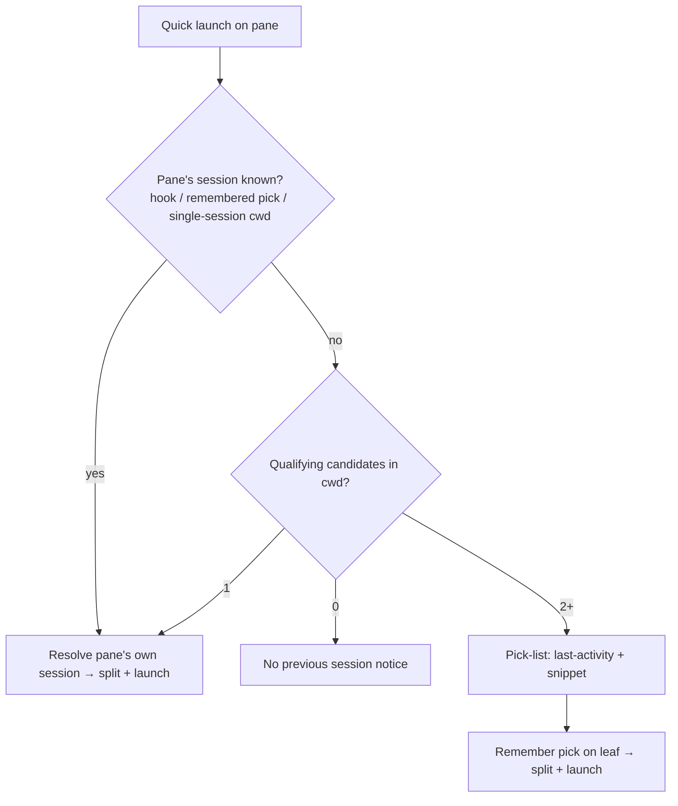

# Quick Launch Session Attribution — Requirements

## Summary

Make quick launch (and crash-resume) act on a pane's *own* Claude session, not
whichever transcript in the shared working directory wrote most recently. Add a
capture-only `SessionStart` hook that tags each session to its exact pane at
birth, demote the cwd-level poll to an abstaining fallback, and — when two live
sessions genuinely share a cwd and fly can't be sure — present a pick-list
instead of guessing.

---

## Problem Frame

Quick launch resolves a pane's previous session from its durable resume record.
That record's session id is captured two ways, and one of them is
cwd-ambiguous. The always-on poll (`active_session_for_cwd`) reads
`~/.claude/projects/<encoded-cwd>/` and picks the **newest-mtime** transcript —
a signal keyed on the directory alone, with nothing pane-specific in it. When
two `claude` sessions run in the same directory, both panes' records get pointed
at whichever session wrote last, and the "winner" flips as the two take turns
being active.

The observed failure: two sessions open in one repo, pane A newer than pane B.
Firing quick launch from pane B picked up **pane A**'s session — because both
leaves' records had been overwritten with A's transcript, and handoff faithfully
resolved the wrong one. The failure is silent: a confident handoff to the wrong
context, not an error.

The pane-precise signal that exists today — Claude's Notification/Stop hook,
attributed to the exact pane by `FLY_PANE_TOKEN` — fires only after the first
such event, far too late to protect an early launch. And the mapping cannot be
recovered after the fact: a running `claude` keeps its transcript file closed
and exposes no session id in its environment, so there is no pid→session trail
on disk or in `/proc`.

---

## Key Decisions

- **Capture at the hook, not after the fact.** Post-hoc pid→session attribution
  is impossible (verified: no open transcript fd, no session id in environ), so
  the only precise, pane-specific signal is a hook carrying the id tagged by the
  pane token. `SessionStart` is the earliest such hook and fires for hand-typed
  `claude` too, since it inherits the pane token from its shell.
- **Precise-over-guess precedence; never silently wrong.** The cwd-newest-mtime
  poll is demoted to a fallback that must **abstain** when the cwd holds more
  than one live session, so it can never overwrite a pane's real session with a
  sibling's. A precise capture always wins over a poll guess.
- **Pick-list only when genuinely ambiguous; remember the pick.** The
  two-keystroke path stays zero-prompt for the single-session case;
  disambiguation surfaces only when fly truly can't tell, and the user's choice
  is bound to the leaf so it isn't asked twice.
- **Fix the capture root, not just handoff.** The same cwd-keyed cause underlies
  crash-resume, so correcting capture fixes both from one place.
- **Graceful degrade over forced migration.** Installs that haven't re-run `fly
  hooks setup` fall back to the ambiguity-aware poll plus the pick-list rather
  than being blocked or nagged into re-setup.

---

## Requirements

**Capture and attribution**

- R1. fly installs a capture-only `SessionStart` Claude hook that reports a
  session's id to its originating pane at session start, attributed by the pane
  token like the existing Notification/Stop hooks.
- R2. `SessionStart` capture raises no attention — no ring, no OS notification,
  no notification-history entry. It only updates the pane's resume record.
- R3. Session-id capture is pane-precise: a pane's resume record holds the id of
  the session that pane is running, never a sibling's, even when several live
  sessions share the working directory.
- R4. When more than one live session shares a pane's cwd, the poll captures
  **no** id for that pane — an ambiguous cwd yields abstention, not a
  newest-mtime guess.
- R5. A precise capture (hook or a remembered pick) is authoritative; the poll
  never overwrites it with a cwd-level guess.

**Disambiguation at launch**

- R6. When quick launch fires on a pane whose session can't be determined with
  confidence, fly presents a pick-list of the cwd's candidate sessions instead
  of launching against a guess.
- R7. Each candidate is identified well enough to recognize — at minimum its
  last-activity time and a recent-turn snippet.
- R8. Selecting a candidate proceeds with handoff exactly as if that session had
  been precisely captured.
- R9. When the pane's cwd holds only one qualifying session (the common case),
  quick launch stays zero-prompt — no pick-list appears.
- R10. A pick is remembered: fly binds the chosen session to the pane's leaf so
  a later launch from the same pane does not re-prompt, until a precise capture
  supersedes it.

**Failure and compatibility**

- R11. If no candidate qualifies (no transcript with a real conversation turn in
  the cwd), quick launch shows the existing "no previous session" notice — it
  never presents an empty pick-list.
- R12. On installs that predate the `SessionStart` hook, attribution degrades to
  the ambiguity-aware poll plus the pick-list; fly does not force or nag a
  re-setup.
- R13. Because the fix lives in the capture layer, crash-resume resolves each
  pane to its own session under the same multi-session-same-cwd conditions.

---

## Key Flows

- F1. Precise launch (common path)
  - **Trigger:** Quick launch on a pane whose session is known — either the
    cwd holds one session, or `SessionStart` already tagged the pane.
  - **Steps:** fly resolves the pane's own session from its resume record;
    splits alongside and launches as today.
  - **Outcome:** The correct session is handed off with no prompt.
- F2. Ambiguous launch → pick-list
  - **Trigger:** Quick launch on a pane whose cwd holds more than one live
    session and no precise capture has landed yet.
  - **Steps:** fly lists the cwd's candidate sessions (last-activity + snippet);
    the user picks the one this pane is; handoff proceeds against it; the pick is
    remembered on the leaf.
  - **Outcome:** The intended session is handed off; a second launch from the
    same pane does not re-prompt.
- F3. No session to hand off
  - **Trigger:** Quick launch on a pane with no qualifying session in its cwd.
  - **Outcome:** No pane spawns; the existing "no previous session" notice
    shows (unchanged from the session-handoff plan).

---

## Acceptance Examples

- AE1. Covers R3, R9. Given pane A and pane B in the same repo with A the more
  recently active, and `SessionStart` has tagged each pane, when quick launch
  fires from pane B, then B's own session is handed off with no prompt. (The
  reported bug, now correct.)
- AE2. Covers R6, R8, R10. Given two live sessions share a cwd and neither has
  been precisely captured, when quick launch fires, then a pick-list of both
  candidates (each with last-activity time and a snippet) appears; picking one
  hands it off, and a second launch from that pane does not re-prompt.
- AE3. Covers R4, R5. Given two sessions share a cwd, when the poll runs, then it
  captures no id for the ambiguous leaves and leaves any previously
  hook-captured id intact.
- AE4. Covers R11. Given a cwd whose only transcripts are metadata-only (no real
  turn), when quick launch fires, then the "no previous session" notice shows
  rather than an empty pick-list.

---

## Scope Boundaries

Deferred for later:

- Minting `--session-id` at launch for fly-spawned handoff/automation panes,
  which would make those precise by construction — a cheap belt-and-suspenders
  once `SessionStart` capture lands, not required for it.
- fly as a first-class agent launcher (a "new agent" pane fly spawns directly),
  and a `claude` PATH shim to inject minted ids into hand-typed invocations.

Rejected:

- Recovering pid→session from process state (`/proc` fds, environ) — verified
  impossible: `claude` holds no transcript fd open and exposes no session id.
- Newest-mtime as the disambiguator — it is the exact cause of the bug.

---

## Dependencies / Assumptions

- Assumes Claude Code fires a `SessionStart` hook carrying `session_id` (and
  re-fires on `/clear` / resume). The pane-token inheritance for hand-typed
  `claude` is already established — attention works for typed panes today — but
  the `SessionStart` payload shape should be confirmed against the installed
  `claude` at planning.
- Requires users to re-run `fly hooks setup` to install the new event; the
  setup/teardown idempotency already exists (`src-tauri/src/cli/hooks.rs`).

---

## Outstanding Questions

Deferred to planning:

- Exact pick-list candidate presentation — which snippet (first user turn, most
  recognizable, vs. last turn) and how much of it.
- How a capture-only signal threads through the notify/dispatch path so
  `SessionStart` updates the resume record without raising attention (a new
  capture-only reason vs. a branch before the attention gate).
- How a remembered pick interacts with `/clear` session rotation and with a
  later precise `SessionStart` capture (supersede rules).
- Whether the poll's ambiguity test (count of fresh transcripts in the cwd)
  needs a recency refinement so a just-exited sibling doesn't keep a pane
  ambiguous forever.

---

## Sources

- Cwd-keyed capture and the newest-mtime pick: `src-tauri/src/session/transcript.rs`
  (`active_session_for_cwd`, `active_session_id`). The poll that calls it:
  `src/App.svelte` (`captureResumeSession` → `paneSessionId`); backend command
  `src-tauri/src/pty/mod.rs` (`pane_session_id`).
- The per-leaf resume record both sources write, field-merging:
  `src-tauri/src/session/resume.rs` (`save_resume_session`, `upsert_at`).
- Precise hook capture attributed by pane token: `src-tauri/src/lib.rs` dispatch
  closure (~L254–272). Installed hook events (Notification, Stop):
  `src-tauri/src/cli/hooks.rs` (`CLAUDE_HOOK_EVENTS`).
- Handoff target resolution that consumes the record:
  `src-tauri/src/session/handoff.rs`; the chords: `src/lib/handoff.ts` and the
  spawn in `src/App.svelte`.
- Prior work: `docs/brainstorms/2026-07-02-session-handoff-requirements.md` and
  `docs/plans/2026-07-02-001-feat-session-handoff-plan.md`.
- Verified this session: `claude --session-id <uuid>` exists (`claude --help`); a
  running `claude` holds no `.jsonl` fd open and exposes no session id in environ
  (`/proc` inspection); a normal pane starts as bash and the user runs `claude`
  inside it (`src/App.svelte:1100`; `spawn_pane`'s optional command,
  `src-tauri/src/stream/mod.rs`).
