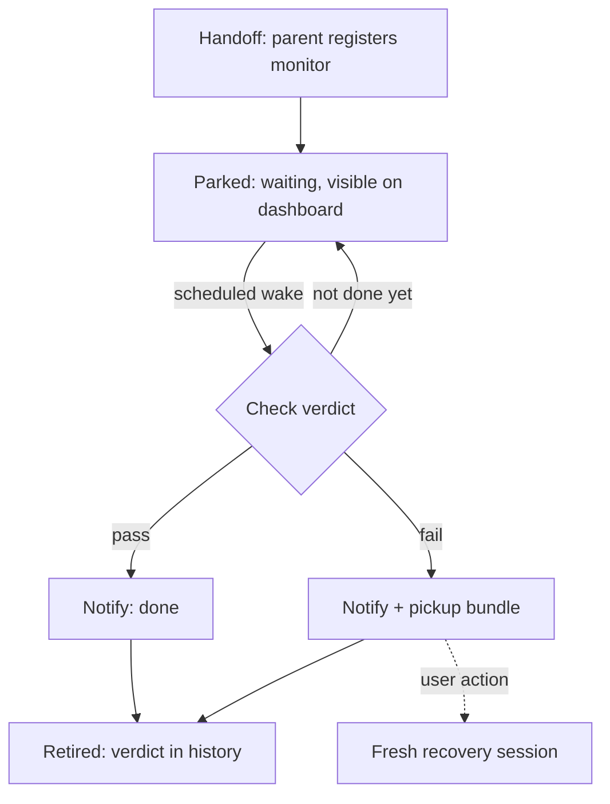

# Monitor Handoff: Parked Experiments Become Automations

## Summary

Long-running experiment monitors move out of live Claude sessions and into fly automations. At handoff, the session registers a monitor — an agent-mode automation with a "not before ~T, then check sparsely" schedule that retires once it delivers a verdict — and the parent tab closes. A pass notifies and is done; a fail notifies with a prepared pickup bundle the user launches a fresh session from with one action.

---

## Problem Frame

Experiments that finish hours or days later (e.g. "finishes around 5am Saturday") currently park a full Claude Code session on a blocking Monitor call. The cost is twofold: the tab and workspace stay visible in the GUI even though there is nothing to do until the healthcheck fires, and a frontier-model session is held open for work a smaller model can do. When a monitor does fire on failure, recovery today is manual: the user assembles the stack trace and the original session's context by hand before starting a fresh session. The original session's live context is not actually needed for that — durable pointers to its transcript suffice.

---

## Key Decisions

- **Extend automations rather than build a first-class "parked experiment" entity.** The automations subsystem already provides the store, sweep, dashboard rows, alert path, per-automation model/effort, and output capture. A separate parking concept is deferred until parking proves to be a daily verb.
- **Sparse scheduling is a skill convention, not a new engine capability.** The monitor wakes rarely at sensible times ("not before ~5am Saturday, then every 30 minutes") rather than polling tightly or blocking. Each wake is a fresh, stateless check, so the monitor prompt must be self-contained. This avoids granting automation-spawned panes any self-rescheduling power, keeping the R22 recursion gate intact.
- **Notify-only on both outcomes in v1.** Pass notifies and finishes. Fail notifies and leaves a prepared pickup; nothing auto-spawns.
- **The parent session closes at handoff.** Decluttering comes from ending the session, not hiding it. The pickup pointers are captured at handoff time, before the tab closes.
- **Monitor checks default to Sonnet at xhigh effort**, riding the existing per-automation model/effort resolution. The user can override per monitor.

---

## Actors

- A1. **User** — parks the experiment, receives the verdict, triggers pickup on fail.
- A2. **Parent session** — the Claude Code session that ran the experiment; authors and registers the monitor, then ends.
- A3. **Monitor** — the agent-mode automation run that checks the experiment and delivers the verdict.
- A4. **Recovery session** — a fresh Claude Code session spawned from the pickup bundle after a fail.

---

## Key Flows

- F1. Handoff
  - **Trigger:** User tells the parent session to hand off its monitor (via the skill).
  - **Steps:** Parent writes a self-contained monitor prompt; captures the pickup pointers (its transcript tail reference, cwd); registers the monitor automation with a not-before time and sparse schedule; confirms registration; the tab closes.
  - **Outcome:** No live session remains; the monitor appears on the dashboard as parked.
- F2. Check cycle
  - **Trigger:** The monitor's schedule fires (not before its earliest-expected time).
  - **Steps:** A fresh agent run evaluates the experiment's state from its self-contained instructions. If the experiment is not finished, the run ends silently and the schedule continues.
  - **Outcome:** No attention raised until a verdict exists.
- F3. Fail verdict
  - **Trigger:** A check determines the healthcheck failed.
  - **Steps:** The monitor assembles the failure bundle (verdict, stack trace or failure evidence, pickup pointers from F1); raises attention; retires.
  - **Outcome:** User sees the notification; the bundle waits until they act.
- F4. Pickup
  - **Trigger:** User triggers the pickup action on a failed monitor.
  - **Steps:** fly spawns a fresh session pre-loaded with a pickup prompt pointing at the failure bundle and the parent transcript tail, reusing the session-handoff machinery.
  - **Outcome:** Recovery starts with full context and zero manual assembly.
- F5. Pass verdict
  - **Trigger:** A check determines the healthcheck passed.
  - **Steps:** The monitor raises a done notification with a short result note and retires.
  - **Outcome:** Nothing else spawns; the result note is readable later.

---

## Requirements

**Monitor semantics**

- R1. A monitor is an agent-mode automation with a not-before time and a sparse re-check schedule; before the not-before time it never runs.
- R2. A monitor retires after delivering a verdict: it stops scheduling and can no longer fire, without the user having to delete it.
- R3. A retired monitor's verdict, result note, and failure bundle remain accessible after retirement.
- R4. A check that finds the experiment still running ends silently — no attention, no alert-log entry a user must triage.
- R5. Monitor checks resolve model/effort through the existing per-automation mechanism, defaulting to Sonnet at xhigh when the monitor does not specify.

**Handoff**

- R6. A skill teaches the parent session to write a self-contained monitor prompt and register it; rough ergonomics are acceptable in v1.
- R7. The pickup pointers (parent transcript tail reference, cwd) are captured at handoff time, before the parent closes.
- R8. If pointer capture fails, the handoff refuses and the parent tab stays open — never close the tab having silently lost the trail.
- R9. After successful registration the parent session ends and its tab closes, leaving no visible residue.

**Verdict and pickup**

- R10. Pass raises a notification with a short result note; nothing else spawns.
- R11. Fail raises a notification and produces a failure bundle: the verdict, the failure evidence (e.g. stack trace), and the pickup pointers.
- R12. A failed monitor offers a single pickup action that spawns a fresh session pre-loaded with the bundle, reusing the session-handoff machinery.

**Visibility**

- R13. A parked monitor is visible on the dashboard while waiting, distinguishable from ordinary recurring automations.

---

## Acceptance Examples

- AE1. **Covers R1, R4.** Given a monitor with not-before Saturday 5:00 and a 30-minute re-check schedule, when Friday passes, then no runs occur; when a Saturday 5:30 check finds the experiment still running, then the run ends with no notification and no triage entry.
- AE2. **Covers R2, R3, R11.** Given a check that finds a failed healthcheck, when the verdict is delivered, then the monitor stops scheduling permanently and its bundle is still readable the next day.
- AE3. **Covers R8.** Given a handoff where the parent's transcript reference cannot be resolved, when registration is attempted, then the handoff reports failure and the tab remains open with the session intact.
- AE4. **Covers R12.** Given a failed monitor's notification, when the user triggers pickup, then a fresh session opens already pointed at the stack trace and the parent session's tail, with no manual context assembly.

---

## Scope Boundaries

- No minimize/bucket UI for tabs. The opening's non-invasive idea is dropped: closing at handoff removes the clutter. (The sidebar's existing transient per-workspace fold remains as-is; it neither persists nor addresses the session-waste half.)
- No auto-spawned recovery session on fail; pickup is user-triggered.
- No follow-up chains on pass.
- No reschedule-self power for monitor runs — the R22 recursion gate is untouched; sparse scheduling is achieved by convention in the monitor prompt and schedule.
- No two-stage script-gate-then-model check shape in v1.
- No polished handoff ergonomics; the skill can be rough.

---

## Dependencies / Assumptions

- Each monitor check completes well inside the existing 30-minute agent-run deadline; the deadline is a fit, not an obstacle, because monitors wake briefly rather than run long.
- The parent is a normal user-spawned pane, so the R22 recursion gate does not block it from creating the monitor automation.
- The parent's transcript and resume record survive pane close, so the pickup bundle can reference them after the tab is gone.
- The existing non-agent alert path (alert-reason raises with CLI-tier confidence) can carry monitor verdicts to the notification surfaces.
- Automation triggers today are cron-schedule, manual, and crash-recovery retry; not-before and retire-on-fire are new semantics this work adds.
- Deleting an automation currently deletes its bounded run history — which is why R3 exists; retirement must not take the delete path.

---

## Outstanding Questions

**Deferred to planning**

- The retirement mechanism (e.g. a retired state vs. auto-pause vs. archive) — constrained by R2 and R3.
- Where the pickup action surfaces (dashboard row, notification panel entry, or both).
- How the not-before time and sparse schedule are expressed at creation (schedule syntax vs. new fields).
- The failure bundle's storage shape and how the pickup prompt references it.
- How a parked monitor row is visually distinguished on the dashboard (R13).

---

## Sources

- `src-tauri/src/automations/model.rs` — automation modes, triggers, bounded run history (history cap and delete behavior motivated R3).
- `src-tauri/src/automations/mod.rs` — sweep, 30-minute run deadline, model/effort resolution, R22 recursion registry.
- `src-tauri/src/automations/alerts.rs` and `src-tauri/src/state/policy.rs` — the alert path and notification suppression rules verdicts will ride.
- `src-tauri/src/session/handoff.rs` and `src/lib/handoff.ts` — the session-handoff machinery the pickup action reuses.
- `src-tauri/src/cli/automation.rs` — `fly automation create` flags (`--model`/`--effort`, agent-mode only) the skill will drive.
- `docs/plans/2026-07-03-002-feat-automations-workspace-and-model-plan.md` — the dedicated automations workspace and output capture the monitor runs inherit.
