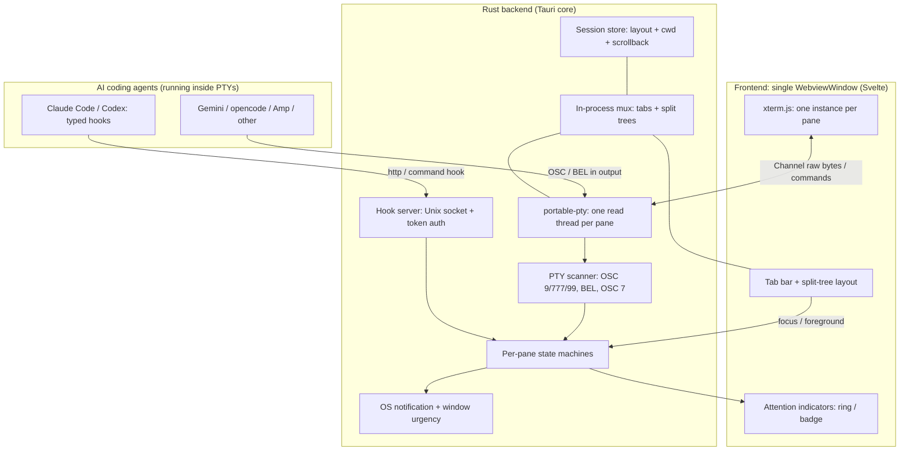
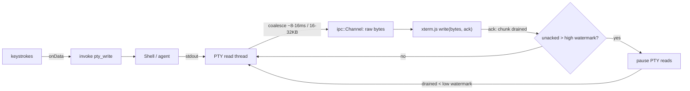
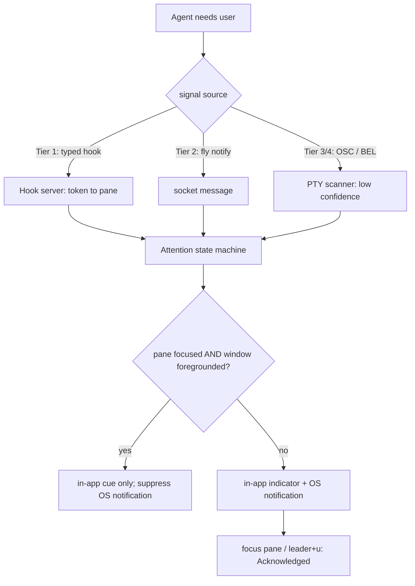
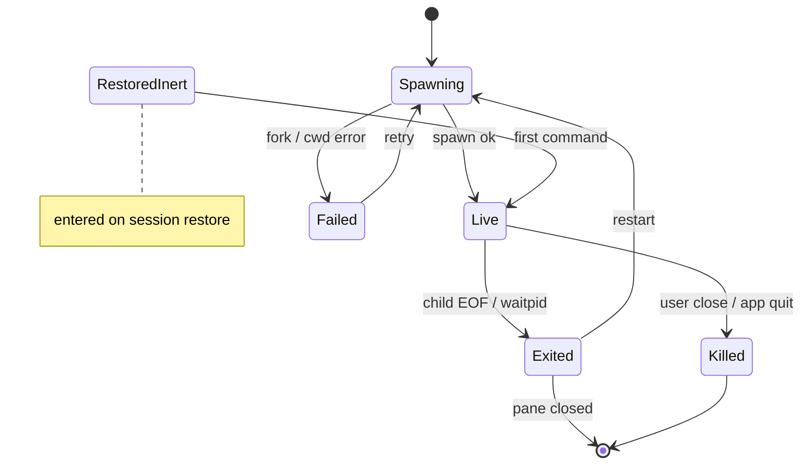
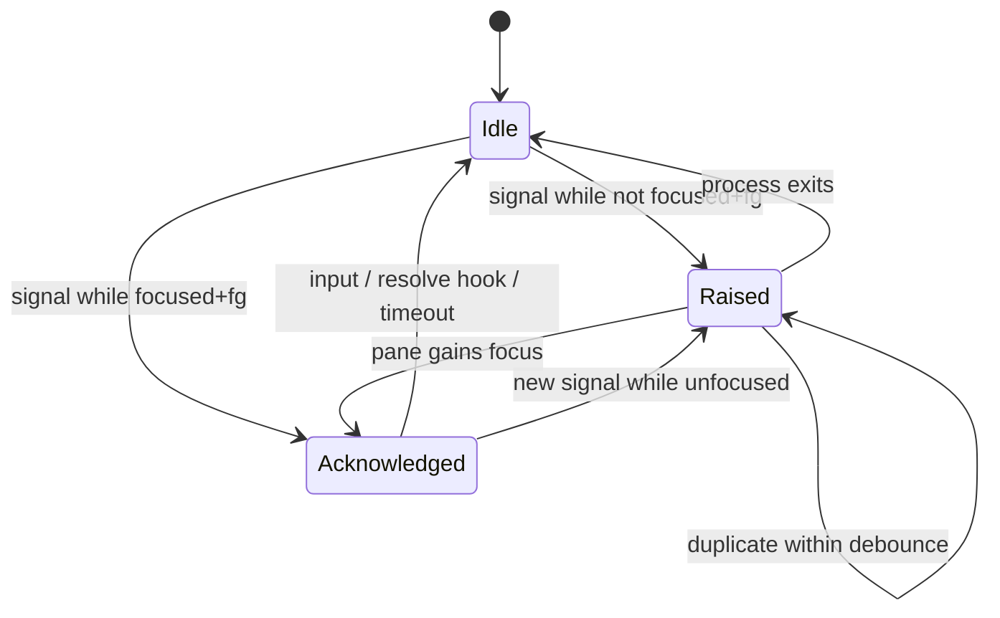

# feat: Build fly, a Tauri agent-aware terminal for Ubuntu

> **Addendum (2026-07-28) — KTD3's "never transcode" holds only above 1 KiB.**
> Verified against the vendored tauri 2.11.3 source (`src/ipc/channel.rs`):
> `InvokeResponseBody::Raw` is delivered two different ways. A chunk **≥ 1024
> bytes** (`MAX_RAW_DIRECT_EXECUTE_THRESHOLD`, `:39`) rides the fetch path as
> real bytes — KTD3 as written. A chunk **< 1024 bytes** (`:163`) is
> `serde_json::to_string`'d into a JSON array of decimal numbers and embedded in
> an `eval()` as `new Uint8Array([…]).buffer`. That path is **lossless** — the
> bytes round-trip exactly, so KTD3's *reason* (transcoding "would corrupt UTF-8
> and escape sequences") is not violated — but it is not free: measured on real
> captured Claude Code renders (`tests/fixtures/screen/*.raw`), the JSON-array
> form is **3.39×** the raw bytes, plus one `eval` per chunk on the webview main
> thread. And it is the *common* path for interactive output: a PTY read loop
> mirroring `pty/pane.rs` saw **60/60 reads under 1024 bytes** (median 49 B)
> during 20 Hz spinner repaints, against 92% of bytes on the raw path during a
> flood. So: raw bytes are lossless end-to-end as designed, and "no transcoding"
> is true for bursts and false for the idle-agent-thinking case. The fix is
> `T1` in `docs/notes/2026-07-23-performance-audit-follow-ups.md` (coalesce
> chunks in fly's own sink to push traffic over the threshold); this addendum
> stands until that lands.

## Summary

Build **fly**, a desktop "terminal for AI coding agents" for Ubuntu/Linux, inspired by cmux but rebuilt clean-room on a Linux-native stack (cmux is a native macOS Swift app and does not port). The first version is terminal-first with a minimal GUI: a real terminal pane, tab/split multiplexing with one agent per pane, agent-attention notifications when an agent needs the user, and lossy session restore. Stack is Tauri v2 (Rust backend, Svelte web frontend) with xterm.js for rendering.

## Problem Frame

Running several AI coding agents (Claude Code, Codex, Gemini CLI, …) at once means constantly babysitting panes to see which one is blocked on a question, a permission prompt, or has finished. cmux solves this on macOS by making the terminal itself agent-aware — it raises a visual indicator and notifies when an agent needs attention. No equivalent exists for a Linux desktop. cmux's value is reusable as *ideas*, but its implementation is not: it is ~83% Swift on AppKit/SwiftUI, GPU-rendered via libghostty, macOS-only. So fly is a fresh build of the same workflow on a stack that runs on Ubuntu.

---

## Scope Boundaries

**In scope (this plan):** a single-window Tauri desktop app on Ubuntu with (1) PTY-backed terminal panes via xterm.js, (2) tabs + horizontal/vertical splits, one agent per pane, (3) agent-attention indicators + OS notifications driven by an authenticated hook channel, (4) session restore of layout, working directory, and optional scrollback. Minimal GUI — a tab bar, panes, and attention indicators, nothing more. **v1 targets Claude Code as the only integrated agent** — its hook system is the richest and most reliable, so v1 commits to it and validates the signature feature against it; additional agents and the generic OSC/BEL fallback for hookless agents are deferred (below).

**Deferred to follow-up work:**
- Built-in scriptable browser.
- Rich sidebar (git branches, PR status, open ports, directories).
- SSH remote workspaces and a remote daemon.
- Additional agents beyond Claude Code (Codex, Gemini, opencode, Amp, and the rest of cmux's ~13; Cursor CLI is currently hook-dark) and the generic OSC 9/777/99 + BEL fallback for hookless agents.
- The loopback HTTP hook endpoint — v1 uses the Claude Code `command` hook → Unix-socket path, so the HTTP endpoint (only needed for `http`-only agents) is not built and its browser-reachable attack surface never exists in v1.
- Live-process preservation across quit (would require a detached/daemonized mux — the largest cmux-parity item).
- Cross-pane agent orchestration (cmux's `send`-into-another-pane).
- macOS/Windows builds (the stack is cross-platform but this plan targets and tests only Ubuntu).

**Non-goals (outside this product's identity):** fly is not an IDE; it is not an agent runtime or SDK (it *hosts* agents, it does not replace them); it is not a tmux/SSH session-persistence replacement.

---

## Requirements

**Terminal core**
- R1. A pane runs a real PTY-backed shell; output renders in xterm.js and keystrokes reach the shell, including control characters (Ctrl-C delivered as byte `0x03`, not a process kill) and bracketed paste.
- R2. Resizing a pane propagates rows/cols to the PTY so full-screen TUI apps (vim, htop) reflow correctly.
- R3. High-throughput output (e.g. `yes`, a large `git log`) stays responsive and memory-bounded via backpressure and a scrollback cap, with no corruption when UTF-8 or escape sequences split across read chunks.
- R4. When a pane's child exits, the pane stays open showing the exit status, and the child is reaped (no zombies).

**Multiplexing and input**
- R5. The user can open multiple panes via tabs and horizontal/vertical splits, one agent per pane, with keyboard-driven directional focus.
- R6. App actions live behind a configurable leader key (or Super-modifier chords) so every other key passes through to the shell/agent unmodified.
- R7. Background tabs and panes keep their PTYs running; splitting is blocked below a minimum usable pane size.

**Agent attention**
- R8. When an agent in a pane needs the user (question, permission, finished, error), that pane and its tab show a visual attention indicator.
- R9. An OS desktop notification fires when an agent needs attention and its pane is not visible-and-focused; it is suppressed when the pane is focused and the window foregrounded; it degrades to in-app indicator only when no notification daemon is present.
- R10. Attention signals arrive over an authenticated local channel that maps each signal to the correct pane and rejects unknown or spoofed senders.
- R11. `fly hooks setup` configures Claude Code to report attention events over the authenticated channel (v1 scope); additional agents (Codex, Gemini, opencode, Amp) and the generic OSC 9/777/99 + BEL fallback for hookless agents are the forward design, deferred from v1.
- R12. Attention clears in two stages — focusing the pane acknowledges it; user input, an explicit resolve signal, or process exit clears it — and rapid duplicate signals from one pane coalesce.
- R16. Signals derived from the PTY byte stream (OSC/BEL) are treated as untrusted and low-confidence, visually distinct from authenticated hook signals, and all notification text from any source is sanitized (control characters stripped, length-capped) before display.

**Persistence**
- R13. The app saves and restores the layout (tabs/splits), each pane's working directory (tracked live via OSC 7), and optional bounded scrollback.
- R14. Restore is layout + cwd + inert replayed scrollback only: processes are never resumed and no restored command auto-runs; a missing cwd or a corrupt session file degrades gracefully instead of failing the launch.

**Platform**
- R15. The app builds and runs on Ubuntu under both Wayland and X11, ships as a `.deb` (primary) and AppImage (secondary), and falls back to a working renderer when GPU/DMABUF paths fail.

---

## Key Technical Decisions

- KTD1. **Stack: Tauri v2 (Rust + Svelte web frontend), xterm.js rendering.** User-chosen; yields a real desktop app with native OS notifications at a solo-tractable surface, and stays cross-platform for later. Svelte is a lightweight reactive layer well-suited to split-tree/pane state; it is swappable, since the load-bearing logic lives in Rust and xterm.js.
- KTD2. **PTY via `portable-pty` 0.9, one dedicated OS thread per pane for blocking reads; drop the slave fd after spawn; reap with `wait()`.** Battle-tested (extracted from WezTerm). The slave-drop (else the master never sees EOF) and the reap (else zombies) are the two classic PTY bugs.
- KTD3. **Output streams over `tauri::ipc::Channel` carrying raw bytes (`InvokeResponseBody::Raw`); control-plane (spawn/resize/write/kill) over commands.** Channel is Tauri v2's documented high-throughput path; events are JSON-only and explicitly not for throughput. Raw bytes avoid base64/JSON bloat and never transcode (which would corrupt UTF-8 and escape sequences). *(See the 2026-07-28 addendum at the top: the no-transcoding half holds only for chunks ≥ 1 KiB; smaller chunks are re-encoded as a JSON number array — losslessly, but at 3.39× and one `eval` each.)* The Channel is the single ordered data path per pane; control commands are not ordered against Channel bytes, so the design tolerates reorder. The one boundary that must be reconciled is resize, handled on the read thread (see KTD13, U4).
- KTD4. **Backpressure: coalesce PTY reads, watermark/ACK via the xterm.js `write()` callback to pause/resume PTY reads, cap scrollback (~10k lines).** xterm.js throughput is ~5–35 MB/s with a hard 50 MB buffer cap; agent log bursts freeze or OOM the webview without this. Pause signals the persistent read thread to stop issuing reads (never tears it down — see KTD13), so the kernel PTY buffer backpressures the producer losslessly. Coalescing is low-latency-first: flush small buffers immediately and engage ~8–16 ms / ~16–32 KB batching only once a backlog builds, so idle keystroke echo is not delayed. Pin the high watermark ≈ 2–4 MB and low ≈ 512 KB–1 MB, well below the 50 MB cap: watermarking bounds unacked bytes but not xterm.js's internal write buffer, and the true overshoot is `high + (pause RTT × peak throughput) + in-flight batches + one PTY-buffer read`, which must stay far under 50 MB.
- KTD5. **Multiplexing: one `WebviewWindow`, multiple xterm.js instances in the DOM, layout as a per-tab binary split tree; mux runs in-process in Rust.** Tauri's multi-webview-per-window is experimental/unstable in v2; a daemonized mux is overkill for a single-user v1. Split tree mirrors the WezTerm Mux→Tab→Pane model. All pane operations route through the mux with `PaneId` as an opaque handle, so the deferred daemonized-mux / remote-pane features become a transport swap behind a stable interface rather than a rewrite.
- KTD6. **Renderer: xterm.js WebGL addon with a DOM-renderer fallback on context loss/failure; dispose WebGL for background panes.** WebGL needs the same GPU path WebKitGTK's DMABUF issues break on Linux, and live WebGL contexts are capped (~16). Allocate WebGL to the focused pane plus the most-recently-focused visible panes up to a cap (≈12, with hysteresis to avoid create/dispose thrash on tab/pane switches); all other panes, visible or not, use the DOM renderer.

  - **Superseded (2026-06-23, branch `fix/webgl-blank-dom-default`).** The eviction policy was never implemented: every pane holds a live WebGL context for its whole life (the never-unmount invariant, KTD5), and on WebKitGTK that blanks an inactive pane whenever more than one is open — the active canvas keeps compositing while the others drop until they next repaint (an idle Claude TUI repaints only on output, so "temporarily" stretches out). Focused-pane-only eviction wouldn't fix the reported 2-pane repro (the ≈12 cap leaves both on WebGL) and attach-on-focus would flash on every switch, so the default renderer is now `Renderer::Dom`; WebGL stays opt-in via `renderer: "auto"`/`"webgl"`. Confirmed live by toggling `renderer` — DOM eliminated the blanking, WebGL reproduced it.
- KTD7. **Attention transport: a local Unix-domain socket plus a per-pane secret token (`FLY_PANE_TOKEN`) injected into each pane's environment; v1 wires Claude Code via a `command` hook to a thin `fly notify` CLI that writes to the socket.** The PTY is a trust boundary: an unauthenticated endpoint lets any local process spoof attention or enumerate panes. The token maps each callback to its originating pane. The token is ≥128 bits from a CSPRNG, compared in constant time, registered before the child starts, and rate-limited against brute force; the Unix socket verifies the peer UID (`SO_PEERCRED`). v1 uses Claude Code's `command` hook → `fly notify` → the Unix socket, so the browser-reachable loopback HTTP endpoint is not built for v1; it is deferred with the multi-agent matrix. If a future `http`-only agent needs it, it would bind `127.0.0.1` on an ephemeral port, stay off unless configured, validate `Origin`/`Host` (anti-DNS-rebinding), and take the token in a header. The token is inherited by all descendants of a pane and authorizes attention for that pane only — never cross-pane or privileged action (see Risks).
- KTD8. **Two orthogonal per-pane state machines — `LifecycleState` {Spawning, Live, Exited, Killed, Failed, RestoredInert} and `AttentionState` {Idle, Raised, Acknowledged} — with a notification-suppression matrix keyed on `paneFocused AND windowForegrounded`.** Modeling attention as a lifecycle state loses an axis when a waiting agent's process exits; suppression needs both notions of focus. The matrix lives in the backend (attention state is backend-owned and pure-testable), so `paneFocused` and `windowForegrounded` are replicated to the backend as the authoritative tuple via `set_focus`/`set_foreground` commands; a focus/foreground change re-evaluates already-Raised panes, and an unknown foreground state is treated as backgrounded (over-notify rather than swallow).
- KTD9. **Tiered detection.** v1 implements Tier 1 for Claude Code only; the rest of the ladder below is the forward design, deferred (see Scope Boundaries). Tier 1 typed hooks (Claude Code, Codex) = high confidence; Tier 2 command-hook + `fly notify` (Gemini, opencode); Tier 3 BEL (Amp, `AMP_FORCE_BEL=1`); Tier 4 generic OSC 9/777/99 + OSC 133 idle = low confidence, scoped to when an agent is believed active and disable-able. Agents differ widely (Gemini lacks a "waiting for input" event; Cursor CLI is hook-dark), so the strategy must degrade gracefully. Tier 3/4 signals come from unauthenticated PTY output — anything that writes to a pane (a remote `ssh` peer, a malicious file, a dependency's output) can emit them — so they are a security control, not just noise reduction: treated as untrusted, visually distinct from Tier-1, rate-limited, never promoted into a Tier-1 path. Every signal carries a `{reason, source/tier, confidence}` tag that flows from U8/U10 through U7 to U11.
- KTD10. **Restore is explicitly lossy:** rebuild layout, spawn fresh shells in saved cwd, replay capped scrollback as inert text after a terminal reset, never auto-run prior commands. PTYs/processes do not survive quit, and auto-running restored commands risks destructive re-execution (Zellij's ENTER-to-run safety lesson). Scrollback is opt-in/off-by-default for privacy (secrets live in history). Opted-in scrollback files are written mode 0600 in a 0700 directory and are unencrypted in v1 — a stated, consent-gated decision the opt-in UI must surface. Notification title/body from any source (hook or OSC 777) is sanitized — control characters stripped, length-capped — before display.
- KTD11. **Linux build: webkit2gtk-4.1; set `WEBKIT_DISABLE_DMABUF_RENDERER=1` before webview init; build on an Ubuntu 22.04 baseline; `.deb` primary + AppImage secondary.** The DMABUF renderer causes blank windows on Wayland/NVIDIA; AppImage's WebKitGTK bundling is fragile vs `.deb` and inherits the build-host glibc.
- KTD12. **A `fly` CLI is the same binary as the app** (subcommands `hooks setup`, `notify`), so agents and scripts invoke one tool and setup can run from onboarding. Mirrors cmux's `cmux hooks setup` / `cmux notify` contract.
- KTD13. **Concurrency model.** The per-pane read thread never holds the registry lock during blocking I/O — reader/writer handles are cloned out (`try_clone_reader` / `take_writer`) so reads run lock-free; the `Mutex<HashMap<PaneId, Pane>>` guards registry mutation only. `PaneId` is generational, so a stale id from a closed pane resolves to "gone" rather than aliasing a reused slot. Pause/resume is signalled via an atomic/condvar, and resize (SIGWINCH) is applied on the read thread so geometry orders with the byte stream instead of racing it. `close_pane` marks the pane Killed, signals and joins the read thread, then reaps, removes from the registry, and invalidates the token — so no accessor ever resolves a half-dead pane.

---

## High-Level Technical Design

### Component architecture



### Terminal data flow and backpressure



### Agent-attention signal flow



### Pane lifecycle state machine



### Attention state machine (orthogonal to lifecycle)



### Output structure

```text
fly/
├── src-tauri/                  # Rust backend
│   ├── src/
│   │   ├── main.rs             # Tauri builder, plugins, Linux env workarounds, single-instance
│   │   ├── pty/                # portable-pty wrapper, read thread, resize, reap
│   │   ├── mux/                # panes, tabs, binary split tree, PaneId registry
│   │   ├── stream/             # Channel output, coalescing, pause/resume backpressure
│   │   ├── hooks/              # Unix socket server, token auth, message schema
│   │   ├── cwd/                # live cwd via /proc (OSC/BEL attention scanner deferred)
│   │   ├── state/              # LifecycleState + AttentionState machines, suppression matrix
│   │   ├── notify/             # OS notification + window urgency
│   │   ├── session/            # save / restore (store + scrollback files)
│   │   └── cli/                # `fly hooks setup` (Claude Code), `fly notify`
│   ├── capabilities/           # notification:default, store:default
│   └── tauri.conf.json         # identifier, bundle targets, deb depends
├── src/                        # Svelte + Vite frontend
│   ├── lib/
│   │   ├── Terminal.svelte     # xterm.js instance + addons + Channel wiring
│   │   ├── Pane.svelte         # split-tree node renderer
│   │   ├── TabBar.svelte
│   │   ├── layout.ts           # split-tree model + geometry
│   │   ├── keymap.ts           # leader key + pass-through
│   │   └── attention.ts        # indicators, cycle-to-next
│   ├── ipc.ts                  # invoke wrappers + Channel handlers
│   └── main.ts
├── tests/                      # integration tests (PTY, throughput, restore, hook auth)
└── packaging/                  # .deb / AppImage config, icons
```

The per-unit **Files** lists remain authoritative; the tree is a scope sketch and the implementer may adjust it.

---

## Implementation Units

Grouped into phases. Phases are sequential; units within a phase are dependency-ordered. **v1 integrates Claude Code only** (see Scope Boundaries), which narrows U8–U10. U13–U15 were added after the per-feature units; their IDs are identity, not order. The recommended first task is **U15 (Phase 0 tracer bullet)** — a thin end-to-end slice that validates the signature bet before the bottom-up build; U13–U14 sequence into Phases A and D as their notes state.

### Phase 0 — Tracer bullet (recommended first task)

#### U15. End-to-end agent-attention tracer bullet

- **Goal:** Prove the signature bet — Claude Code running in a fly pane reliably raises a visible attention signal when it needs the user — with the least possible code, before investing in the full foundation.
- **Requirements:** thin slices of R1, R8, R9, R10, R11 (validation, not full implementation)
- **Dependencies:** none (it is the first task; it builds throwaway-thin slices of U1/U2/U3/U7/U8/U9 inline)
- **Sequencing:** the recommended starting point. Once it gives a go/no-go read, promote the proven pieces into the real U1–U11 and continue the bottom-up build; if it reads no-go, reconsider the bet before building the foundation.
- **Files:** a minimal `src-tauri/` + `src/` scaffold (subset of U1), a hardcoded single pane (subset of U2/U3), a minimal socket + token (subset of U8), `fly hooks setup` for Claude Code + `fly notify` (subset of U9), and a crude indicator (subset of U7/U11)
- **Approach:** Stand up the smallest Tauri window with one hardcoded PTY pane running a shell — no multiplexing, tabs, backpressure, or restore. Wire a minimal token + Unix socket (U8 essentials) and `fly hooks setup` for Claude Code (U9 essentials) so Claude Code's `command` hook → `fly notify` → socket raises a crude border/badge on the pane. Just enough attention state (U7) and surfacing (U11) to see `Notification`/`Stop` land. No config substrate, flow control, or persistence.
- **Execution note:** A throwaway-friendly spike — its output is a go/no-go judgment on signature reliability and the product success measure (see the product-validation Open Question), not production code. Promote the proven slices into U1–U11 afterward; do not let it ossify into the foundation untested.
- **Patterns to follow:** the U8/U9 socket+hook contract (thin); cmux `hooks setup`.
- **Test scenarios:**
  - Running `claude` in the pane and triggering a permission prompt raises the indicator.
  - Claude Code finishing (`Stop`) raises the indicator.
  - A socket message without the valid token is rejected.
  - Manual read: over a real multi-step Claude Code session, the indicator fires reliably and on time (the signature-reliability / success measure).
- **Verification:** you can run Claude Code in fly and reliably get a visible attention signal when it needs you — the bet is validated before the full build.

### Phase A — Terminal foundation

#### U1. Project scaffold and Linux build baseline

- **Goal:** Stand up a Tauri v2 + Svelte app that builds and launches on Ubuntu under Wayland and X11, with the DMABUF workaround and packaging targets wired.
- **Requirements:** R15
- **Dependencies:** none
- **Files:** `src-tauri/tauri.conf.json`, `src-tauri/Cargo.toml`, `src-tauri/src/main.rs`, `src-tauri/capabilities/default.json`, `package.json`, `vite.config.ts`, `src/main.ts`, `packaging/`
- **Approach:** Scaffold from the Tauri v2 Svelte template. Set the app identifier (placeholder `dev.evan.fly`). In `main.rs`, before `run()`, set `WEBKIT_DISABLE_DMABUF_RENDERER=1` on Linux. Register the notification and store plugins and add `notification:default` and `store:default` to capabilities. Set `bundle.targets` to `["deb","appimage"]` and declare `.deb` depends. Document the Ubuntu 22.04 build baseline and the `libwebkit2gtk-4.1-dev` requirement.
- **Patterns to follow:** `create-tauri-app` Svelte template; Tauri v2 capabilities config.
- **Test scenarios:** Test expectation: none (scaffold) — verified by a build/launch smoke check: `cargo tauri build` produces a `.deb` and an AppImage, and the app launches to a blank window under both a Wayland and an X11 session with no blank-screen regression.
- **Verification:** the `.deb` installs and launches on a clean Ubuntu 22.04; the window renders under both display servers.

#### U2. PTY backend core (single pane)

- **Goal:** Spawn and manage a PTY-backed shell in Rust with correct lifecycle (resize, EOF, reap) and an input path.
- **Requirements:** R1, R2, R4
- **Dependencies:** U1
- **Files:** `src-tauri/src/pty/mod.rs`, `src-tauri/src/pty/pane.rs`, `src-tauri/src/main.rs`, `tests/pty_lifecycle.rs`
- **Approach:** `native_pty_system()` → `openpty(PtySize)` → spawn `$SHELL` (interactive) via `CommandBuilder`; `drop(slave)` after spawn. A dedicated `std::thread` reads `try_clone_reader()` into an 8 KB buffer; `take_writer()` handles input. `master.resize()` on resize (the kernel ioctl delivers SIGWINCH). On `read() == Ok(0)`, call `child.wait()` to reap and mark exited. Set env `TERM=xterm-256color`, `COLORTERM=truecolor`, a UTF-8 locale if unset, and `FLY=1`. Managed state `Mutex<HashMap<PaneId, Pane>>`. Commands: `spawn_pane`, `pty_write`, `pty_resize`, `close_pane` (kill then wait). Keystrokes (including Ctrl-C as `0x03`) pass through untouched. Apply the KTD13 concurrency discipline: clone the reader/writer out of the lock; generational `PaneId`; the `close_pane` teardown order (signal+join the read thread, then reap, remove, invalidate token). Generate and register the per-pane token (KTD7) before spawning the child so no callback can race registration; resize is applied on the read thread.
- **Execution note:** Start with failing tests for the EOF→reap and resize→SIGWINCH contracts — these are the classic PTY bugs.
- **Patterns to follow:** WezTerm `portable-pty` usage.
- **Test scenarios:**
  - `echo hi` round-trips from spawn to reader output.
  - Writing a byte sequence reaches the shell and echoes.
  - `pty_resize` changes the winsize and a running TUI (e.g. `top`) sees SIGWINCH and reflows.
  - Shell `exit` produces EOF on the reader and the child is reaped — assert no zombie remains.
  - `close_pane` on a live shell kills then reaps it.
  - Binary / invalid-UTF-8 output split across two reads does not panic; bytes are forwarded verbatim.
  - With the slave dropped, child exit yields EOF within a timeout (no infinite hang).
  - `close_pane` concurrent with a mid-batch read tears down in order with no use-after-free and no zombie.
- **Verification:** a pane runs an interactive shell end to end and closing it leaves no orphan or zombie.

#### U3. xterm.js pane and streaming wiring (single pane)

- **Goal:** Render one PTY in xterm.js and wire bidirectional streaming over a Channel.
- **Requirements:** R1, R2
- **Dependencies:** U2
- **Files:** `src/lib/Terminal.svelte`, `src/ipc.ts`, `src-tauri/src/stream/mod.rs`
- **Approach:** `@xterm/xterm` 5.5 with `addon-fit`, `addon-webgl`, `addon-unicode11`. `spawn_pane` takes an `ipc::Channel`; the read thread sends `InvokeResponseBody::Raw(bytes)`. Frontend: `new Channel<ArrayBuffer>()`; `onmessage` → `term.write(new Uint8Array(bytes))`; `term.onData` → `invoke('pty_write')`. `FitAddon` recomputes cols/rows on container resize (debounced ~50–100 ms) → `invoke('pty_resize')`. Raw bytes end to end, no transcoding *(qualified by the 2026-07-28 KTD3 addendum — sub-1 KiB chunks are re-encoded losslessly as a JSON number array)*. Activate unicode v11.
- **Patterns to follow:** xterm.js + Tauri Channel wiring (see Sources).
- **Test scenarios:**
  - Shell output renders in the pane.
  - Typed keys reach the shell and echo back.
  - Resizing the container fits the grid and the PTY follows.
  - 256-color and truecolor output and wide/emoji glyphs render correctly.
  - A multibyte char or escape sequence split across two chunks renders intact (no mojibake).
  - WebGL renderer is active when the GPU path is available.
- **Verification:** a visible, interactive terminal pane.

#### U4. Backpressure, flow control, and WebGL fallback

- **Goal:** Keep the UI responsive and memory bounded under output floods, and survive renderer failure.
- **Requirements:** R3, R15 (renderer fallback)
- **Dependencies:** U3
- **Files:** `src-tauri/src/stream/mod.rs`, `src/lib/Terminal.svelte`, `src/ipc.ts`
- **Approach:** The Rust read loop coalesces low-latency-first (flush small reads immediately; engage ~8–16 ms / ~16–32 KB batching only once a backlog builds) before `Channel.send`. The frontend calls `term.write(chunk, callback)`, tracks unacked bytes, and on exceeding the high watermark (≈2–4 MB) calls `invoke('pty_pause')`; on draining below the low watermark (≈512 KB–1 MB), `invoke('pty_resume')`. Pause signals the persistent read thread (atomic/condvar, KTD13) to stop issuing reads and park; resume wakes it — the thread is never torn down. The kernel PTY buffer backpressures the producer. Cap xterm scrollback (~10k lines). WebGL: try `WebglAddon`; on load failure or its context-loss event, dispose and fall back to the DOM renderer; apply the KTD6 eviction policy for off-screen and over-cap panes.
- **Execution note:** Spike this throughput path early — a `yes` / 50 MB `git log` harness — before layering multiplexing on top; it is the most likely day-one freeze.
- **Patterns to follow:** xterm.js Flow Control guide (watermark/ACK).
- **Test scenarios:**
  - A `yes` flood keeps the UI responsive and memory flat (no growth past the cap).
  - A 50 MB `git log` completes without freezing.
  - Pause fires above the high watermark and resume below the low watermark.
  - Scrollback is capped (oldest lines dropped).
  - A WebGL context-loss event falls back to the DOM renderer and the terminal still renders.
  - Renderer fallback also works with `WEBKIT_DISABLE_DMABUF_RENDERER` set.
  - Quantitative gates: sustained `yes` throughput holds a stated MB/s floor; a single idle keystroke echoes without incurring the full coalescing-window delay; peak unacked bytes and peak xterm.js write-buffer stay under a hard fraction (e.g. <10 MB) of the 50 MB cap; pause→reads-stopped and resume→reads-resumed RTT is measured and the pipe does not stall on resume.
  - K panes flooding simultaneously keep the UI responsive and each stays memory-bounded (per-pane watermarks behave independently).
  - The WebSocket-fallback trigger is data-driven: if sustained throughput falls below the floor, fall back to a localhost WebSocket for the output stream.
- **Verification:** pathological output no longer freezes the app; memory stays bounded; the throughput floor and echo-latency ceiling are met.

### Phase B — Multiplexing

#### U5. Tabs and split panes (binary split tree)

- **Goal:** Multiple panes via tabs and H/V splits, one PTY each, with geometric focus navigation.
- **Requirements:** R5, R7
- **Dependencies:** U4
- **Files:** `src/lib/Pane.svelte`, `src/lib/TabBar.svelte`, `src/lib/layout.ts`, `src-tauri/src/mux/mod.rs`, `src-tauri/src/mux/tree.rs`
- **Approach:** Each tab holds a binary split tree (internal node = orientation + ratio; leaf = pane). A CSS flex/grid layout walks the tree; each leaf is one xterm.js instance bound to one backend `PaneId`. Split = replace the focused leaf with an internal node `{old, new}`. Directional focus uses nearest-edge geometry. A minimum pane size (≈ 4 rows × 20 cols) blocks splits below the floor. Background tabs keep PTYs running; hidden panes hide their DOM (re-fit on reveal) and drop to the DOM renderer per the KTD6 eviction policy. Window resize is coalesced at the window level and re-walks the tree to re-resize every PTY once on settle, not per drag event.
- **Patterns to follow:** WezTerm Mux→Tab→Pane tree; keep the tree shallow (Zellij flat-tree perf note).
- **Test scenarios:**
  - Splitting horizontally and vertically creates panes.
  - A nested split lays out correctly.
  - Directional focus moves to the correct neighbor.
  - Closing a non-root pane re-balances the tree.
  - The min-size clamp blocks an over-split.
  - Switching tabs preserves background PTY output.
  - Window resize updates every pane's cols/rows.
  - Many panes do not exhaust WebGL contexts (background panes fall back to DOM).
  - More than 16 *visible* split panes render correctly (excess on the DOM renderer, no context exhaustion).
  - Dragging a window resize with many running TUIs settles to the correct cols/rows with no per-frame resize storm.
- **Verification:** a usable multi-pane workspace with tabs and splits.

#### U6. Keyboard model and input pass-through

- **Goal:** Bind app actions behind a leader key while passing all other input to the shell/agent.
- **Requirements:** R6
- **Dependencies:** U5, U13 (leader key from config)
- **Files:** `src/lib/keymap.ts`, `src/lib/Terminal.svelte`, `src-tauri/src/cli/mod.rs` (config load)
- **Approach:** A configurable leader key (default Ctrl-A, tmux-style) or Super-modifier chords drive new tab, split H/V, focus move, close pane, and cycle-attention. `attachCustomKeyEventHandler` on xterm.js intercepts only the leader sequence; everything else (Ctrl-C, Ctrl-W, Ctrl-P/N, vim keys) flows through `onData` to the PTY. Forward bracketed-paste markers so multiline paste does not auto-execute. The leader is set via the config file.
- **Execution note:** Lock the shortcut scheme before writing keybinding code, and add a pass-through conformance test.
- **Patterns to follow:** tmux leader; iTerm/cmux split muscle memory.
- **Test scenarios:**
  - Each leader chord triggers its app action.
  - Ctrl-C reaches the shell (SIGINT inside the PTY, not a pane kill).
  - Ctrl-W, Ctrl-P, and vim navigation reach the program running in the PTY.
  - A bracketed multiline paste arrives as one block and does not auto-run.
  - Changing the configured leader takes effect.
  - Leader followed by an unbound key is a no-op and does not leak to the PTY.
- **Verification:** vim, less, and Claude Code's own keybindings are all usable inside a pane; app shortcuts never collide.

### Phase C — Agent attention (signature)

#### U7. Per-pane state machines (lifecycle + attention)

- **Goal:** Model pane lifecycle and attention as two orthogonal, fully-tested state machines with a notification-suppression matrix.
- **Requirements:** R8, R12, R4 (exit behavior)
- **Dependencies:** U2 (lifecycle source), U5 (focus signal)
- **Files:** `src-tauri/src/state/lifecycle.rs`, `src-tauri/src/state/attention.rs`, `src-tauri/src/state/suppress.rs`, `tests/state_machines.rs`
- **Approach:** `LifecycleState` {Spawning, Live, Exited, Killed, Failed, RestoredInert} fed by PTY events; `AttentionState` {Idle, Raised, Acknowledged}; transition tables exactly per the HTD diagrams. The suppression matrix keys on `(paneFocused, windowForegrounded)` and suppresses the OS notification only when both are true. A debounce window (300–500 ms, keyed on time + pane) coalesces duplicates; passing through Acknowledged or input resets the debounce so a genuine follow-up re-notifies. Process exit forces attention to Idle. An exited pane stays open showing its exit code, distinguishing code 0 from a signal/non-zero exit. Focus/foreground reach the backend as the authoritative tuple via `set_focus`/`set_foreground` commands (KTD8); the raise/suppress decision reads that tuple, and a focus change re-evaluates already-Raised panes. Each signal carries a `{reason, source/tier, confidence}` tag (KTD9) for downstream rendering.
- **Execution note:** Pure logic — implement test-first against the transition tables; these are the highest-value unit tests in the plan.
- **Patterns to follow:** orthogonal-state modeling (see Sources, flow analysis).
- **Test scenarios:**
  - Lifecycle: Spawning→Live→Exited; Spawning→Failed→retry; Live→Killed; RestoredInert→Live on first command.
  - Attention: Idle→Raised→Acknowledged→Idle; Idle→Acknowledged directly when focused+foregrounded.
  - All four suppression-matrix quadrants produce the correct notify/suppress decision.
  - Rapid duplicate signals coalesce to one notification.
  - Answer-then-new-signal re-notifies (not treated as a duplicate).
  - Process exit forces attention to Idle.
  - An exited pane reports code 0 vs non-zero distinctly.
  - A signal racing a focus switch uses the backend-authoritative focus tuple.
  - A window blur/focus event updates foreground and re-runs suppression for already-raised panes.
- **Verification:** transitions match the tables; the suppression matrix has full branch coverage.

#### U8. Agent-hook signal channel (authenticated)

- **Goal:** Receive attention signals over an authenticated local socket that maps each to its pane.
- **Requirements:** R10
- **Dependencies:** U2 (pane env injection), U7 (feeds the attention machine)
- **Files:** `src-tauri/src/hooks/server.rs`, `src-tauri/src/hooks/protocol.rs`, `src-tauri/src/hooks/token.rs`, `tests/hook_auth.rs`
- **Approach:** On pane spawn, generate a per-pane secret token and inject `FLY_PANE_TOKEN` and `FLY_SOCKET_PATH` into the pane environment. Run a Unix-domain socket server (not TCP). The loopback HTTP endpoint for `http`-only agents is deferred (KTD7); v1 receives Claude Code callbacks via the `command` hook → `fly notify` → socket path. Message schema `{token, reason: question|permission|finished|error, title?, body?}`. Validate the token → resolve the pane; reject unknown/missing tokens and malformed payloads. Map `reason` to an attention signal into U7. Remove the socket and invalidate the token on pane close / app exit. The token is ≥128-bit CSPRNG, compared in constant time, and registered before the child starts; repeated invalid tokens are throttled/locked out. The Unix socket checks the peer UID (`SO_PEERCRED`). If the deferred loopback HTTP endpoint is later added, it binds `127.0.0.1` on an ephemeral port, stays absent unless an `http`-hook agent is configured, rejects mismatched `Origin`/`Host`, and reads the token from a header (never a query string).
- **Execution note:** Write the protocol spec (transport, token, schema, rejection rules) first, then implement token validation test-first — this is the security boundary.
- **Patterns to follow:** cmux's socket + `CMUX_SURFACE_ID` / `CMUX_SOCKET_PATH` contract (analogue).
- **Test scenarios:**
  - A valid token routes to the right pane and raises attention.
  - An unknown token is rejected (no signal, logged).
  - A missing or garbled message is rejected without crashing.
  - A token from a closed pane is rejected.
  - Two panes' tokens never cross-map.
  - Concurrent callbacks are handled.
  - The HTTP loopback path enforces the same token check.
  - The socket file is removed on exit.
  - v1 builds no loopback HTTP endpoint (Claude Code uses the command-hook → socket path); when the endpoint is later added, a cross-origin POST with a wrong/absent `Origin`/`Host` is rejected even without a token.
  - Repeated invalid-token requests from one source are throttled/locked out.
  - A callback fired at child start (before registration completes) is correctly attributed or cleanly rejected, never misrouted.
- **Verification:** only authenticated, pane-scoped signals raise attention; spoofing attempts are rejected.

#### U9. Agent setup and notify CLI (`fly hooks setup`, `fly notify`)

- **Goal:** Configure Claude Code to report attention (v1), with a `fly notify` CLI bridge to the socket.
- **Requirements:** R11
- **Dependencies:** U8
- **Files:** `src-tauri/src/cli/mod.rs`, `src-tauri/src/cli/hooks_setup.rs`, `src-tauri/src/cli/notify.rs`, `src-tauri/src/cli/agents/claude.rs`
- **Approach:** `fly` CLI subcommands of the app binary. `hooks setup` (v1: Claude Code only) idempotently writes a Claude Code `command` hook in `~/.claude/settings.json` (matching `Notification`, `Stop`, `PermissionRequest`) that invokes `fly notify`. `fly notify <reason> [--title --body]` reads `FLY_PANE_TOKEN` and `FLY_SOCKET_PATH` from the env and sends to the Unix socket. Map Claude Code `Notification.notification_type` (`permission_prompt` / `idle_prompt`) and `Stop` to reasons. Codex/Gemini/opencode/Amp and the `http`-hook path are deferred (see Scope Boundaries); a `--agent` other than `claude` errors clearly for now. Config writes merge (read-modify-write) under a stable `fly`-owned marker, preserve unknown keys, and back up the file before first modification; the hook records the absolute, canonical `fly` binary path (never a `PATH`-relative name) and builds command strings safely. A `fly hooks teardown` (and the `.deb` `postrm`) removes only `fly`-owned blocks on uninstall.
- **Patterns to follow:** cmux `hooks setup` / `notify`.
- **Test scenarios:**
  - `setup` writes the correct Claude Code `command` hook idempotently (re-run adds no duplicate).
  - `fly notify` with valid env posts to the socket and raises attention; with no env it errors cleanly.
  - A Claude Code `Stop` event maps to the "finished" reason; a `Notification` `permission_prompt` maps to "permission".
  - A `--agent` other than `claude` errors clearly (others deferred).
  - Setup preserves a pre-existing unrelated hook in the same file and updates its own prior block in place across a schema change without duplicating.
  - The written hook contains an absolute binary path, and `hooks teardown` removes fly's block while leaving user hooks intact.
- **Verification:** after setup, a real Claude Code permission prompt raises attention in the right pane.

#### U10. Live working-directory tracking

- **Goal:** Track each pane's live working directory for session restore. (The generic OSC/BEL attention fallback for hookless agents is deferred with the multi-agent matrix.)
- **Requirements:** R13 (cwd tracking). R11's fallback and R16's OSC-stream handling are deferred with the multi-agent matrix; R16's notification-text sanitization stays active (U11).
- **Dependencies:** U2 (pane foreground pid)
- **Files:** `src-tauri/src/cwd/mod.rs`, `tests/cwd_tracking.rs`
- **Approach:** Track the pane's live cwd by reading `/proc/<pid>/cwd` of the pane's foreground process — robust on Linux and needs no shell cooperation, because default Ubuntu shells do not emit OSC 7 outside VTE. Resolve the foreground process from the slave's foreground process group; poll on a low cadence (on focus change / before a save), never per output byte. Optionally also honor OSC 7 (`\e]7;file://…`) as a cheaper signal when a shell emits it. Deferred to the multi-agent phase: the incremental OSC 9/777/99 + BEL attention scanner (partial-sequence reassembly, an allocation-free no-OSC fast path, untrusted/low-confidence handling per KTD9, OSC 133 idle detection), re-validated against the U4 throughput baseline when built.
- **Patterns to follow:** WezTerm `/proc`-based cwd tracking; OSC 7 as the blessed-but-optional path.
- **Test scenarios:**
  - The pane's cwd follows `cd`, read from `/proc/<pid>/cwd` of the foreground process.
  - The tracked cwd is the foreground job's, not the spawn cwd, and is available to U12 restore.
  - When a shell does emit OSC 7, it updates the cwd without waiting for the poll.
  - Polling cadence stays off the hot output path (no per-byte work).
- **Verification:** a pane's tracked cwd follows `cd` and restore reopens it (not `$HOME`).

#### U11. Notification surfacing (indicators + OS notifications)

- **Goal:** Surface attention as in-app indicators and OS notifications honoring the suppression matrix.
- **Requirements:** R8, R9, R16 (sanitization + tier distinction)
- **Dependencies:** U7, U8, U13 (thresholds from config)
- **Files:** `src/lib/attention.ts`, `src/lib/Pane.svelte`, `src/lib/TabBar.svelte`, `src-tauri/src/notify/mod.rs`
- **Approach:** A Raised pane shows a border ring and a tab badge, cleared on Acknowledged/Idle per U7. OS notifications go through `tauri-plugin-notification` (request permission once; if no daemon, degrade to in-app only and never block). Above N simultaneously-raised panes, fire one coalesced "N agents need attention". Leader+u cycles focus to the next raised pane. Set the window `request_user_attention(Critical)` urgency hint. Best-effort: a notification click calls `set_focus()` and selects the firing pane — do not hard-depend, since Linux click delivery is daemon-dependent. Sanitize notification title/body (strip control characters, length-cap) before passing to the OS, render Tier-1 vs low-confidence signals distinctly, and rate-limit the aggregate signal intake so a looping agent cannot thrash indicators, notifications, or the urgency hint.
- **Patterns to follow:** Warp two-tier (toast + cycle); cmux blue-ring + cycle-unread keybinding.
- **Test scenarios:**
  - A Raised pane shows a ring and a tab badge.
  - An OS notification fires when the pane is unfocused.
  - It is suppressed when the pane is focused and the window foregrounded.
  - It fires when the pane is focused but the window is backgrounded.
  - Above the threshold, notifications coalesce into one.
  - With no notification daemon, the in-app indicator still shows and nothing errors.
  - Leader+u jumps to the next raised pane and Acknowledges it.
  - The urgency hint is set and cleared.
  - A notification click focuses the window best-effort.
  - A Tier-1 hook signal and a Tier-4 OSC/BEL signal render distinctly.
  - An OSC 777 with control characters or a very large body is sanitized and length-capped before notifying.
  - A pane emitting attention at high frequency produces at most one indicator update per debounce and does not re-fire notifications or urgency hints in a loop.
- **Verification:** attention is visible at a glance and notifies appropriately without spamming.

### Phase D — Persistence

#### U12. Session persistence and restore

- **Goal:** Save and restore layout, cwd, and optional bounded scrollback, with safe lossy restore.
- **Requirements:** R13, R14
- **Dependencies:** U5 (layout), U10 (live cwd), U3 (scrollback serialize), U13 (config substrate, separate store)
- **Files:** `src-tauri/src/session/save.rs`, `src-tauri/src/session/restore.rs`, `src/lib/serialize.ts`, `src-tauri/src/main.rs` (single-instance)
- **Approach:** A debounced save (on change + interval) writes the layout tree and per-pane `{live cwd, last command, title}` via `tauri-plugin-store`; scrollback is serialized via `addon-serialize` to per-pane files under `app_data_dir` (XDG; `create_dir_all`), opt-in, off by default, and capped (~N lines). Restore rebuilds the tree, spawns fresh shells in the saved cwd (state RestoredInert), replays scrollback after a terminal reset, marks it "previous session", and never auto-runs. A missing cwd falls back to `$HOME` with a warning banner. A corrupt/partial/version-mismatched session file falls back to a default workspace and backs up the bad file. A single-instance lock (owned by U1) avoids concurrent-write corruption. Scrollback files are written mode 0600 in a 0700 directory (set explicitly, not via umask). Serialization is incremental/dirty-tracked — only panes whose buffer changed since the last save are re-serialized — and backs off while a pane is actively flooding. User settings live in a separate `config_dir` store (U13) from this disposable session state, so a corrupt session never wipes settings.
- **Execution note:** Treat restore as explicitly lossy — processes are never resumed.
- **Patterns to follow:** Zellij session resurrection (ENTER-to-run gate, opt-in scrollback, debounced save).
- **Test scenarios:**
  - Save then restore reproduces the layout.
  - Restored panes open in the saved cwd (OSC 7-tracked, not the spawn cwd).
  - A cwd that no longer exists falls back with a warning.
  - Scrollback replays as inert text after a reset (no auto-run, no alt-screen corruption).
  - Scrollback is off by default.
  - The cap is enforced on save.
  - A corrupt session file yields a default workspace and a backup file.
  - A second instance is blocked or isolated.
  - Large scrollback does not blow up startup.
  - Serialized scrollback files are mode 0600 and the session dir is 0700; with scrollback off (default) no file is written.
  - A debounced save with many panes (e.g. N=16) at full scrollback completes within a stated budget and does not stall output.
  - A corrupt session reset preserves user settings (separate store).
- **Verification:** relaunch restores the visual workspace; no command auto-runs; bad inputs never block launch.

### Phase E — Cross-cutting substrate

These two units are sequenced into earlier phases (noted per unit), not run as a final phase; they are grouped here because they were identified as cross-cutting after the per-feature units.

#### U13. Configuration substrate

- **Goal:** Provide a typed user-settings store, separate from session state, that other units read.
- **Requirements:** supports R6 (leader key), R11 and R16 (fallback toggle), R15 (renderer / env workarounds)
- **Dependencies:** U1
- **Sequencing:** lands early in Phase A, before U6 (its first consumer).
- **Files:** `src-tauri/src/config/mod.rs`, `src-tauri/src/config/schema.rs`, `src/lib/config.ts`
- **Approach:** A typed settings schema with defaults, stored under XDG `config_dir` — a separate file from the `tauri-plugin-store` session state (so a corrupt session never wipes settings). Load-with-fallback-on-corruption mirrors U12 (back up the bad file, use defaults). A single accessor the other units read. It owns the leader key, the OSC/BEL fallback toggle, the notification coalesce threshold, the attention debounce window, and the renderer choice plus the Linux env-var workarounds. No settings GUI — file plus sane defaults (minimal-GUI scope).
- **Patterns to follow:** XDG config conventions; mirror U12's corrupt-file fallback.
- **Test scenarios:**
  - Defaults load when no config file exists.
  - A valid config overrides defaults.
  - A corrupt config falls back to defaults and backs up the bad file.
  - The settings store is a separate file from the session store.
- **Verification:** U6, U10, U11, and U12 read settings from one substrate; corrupting the session file does not affect settings.

#### U14. App lifecycle and graceful shutdown

- **Goal:** Sequence startup and quit so no save is lost and no process leaks.
- **Requirements:** R4 (no zombies/orphans), R13, R14 (final save)
- **Dependencies:** U2, U8, U12
- **Sequencing:** lands last, in Phase D.
- **Files:** `src-tauri/src/lifecycle.rs`, `src-tauri/src/main.rs` (`RunEvent::ExitRequested` + window-close)
- **Approach:** Hook the Tauri exit/window-close events and define the quit order: stop accepting hook callbacks and remove the socket → flush the final debounced session save (before processes die, so cwd/scrollback are captured) → signal and join every read thread → kill and reap every child (SIGHUP → grace → SIGKILL; no zombies/orphans) → release the single-instance lock. On launch, reclaim a stale socket/lock left by a prior crash. Composes the teardown fragments owned by U2 (reap), U8 (socket/token), and U12 (final flush + lock).
- **Patterns to follow:** graceful SIGHUP→SIGKILL escalation (see Sources).
- **Test scenarios:**
  - Quit with N live panes leaves no zombie or orphan.
  - The final session save completes before processes are killed.
  - A stale socket/lock from a prior crash is reclaimed on next launch.
  - Closing the last pane keeps one empty pane (does not quit); explicit app-quit tears everything down.
- **Verification:** a clean quit under load loses no session state and leaks no processes.

---

## Risks & Dependencies

- **IPC throughput is the central performance risk.** Tauri IPC is a known weak spot for large single payloads; the whole terminal feel rides on it. Mitigated by KTD3/KTD4 and the early spike in U4. If Channel throughput proves insufficient, the fallback is a localhost WebSocket for the output stream.
- **WebKitGTK rendering on Linux is hardware/compositor-dependent.** Blank windows and WebGL failures vary across Wayland/X11 and Intel/NVIDIA/AMD. Mitigated by KTD11 (DMABUF disable) and the DOM-renderer fallback; requires a test matrix across display servers and GPUs. User hardware can't be fully controlled — expose renderer and env-var workarounds as settings.
- **Agent hook APIs are young and drift.** Gemini lacks a "waiting for input" event; Cursor CLI is hook-dark; Codex requires a trust review; schemas may change. This risk is deferred with the multi-agent work — v1 integrates only Claude Code, whose hook system is the most stable. As more agents are added, mitigate with tiered detection (KTD9) plus the generic OSC/BEL fallback, treating per-agent support as versioned.
- **The hook socket is a local attack surface.** Any local process could attempt to spoof attention or enumerate panes. Mitigated by KTD7 (Unix socket + per-pane token); warrants a focused security review of U8 before relying on it.
- **In-process mux means no live-process persistence across quit** (a known cmux gap too). Accepted for v1 and documented as deferred; revisit only if a detached mux is added.
- **`portable-pty` is blocking-only**, so thread-per-pane scales to the handful of panes a user runs, not hundreds. Fine for the target workload.
- **Dependency pins under churn:** `tauri` 2.11.x, `portable-pty` 0.9, `@xterm/*` 5.5, `tauri-plugin-notification` 2.3, `tauri-plugin-store` 2.4. Track for breaking changes.
- **Loopback HTTP endpoint (deferred from v1).** v1 wires Claude Code via the `command` hook → Unix-socket path, so the browser-reachable HTTP surface is never built and this risk does not apply to v1. If the endpoint is later added for an `http`-only agent, the per-pane token is the only control (bounded impact: forged attention, not code execution), mitigated by KTD7 (ephemeral `127.0.0.1`, `Origin`/`Host` checks, off-by-default, token-in-header).
- **Unauthenticated PTY stream (OSC/BEL detection deferred from v1).** With v1 detecting attention only via Claude Code's authenticated hook, the OSC/BEL stream path is inactive, so this back door does not exist in v1. When the fallback ships, anything writing to a pane (a remote `ssh` peer, a malicious file, a dependency's output) can emit OSC/BEL to spoof attention or inject text, mitigated by KTD9 (untrusted, low-confidence, rate-limited, visually distinct). Notification-text sanitization (R16) still applies in v1 to Claude Code hook content.
- **`fly hooks setup` mutates third-party global config.** Risk of clobbering user hooks, leaving a `PATH`-relative callback, or orphaning config on uninstall. Mitigated by U9 (merge under a `fly`-owned marker, backup, absolute binary path, `hooks teardown`).
- **Token environment-inheritance.** `FLY_PANE_TOKEN` is inherited by all descendants of a pane and can leak (env dumps, `/proc/<pid>/environ`, an agent printing its env). Accepted: the token authorizes attention for that pane only, never cross-pane or privileged action.
- **Scrollback secrets-in-history.** Opted-in scrollback may contain secrets; stored unencrypted in v1, protected by 0600 perms, off by default and consent-gated. At-rest encryption and redaction are deferred.
- **OSC scanner on the hot path.** The U10 stream scanner adds per-byte work (and a possible buffer rewrite) to every pane's output; the U4 throughput figure is measured without it and must be re-validated with the scanner inline against the allocation-free no-OSC fast path.

---

## Open Questions

- The app name **fly** is a placeholder taken from the project directory; confirm before settling the bundle identifier and any public packaging.
- v1 integrates Claude Code only. Which agents to add next (Codex, Gemini, opencode, Amp, then the rest of cmux's ~13; Cursor CLI is hook-dark today), and when to build the generic OSC/BEL fallback and the loopback HTTP endpoint they need.
- Default leader key: Ctrl-A vs Super-based chords — decide during U6 after testing against common agent keybindings.
- Whether to add a minimal notification "inbox" panel beyond the cycle-to-next keybinding. Terminal-first keeps it light for now; revisit if missed notifications become a problem.
- Distribution and update trust: no artifact signing/checksum or update mechanism is defined yet. Decide v1's stance on artifact provenance, an update/notification path, and keeping any `.deb` maintainer scripts (which run as root) minimal — state a posture rather than leave it undefined.
- Supported maximum pane count: pin a soft maximum so the WebGL eviction cap (KTD6), the session-serialization cost (U12), and the memory budget share one design and test target.

---

## Sources & Research

External research was load-bearing — it shaped nearly every KTD. Key sources:

**Tauri v2 + streaming**
- Calling the frontend / Channels vs events: https://v2.tauri.app/develop/calling-frontend/ and https://v2.tauri.app/develop/calling-rust/
- `ipc::Channel`: https://docs.rs/tauri/latest/tauri/ipc/struct.Channel.html
- Notifications plugin: https://v2.tauri.app/plugin/notification/ ; Store plugin: https://github.com/tauri-apps/tauri-plugin-store
- Linux packaging: https://v2.tauri.app/distribute/debian/ , https://v2.tauri.app/distribute/appimage/ ; DMABUF/NVIDIA: https://github.com/tauri-apps/tauri/issues/9394

**PTY + terminal**
- `portable-pty`: https://docs.rs/portable-pty ; `pty(7)`: https://www.man7.org/linux/man-pages/man7/pty.7.html
- Process termination/reaping: https://iximiuz.com/en/posts/dealing-with-processes-termination-in-Linux/
- xterm.js Flow Control: https://xtermjs.org/docs/guides/flowcontrol/ ; WebGL renderer: https://github.com/xtermjs/xterm.js/pull/1790
- `@xterm/xterm`: https://www.npmjs.com/package/@xterm/xterm

**Multiplexing + persistence**
- WezTerm mux architecture: https://deepwiki.com/wezterm/wezterm/2.2-multiplexer-architecture
- Zellij session resurrection: https://zellij.dev/documentation/session-resurrection.html and https://github.com/zellij-org/zellij/pull/2801

**Agent-attention landscape**
- Claude Code hooks: https://code.claude.com/docs/en/hooks ; Codex hooks: https://developers.openai.com/codex/hooks
- Gemini CLI hooks + the missing waiting-for-input event: https://github.com/google-gemini/gemini-cli/blob/main/docs/hooks/reference.md , https://github.com/google-gemini/gemini-cli/issues/19527
- Amp plugin API / BEL: https://ampcode.com/manual/plugin-api ; Cursor hooks: https://cursor.com/docs/hooks
- cmux integration contract (OSC 9/777/99 + socket + wrapper): https://deepwiki.com/manaflow-ai/cmux/6.4-ai-agent-integration
- Warp agent-management UX: https://docs.warp.dev/agents/using-agents/managing-agents
- OSC sequence references: https://wezterm.org/escape-sequences.html , https://iterm2.com/3.0/documentation-escape-codes.html
