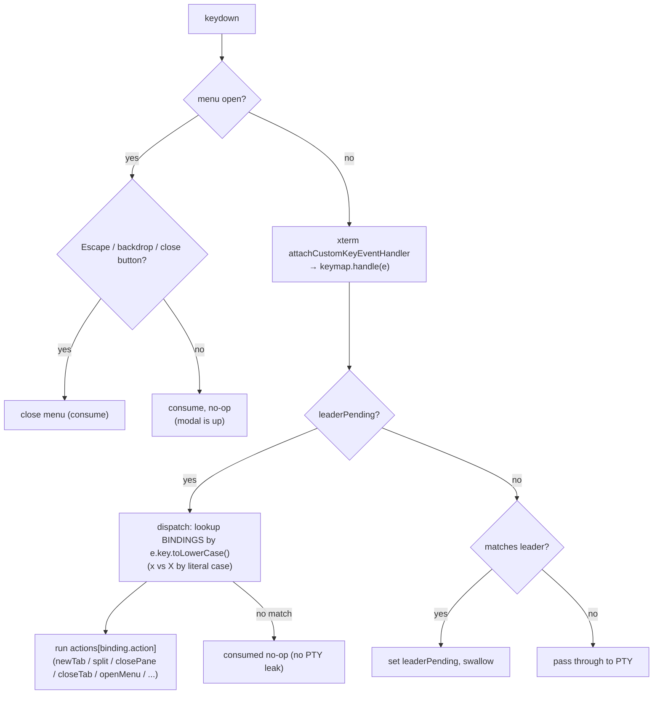

# feat: Hotkey menu (cheat-sheet overlay) + close-tab chord

## Summary

Add a **hotkey menu** — a dismissible cheat-sheet overlay that lists every leader-key
chord and what it does — opened with `leader ?` (and a tab-bar button). The four
operations the request named (new tab, split horizontal/vertical, close) **already
exist** as tmux-style leader chords in `src/lib/keymap.ts`; the real gap is
**discoverability**. The one new binding is a distinct **`leader X` "close the current
tab and every pane in it"** (today `leader x` closes the focused *pane* and only closes
the tab when it is the last pane).

To keep the menu from drifting out of sync with the actual bindings, the chord→action
map is first refactored into a single `BINDINGS` data structure that both the
dispatcher and the menu consume. The leader-key model and shell pass-through are
otherwise unchanged.

---

## Problem Frame

The leader-key model (`src/lib/keymap.ts`, default Ctrl-A) drives new tab, split H/V,
focus move, close pane, and cycle-attention. Two problems:

1. **No discoverability.** The chords are real but invisible — there is no in-app
   surface that tells a user the leader is Ctrl-A or that `leader -` splits a pane.
   New users cannot find the bindings without reading source.
2. **No true "close tab."** The request asks for "closing the current tab." Today
   `leader x` closes the focused pane (`closePane` in `src/App.svelte`); the whole tab
   only goes away when that pane was its last leaf. There is no single chord that
   closes an entire tab with all its splits.

Scope decided with the user: **keep the leader-chord model as-is** (no direct modifier
hotkeys, no command palette). Deliver a passive cheat-sheet overlay plus the missing
close-tab chord.

---

## Requirements

- **R1.** A hotkey menu lists all leader chords with human-readable labels, opened by a
  leader chord (`leader ?`).
- **R2.** The menu is dismissible by Escape, a backdrop click, and a close button.
- **R3.** The chords shown in the menu derive from the **same source** the dispatcher
  uses, so the two can never drift.
- **R4.** A distinct chord (`leader X`) closes the entire active tab and all its panes.
- **R5.** The existing leader model and shell/agent pass-through (the v1 foundation's
  pass-through guarantee — distinct from this document's R6) are preserved: all
  non-leader input still flows to the PTY untouched.
- **R6.** The menu displays the **configured** leader key (e.g. "Ctrl-A"), read from
  config — not a hardcoded label.

---

## Key Technical Decisions

- **KTD1 — Single source of truth for bindings.** Introduce an exported `BINDINGS`
  array in `src/lib/keymap.ts` (`{ keys, shift?, label, action }`). `dispatch()` becomes
  a lookup over `BINDINGS`; the menu renders from the same array. *Rationale:* a
  hand-maintained label list in the menu component would drift from the `switch` as
  chords change. One array, consumed twice, makes drift impossible and is directly
  unit-testable in the existing pure-function Vitest style.
- **KTD2 — `leader x` vs `leader X` by character case, not a shift flag.** `dispatch()`
  matches on `e.key.toLowerCase()`, so `X` collapses onto the existing `x` (close pane).
  **Keep the lowercase lookup exactly as today** — this is what makes `?`, `|`, `\`, `-`,
  `_`, and CapsLocked focus letters all keep matching with no shift reasoning. Disambiguate
  **only** the `x`/`X` pair by inspecting the *literal* `e.key` character: `closeTab` when
  `e.key === "X"`, `closePane` when `e.key === "x"`. Model this with an optional
  `upper?: boolean` on the two colliding `BINDINGS` entries (lookup compares the raw
  `e.key`'s case for entries that carry it; all other entries ignore case as before).
  *Rationale:* character-case matching is CapsLock-robust (Shift is not the only way to
  produce `X`), and confining the special case to the one colliding pair means no shifted
  symbol chord (`|`/`?`/`_`) is at risk. *Alternatives rejected:* (a) a global
  `shift?: boolean` default of "shift must be false" — this is the rule an earlier draft
  used; it would make `leader ?` (always Shift on US layouts) unreachable and silently
  break the shifted split chords. (b) a non-letter close-tab key (e.g. `&`) — avoids the
  ambiguity but loses the natural `x`/`X` pane/tab pairing.
- **KTD3 — Non-focus-stealing overlay.** The menu is rendered in `src/App.svelte`,
  gated by a `menuOpen` `$state`. It is **opened** through the keymap (`openMenu`
  action) and **dismissed** by Escape (a window-level `keydown` capture listener active
  only while open), a backdrop click, and a close button. The overlay does **not** take
  DOM focus — xterm keeps focus throughout. *Rationale:* avoids the focus-restore gap
  (the `Terminal` `$effect` only refocuses on a `focused` prop change, not on DOM-focus
  loss), and extends the repo's existing `window.addEventListener` precedent minimally.
  *Alternative rejected:* a focusable modal with a focus trap + refocus-on-close is
  heavier and introduces the very refocus gap this avoids.
- **KTD4 — Logic in pure functions, component stays presentational.** Vitest runs in
  Node with no jsdom/testing-library, so `.svelte` components are not unit-testable.
  Keep all testable logic — the `BINDINGS` lookup and a `formatLeader(spec)` display
  helper — as pure exports in `src/lib/keymap.ts`; `HotkeyMenu.svelte` only renders.
- **KTD5 — Guard `leader X` against accidental multi-pane loss.** `leader X` is the only
  *new destructive* action, and it kills an entire tab and every pane (every live
  agent/shell) in it at once, with no undo — and it sits one Shift away from the
  far-less-destructive `leader x`. **Decision (default): require a confirmation when the
  active tab has more than one pane.** Single-pane tabs close immediately (equivalent to
  closing the last pane, which already collapses the tab today). Confirmation can be a
  lightweight inline prompt in the tab bar or a small overlay reusing the menu's overlay
  styling — exact affordance decided during U2/U4. *Rationale:* preserves the convenience
  of a one-chord tab close for the common single-pane case while preventing a sticky-Shift
  mis-fire from silently destroying several agents' work. *Alternative:* accept silent
  destruction for parity with terminal conventions — viable, but the asymmetry of
  consequence (one keystroke, N panes, no recovery) argues against it for an app whose
  whole point is long-running agent panes. **This is the one open decision the user should
  confirm** (see Open Questions).
- **KTD6 — Accessibility: `aria-hidden`, AT support deferred.** The overlay is a redundant
  *reference* surface — every chord it documents is operable without it — and KTD3
  deliberately keeps DOM focus in xterm, which breaks the standard focusable-dialog pattern.
  **Decision: mark the panel `aria-hidden="true"` for v1** (so screen readers are not handed
  a focus-less, non-navigable dialog) and defer real AT support (`role="dialog"`,
  `aria-modal`, focus trap) to follow-up. *Rationale:* a half-implemented dialog pattern is
  worse than an explicitly-hidden one; the underlying functionality is fully accessible via
  the chords themselves. Revisit if the menu ever becomes interactive (e.g. the deferred
  command palette).

---

## High-Level Technical Design

Key-handling path after this change. New branches are the **menu-open guard** (window
capture listener, KTD3) and the **`x`/`X` character-case** distinction inside dispatch
(KTD2). The existing leader-pending flow is unchanged.

*Directional guidance, not implementation specification.*

---

## Implementation Units

### U1. Refactor chord dispatch into a single `BINDINGS` source of truth

- **Goal:** Replace the hand-written `dispatch()` switch with a lookup over an exported
  `BINDINGS` array, preserving exact current behavior for all existing chords. Enables
  R3 without changing any observable binding.
- **Requirements:** R3, R5
- **Dependencies:** none
- **Files:** `src/lib/keymap.ts`, `src/lib/keymap.test.ts`
- **Approach:** Define `interface Binding { keys: string[]; upper?: boolean; label:
  string; action: keyof KeymapActions }` and `export const BINDINGS: Binding[]` covering
  the current chords (new tab `c`, split right `|`/`\`, split down `-`/`_`, close pane
  `x`, focus h/j/k/l + arrows, cycle attention `u`) with display labels. Rewrite
  `dispatch()` to find the entry whose `keys` includes `e.key.toLowerCase()`; **the
  lowercase lookup is preserved exactly as today**, which is precisely why `?`, `|`, `\`,
  `-`, `_`, and CapsLocked focus letters all keep matching with no modifier reasoning.
  The **only** case-sensitive entries are the `x`/`X` pair (close pane vs. close tab):
  give the close-tab entry `upper: true` and, when an entry carries `upper`, require the
  *literal* `e.key` case to match (`e.key === "X"` for close-tab, `e.key === "x"` for
  close-pane). No `shift?` flag is introduced — earlier drafts used one, but a global
  "shift must be false" default would make `leader ?` (always Shift on US layouts)
  unreachable and break the shifted split chords. Call `this.actions[binding.action]()`.
  Unmatched chord remains a consumed no-op.
- **Patterns to follow:** the existing `dispatch()` cases (`src/lib/keymap.ts`) for the
  exact key strings; keep the lowercased-`e.key` lookup the current `switch` uses.
- **Execution note:** behavior-preserving refactor — the existing `keymap.test.ts`
  assertions ("maps focus + tab + close chords", split chords) should keep passing
  untouched; treat them as the characterization net, and **add the missing shifted-symbol
  coverage below before refactoring** (the current suite only proves `|`).
- **Test scenarios:**
  - Each existing chord still triggers its action (re-run/keep the existing
    `["left","right","newTab","close","cycle"]` and split assertions).
  - **Every shifted-symbol chord fires after the refactor:** `leader |` (Shift+`\`),
    `leader \` (no shift), `leader -`, `leader _` (Shift+`-`) each fire their split
    action. These are the entries the refactor could silently regress and only `|` is
    covered today — add `\`, `-`, `_` (and `?` once U3 lands).
  - An unbound leader chord (e.g. `leader z`) is still a consumed no-op and does not
    leak to the PTY.
  - Ordinary input (Ctrl-C, plain `j`) still passes through (`handle` returns `false`).

### U2. Add `leader X` — close the current tab

- **Goal:** A distinct chord that closes the entire active tab and all its panes,
  separate from `leader x` (close pane).
- **Requirements:** R4
- **Dependencies:** U1
- **Files:** `src/lib/keymap.ts`, `src/App.svelte`, `src/lib/keymap.test.ts`
- **Approach:** Add `closeTab: () => void` to `KeymapActions`. Add a `BINDINGS` entry
  `{ keys: ["x"], upper: true, label: "Close tab", action: "closeTab" }` alongside the
  existing close-pane entry (`{ keys: ["x"], label: "Close pane", action: "closePane" }`)
  so the case-sensitive lookup (KTD2) routes `X`→`closeTab` and `x`→`closePane`. In
  `src/App.svelte`, wire `closeTab: () => closeTab(activeId)` into the actions literal
  passed to `new Keymap(...)` — the `closeTab(id)` function already exists in
  `App.svelte` and handles the last-tab case (respawns a fresh tab). **Also add a
  `closeTab` stub to `spyActions()` in `keymap.test.ts`** — `KeymapActions` is a
  required-field interface, so the test's full-object construction won't typecheck
  otherwise. See KTD5 for the destructive-action guard this unit must honor.
- **Patterns to follow:** existing action wiring in `App.svelte` (`restore()`), e.g.
  `closePane`, `cycleAttention`.
- **Test scenarios:**
  - `leader X` (literal `e.key === "X"`) fires `closeTab`, not `closePane`.
  - `leader x` (literal `e.key === "x"`) still fires `closePane`, not `closeTab`.
  - (If KTD5 resolves to a guard) `closeTab` on a multi-pane tab routes through the
    confirmation path; on a single-pane tab it closes directly.
  - (Wiring) `closeTab` action invokes `App`'s `closeTab(activeId)` — verified by the
    pure-keymap test asserting the action name; the `closeTab(id)` behavior itself is
    already covered by existing app behavior and manual verification.

### U3. Add `openMenu` action, `leader ?` binding, and menu-open state

- **Goal:** A leader chord opens the menu; `App` owns the open/closed state and exposes
  the configured leader for display.
- **Requirements:** R1, R6
- **Dependencies:** U1
- **Files:** `src/lib/keymap.ts`, `src/App.svelte`, `src/lib/keymap.test.ts`
- **Approach:** Add `openMenu: () => void` to `KeymapActions` and a `BINDINGS` entry
  `{ keys: ["?"], label: "Hotkey menu", action: "openMenu" }` (the `?` char is what
  Shift+`/` produces; `.toLowerCase()` leaves it unchanged). In `src/App.svelte`: add
  `let menuOpen = $state(false)` and `let leaderKey = $state("ctrl+a")`; in `restore()`
  set `leaderKey = cfg.leaderKey` (currently `cfg.leaderKey` is passed to `new Keymap`
  but not retained). The `"ctrl+a"` initial value is a deliberate fallback so the menu
  never displays an empty/undefined leader if it is somehow opened before `restore()`
  resolves (it matches the config default). Wire `openMenu: () => (menuOpen = true)`.
  **Add an `openMenu` stub to `spyActions()` in `keymap.test.ts`** (same required-field
  reason as U2).
- **Patterns to follow:** `$state` declarations and `restore()` config load in
  `src/App.svelte`; `getConfig()` usage in `src/lib/config.ts`.
- **Test scenarios:**
  - `leader ?` (literal `e.key === "?"`, Shift held) fires `openMenu` — guards the bug
    where treating `?` as a shift-must-be-false entry would make the menu unreachable.
  - `openMenu` is included in the spy actions object (the actions object still satisfies
    `KeymapActions` after the interface grows — compile-time guard plus dispatch test).

### U4. Build the `HotkeyMenu` overlay component and wire dismissal

- **Goal:** Render the cheat-sheet overlay from `BINDINGS` + the configured leader, with
  Escape / backdrop / button dismissal and a tab-bar entry point.
- **Requirements:** R1, R2, R3, R6
- **Dependencies:** U1, U2, U3
- **Files:** `src/lib/HotkeyMenu.svelte` (new), `src/lib/keymap.ts` (add `formatLeader`),
  `src/App.svelte`, `src/lib/TabBar.svelte`, `src/lib/keymap.test.ts`
- **Approach:**
  - Add `export function formatLeader(spec: string): string` to `src/lib/keymap.ts` that
    turns a leader spec (`"ctrl+a"`, `"super+space"`) into a display string ("Ctrl-A",
    "Super-Space"): split on `+`, title-case each part (map `ctrl`→Ctrl, `super`/`meta`/
    `cmd`→Super, `alt`→Alt, `shift`→Shift, `space`→Space), join with `-`.
  - New `src/lib/HotkeyMenu.svelte`: presentational, mirrors `TabBar.svelte`
    (`interface Props` + `$props()`, scoped `<style>`, dark palette `#0b1020`/`#0a0e1a`
    panel, `#c9d1d9` text, `#4da3ff` accent, `12px ui-monospace`). Props:
    `open: boolean`, `leader: string`, `onClose: () => void`. Renders a backdrop (click →
    `onClose`) + a centered panel: title showing the leader (`Leader: {formatLeader(leader)}`),
    a keyed `{#each BINDINGS}` list of rows (formatted keys + label, prefixing the leader
    for chord rows; the close-tab row renders `X` to distinguish it from close-pane `x`),
    and a close button. Render nothing (or `class:hidden`) when `open` is false.
    Required details so the "purely presentational" component is built correctly:
    - The **panel** element calls `event.stopPropagation()` on click, so only clicks that
      land on the backdrop trigger `onClose` (otherwise reading/selecting inside the menu
      dismisses it).
    - The **binding list** region has `max-height` (e.g. `60vh`) + `overflow-y: auto`, with
      the title and close button outside the scroll region, so a growing chord list (or a
      short window) never clips or overflows the viewport.
    - **Instant show/hide** (conditional render / `display`), no CSS transition — matches
      the terminal aesthetic and avoids a fade outliving the Escape-listener teardown.
    - Mark the panel `aria-hidden="true"` per KTD6 (accessibility decision).
    - Sits at `z-index: 100` (above the `z-index: 5` dividers).
  - In `src/App.svelte`: mount `<HotkeyMenu open={menuOpen} leader={leaderKey}
    onClose={() => (menuOpen = false)} />`. Add a window `keydown` **capture** listener,
    registered only while `menuOpen` (added on open, removed on close), that closes on
    Escape and calls `preventDefault()`/`stopPropagation()` so Escape does not reach xterm.
    Because the listener only exists while the menu is open, Escape reaches a running TUI
    (vim, an agent) normally at all other times. Keep xterm focused (do not move DOM focus
    to the overlay); note that, by consequence, **other keystrokes typed while the menu is
    open still flow to the focused PTY** — acceptable for a transient cheat-sheet, called
    out here so it is a conscious choice rather than a surprise.
  - In `src/lib/TabBar.svelte`: add an `onMenu: () => void` prop and a `?` icon button in
    the `.controls` group (mirrors the existing split/close icon buttons); `App` passes
    `onMenu={() => (menuOpen = true)}`.
- **Patterns to follow:** `src/lib/TabBar.svelte` (props, icon buttons, styling), the
  `.slot.hidden` toggle pattern and `window.addEventListener` lifecycle in
  `src/App.svelte` (`onMount` add/remove).
- **Execution note:** no DOM test harness exists; cover `formatLeader` and the
  `BINDINGS` contents with Vitest, and verify the overlay rendering/dismissal manually
  via `pnpm tauri dev`.
- **Test scenarios:**
  - `formatLeader("ctrl+a")` → `"Ctrl-A"`; `formatLeader("super+space")` → `"Super-Space"`;
    `formatLeader("alt+shift+x")` → `"Alt-Shift-X"`.
  - `BINDINGS` contains exactly the expected actions including `closeTab`, `openMenu` (a
    snapshot/inclusion test so a future chord change forces a conscious test update — this
    is the anti-drift guard for R3).
  - `Test expectation (HotkeyMenu.svelte rendering & dismissal): none — no jsdom/component
    test harness; verified manually via pnpm tauri dev`: overlay opens on `leader ?` and
    the `?` button; Escape, backdrop, and close button each dismiss; clicking inside the
    panel does **not** dismiss; menu shows the configured leader and every binding row.
  - Manual: open `vim` (or an agent TUI) in a pane, open the menu, press Escape to dismiss,
    confirm the TUI's mode is unaffected afterward (guards the Escape-capture/teardown).

---

## Scope Boundaries

**In scope:** cheat-sheet overlay opened via `leader ?` and a tab-bar `?` button;
dismissal by Escape/backdrop/button; the `BINDINGS` refactor; `leader X` close-tab;
configured-leader display.

### Deferred to Follow-Up Work

- **Searchable command palette** (type-to-filter + Enter-to-run). Bigger build (command
  registry, search, keyboard nav); the user chose the cheat-sheet for now.
- **Rebindable chords / settings GUI** for the menu and close-tab keys — the app has no
  settings GUI by design (origin U13 scope); chords stay code-defined.
- **jsdom / component-test harness** so `HotkeyMenu.svelte` can be unit-tested — only
  worth adding if overlay logic grows beyond the pure helpers.

**Out of scope (explicit non-goals):** changing the leader-key model; adding direct
single-press modifier hotkeys (e.g. Ctrl+Shift+T); altering shell/agent pass-through.

---

## Open Questions

- **Close-tab confirmation (KTD5) — needs user sign-off.** Default in this plan is to
  confirm `leader X` only when the active tab has >1 pane. Confirm this, or choose silent
  destruction. This is the one decision that changes behavior the user will feel.
- **`formatLeader` coverage of exotic specs.** The helper targets the documented forms
  (`ctrl+a`, `super+space`). An unusual spec falls back to title-casing each `+`-part —
  acceptable for v1; revisit only if a non-standard leader is configured.
- **Tab-bar `?` button placement.** The `?` button is the only *non-circular*
  discoverability affordance — `leader ?` only helps users who already know the leader
  exists, so the button is the entry point for newcomers and is therefore **kept in
  scope**, not optional. Open detail: its exact position in the `.controls` group and
  whether it needs a divider/tooltip; decide visually during U4. If the toolbar proves too
  tight at narrow widths, move (don't drop) the button.

---

## Risks & Dependencies

- **Chord-matching regressions (KTD2).** The refactor is the one change that could
  silently break a shifted-symbol chord (`|`, `\`, `-`, `_`, `?`) if the lookup ever
  conditioned on `e.shiftKey`. Mitigation: KTD2 keeps the lowercase lookup unchanged and
  confines case-sensitivity to the `x`/`X` pair only; U1's test scenarios add explicit
  coverage for **all** shifted-symbol chords (today only `|` is proven) before the
  refactor lands.
- **Accidental tab destruction (KTD5).** `leader X` is one Shift away from `leader x` and
  destroys N panes irreversibly. Mitigation: the KTD5 confirmation guard for multi-pane
  tabs; pending user sign-off (Open Questions).
- **Escape capture vs xterm.** The window capture listener must `stopPropagation()` so
  Escape closing the menu does not also reach the focused terminal — and must be removed
  on close so Escape reaches a running TUI normally the rest of the time. Mitigation:
  register the listener only while `menuOpen`; the U4 manual `vim` test verifies Escape
  behaves correctly both during and after dismissal.
- **Dependency order:** U1 underpins U2–U4 (all read `BINDINGS`); U4 depends on U2 and
  U3 so the menu lists the new chords and has an open trigger.
