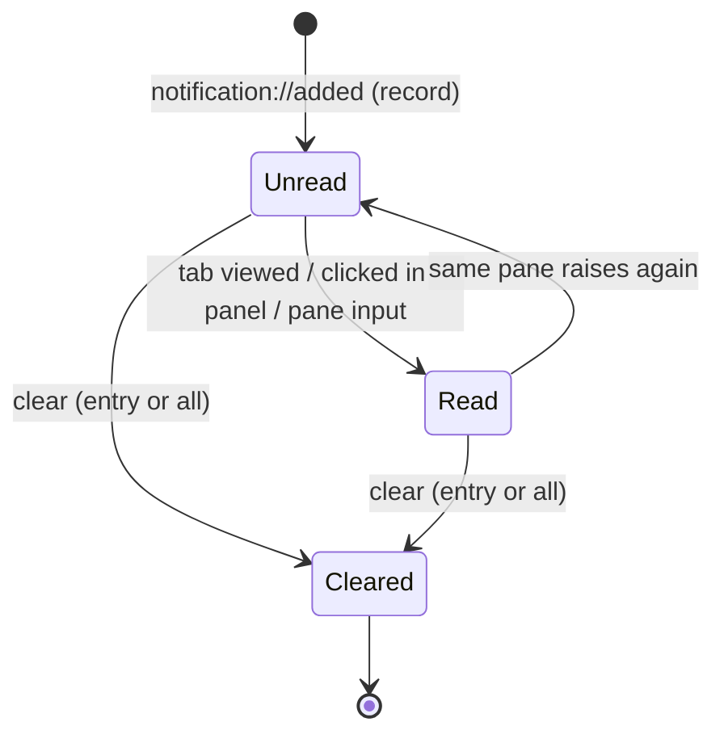

# feat: Notification parity with cmux (panel, badges, suppression)

## Summary

Bring fly's notification system to functional parity with cmux's, built **entirely
on the existing Claude Code hook path** (the "primary operational plane") rather
than adding generic OSC/escape-sequence ingestion for other tools. fly already
has the hard parts — desktop alerts, coalescing, rate-limiting, an attention
state machine, and a focus-based suppression matrix — so this **extends** that
foundation rather than rebuilding it.

The work has two halves, both confirmed in scope:

1. **Suppression / policy layer** (the emphasized request): a global mute /
   do-not-disturb toggle, **per-effect** filtering (desktop banner vs. sound vs.
   history-record decided independently), per-reason and per-workspace rules, and
   broader auto-suppress (suppress the desktop banner when the window is
   foregrounded, when the notification panel is open, or when muted — not just
   when the exact pane is keyboard-focused).
2. **Parity surface**: a notification panel/history with a read → unread →
   cleared lifecycle, unread badges on tabs and workspaces, and keybindings to
   open the panel and jump to the newest unread agent.

Plus two output options from cmux: a **configurable sound** and an **opt-in
notification command** (a user shell command receiving sanitized
title/subtitle/body env vars, for TTS / custom sounds / logging).

**Out of scope:** OSC 777 / OSC 99 ingestion, non-Claude notification sources
(BEL / generic CLI), and remote/push delivery (see Scope Boundaries).

---

## Problem Frame

fly's notifications today are a single, coupled decision: when an authenticated
Claude Code hook fires, the dispatch closure (`src-tauri/src/lib.rs:146`) runs
the attention state machine, and if the result says `notify`, it immediately
coalesces + rate-limits and fires one OS banner with a fixed sound. Three things
follow from that coupling:

- **Suppression is all-or-nothing.** The only lever is the
  `should_notify(pane_focused, window_foregrounded)` matrix. There is no mute, no
  per-reason control, no way to keep the banner but drop the sound, and no
  history to fall back on when a banner is suppressed.
- **There is no notification surface beyond the transient banner.** Attention
  renders as a binary dot on the tab/workspace (`Sidebar.svelte`) that clears
  when you look. A missed banner is gone — no panel, no unread state, no
  count, no "jump to the agent that needs me."
- **Output is fixed.** One hard-coded sound (`message-new-instant`), no custom
  command, so cmux's TTS / `afplay` / logging integrations are impossible.

cmux solves all three with: auto-suppress rules (window focused / workspace
active / panel open), a notification panel (`⌘⇧I`) with a four-stage
received → unread → read → cleared lifecycle, unread badges, jump-to-unread
(`⌘⇧U`), a custom Notification Command, and per-effect notification hooks. This
plan closes that gap on fly's Claude-Code-first architecture.

---

## Requirements

Extending the foundation plan's R-series (max existing: R16). Origin for R1–R16:
`docs/plans/2026-06-16-001-feat-fly-agent-terminal-plan.md`.

- **R17 — Global mute / do-not-disturb.** A runtime toggle suppresses desktop
  banners and sounds (history records are still kept), reachable via keybinding,
  command palette, and a control-bar affordance; its state is visible in the UI.
- **R18 — Per-effect, per-reason, per-workspace suppression.** Desktop banner,
  sound, and history-record are each independently *configurable* per attention
  reason (`question` / `permission` / `finished` / `error`). By default sound
  follows the desktop banner (the suppression matrix is the source of truth) and
  history-record survives mute so the panel stays complete; a workspace can be
  muted at runtime. ("Independently configurable" means each effect has its own
  per-reason switch — not that the defaults are uncoupled.)
- **R19 — cmux-parity auto-suppress.** A desktop banner is auto-suppressed when
  the app window is foregrounded, when the notification panel is open, or when
  muted — relying on in-app badges + the panel while the user is in the app.
- **R20 — Notification panel + history lifecycle.** A panel lists recent
  notifications with a received → unread → read → cleared lifecycle; clicking an
  entry jumps to its originating pane (best-effort if the pane has exited);
  viewing a tab marks its notifications read; entries can be cleared.
- **R21 — Unread badges.** Tabs and workspaces show unread **counts** (not just a
  binary dot) derived from the history's unread entries.
- **R22 — Navigation keys.** Keybindings (and palette commands) open the panel
  and jump to the newest unread agent.
- **R23 — Output options.** The notification sound is configurable; an opt-in
  notification command runs on each surfaced notification with sanitized
  title/subtitle/body env vars.
- **R24 — Safety invariants preserved.** All notification text (banner, panel,
  and command env) stays sanitized per R16; the notification command is
  best-effort and never blocks the dispatch path; the hook socket trust boundary
  (R10/KTD7) is unchanged.

---

## Key Technical Decisions

Extending the foundation plan's KTD-series (max existing: KTD13).

- **KTD14 — Per-effect notification policy, backend-owned and pure-testable.**
  Replace the single boolean `should_notify` with a pure function that computes a
  three-field `Effects { desktop, sound, record }` from the full input tuple
  (reason, per-reason config, per-pane visibility, window foreground, panel-open,
  global mute, per-workspace mute). This mirrors cmux's hooks effect model
  (`desktop` / `sound` / `record`) in **fly-native typed config** — no
  `cmux.json`, no project-level file, no shell-chain / stop-propagation
  semantics (confirmed scope decision). Lives beside the existing attention
  machine in `state/`, time/inputs injected, so it is fully unit-tested.
  **Critical decoupling (U17):** the `record` effect must be computed for a
  raise *even when the user is looking* — today `AttentionMachine::signal`
  returns early with `notify:false` on the "looking" branch
  (`attention.rs:162`), which would drop exactly the visible-pane row the matrix
  requires to record. So the focus/visibility suppression moves **out** of the
  state machine into this policy, and the machine emits a `recordable` signal
  (any non-debounced raise, including the Acknowledged-at-birth case) separate
  from the desktop decision. `is_user_viewing(visible, foregrounded)` is the
  *negation* of the old `should_notify` — the absorbed tests must assert the
  flipped polarity, not transcribe it.

- **KTD15 — cmux-parity desktop-suppress semantics.** Suppress the desktop
  banner whenever the user is "in the app" (window foregrounded) **or** the panel
  is open **or** muted; desktop banners are for when you are *away*. While the
  window is focused, the new unread badges + panel carry attention instead. This
  intentionally broadens fly's current pane-focused rule (a behavior shift —
  existing users no longer get background-pane banners while focused; see Risks).
  The **in-app** attention ring/Acknowledged transition uses **per-pane
  visibility** (a pane in the active tab of the active workspace = cmux's
  "workspace active"), decoupled from the desktop decision. **Panel-open
  suppresses only while the window is also foregrounded** — a user who left the
  panel open and walked away (window backgrounded) still gets banners, since the
  compensating surface (badges) is in-window and useless when away. These
  suppressors are tuned for the trusted Hook tier; if the deferred OSC/BEL tiers
  (KTD9) ever land, their suppression must be re-reviewed — a lower-trust source
  must not silently inherit "muted ⇒ dropped" (carried to Scope Boundaries).

- **KTD16 — Notification history is frontend-owned; backend is the policy
  authority.** The backend emits a `notification://added` event when policy says
  `record`; the frontend owns the history list and the read/unread/cleared
  lifecycle (a UI concept). Read/clear actions are local UI state; only the
  suppression *inputs* (panel-open, visible panes, mute) are replicated
  **backend-ward**, exactly mirroring the existing `set_pane_focus` /
  `set_window_foreground` pattern. Two seams the split must respect, or it
  fractures into two writers of one fact:
  - **Auto-read-at-birth is backend-authored.** When a pane is visible at raise
    time the policy already knows the entry is read; the seed event therefore
    carries a `read: bool` (from `is_user_viewing`) and `addNotification` honors
    it, instead of always inserting `unread` and re-deriving "visible" on the
    frontend (which would race an in-flight tab switch). Frontend
    `markReadForTab` then owns only the *later* "user switched to a tab that
    already had unread entries" transition.
  - **History keys on stable `leafKey`, not `paneId`.** `paneId` is per-spawn
    ephemeral (`pty.reserve_id()`), so a restored session's history could never
    map back to a pane. The frontend resolves `paneId → leafKey` at ingestion
    (via a `leafByPaneId` reverse index maintained beside `paneIdByLeaf`) and
    stores the `leafKey`, consistent with the scrollback-file keying invariant.
  - **Privacy: metadata-only by default.** Bodies can contain agent output, so by
    default only metadata (reason / title / ts / leafKey) persists; bodies persist
    only when `saveScrollback` is on (KTD10 posture). The session file itself must
    be written mode `0o600` — today `write_session` (`session/mod.rs:39`) sets no
    permissions, unlike `write_scrollback`'s explicit `0o600`; moving
    secret-bearing text there without that fix would expose it at the umask
    default. Because `write_session` writes a temp file then renames, set the mode
    on the **temp file before the rename** (not the destination after), or a
    world-readable window exists between rename and chmod. "Clear" must reach
    disk, not just the in-memory list.

- **KTD17 — Opt-in notification command: detached, non-blocking, sanitized,
  env-isolated.** The user-configured command runs with fly-namespaced env
  (`FLY_NOTIFICATION_TITLE` / `_SUBTITLE` / `_BODY`) on a short-lived thread that
  does not block dispatch and reaps its child via `Child::wait()` (not
  process-global `SIGCHLD`, which Tauri/GTK may own). Off unless configured; not
  reachable by the agent or any socket peer. Three hardening points the
  sanitization alone does **not** cover:
  - **`sanitize` strips control chars, it does not shell-escape.** Title/body
    originate from agent output, so they can contain `$()`, backticks, `;`, `|`.
    They are safe *only* because fly passes them exclusively as **env values**
    (never interpolated into the command string), inert as long as the user's
    command references `"$FLY_NOTIFICATION_*"` **inside double quotes**. The docs
    for `notification_command` must show only quoted references and warn that
    unquoted use re-exposes the value to word-splitting/globbing.
  - **Build the child env from an allowlist, not inheritance.** Spawn with
    `.env_clear()` then re-add only `PATH`, `HOME`, `USER`, locale, and the three
    `FLY_NOTIFICATION_*` vars. A bare `Command` inherits the *app process* env;
    `FLY_PANE_TOKEN` / `FLY_SOCKET_PATH` are not in it today (they are injected
    only into PTY children, `stream/mod.rs:103`), but the command is spawned from
    the dispatch closure in the same crate that owns those tokens — pin "neither
    token reaches the command" as a tested invariant so a future refactor can't
    silently arm the leak.
  - **Trigger on the rate-limited desktop decision and cap concurrency.** Gate the
    command on the gated banner (inheriting `MIN_INTERVAL_MS`), and drop it if a
    small in-flight cap (e.g. 4) is already running, so a looping agent cannot fan
    out unbounded threads/processes. A hard per-command timeout stays deferred
    (Open Questions).

---

## High-Level Technical Design

### Dispatch pipeline — before vs. after

The change decouples three concerns currently fused in the dispatch closure.

```mermaid
flowchart TD
    H["Claude hook → fly notify → socket\n(ValidatedHook: reason, title, body)"] --> S["attention.signal(pane)\n(state machine: Idle→Raised→Ack)"]
    S -->|outcome.state: ring| E1["emit pane://attention\n(in-app ring — unchanged)"]
    S -->|outcome.recordable\n(non-dup raise, incl. Acknowledged-at-birth)| P{"NotificationPolicy.decide\n(KTD14)"}

    subgraph inputs["replicated frontend state (backend-owned)"]
        V["visible panes"]
        FG["window foregrounded"]
        PO["panel open"]
        MU["global + per-workspace mute"]
        RC["per-reason effect config"]
    end
    inputs -.-> P

    P -->|record| R["emit notification://added\n{id, paneId, reason, title?, body?, ts, read}\n(frontend resolves paneId→leafKey, KTD16)"]
    P -->|desktop| G["NotificationGate.decide\n(coalesce + rate-limit\n— desktop only now)"]
    G --> B["notify::banner (window urgency)"]
    P -->|sound| SND["notify::play_sound\n(configurable name)"]
    G -->|banner fired| C["notify::run_command\n(opt-in, detached, sanitized — KTD17)"]
```

Key shift: today `gate.decide()` gates the **whole** surface call; after, it
gates only the **desktop banner**. History `record` is independent (so a
coalesced "3 agents" banner still records all three), and `sound` is independent
(so you can keep the banner but mute the chime, or vice-versa). Critically,
`record` is driven by `outcome.recordable`, **not** `outcome.notify` — a raise on
a pane the user is already looking at still records (carrying `read:true`), which
the old early-return-on-looking path would have dropped.

### Suppression decision matrix (KTD14/KTD15 default)

Given a raise whose reason has all three effects enabled, the pure policy returns:

| User / app state                                  | desktop | sound | record |
| ------------------------------------------------- | :-----: | :---: | :----: |
| **Away** — window backgrounded                    |    ✓    |   ✓   |   ✓    |
| In app, pane not visible, panel closed, not muted |    ✗    |   ✗   |   ✓    |
| In app, **pane visible** (looking at it)          |    ✗    |   ✗   | ✓ → read at birth |
| **Panel open** *and foregrounded*                 |    ✗    |   ✗   |   ✓    |
| Panel open *but window backgrounded*              |    ✓    |   ✓   |   ✓    |
| **Muted** (global or this pane's workspace)       |    ✗    |   ✗   |   ✓    |

Per-reason / per-effect config is an AND-mask applied on top: `reason.desktop =
false` forces desktop ✗ regardless of state (e.g. never banner on `finished`);
`reason.record = false` forces record ✗ (skip history for a noisy reason);
`reason.sound = false` keeps the banner but drops the chime (cmux's "suppress
sounds independently"). `record` is the one effect mute does **not** kill, so the
panel always has the history to fall back on.

> Directional guidance for reviewers — the implementer pins this exact table in
> unit tests (U16); it is the contract, not pseudo-code to transcribe.

### Notification history lifecycle (KTD16, frontend-owned)



Unread badges count `Unread` entries per tab/workspace. "Jump to newest unread"
(R22) selects the most recently added `Unread` entry's pane. Auto-read happens
when the originating tab is the active tab (cmux "read when the workspace is
viewed").

---

## Output Structure

New files (everything else extends existing files):

```
src-tauri/src/
  state/
    policy.rs          # U16 — pure NotificationPolicy + Effects (replaces suppress.rs role)
  notify/
    command.rs         # U19 — opt-in notification command runner
src/
  lib/
    notifications.ts        # U20 — pure history model (add/markRead/clear/unreadCounts)
    notifications.test.ts    # U20 — vitest for the model
    NotificationPanel.svelte # U21 — the panel UI
```

`src-tauri/src/state/suppress.rs` is absorbed by `policy.rs` (U16) — its
`should_notify` becomes the "is the user looking at this pane" predicate used for
the Acknowledged transition, and the broader desktop decision moves into the
policy.

---

## Implementation Units

Sequenced backend-first (the policy core the request emphasizes), then output
options, then the frontend parity surface. Backend chain: **U23 → U16 → U17 →
U18 → U19** (U23 is pure config that U18 depends on; it is numbered last per the
U-ID stability convention but must land before U18). Frontend chain consumes
U18's event: U20 → U21 → U22.

### U16. NotificationPolicy — the pure per-effect suppression core

**Goal:** Introduce the pure `NotificationPolicy` that decides `Effects {
desktop, sound, record }` for a raise, replacing the single-boolean
`should_notify`. This is the heart of the emphasized suppression work.

**Requirements:** R18, R19 (KTD14, KTD15).

**Dependencies:** none (pure module).

**Files:**
- `src-tauri/src/state/policy.rs` (new) — `Effects`, `ReasonEffects`,
  `PolicyInputs`, and `decide(...) -> Effects`; plus the narrower
  `is_user_viewing(pane_visible, window_foregrounded)` used by the state machine.
- `src-tauri/src/state/suppress.rs` (delete/absorb) — fold its matrix + tests in.
- `src-tauri/src/state/mod.rs` — re-export `policy` instead of `suppress`.

**Approach:** Model `Effects` as three `bool`s. `decide` takes the reason's
configured `ReasonEffects` (which effects are even eligible), plus the runtime
tuple `(pane_visible, window_foregrounded, panel_open, muted_global,
muted_workspace)`, and applies the matrix above: `record` defaults on (only
`reason.record=false` removes it); `desktop = reason.desktop && !muted &&
!panel_open && !window_foregrounded`; `sound = reason.sound && desktop` as the
default tie, with `reason.sound=false` able to drop sound under an otherwise-on
banner. Keep it a free function over explicit inputs (no clock, no I/O), matching
`suppress.rs`/`attention.rs` style. Document each branch with the cmux rule it
implements.

**Patterns to follow:** `src-tauri/src/state/suppress.rs` (pure, table-tested),
`src-tauri/src/state/attention.rs` (input-injected enums + `#[serde]` reasons).

**Test scenarios:**
- *Away notifies fully:* `window_foregrounded=false`, all reason effects on,
  nothing muted → `{desktop:true, sound:true, record:true}`.
- *In-app, pane hidden:* foregrounded + not visible + panel closed + unmuted →
  `{desktop:false, sound:false, record:true}` (badge-only).
- *Pane visible:* foregrounded + visible → desktop/sound false, record true
  (caller will auto-read).
- *Panel open suppresses banner:* `panel_open=true`, backgrounded → desktop false,
  record true (panel already shows it).
- *Global mute:* `muted_global=true`, backgrounded → desktop+sound false, record
  true.
- *Per-workspace mute:* `muted_workspace=true` → same as global for that pane.
- *Per-reason desktop off:* `reason.desktop=false`, backgrounded → desktop false,
  sound follows (false), record true.
- *Independent sound suppression:* `reason.sound=false`, backgrounded → desktop
  true, sound false, record true.
- *Per-reason record off:* `reason.record=false` → record false even when
  unmuted (noisy-reason opt-out).
- *`is_user_viewing` polarity:* true only when visible AND foregrounded — the
  *negation* of the old `should_notify`. Port the four-quadrant `suppress` test
  with **flipped** expectations (sign-error magnet: `should_notify(true,true)`
  was `false`; `is_user_viewing(true,true)` is `true`).

**Verification:** `cargo test --offline` covers every row of the matrix; the old
`suppress` tests pass under `policy` with equivalent assertions.

---

### U17. Decouple in-app raise from desktop alert; replicate visibility / panel / mute

**Goal:** Make the attention machine raise the in-app indicator independently of
the desktop decision, and feed the policy its new inputs (per-pane visibility,
panel-open, mute) via the established replication pattern.

**Requirements:** R17, R18, R19 (KTD15, KTD16).

**Dependencies:** U16.

**Files:**
- `src-tauri/src/state/attention.rs` — **state-machine surgery, the riskiest edit
  in the chain** (see Approach): `signal()` currently early-returns `notify:false`
  on the "user is looking" branch (`attention.rs:162`) — pull the focus/visibility
  suppression *out* of the machine (it moves to the policy) while preserving the
  *debounce* dedup (`last_raise_ms`, `attention.rs:170`). Add `recordable: bool`
  to `Outcome` (true on any non-debounced raise, including the Acknowledged-at-
  birth case); broaden the focus input from "keyboard focused" to "visible" for
  the Acknowledged transition only.
- `src-tauri/src/state/manager.rs` — hold `panel_open`, `muted_global`, the set of
  muted-workspace keys, and per-pane visibility + workspace key; add setters
  returning re-evaluated outcomes (mirroring `set_foreground`); expose the policy
  decision for a pane (the dispatch closure asks the manager, not `should_notify`).
- `src-tauri/src/stream/mod.rs` — new Tauri commands `set_visible_panes`,
  `set_panel_open`, `set_muted`, `set_workspace_muted`; extend `spawn_pane` to
  accept the pane's workspace key (or a follow-up `set_pane_workspace`).
- `src-tauri/src/lib.rs` — register the new commands in `invoke_handler!`.
- `src/ipc.ts` — typed wrappers for the new commands.
- `src/App.svelte` / `src/lib/Terminal.svelte` — push the visible set (see
  Approach).

**Approach:** The "ensure `Outcome.notify` means raised-not-duplicate" framing
understates this: today `notify` *encodes the suppression decision* (looking →
`Acknowledged`, `notify:false`, before the debounce check). Conflating "user is
looking" with "debounced duplicate" is the actual edit — separate them so a raise
on a visible pane still produces `recordable:true` (the policy then yields
`{desktop:false, sound:false, record:true}` and the seed event carries
`read:true`), while genuine debounce duplicates stay `recordable:false`. Without
this, U18's "suppressed banner still records" and "record decoupled from coalesce"
tests cannot pass for the visible-pane row.

`set_focus` today marks one pane focused (manager blurs the rest). Generalize
visibility to a **set** — the active tab's leaves in the active workspace — so a
visible-but-not-keyboard-focused split pane counts as "looking" (cmux
workspace-active). Replicate it the way `set_window_foreground` is driven: a
single `$derived` visible-set + one `$effect` in `App.svelte`, **not** a push
sprinkled through every mutation. Two grounded hazards to handle: (1) `paneIdByLeaf`
is a plain object, not `$state` (`App.svelte:69`), so a `$derived` over it won't
re-fire on spawn — `onSpawned` must also re-push `set_visible_panes`; (2) a
late-arriving `paneId` (async spawn) transiently excludes a just-split/just-visible
pane, and "unknown visibility → not visible" cuts the *wrong* way here (it
over-banners a looked-at pane) — accept one stale banner at worst and re-push on
spawn. Mute and panel-open are backend runtime state (reset on launch); frontend
persistence of the *preference* is handled in U21/U20.

**Patterns to follow:** `set_foreground` / `set_focus` in `state/manager.rs` and
`set_window_foreground` / `set_pane_focus` in `stream/mod.rs` (replication +
re-evaluate + emit). `invoke_handler!` registration + `src/ipc.ts` wrappers per
CLAUDE.md ("add a command in both places").

**Test scenarios:**
- *Visible raise records as read (the decoupling):* a raise on a visible,
  foregrounded pane → `state:Acknowledged`, **`recordable:true`**, policy
  `{desktop:false, sound:false, record:true}` → exactly one record carrying
  `read:true`. (This is the row the old early-return dropped.)
- *Visible sibling acknowledges:* pane A and B share the active tab; a raise on B
  while the tab is active and foregrounded → B Acknowledged (no ring) even though
  A holds keyboard focus — still `recordable:true`.
- *Debounce duplicate does not record:* a second identical raise within the
  debounce window on a hidden pane → `recordable:false` (no second record), while
  a fresh non-duplicate raise is `recordable:true`. Proves "looking" and
  "duplicate" are now independent.
- *Hidden pane stays raised:* raise on a pane in a non-active tab while
  foregrounded → stays Raised (ring shows), `recordable:true`.
- *Panel-open is a desktop-only suppressor:* with `set_panel_open(true)` while
  foregrounded, a raise on a hidden pane still goes Raised (ring + record) but the
  policy says `desktop:false`; `set_panel_open(true)` while *backgrounded* →
  `desktop:true` (the away-with-panel-open case).
- *Visible set re-pushed on spawn:* a freshly-split pane whose `paneId` arrives
  after the tab switch is included in the visible set via the `onSpawned` re-push,
  not only on switch (frontend test / structural assertion).
- *Mute toggles re-evaluate:* `set_muted(true)` then a raise → policy desktop
  false; `set_muted(false)` → next raise desktops again.
- *Workspace mute scoping:* mute workspace W → raises on W's panes suppress
  desktop; raises on another workspace's panes do not.
- *Visibility command updates the set:* `set_visible_panes([1,3])` makes 2 hidden;
  a later raise on 2 stays Raised.

**Verification:** Manager unit tests assert re-evaluation outcomes; `cargo test
--offline` green; `pnpm check` passes with the new `ipc.ts` signatures.

---

### U18. Rewire dispatch: per-effect surfacing, split banner/sound, history event

**Goal:** Replace the coupled `gate.decide → surface` block in the dispatch
closure with the per-effect pipeline: record → event, desktop → gate → banner,
sound → play, command → run.

**Requirements:** R18, R19, R20, R24 (KTD14, KTD16).

**Dependencies:** U16, U17, U23 (config fields).

**Files:**
- `src-tauri/src/lib.rs` — rewrite the `dispatch` closure (currently lines
  ~146–170): after `attention.signal`, branch on `outcome.recordable` (not
  `outcome.notify`); ask the manager for `Effects`. **Gotcha:** the config `Arc`
  is consumed by `.manage(config)` at `lib.rs:126`, so a fresh `Arc::clone` of the
  config (carrying `reason_effects` / `notification_sound` / `notification_command`)
  must be taken **before** `.manage()` and moved into the closure — mirror the
  existing `tokens_for_hooks` / `attention_for_hooks` clones at `lib.rs:112–113`.
- `src-tauri/src/notify/mod.rs` — split `surface()` into `banner()` (notification
  + window urgency, no sound) and `play_sound(name)`; make the sound name a
  parameter (drop the hard-coded `NOTIFICATION_SOUND` constant → config-driven).
  Add the `notification://added` emit helper + the event payload
  (`id`, `paneId`, `reason`, `title?`, `body?`, `ts`, **`read`**). Keep coalescing
  in the gate but apply it to the banner only.

**Approach:** The dispatch closure becomes: `signal → emit ring → if
outcome.recordable: effects = manager.decide(pane, reason); if effects.record {
emit notification://added with read = is_user_viewing }; if effects.desktop {
match gate.decide(...) { Individual → banner; Coalesced → summary banner;
Suppressed → {} } }; if effects.sound { play_sound(config.sound) }; if
effects.desktop (gated) { run_command(...) }`. The `record` deliberately bypasses
the gate so the panel is complete even when banners coalesce or rate-limit; the
command is gated on the *rate-limited desktop* decision (U19/KTD17). The `read`
bit makes the backend the single author of birth read-state (KTD16). Generate a
monotonic id in the backend (reuse `gate.now_ms()` epoch + a counter) so the
frontend can key/dedupe.

**Patterns to follow:** the existing dispatch closure in `src-tauri/src/lib.rs`;
the `*_for_hooks` `Arc::clone`-before-`.manage()` pattern; `NotificationGate` usage.

**Test scenarios:**
- *Record decoupled from coalesce:* 4 simultaneous raises → banner coalesces to one
  summary, but 4 `notification://added` events emit (assert via a test dispatch
  sink).
- *Suppressed banner still records:* foregrounded (hidden-pane) raise → no banner,
  one record event with `read:false`.
- *Visible raise records as read:* visible foregrounded raise → no banner, one
  record event with **`read:true`** (the decoupled path from U17).
- *Sound independence:* `notification_sound=None` → banner fires, no sound call;
  `reason.sound=false` → banner fires, no sound.
- *Muted path:* muted → no banner, no sound, no command; one record event.
- *Command gated on banner:* a suppressed/rate-limited banner → `run_command` is
  not called (it rides the gated desktop decision, not the raw raise).
- *Sanitization preserved:* a title/body with control chars is sanitized in the
  banner, the record event, and the command env (Covers R16/R24).

**Verification:** `cargo test --offline` for the dispatch/notify changes;
manual `pnpm tauri dev` smoke — trigger a Claude `Stop` hook backgrounded (banner
+ record) and foregrounded (record only); `pnpm check` for `config.ts`.

---

### U19. Notification command + configurable sound

**Goal:** Run an opt-in user command per surfaced notification with sanitized
env, non-blocking and best-effort; finish wiring the configurable sound.

**Requirements:** R23, R24 (KTD17).

**Dependencies:** U18.

**Files:**
- `src-tauri/src/notify/command.rs` (new) — `run(command, title, subtitle, body)`:
  sanitize all three (R16), spawn `sh -c <command>` with **`.env_clear()`** then a
  minimal allowlist (`PATH`, `HOME`, `USER`, locale) plus the three
  `FLY_NOTIFICATION_*` vars — never inheriting the app-process env (so
  `FLY_PANE_TOKEN` / `FLY_SOCKET_PATH` cannot leak). Run on a short-lived named
  thread that `Child::wait()`s to reap (not process-global `SIGCHLD`, which
  Tauri/GTK may own). An in-flight counter caps concurrency (skip if ≥ cap). No
  stdout/stderr capture (best-effort).
- `src-tauri/src/notify/mod.rs` — `mod command;`; ensure `play_sound` honors the
  configured name and no-ops on `None`.
- `src-tauri/src/lib.rs` — pass `config.notification_command` into the dispatch
  branch, gated on the rate-limited desktop decision.

**Approach:** Subtitle maps from the attention reason's default title (e.g.
"Claude needs permission"); title/body come from the hook. The data is passed
**only** as env values, never interpolated into the command string — so agent
metacharacters (`$()`, backticks, `;`) are inert *as long as the user's command
references `"$FLY_NOTIFICATION_*"` in double quotes*. The `notification_command`
docs must show only quoted references and warn that unquoted use re-exposes the
value to word-splitting/globbing. Trigger on the gated banner (inheriting
`MIN_INTERVAL_MS`) + concurrency cap so a looping agent cannot fan out unbounded
processes; a hard per-command timeout stays deferred (Open Questions). Spawn
failure is a logged no-op (like `surface()` with no daemon).

**Patterns to follow:** `notify::surface` best-effort style (`let _ = ...`);
`sanitize` in `src-tauri/src/notify/mod.rs`; named thread spawning in
`src-tauri/src/hooks/server.rs`. **Note:** `pty/pane.rs` is *not* a copy-able
precedent here — after portable-pty clears the env it deliberately re-adds the
*full* parent env, the opposite of an allowlist. The command runner's
`env_clear()` + fixed allowlist is new code with no in-repo template; do not
mirror the pane env construction.

**Test scenarios:**
- *Env is set + sanitized:* a `printenv`-style command with a control-char-laden
  title → the three `FLY_NOTIFICATION_*` vars present, control chars stripped,
  length-capped.
- *Token isolation (security invariant):* after a pane has spawned, the command's
  env contains the three `FLY_NOTIFICATION_*` vars but **neither `FLY_PANE_TOKEN`
  nor `FLY_SOCKET_PATH`** (assert absence — guards a future refactor).
- *Metacharacters inert via env:* a body of `$(touch /tmp/pwned)` consumed by a
  quoted-reference command does **not** create `/tmp/pwned` (assert absent).
- *Burst bound:* 50 rapid raises with a `sleep`-ing command never exceed the
  concurrency cap and leave zero `<defunct>` children after draining (reaped via
  `wait`).
- *Missing command no-ops:* `notification_command=None` → `run` never called.
- *Spawn failure is non-fatal:* a non-existent command → dispatch returns
  normally, error logged, no panic, no zombie.
- *Command rides the gate:* a rate-limited (suppressed) banner → `run` not called.
- *Sound config:* `notification_sound=Some("bell")` → `play_sound("bell")`; `None`
  → not called.

**Verification:** `cargo test --offline` for `command.rs`; manual `pnpm tauri
dev` with `notification_command` set to `notify-send "$FLY_NOTIFICATION_TITLE"`
or `paplay` and confirm it fires backgrounded; confirm no defunct processes
(`ps` shows no `<defunct>` children after a burst).

---

### U20. Notification history model + event ingestion + persistence

**Goal:** A pure frontend model for the notification history (add / mark-read /
clear / unread counts) plus session persistence, consuming
`notification://added`.

**Requirements:** R20, R21 (KTD16).

**Dependencies:** U18 (emits the event).

**Files:**
- `src/lib/notifications.ts` (new) — `Notification` type keyed by **`leafKey`**
  (stable; `paneId` is per-spawn-ephemeral, so it cannot be the persisted key):
  `id`, `leafKey`, `reason`, `title`, `body?`, `ts`, `state:
  "unread"|"read"|"cleared"`. Pure helpers: `addNotification` (honors the event's
  `read` bit for birth-state), `markRead(ids)`, `markReadForTab(...)`,
  `clear(ids)`, `clearAll`, `unreadByLeaf`, `newestUnread`. Takes id/lookup
  factories so it is testable without an app (mirrors `workspaces.ts`).
- `src/lib/notifications.test.ts` (new) — vitest.
- `src/ipc.ts` — typed `onNotificationAdded` subscription wrapper. **Note:**
  `ipc.ts` has *no* event-subscription wrapper today (every export is an
  `invoke`); this introduces a `listen`-based shape returning an unlisten fn —
  mirror the `pane://attention` / `pane://exit` listener pattern in
  `Terminal.svelte`.
- `src/lib/serialize.ts` — add an optional `notifications` array to `SavedSession`;
  `migrateSession` tolerates its absence in **both** the current-`workspaces` and
  legacy-`tabs` branches (old sessions → empty history); malformed entries dropped.
- `src/App.svelte` — hold `notifications` state; own the `notification://added`
  listener (a *new* responsibility — attention currently arrives prop-drilled from
  `Terminal`, not via a direct `App` listener); maintain a **`leafByPaneId`
  reverse index** beside `paneIdByLeaf` (which is `leafKey → paneId`) to resolve
  the event's `paneId → leafKey` at ingestion; gate persistence (a *new* branch in
  `persist()`, which today always writes the session).
- `src-tauri/src/session/mod.rs` — set mode `0o600` on `write_session`'s **temp
  file before the rename** (today it sets none, unlike `write_scrollback`) so
  persisted bodies aren't exposed at the umask default and there's no
  world-readable window between rename and chmod.

**Approach:** Keep `notifications.ts` a pure data module like
`src/lib/workspaces.ts` / `layout.ts`: no DOM, no Svelte. Unread counts roll up
per leaf → tab → workspace (panel/badges derive from this, like the existing
`attention` rollup). **Privacy — metadata-only by default:** persist
`reason`/`title`/`ts`/`leafKey` always, but **bodies only when `saveScrollback`
is on** (bodies are the secret-bearing field; titles keep the panel useful).
"Clear" must rewrite/remove the persisted history, not only the in-memory list. A
now-exited pane whose *tab still exists* keeps its `leafKey` (the stale
`paneIdByLeaf` entry is never pruned, which *helps* the best-effort jump). But
when a **tab or workspace is deleted**, prune its leaves' notifications (in the
`closeTabIn` / `deleteWorkspaceFrom` paths, or filter counts to leaves that still
resolve to a live tree) — otherwise the control-bar global unread badge counts
orphans forever with no tab left to view-and-clear, and `jumpNewestUnread`
dead-ends on a `leafKey` that resolves to nothing. **Restore boundary:** the
initial active tab on launch does **not** auto-read its restored history (only an
explicit tab-switch or panel-open marks read), so a notification missed last
session stays visible on the tab you reopen into.

**Patterns to follow:** `src/lib/workspaces.ts` (pure model + id factories +
co-located test, takes a `Record<string,string>` like the proposed
`unreadByLeaf`), `src/lib/serialize.ts` `migrateSession` (tolerant upgrade, the
`sidebarCollapsed` read at line 50 is the precedent), `App.svelte` attention
rollup + the 800ms debounced `persist()` `$effect`, the `listen` pattern in
`Terminal.svelte`, `write_scrollback`'s explicit `0o600` in `session/mod.rs`.

**Test scenarios:**
- *Add honors birth read-state:* an event with `read:false` inserts `unread`; with
  `read:true` inserts `read` (zero unread contribution) — the backend-authored
  auto-read (KTD16), no frontend re-derivation.
- *Mark-read for tab:* entries for that tab's leaves flip to `read`; others
  untouched.
- *Re-raise re-unreads:* a read leaf raising again becomes `unread`.
- *Clear removes from counts and disk:* `clear`/`clearAll` drops entries from
  `unreadByLeaf`; after a clear + reload, persisted bodies are gone from disk.
- *Unread rollup:* counts aggregate per leaf/tab/workspace with mixed states.
- *Newest-unread selection:* `newestUnread` returns the most recent `unread` by
  `ts`, `null` when none.
- *leafKey survives restart:* a persisted notification round-trips through
  save/load and still resolves to its leaf (and thus tab/workspace) **after
  paneIds have been reassigned** (the headline persistence case).
- *Deletion prunes orphans:* deleting a workspace/tab that held unread entries
  returns the global unread count to zero and leaves no `jumpNewestUnread`
  dead-end (no leaked badge).
- *paneId reuse resolves correctly:* spawn A (paneId 3 → leaf-2), exit it, spawn B
  (paneId 3 → leaf-5); a notification for the new pane-3 resolves to leaf-5, not
  the stale leaf-2 (the `leafByPaneId` entry is overwritten on spawn).
- *Restore not auto-read:* load a session with unread entries on the active tab →
  they stay unread until an explicit switch-away-and-back (the missed-notification
  value is preserved).
- *Migration tolerance:* a `SavedSession` without `notifications` migrates to empty
  in both branches; a malformed entry is dropped, not fatal.
- *Privacy gate (frontend):* with `saveScrollback=false`, the persisted shape
  contains **no `body`** (metadata only); with it on, bodies persist.
- *Session file mode (backend):* `write_session` produces a `0o600` file.

**Verification:** `pnpm vitest run src/lib/notifications.test.ts` green; `pnpm
check` clean; round-trip a session save/load in `pnpm tauri dev` and confirm
history restores (with `saveScrollback` on) / stays empty (off).

---

### U21. Notification panel UI + navigation keys + mute controls

**Goal:** The notification panel (cmux `⌘⇧I`), jump-to-newest-unread (cmux
`⌘⇧U`), and the global-mute affordance — wired through the existing
keymap/palette so they cannot drift.

**Requirements:** R17, R20, R22 (KTD16).

**Dependencies:** U20 (model), U17 (backend panel-open / mute / visibility
commands).

**Files:**
- `src/lib/NotificationPanel.svelte` (new) — a focus-taking overlay listing
  notifications newest-first; each row shows reason, title, body preview,
  relative time, and source tab/workspace; click → jump (mark read) + close;
  actions: clear entry, clear all, mark all read.
- `src/lib/keymap.ts` — add bindings: `leader n` → `openNotifications`,
  `leader U` (uppercase, distinct from `leader u` cycle-attention) →
  `jumpNewestUnread`, `leader m` → `toggleMute`. Extend `KeymapActions`.
- `src/lib/palette.ts` — these actions flow into the palette automatically from
  `BINDINGS`; add the jump/mute/panel labels.
- `src/App.svelte` — implement `openNotifications` (toggle panel + replicate
  `set_panel_open`), `jumpNewestUnread` (use `newestUnread` → `focusPane`),
  `toggleMute` (flip state + `set_muted` + persist preference); on tab/workspace
  switch, call `set_visible_panes` and `markReadForTab`; hand focus back to the
  active pane on panel close (like the command palette).
- `src/ipc.ts` — used for `set_panel_open` / `set_muted` (from U17).

**Approach:** Model the panel on `src/lib/CommandPalette.svelte` (focus-taking
overlay + `App.focusActivePane()` on close — CLAUDE.md notes this pattern).
Replicate panel-open to the backend on open/close so KTD15's panel-open
suppressor works. `leader u` stays "cycle attention" (raised panes); the new
`leader U` jumps within the **notification** history (unread) — related but
distinct surfaces, both kept. Mute state lives in `App.svelte`, mirrored to the
backend and persisted (session or `tauri_plugin_store`).

**Patterns to follow:** `src/lib/CommandPalette.svelte` (overlay + focus return),
`src/lib/keymap.ts` `BINDINGS` (single source for dispatch + menu + palette —
R3/KTD1), `App.svelte` `focusPane` / `cycleAttention` / `focusActivePane`.

**Test scenarios:**
- *Keymap additions (vitest):* `leader n` / `leader U` / `leader m` resolve to the
  new actions; `leader u` still resolves to `cycleAttention` (no regression);
  uppercase `U` vs lowercase `u` are distinct (the existing `upper` mechanism).
- *Palette parity (vitest):* the palette lists the panel/jump/mute actions (so
  `BINDINGS` and palette cannot drift).
- *Newest-unread routing (vitest, App-level helper):* with a known history,
  `jumpNewestUnread` targets the right `(wsId, tabId, key)`.
- *Manual:* open panel (`leader n`) → backend receives `set_panel_open(true)` and
  a backgrounded raise no longer banners; click an entry → jumps + marks read;
  clear all empties the panel; toggle mute → control reflects state and banners
  stop.

**Verification:** `pnpm vitest run -t "notification"` and `-t "leader"` green;
`pnpm check` clean; manual panel walkthrough in `pnpm tauri dev` confirming
open/jump/clear/mute and panel-open suppression.

---

### U22. Unread badges on tabs and workspaces + per-workspace mute

**Goal:** Replace the binary attention dot with unread **counts**, and add a
per-workspace mute affordance in the sidebar.

**Requirements:** R21, R18 (KTD16).

**Dependencies:** U20 (counts), U21 (panel), U17 (`set_workspace_muted`).

**Files:**
- `src/lib/Sidebar.svelte` — render unread counts on tabs and workspaces (roll up
  collapsed workspaces, like the existing `attention` flag); add a per-workspace
  mute toggle (e.g. a row action) with a muted indicator; keep the raised-agent
  dot as a distinct cue from unread-count.
- `src/lib/ControlBar.svelte` — surface the global mute toggle + a total unread
  badge that opens the panel.
- `src/App.svelte` — extend the sidebar view-model to carry `unreadCount` and
  `muted` per tab/workspace (alongside the existing `attention` rollup); wire
  `set_workspace_muted`.
- `src/lib/workspaces.ts` — if needed, a small pure helper to roll unread counts
  per workspace (test-co-located).

**Approach:** The sidebar already computes an `attention` rollup per tab/workspace
(`App.svelte:114` view-model); add a parallel `unreadCount` from
`unreadByLeaf`/`notifications`. Distinguish three visual states: raised (agent
needs you now — existing `.dot`), unread-count (notifications you haven't viewed),
and muted (suppressed). Per-workspace mute calls `set_workspace_muted(wsKey,
true)` and is reflected in both the badge styling and the policy.

**Patterns to follow:** `src/lib/Sidebar.svelte` existing `dot` rendering and the
`attention` rollup in `App.svelte`; `src/lib/ControlBar.svelte` slim-bar
controls; `src/lib/workspaces.ts` pure rollups with co-located tests.

**Test scenarios:**
- *Unread rollup (vitest):* a workspace with unread entries across two tabs shows
  the summed count; zero unread → no badge.
- *Muted styling precedence:* a muted workspace shows the muted indicator even
  with raised agents; unread still counts (record survives mute).
- *Raised vs unread distinct:* a raised-but-read pane shows the dot but no unread
  count; an unread-but-acknowledged pane shows a count but no dot.
- *Manual:* finishing agents in a collapsed workspace bump its count; muting it
  stops banners but the count still climbs; opening the panel/viewing the tab
  clears the count.

**Verification:** `pnpm vitest run` green for the rollup helper; `pnpm check`
clean; manual sidebar/control-bar check in `pnpm tauri dev` across collapsed and
expanded workspaces.

---

### U23. Notification config schema + frontend mirror

**Goal:** Add the typed notification settings the backend policy and output path
read. Carved out of U18 (which was overloaded) so the schema evolution — a
distinct, independently-testable blast radius — lands and tests on its own.
Appended as U23 rather than renumbered into the U18 slot, per the U-ID stability
convention (existing IDs are never renumbered).

**Requirements:** R17, R18, R22, R23 (KTD14, KTD17).

**Dependencies:** none (pure config). **U18 depends on this.**

**Files:**
- `src-tauri/src/config/schema.rs` — add serde-default, migration-safe fields:
  `notifications_muted_default: bool`, `notification_sound: Option<String>`
  (None = silent; default `Some("message-new-instant")`),
  `notification_command: Option<String>`, and
  `reason_effects: ReasonEffectsConfig`.
- `src/lib/config.ts` — mirror the new fields in the flat `camelCase` `Config`
  interface.

**Approach:** `ReasonEffectsConfig` is a **nested** struct (one `ReasonEffects`
field per `Reason`: `question`/`permission`/`finished`/`error`), and `ReasonEffects`
is three bools defaulting all-true. The migration gotcha: `#[serde(default)]` on
the parent `Config` only fills the field when the **whole `reasonEffects` key is
absent** — for a *partial* nested object (`{"reasonEffects":{"question":{...}}}`
with `permission` omitted) to fill, `ReasonEffectsConfig` *and each* `ReasonEffects`
field must **also** carry `#[serde(default)]`. Keep all-effects-on as the default
(no surprise). **`Eq` guard:** `Config` derives `Eq` (`schema.rs:9`,
`font_size` is `u16` specifically to preserve it) — bools and `Option<String>`
keep `Eq`; do **not** introduce any `f64` field.

**Patterns to follow:** the existing serde-default `Config` + hand-written
`impl Default` in `src-tauri/src/config/schema.rs`; the flat mirror in
`src/lib/config.ts`; existing config back-compat tests.

**Test scenarios:**
- *All-absent back-compat:* an old `config.json` with none of the new keys loads
  to defaults (every field present, all reason effects on).
- *Partial-nested fill:* a config with `reasonEffects.question` set but the other
  three reasons omitted loads with the omitted reasons defaulted all-on (the
  nested-`serde(default)` case — not just the all-absent case).
- *Sound/command parse:* `notification_sound: null` → `None`; a string → `Some`;
  `notification_command` round-trips.
- *Frontend mirror parity:* `pnpm check` confirms `config.ts` matches the Rust
  field names (camelCase) the `get_config` command returns.

**Verification:** `cargo test --offline` for the schema tests (partial-nested
included); `pnpm check` clean.

---

## Scope Boundaries

### In scope
- Full cmux parity surface on the Claude Code hook tier: suppression/policy layer
  (mute, per-effect, per-reason, per-workspace, auto-suppress), notification
  panel + read/unread/cleared lifecycle, unread badges, navigation keys,
  configurable sound, opt-in notification command.

### Deferred to follow-up work
- **Per-pane (not just per-workspace) mute** rules and a richer rule-matching
  config beyond reason/workspace — the fly-native typed config can grow into it.
  Per-workspace mute is **runtime-only** in v1 (U23 adds a global
  `notifications_muted_default` startup default but no per-workspace startup
  default).
- **Cross-restart persistence of notification bodies** when `saveScrollback` is
  off — currently session-scoped for privacy (see Open Questions).
- **A hard timeout / sandbox around the notification command** — v1 spawns
  detached on its own thread; a watchdog is a later hardening.
- **Settings GUI** for sound/command/effects — fly is config-file-first
  (`config/mod.rs`: "No settings GUI"); these stay config fields in v1.

### Outside this product's identity (not planned)
- **OSC 777 / OSC 99 ingestion** and **non-Claude notification sources**
  (BEL/generic CLI). These are the forward-design Tier 3/4 ladder (KTD9), gated
  on the unauthenticated-PTY-stream security work (R-series risks in the
  foundation plan), and explicitly excluded by the "Claude Code as primary
  operational plane" scope decision. Note for that future work: this plan's
  suppressors (mute, panel-open) are tuned for the trusted Hook tier — a
  lower-trust source must not silently inherit "muted ⇒ dropped" without a
  re-review (KTD15).
- **Remote / push / mobile delivery.** fly is a local desktop app; the hook
  transport is a Unix socket (KTD7).

---

## System-Wide Impact

- **Behavior shift (existing users):** KTD15 stops desktop banners while the
  window is focused. This is intentional cmux parity, compensated by the new
  badges + panel, but it changes day-one behavior — call it out in the changelog.
  An optional "legacy: banner background panes while focused" config toggle is in
  Open Questions.
- **Security surface:** the notification command (KTD17) adds a user-owned
  execution path. It is opt-in, fed sanitized data **passed only as env values**,
  spawned with a cleared+allowlisted env (no `FLY_PANE_TOKEN` / `FLY_SOCKET_PATH`
  leak), concurrency-bounded, reaped, and non-blocking. The hook socket trust
  boundary (KTD7/R10) is untouched. Warrants a focused note in the U19 review.
- **Cross-boundary read-state has a single author:** auto-read-at-birth is
  backend-decided and carried on the seed event's `read` bit; the frontend authors
  only the later tab-switch read transition. The two never compute "is this seen"
  twice (KTD16) — the split-brain the architecture review flagged is designed out.
- **History keys on stable `leafKey`, not ephemeral `paneId`:** persisted entries
  resolve to their pane after a restart (paneIds are reassigned per spawn),
  consistent with the scrollback-file keying invariant; the frontend maintains a
  `leafByPaneId` reverse index to resolve the event at ingestion.
- **Session-file privacy:** persisting notification bodies requires
  `write_session` to set mode `0o600` (it sets none today, unlike
  `write_scrollback`); default persistence is metadata-only.
- **Config schema evolves** (`config/schema.rs` + `config.ts`, U23): all new
  fields serde-defaulted (including the nested `ReasonEffectsConfig`), so old
  config files keep loading; the `Eq` derive is preserved (no `f64`).
- **Session schema evolves** (`serialize.ts`): `migrateSession` gains a tolerant
  `notifications` field in both branches; old sessions load to empty history.
- **IPC grows:** new commands (`set_visible_panes`, `set_panel_open`, `set_muted`,
  `set_workspace_muted`) and a new event (`notification://added`, carrying the
  `read` bit) — registered in `lib.rs` `invoke_handler!` and mirrored in
  `src/ipc.ts`, which gains its **first** `listen`-based subscription wrapper.

---

## Risk Analysis & Mitigation

- **Arbitrary command execution (notification command).** *Mitigation:* opt-in
  only; the user's own config; R16-sanitized data passed **only as quoted env
  values** (never interpolated); `env_clear` + allowlist so no app-process secrets
  or pane tokens leak; non-blocking + `Child::wait()`-reaped; not agent- or
  socket-reachable. Future: hard per-command timeout (deferred).
- **Resource exhaustion from a hung/looping notification command.** A looping
  agent could otherwise spawn one process + thread per raise. *Mitigation:* gate
  the command on the rate-limited (`MIN_INTERVAL_MS`) desktop decision + an
  in-flight concurrency cap; U19 burst test asserts the bound and zero leaked
  children.
- **Behavior regression from broader desktop suppression (KTD15).** *Mitigation:*
  badges + panel as the compensating surface; changelog note; optional legacy
  toggle (Open Questions). Pin the matrix in U16 tests so the rule is explicit.
- **Broadened auto-suppress could drop a *needed* banner** when the only
  compensating surface (badges) is in-window — e.g. a user who left the panel open
  and walked away. *Mitigation:* panel-open suppresses only while foregrounded
  (KTD15); `record` always survives so the panel back-fills.
- **Agent output in persisted history may contain secrets.** *Mitigation:*
  metadata-only persistence by default (no bodies); bodies gated on
  `saveScrollback` (KTD10 posture); the session file is mode `0o600`; clearable,
  and clear reaches disk.
- **Decoupling coalesce from record could double-count or drop.** *Mitigation:*
  drive `record` off `outcome.recordable` (not `notify`) so the visible-pane row
  is not dropped; U18 test asserts N records for N raises under a coalesced banner;
  backend mints monotonic ids for frontend dedupe.
- **Visibility-set replication races.** Two cases: rapid tab/workspace switches,
  and a **late-arriving `paneId`** on async spawn (which transiently excludes a
  just-visible pane and would *over-banner a pane being looked at* — the opposite
  of the foreground rule's intent). *Mitigation:* a single derived visible-set +
  `$effect`, re-pushed on `onSpawned`; accept one stale banner at worst. Called out
  as a distinct race so the implementer wires the spawn re-push, not just switches.

---

## Alternatives Considered

- **cmux-style `cmux.json` hook chain (global + project files, stop-propagation,
  per-hook enable).** Rejected for v1 (the confirmed "fly-native typed config"
  decision): it adds a project-level file, a shell-out chain, and propagation
  semantics over the socket/security boundary for power most users won't need.
  The typed per-reason/per-effect config captures the common cases; the chain can
  be revisited if real rules outgrow it.
- **Frontend-owned suppression policy.** Rejected: attention/suppression is
  backend-owned and pure-testable by design (KTD8); moving policy to the frontend
  would split the decision across the IPC boundary and lose the unit-test
  surface. The frontend only *replicates inputs* and *owns the read-state UI*.
- **Backend-owned notification history.** Rejected in favor of KTD16: read/unread
  is a UI lifecycle, the panel/badges are frontend, and the session file already
  persists frontend state — a backend log would duplicate state and add IPC for
  no gain. The backend stays the policy authority and emits the seed event.

---

## Open Questions (non-blocking; resolve during implementation)

- **Keep the audible cue while foregrounded? (highest-value open decision.)** KTD15
  suppresses both banner *and* sound whenever the window is foregrounded, so a user
  actively working in fly with several background agents goes fully silent and must
  watch the badges — blunting the signature audible "an agent needs you" cue that
  today fires via `message-new-instant` on any non-focused raise. Two independent
  reviewers flagged this as the riskiest default. **Recommended:** decouple sound
  from the foreground suppressor — banner off when foregrounded (cmux parity) but
  chime *on* for a raise on a **non-visible** pane — so multi-agent users keep the
  audible signal. Decide before U16/U18; the per-effect policy already supports it.
- **Legacy desktop-alert toggle?** Beyond sound, should U18 ship a config flag to
  restore full "banner background panes while focused" behavior? Default plan: no —
  adopt cmux parity for the banner; add only if requested.
- **Panel + badge/mute interaction spec (before U21/U22).** The plan specifies the
  data and behavior but not the interaction contract: in-panel keyboard navigation
  + per-row actions + body-preview truncation + empty state + what a click on an
  *exited* pane's row does; the three-way badge visuals (raised dot vs. unread
  count vs. muted) and their layout in the existing fixed-width dot slot; the
  per-workspace mute affordance placement (hover-reveal row action vs. palette-only)
  and the control-bar mute+count states. A short design pass should pin these so the
  U21/U22 implementer isn't inventing UX. (fly is keyboard-first, no settings GUI —
  judge against that identity.)
- **Per-reason effect defaults.** Ship all-effects-on for every reason, or default
  `finished.sound=false` (less chime for the common case)? Default plan: all-on,
  tune after dogfood.
- **Notification command hard timeout.** v1 bounds *concurrency* (the in-flight
  cap, U19) but not *duration* — a single hung command holds one thread until it
  exits. Add a per-command timeout/watchdog if that proves a problem in practice.
- **Key choice for jump-to-unread.** Plan uses `leader U`; confirm it reads well
  next to `leader u` (cycle attention) or pick another (e.g. `leader U` vs a
  panel-internal `n`/`p` navigation).

---

## Sources & Research

- **cmux notification docs** (`http://cmux.com/docs/notifications`, user-named
  parity target, load-bearing): notification lifecycle (received → unread → read
  → cleared), panel (`⌘⇧I`) + jump-to-unread (`⌘⇧U`), the three auto-suppress
  rules (window focused / workspace active / panel open), the Notification Command
  (`CMUX_NOTIFICATION_*` env), and per-effect notification hooks
  (`desktop`/`record`/sound). These shaped KTD14–KTD17 and R17–R23.
- **Foundation plan** (`docs/plans/2026-06-16-001-feat-fly-agent-terminal-plan.md`):
  KTD7 (hook transport), KTD8 (two state machines + suppression matrix), KTD9
  (tiered detection / why OSC is deferred), KTD10 (lossy/privacy posture), KTD12
  (`fly` CLI parity with cmux), R16 (sanitization), R10 (socket auth). This plan
  extends those IDs (KTD14+, R17+, U16+).
- **Codebase** (the integration seams this plan targets): `src-tauri/src/lib.rs`
  dispatch closure, `src-tauri/src/notify/mod.rs`, `src-tauri/src/state/{suppress,
  attention,manager}.rs`, `src-tauri/src/stream/mod.rs`,
  `src-tauri/src/config/schema.rs`, `src/lib/{keymap,workspaces,serialize,
  config}.ts`, `src/lib/{Sidebar,ControlBar,CommandPalette,Terminal}.svelte`,
  `src/App.svelte`.
- *External research beyond the cmux spec was skipped:* local patterns are strong
  (fly's own notification infra), the config approach is settled (fly-native), and
  there is no unsettled external option set.
