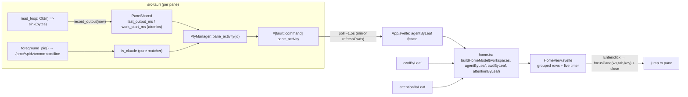
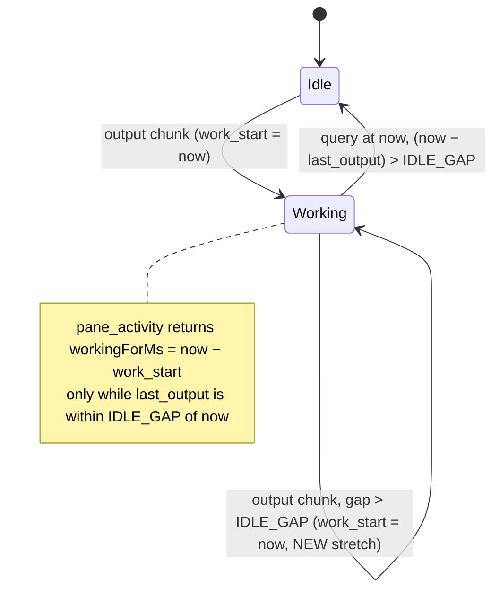

# feat: Agent dashboard home view

A hotkey-toggled **home view** in the main content area (the left workspace nav
stays visible) that shows the live set of panes running **Claude Code**, grouped
by workspace and tab, each with **how long it has been actively working** (the
current contiguous work stretch) and a jump-to-pane action. Backed by a new
per-pane **output-activity heuristic** in the PTY read thread plus `/proc`
process detection — both riding existing seams.

---

## Problem Frame

fly already surfaces *attention* ("an agent needs you") through the hook →
`AttentionManager` → `pane://attention` pipeline. What it does **not** answer is
the inverse, glanceable question: *"what are my agents doing right now, and for
how long?"* When you have several workspaces each running a Claude Code session,
there is no single surface that says "this one has been grinding for 55 minutes,
that one for 5." Today you'd switch tabs one by one to find out.

The blocker is that **no "actively working" signal exists** today. The two
per-pane state machines are `lifecycle` (`Spawning`/`Live`/`Exited` — process
status, no duration) and `attention` (`Idle`/`Raised`/`Acknowledged` — driven by
`Notification`/`Stop` hooks, i.e. "needs you / finished a turn"). Neither records
"a turn started at T and output is still flowing," so the metric has to be built
from a new signal.

Two sources were weighed. (a) A **turn-start hook** — a `UserPromptSubmit`/
`PreToolUse` Claude Code hook paired with the existing `Stop` — is the
higher-confidence anchor, but it is net-new work on the authenticated socket
protocol + hook setup (fly installs only `Notification`/`Stop` today), touches
the security boundary, and binds the metric to Claude Code specifically. (b) **PTY
output activity** rides a stream the backend already reads and needs no hook
changes. **(b) is the chosen v1 source**; the hook anchor is the recorded upgrade
path if the heuristic proves too coarse.

Be precise about what the number means: it is the **current output-active
stretch** — time since output resumed after the last idle gap — **not**
continuous task time and **not** process uptime. Excluding uptime is the whole
point (it would count idle time and mislead), but the stretch framing has a known
cost: a multi-minute *silent* tool call (a single network fetch, a quiet build)
with no output past `IDLE_GAP_MS` ends the current stretch, so an agent deep in
one long task can momentarily read low or idle until output resumes. The
mitigations — a tolerant gap, gating the *displayed* "working" on attention state
and output volume, and an honest label — live in KTD-A/KTD-E and Risks; the
residual under-count is accepted for v1.

---

## Requirements

- **R1** — A home/dashboard view is toggled by a single leader chord, rendered in
  the main content region with the left-hand workspace nav (Sidebar) still
  visible. It is hotkey-only (no launch-screen / no persistence across restart).
- **R2** — The view lists only panes detected as running **Claude Code**, grouped
  by workspace → tab. Workspaces/tabs with no agent pane are omitted.
- **R3** — Each agent row shows its **current working-for duration** (the current
  contiguous work stretch), updating live (~1 s tick), plus an at-rest state
  ("waiting"/"idle") when not working.
- **R4** — Selecting an agent row (Enter or click) jumps to that pane (switches
  workspace/tab, focuses the leaf) and closes the home view.
- **R5** — Agent detection is by `/proc` inspection of the pane's foreground
  process (mirroring the existing cwd path), not a heuristic over output content.
- **R6** — "Working since" is derived from **PTY output activity** and resets on
  an idle gap; it is never process spawn age.
- **R7** — An empty state renders when no agents are running.
- **R8** — Toggling the view **never unmounts a pane** (no agent respawns) — the
  grid is hidden, not removed (the foundation never-unmount invariant, KTD5).

### Acceptance Examples

- **AE1** — Three workspaces, one tab each, each running a Claude Code session
  actively working for 5 / 45 / 55 minutes. Pressing the dashboard chord shows
  three groups, each with one row reading roughly `working 5m` / `45m` / `55m`,
  ticking up live. (Covers R1, R2, R3.)
- **AE2** — From the dashboard, pressing Enter on the 45-minute row switches to
  that workspace/tab, focuses the pane, and the dashboard closes. (Covers R4.)
- **AE3** — A pane sitting at a Claude Code prompt — even one drawing a blinking
  cursor or idle spinner — shows `idle` (or `waiting` if it just finished a turn),
  not a running timer: sub-threshold redraws don't count as work, and the
  attention/idle-gap gates the label. (Covers R3, R6.)
- **AE4** — A pane running a plain shell (`bash`) does not appear in the
  dashboard. (Covers R2, R5.)
- **AE5** — Opening then closing the dashboard leaves every agent exactly as it
  was — same scrollback, no respawn. (Covers R8.)
- **AE6** — An agent mid-turn during a multi-minute *silent* tool call keeps
  reading `working` while output trickles within `IDLE_GAP_MS`; if the call
  exceeds the gap with zero output the row falls back to `idle` (never `waiting` —
  no `Stop` fired) and resumes a fresh stretch when output returns. The number is
  the current output-active stretch, by design. (Covers R6; documents the KTD-A
  limitation.)

---

## Key Technical Decisions

- **KTD-A — "Working stretch" = output-activity with idle-gap reset, computed by
  a pure time-injected function.** A per-pane tracker holds `last_output_ms` and
  `work_start_ms`. On each output chunk at time `t`: if there was no active
  stretch or the gap since `last_output_ms` exceeds `IDLE_GAP_MS`, start a new
  stretch (`work_start_ms = t`); otherwise extend it. A query at `now` returns
  the elapsed stretch *only while* `last_output_ms` is within `IDLE_GAP_MS` of
  `now`; otherwise the agent reads as idle. The decision logic lives in a pure
  module (`state/activity.rs`) taking time as an argument — the same test-first,
  time-injected shape as `state/attention.rs` and `state/lifecycle.rs` (KTD8).
  To keep periodic terminal noise (cursor-blink, spinner/status-line redraws)
  from masquerading as work, only chunks above a small byte threshold anchor or
  extend a stretch — trivial redraws are filtered at the record site (U3), so a
  settled-but-animated prompt still goes idle. Whether the *displayed* row reads
  `working` is further gated by attention state (KTD-E). The idle-gap reset is a
  documented limitation, not a bug (see Problem Frame).
- **KTD-B — Record on the read chunk, decide off the hot path.** The only hot-path
  cost is storing a timestamp (and a cheap compare) once per PTY read chunk (≤64
  KiB), via atomics on the already-`Arc`-shared `PaneShared` — not per byte, not
  per the streamed bytes. The working/idle *computation* runs only at poll/query
  time. This honors KTD9's rule that new signals stay off the raw-byte path
  (KTD3) and don't perturb the backpressure pause/resume watermarks (KTD4).
- **KTD-C — Poll, don't push.** The dashboard reads a new `pane_activity` command
  on the existing frontend poll loop (mirroring `pane_cwd`), rather than emitting
  an event per output chunk (which would be far too chatty). Live elapsed time is
  rendered frontend-side from the polled duration, re-anchored each poll and
  ticked locally. An activity *event* is explicitly deferred.
- **KTD-D — Agent detection via `/proc` foreground process.** Reuse
  `Pane::foreground_pid()` (the foreground process-group leader — `claude` when
  running) + a new `/proc/<pid>/comm` and `/proc/<pid>/cmdline` read beside
  `proc_cwd`, with a **pure matcher** over the comm/cmdline strings (Claude Code
  often runs as a `node` process, so the argv path is the robust signal, not
  `comm`). Sampled on the poll cadence only (U10/R13 cwd pattern, KTD9 caution).
- **KTD-E — "Working" and "needs you" are orthogonal, combined in the frontend.**
  The backend activity signal stays purely output-based (no hook awareness). The
  frontend layers the attention state it already has (`attentionByLeaf`) on top.
  The row label follows a strict 3-way precedence (rendered as a table in U5):
  (1) `needsAttention` (Raised/Acknowledged) → **`waiting`** — attention wins, so
  a finished-but-still-animated agent never reads as working; (2) else an active
  output stretch with attention Idle → **`working {elapsed}`**; (3) else →
  **`idle`**. To kill the working↔waiting flicker in the brief window after a
  turn is acked-to-Idle while its last output is still inside `IDLE_GAP_MS`, the
  frontend suppresses `working` for a stretch whose wall-clock anchor predates the
  leaf's last attention-clear (the just-finished turn's residual output does not
  resurrect a timer). Keeps each subsystem single-purpose (KTD8).
- **KTD-F — Home view is a content swap, not a modal overlay.** Render `<HomeView>`
  as a sibling of `.layout` inside `.body`; hide the terminal grid with
  `display:none` (never `{#if}`-removal) so panes stay mounted and agents never
  respawn (KTD5). It takes DOM focus for keyboard nav, so it joins the
  `onWindowKeydown` bail list and hands focus back via `focusActivePane()` on
  close — the established overlay-focus discipline (KTD3 / CommandPalette).

---

## High-Level Technical Design

### Data flow (backend signal → glanceable dashboard)

*Diagram is authoritative for the data path; prose governs on any disagreement.*

### Working-stretch logic (the pure tracker in `state/activity.rs`)

Directional guidance, not implementation spec: the "states" are derived from two
stored timestamps + `IDLE_GAP_MS`, not a stored enum. `IDLE_GAP_MS` is a backend
constant for v1 (tuned live; see Open Questions), generous enough to tolerate
mid-turn tool/thinking pauses.

---

## Scope Boundaries

**In scope:** the home view surface (R1), Claude Code agent listing grouped by
workspace/tab (R2, R5), the per-pane output-activity working-stretch heuristic
(R6, KTD-A/B), `/proc` agent detection (KTD-D), the `pane_activity` command +
poll wiring (KTD-C), live working-for timers + waiting/idle state (R3, KTD-E),
jump-to-pane (R4), empty state (R7), and the never-unmount-safe render (R8).

### Deferred to Follow-Up Work

- **Activity push event** (`pane://activity`) for instant idle↔working transitions
  without poll latency — poll is sufficient for a glanceable surface.
- **Config-exposed `IDLE_GAP_MS`** and an agent-detection override — ship a Rust
  constant first, expose via `config.ts` once tuned.
- **Reason-granular row labels** (question vs permission vs error) — v1 collapses
  to working / waiting / idle.
- **Summary-stat rollups, all-pane (non-agent) visibility, notification digest,
  and quick-actions** (new workspace/tab from the home view) — explicitly out of
  the confirmed v1 scope.
- **Merging `pane_activity` into the `pane_cwd` poll** into one round-trip per
  pane — a perf refinement, not needed at v1 pane counts.
- **Home-as-launch-screen** (showing the dashboard on startup / when no pane is
  active) — confirmed hotkey-toggle-only.

---

## Implementation Units

### U1. Pure working-stretch activity tracker

**Goal:** A pure, time-injected module that turns a sequence of output timestamps
into a "current work stretch", with idle-gap reset — the core of KTD-A.

**Requirements:** R3, R6. **Dependencies:** none.

**Files:**
- `src-tauri/src/state/activity.rs` (new)
- `src-tauri/src/state/mod.rs` (export the module)

**Approach:** Two pure functions over `(last_output_ms: Option<u64>,
work_start_ms: Option<u64>)` plus `IDLE_GAP_MS`:
- `record(last, start, now, gap) -> (new_last, new_start)` — start a new stretch
  when `start` is `None` or `now - last > gap`, else keep `start`; `new_last = now`.
- `current_stretch(last, start, now, gap) -> Option<u64>` — `Some(now - start)`
  when `start` is `Some` and `now - last <= gap`; else `None`.
Use saturating subtraction throughout. No I/O, no clock — `now` is an argument,
matching `state/attention.rs`. Define `IDLE_GAP_MS` here as a `const`.

**Patterns to follow:** `state/lifecycle.rs` / `state/attention.rs` (pure,
time-injected, heavily doc-commented, `#[cfg(test)] mod tests`).

**Execution note:** Test-first — write the table of stretch transitions before
the functions.

**Test scenarios:**
- `record` with `start = None` starts a stretch (`new_start == now`).
- Continued output with gap ≤ `IDLE_GAP_MS` keeps the original `work_start`.
- Output after a gap > `IDLE_GAP_MS` advances `work_start` to `now` (new stretch).
- `current_stretch` returns `Some(now - start)` while `last` is within the gap.
- `current_stretch` returns `None` once `now - last` exceeds the gap (gone idle).
- `current_stretch` returns `None` when `start`/`last` is `None` (never ran).
- Boundary: gap exactly equal to `IDLE_GAP_MS` resolves per the documented
  inclusive/exclusive rule (still "working" at `== gap`).
- Saturating math: a `now` earlier than a stored timestamp yields `0`, not panic.

---

### U2. Claude Code process detection via `/proc`

**Goal:** Decide whether a pane's foreground process is Claude Code, via `/proc`
inspection and a pure matcher (KTD-D).

**Requirements:** R5, R2. **Dependencies:** none.

**Files:**
- `src-tauri/src/cwd/mod.rs` (add `proc_comm` / `proc_cmdline` beside `proc_cwd`,
  or a new `proc.rs` — keep next to the existing `/proc` reader)
- `src-tauri/src/pty/mod.rs` (`PtyManager::is_agent(id)` accessor, mirroring `cwd`)

**Approach:** Thin `/proc` readers: `proc_comm(pid)` reads `/proc/<pid>/comm`
(trim newline); `proc_cmdline(pid)` reads `/proc/<pid>/cmdline` (split on `\0`).
A **pure** `is_claude(comm: Option<&str>, argv: &[String]) -> bool` is the tested
unit: match when `comm == "claude"`, or `argv[0]`'s basename is `claude`, or —
for the JS-wrapper case — `argv[0]` is a JS runtime (`node`/`bun`/`deno`) **and a
later argv element** is `claude` by basename or a `cli.js` under a `claude/` path
segment. The wide "any argv basename is `claude`" rule is deliberately *not* used:
it false-positives on commands that merely reference a `claude`-named path (e.g.
`tail -f ~/.claude/x`). `PtyManager::is_agent(id)` composes `foreground_pid(id)`
to fetch the pid **and releases the registry lock before** the `/proc` reads —
the two-step `self.foreground_pid(id).and_then(...)` shape `PtyManager::cwd`
already uses, so a blocking syscall never holds the `panes` mutex. Sampled only
on the poll cadence (KTD9).

**Patterns to follow:** `cwd::proc_cwd` (thin `/proc` reader returning `Option`),
`PtyManager::cwd` (compose `foreground_pid` + reader).

**Test scenarios:**
- `is_claude` matches `comm == "claude"`.
- Matches when `argv[0]` basename is `claude` (e.g. `/usr/local/bin/claude`).
- Matches a node wrapper: `["node", "/home/u/.../claude/cli.js"]`.
- Does **not** match a plain shell (`["-bash"]`, `comm = "bash"`).
- Does **not** match `claude` appearing only as a non-basename substring
  (e.g. an arg `--dir=/claude-tools`) per the basename rule.
- Does **not** match a non-agent command that references a `claude`-named path as
  an argument (e.g. `["tail", "-f", "/home/u/.claude/x.log"]`) — the wrapper rule
  requires a JS-runtime `argv[0]` plus a `claude` entrypoint, not any `claude`
  basename.
- Empty argv + `None` comm → `false`.
- `proc_comm` / `proc_cmdline` are thin wrappers — one sanity test reading
  `/proc/self` confirms the reader shape; no behavior test on the syscall.

---

### U3. Per-pane output-activity recording in the read thread

**Goal:** Feed real PTY output into the U1 tracker via `Arc`-shared atomics on
`PaneShared`, recorded once per read chunk (KTD-B).

**Requirements:** R3, R6. **Dependencies:** U1.

**Files:**
- `src-tauri/src/pty/pane.rs` (`PaneShared` fields + `read_loop` record call +
  `Pane` accessor)
- `src-tauri/src/pty/mod.rs` (`PtyManager::pane_activity(id)` accessor)

**Approach:** Add to `PaneShared`: `epoch: Instant` (per-pane clock, set at
spawn), `last_output_ms: AtomicU64`, `work_start_ms: AtomicU64`, and a
`has_stretch: AtomicBool` discriminator — **do not overload `0` as the `None`
sentinel**: a first chunk arriving sub-millisecond after spawn legitimately
yields `now == 0`, which a `0`-sentinel would misread as "no stretch". In
`read_loop`'s `Ok(n) => sink(&buf[..n])` arm, **skip chunks below
`MIN_OUTPUT_BYTES`** (cursor/spinner redraws are tiny — this is the volume filter
KTD-A relies on to keep idle terminal noise from extending a stretch), then
compute `now = epoch.elapsed().as_millis() as u64`, call `activity::record(...)`,
and store with `Ordering::Relaxed` (a display signal — the pair need not be read
atomically together; a one-poll torn read self-corrects). Add
`Pane::activity(now_ms)` returning the queried stretch via
`activity::current_stretch`, and `PtyManager::pane_activity(id)` returning
`{ working_for_ms, last_output_ago_ms }` (computed against `epoch.elapsed()` at
call time). Because the command returns a *duration*, the per-pane epoch needs no
cross-pane comparability (resolves the "no global clock" gap).

**Patterns to follow:** existing `PaneShared` shared state (`reaped: AtomicBool`,
`lifecycle: Mutex<…>`), `Pane::lifecycle()` / `foreground_pid()` accessors, the
`PtyManager` accessor trio (`cwd` / `token` / `lifecycle`).

**Execution note:** Make accessors take `now_ms` (or expose `epoch.elapsed()`)
so the stretch can be queried deterministically in tests without a real PTY.

**Test scenarios:**
- Recording an output at `t` then querying shortly after returns
  `Some(elapsed)` (a `PaneShared`-level test driving the atomics + U1 fns, no
  real child).
- A query after a gap > `IDLE_GAP_MS` returns `None` (idle) from the accessor.
- Two outputs spanning a gap > `IDLE_GAP_MS` reset the stretch (second
  `work_start` wins), observed through `pane_activity`.
- `PtyManager::pane_activity` on an unknown pane id returns `None`/default
  gracefully (no panic, no lock poisoning).
- A first chunk recorded at `now == 0` still registers a stretch — the
  `has_stretch` discriminator marks presence, so `0` is never read as "no stretch".
- A sub-`MIN_OUTPUT_BYTES` chunk neither starts nor extends a stretch (the
  read-site volume filter; covers the animated-idle-prompt case).
- Integration: bytes arriving on the sink path update `last_output_ms` (verified
  in the existing `pane.rs` read-loop test harness if present; otherwise covered
  by the `PaneShared` accessor test above).

---

### U4. `pane_activity` Tauri command + registration + IPC wrapper

**Goal:** Expose the combined per-pane agent state to the frontend (KTD-C).

**Requirements:** R2, R3, R5. **Dependencies:** U2, U3.

**Files:**
- `src-tauri/src/pty/mod.rs` (`#[tauri::command] pub fn pane_activity` beside
  `pane_cwd`)
- `src-tauri/src/lib.rs` (add to `invoke_handler! / generate_handler!`)
- `src/ipc.ts` (`paneActivity(paneId)` wrapper + `PaneActivity` interface)

**Approach:** Return a `#[derive(Clone, Serialize)] #[serde(rename_all =
"camelCase")] struct PaneActivity { is_agent: bool, working_for_ms: Option<u64>,
last_output_ago_ms: Option<u64> }`. The command composes `PtyManager::is_agent`
(U2) + `PtyManager::pane_activity` (U3); `working_for_ms` is `None` when idle or
not an agent. Register the command in `lib.rs` (the single handler list — "add in
both places"). Add the TS wrapper `paneActivity(paneId): Promise<PaneActivity>`
and the matching interface (Rust `pane_id: u64` ↔ TS `paneId`; snake→camel
fields) next to `paneCwd` / `AttentionEvent` in `ipc.ts`.

**Patterns to follow:** `pty::pane_cwd` (polled per-pane command), `spawnPane` /
`paneCwd` arg-casing convention in `ipc.ts`, the camelCase serialize rename on
existing event payload structs.

**Test scenarios:**
- `Test expectation: thin command — logic is tested in U1–U3.` Provide one
  guard: the accessor path returns `is_agent = false` and `working_for_ms = None`
  for a non-agent / unknown pane (graceful default, asserted via the
  `PtyManager` accessor, not a live Tauri invoke).
- Registration is compile-time verified (the command appears in the handler
  list); the `ipc.ts` wrapper is a typed passthrough (no unit test).

---

### U5. Frontend agent-state polling + dashboard view-model

**Goal:** Poll `pane_activity` into reactive state and derive the grouped
dashboard model — a pure, tested builder (mirrors the cwd map).

**Requirements:** R2, R3, R7. **Dependencies:** U4.

**Files:**
- `src/App.svelte` (`agentByLeaf = $state({})`; poll + change-merge in/alongside
  `refreshCwds`)
- `src/lib/home.ts` (new — `buildHomeModel` + `formatDuration`, pure)
- `src/lib/home.test.ts` (new)

**Approach:** Add `agentByLeaf = $state<Record<string, PaneActivity>>({})`. Poll
`paneActivity(pid)` for each `paneIdByLeaf` entry **only while the dashboard is
open** — start the interval when `homeViewOpen` becomes true (with one immediate
fetch so a freshly-opened view is current, not a poll stale), clear it on close —
so this toggle-only surface adds no always-on IPC. Merge **only changed** entries
(the existing "write state only on change" optimization). `home.ts` is the tested
logic:
- `buildHomeModel(workspaces, agentByLeaf, cwdByLeaf, attentionByLeaf)` →
  `HomeWorkspaceGroup[]` (ws → tab → `AgentRow[]`), including only leaves where
  `agentByLeaf[key]?.isAgent`, and dropping tabs/workspaces with zero agent rows.
  A pane that exited drops out automatically (its foreground process is no longer
  `claude`, so `isAgent` goes false on the next poll); the U7 jump guard covers
  the one-poll race. Each `AgentRow` carries `tabTitle` (`tabDisplayTitle`),
  `cwd`, `workingForMs`, `needsAttention`, and a derived `status` per the KTD-E
  precedence: `needsAttention` → `"waiting"`; else `workingForMs != null` →
  `"working"`; else `"idle"`. (To kill the post-turn flicker, App zeroes a
  `workingForMs` whose stretch anchor predates the leaf's last attention-clear
  *before* calling `buildHomeModel`, so the model stays pure on these four maps.)
- `formatDuration(ms)` → `"12s"` / `"5m"` / `"1h 5m"`.

**Patterns to follow:** `cwdByLeaf` + `refreshCwds` change-merge poll, the
`sidebarWorkspaces` `$derived` grouping, `tabDisplayTitle` / `basename` from
`workspaces.ts`, `relativeTime` in `notifications.ts` (pure, formatting style).

**Test scenarios:**
- `buildHomeModel` groups agent leaves under their workspace → tab.
- Non-agent leaves (`isAgent === false`/absent) are excluded from rows.
- Tabs and workspaces with no agent rows are omitted entirely.
- `status` precedence: `needsAttention` → `"waiting"` even when `workingForMs`
  is non-null (attention wins); attention-Idle + non-null stretch → `"working"`;
  attention-Idle + null stretch → `"idle"`.
- A stretch whose anchor predates the leaf's last attention-clear is suppressed
  to `"idle"` (no post-turn working↔waiting flicker).
- `workingForMs` is carried through (and `null` when idle).
- Empty inputs / no agents → `[]` (drives the R7 empty state).
- `formatDuration`: `0` → `"0s"`; sub-minute → `"Ns"`; minutes → `"Nm"`;
  ≥1h → `"Hh Mm"`; boundary at 60 s and 3600 s.

---

### U6. Dashboard leader chord + keymap action

**Goal:** Add the toggle to the single-source-of-truth keymap so dispatch, the
hotkey menu, and the command palette all pick it up without drift (R1; the
keymap SSOT, KTD1).

**Requirements:** R1. **Dependencies:** none.

**Files:**
- `src/lib/keymap.ts` (`BINDINGS` entry + `KeymapActions.toggleHome`)
- `src/lib/keymap.test.ts` (chord dispatch coverage)

**Approach:** Add `toggleHome: () => void` to `KeymapActions` and a `BINDINGS`
row `{ keys: ["d"], label: "Dashboard (home)", action: "toggleHome" }` (`d` is
unused; mnemonic for *dashboard*). No parameterization, so it slots into the
uniform action map and the palette derives it automatically via
`actionCommands`. The cheat-sheet renders it from `BINDINGS` (no drift).

**Patterns to follow:** existing `BINDINGS` rows + the `leader x` dispatch test
in `keymap.test.ts`; the palette-derivation note in `keymap.ts` / `palette.ts`.

**Test scenarios:**
- `leader d` invokes the `toggleHome` action (dispatch test).
- `BINDINGS` contains exactly one `toggleHome` row with key `d` and a label.
- The action appears in the palette command list (palette derives from
  `BINDINGS` — assert via the existing palette test pattern).
- Type-level: `toggleHome` is a member of `KeymapActions` (compile-time; an
  unbound action would fail `pnpm check`).

---

### U7. HomeView component + never-unmount render integration

**Goal:** Render the grouped dashboard in the main content area with the Sidebar
intact, wire the toggle/focus discipline, and jump-to-pane — without ever
unmounting a pane (R1, R4, R8, KTD-F).

**Requirements:** R1, R4, R7, R8. **Dependencies:** U5, U6.

**Files:**
- `src/lib/HomeView.svelte` (new — presentational, renders `buildHomeModel`)
- `src/App.svelte` (`homeViewOpen = $state(false)`; `toggleHome` wiring; render
  `<HomeView>` as a sibling of `.layout` in `.body`; hide `.layout` via
  `class:hidden`; `onWindowKeydown` bail; focus handoff; jump-closes-view; gated
  agent-poll + `$effect`-managed 1 s tick while open)

**Approach:**
- **Render & hide:** in `.body`, keep `.layout` always rendered but add
  `class:hidden={homeViewOpen}` (→ `display:none`); render
  `{#if homeViewOpen}<HomeView .../>{/if}` as its sibling, taking the same
  `flex:1` space. Panes stay mounted (xterm `ResizeObserver` no-ops at zero
  size), so no agent respawns (R8, KTD5). **Never** gate the `{#each allPanes}`
  block with `{#if}` — that is the forbidden unmount.
- **Toggle & focus:** `toggleHome` flips `homeViewOpen`, clearing the other
  overlays (mutual exclusivity). When open it takes DOM focus, so add
  `homeViewOpen` to the `onWindowKeydown` bail list and give `HomeView` a
  `captureKeys`-style handler: **Escape closes** (Esc-only, matching the other
  overlays — `d` is not a close key; a one-line in-view hint, "Esc to close",
  makes dismissal discoverable since the cheat-sheet sits behind the open view);
  ↑/↓ move the selection; Enter jumps. On any close, call `focusActivePane()`.
- **Jump:** Enter/click on a row calls the existing
  `focusPane(wsId, tabId, leafKey)` then sets `homeViewOpen = false` (and
  `focusActivePane()`). Guard against a row whose leaf no longer resolves (mirror
  the notification `jumpable` check) — exited panes already drop from
  `buildHomeModel` (U5), so a stale row should not appear; the guard is
  belt-and-suspenders and a no-op jump simply leaves the view open.
- **Live tick:** a Svelte `$effect` keyed on `homeViewOpen` starts a
  `setInterval(1000)` and **returns a `clearInterval` cleanup** (runes-mode
  discipline — no leaked interval); it re-renders elapsed timers from a wall-clock
  anchor (`Date.now() - workingForMs`, re-synced each poll) only while open.
- **Empty state:** `buildHomeModel(...) === []` → a "No Claude Code agents
  detected — start one in a pane to see it here" message (R7). Soft wording:
  detection can miss a wrapped install, so it doesn't assert "none running" as
  fact.
- **Selection model:** a **flat keyboard list** — ↑/↓ move across all agent rows
  in workspace→tab order (group headers are skipped, never focused), wrapping at
  the ends. Selection is tracked by **leaf key**, not row index, so a row
  appearing or exiting while the view is open never jumps the cursor. Initial
  selection on open is the first row; an empty model has no selection (focus rests
  on the container). Mirrors CommandPalette's flat-list model.

**Patterns to follow:** the overlay toggle/mutual-exclusion + `focusActivePane()`
discipline and `captureKeys` Escape handling in `App.svelte`
(CommandPalette/NotificationPanel); the inactive-tab `display:none` hide;
`focusPane` (already cross-workspace, used by `cycleAttention`); `Sidebar.svelte`
for the grouped-tree visual style.

**Execution note:** This repo unit-tests pure modules, not Svelte components — the
testable logic lives in `home.ts` (U5) and `keymap.ts` (U6). HomeView itself and
the App wiring are verified by running the app (CLAUDE.md live-validation), so the
component carries no vitest file.

**Test scenarios:**
- `Test expectation: none (presentational + integration) — logic covered by
  home.ts (U5) and keymap.ts (U6).`
- **Live verification (run the app):**
  - `leader d` opens the dashboard with the Sidebar still visible and the grid
    hidden; agent rows show ticking timers (AE1).
  - Enter/click on a row switches workspace/tab, focuses the pane, and closes the
    view (AE2).
  - A plain-shell pane does not appear; a prompt-idle agent — even one with a
    blinking cursor/spinner — shows idle (or waiting if just finished), not a
    timer (AE3, AE4).
  - An agent in a long silent tool call reads working while output trickles, then
    idle past the gap, never waiting (AE6).
  - With the dashboard closed, no `pane_activity` IPC fires; opening it shows
    current agents within one round-trip (gated poll + immediate fetch).
  - Open→close leaves agents untouched — confirm no respawn via scrollback
    continuity / no new spawn in stderr (AE5, R8).
- **Code-review guard:** the grid is hidden via CSS, never `{#if}`-removed
  (the never-unmount invariant).

---

## Risks & Dependencies

- **Idle-gap reset under-counts the headline number** — the displayed value is
  the *current output-active stretch*, so a multi-minute silent tool call past
  `IDLE_GAP_MS` ends the stretch and an agent deep in one task can read low/idle
  until output resumes (the metric is weakest exactly when an agent is grinding on
  one long quiet task). *Mitigation:* a tolerant `IDLE_GAP_MS` covering typical
  tool-call gaps; an honest label ("current work stretch", not "total task time" —
  Problem Frame); the attention gate so a finished turn reads `waiting`, not a
  reset timer. Residual under-count accepted for v1; the turn-start hook is the
  upgrade path.
- **Animated-idle false-positive** — if a settled Claude Code prompt emits
  periodic PTY output (spinner/status redraws) above `MIN_OUTPUT_BYTES`, "no
  output ⇒ idle" would not fire and a row could read `working` while idle.
  *Mitigation:* the read-site volume filter (KTD-A/U3) + the attention gate
  (KTD-E); the actual idle-prompt byte cadence is measured empirically (Open
  Questions) before `MIN_OUTPUT_BYTES`/`IDLE_GAP_MS` are locked.
- **Agent-detection brittleness** — Claude Code may run as `node` (so `comm` is
  `node`, not `claude`); detection leans on the argv path. A renamed binary or
  exotic wrapper could miss (silent omission — the agent simply doesn't appear),
  and a non-agent command referencing a `claude`-named path could false-positive.
  *Mitigation:* the JS-runtime + `claude`-entrypoint wrapper rule (U2), not a bare
  basename match, with both a positive and a negative test; the soft empty-state
  copy (U7) so a missed agent doesn't read as "none running"; deferred config
  override; verify against the real install during U2.
- **`foreground_pid` fallback** — when `claude` is not the foreground group leader
  (e.g. backgrounded), detection falls back to the shell pid and the pane reads as
  non-agent. Accepted for v1.
- **Hot-path discipline** — the read-chunk timestamp must stay atomic/cheap (per
  read, not per byte) and must not touch the pause/resume condvar path (KTD-B /
  KTD4). *Mitigation:* atomics on `PaneShared`, code-review against KTD9.
- **Never-unmount regression** — a careless `{#if}` around the grid would respawn
  every agent on toggle. *Mitigation:* CSS-hide only (KTD-F), explicit code-review
  guard + live AE5 check.
- **No new external dependencies.** Internal dependencies: the cwd `/proc` path,
  the `pane.rs` read loop + `PaneShared`, the App poll loop, and the
  keymap/palette SSOT — all reused, not modified structurally.

---

## Open Questions (resolve during implementation)

- **`IDLE_GAP_MS` and `MIN_OUTPUT_BYTES` defaults** — start `IDLE_GAP_MS` around
  60–90 s (generous enough to ride over typical tool-call gaps without resetting);
  set `MIN_OUTPUT_BYTES` from the measured size of a real work-output chunk vs. an
  idle redraw. Both decided by observation, not up front.
- **Idle-prompt byte emission** — measure on the dev box whether a settled Claude
  Code prompt emits periodic PTY output (cursor/spinner/status redraws); this is
  the load-bearing check for AE3 and the `MIN_OUTPUT_BYTES` filter (belt-and-
  suspenders if the idle prompt is byte-silent, load-bearing if not).
- **Exact `is_claude` match rule** — confirm on the dev box whether the running
  process presents as a `claude` binary or a JS runtime + `claude` entrypoint, and
  lock the wrapper rule accordingly.
- **One poll vs. two** — whether to fold `pane_activity` into the `pane_cwd`
  round-trip; left as a deferred perf refinement.

---

## System-Wide Impact

This adds a **third per-pane signal** (output activity) alongside `lifecycle` and
`attention`, deliberately kept orthogonal and pure (KTD8). It touches the hot PTY
read path for the first time for a derived signal — bounded to one atomic write
per above-threshold chunk (KTD-B/KTD9); that is the one standing maintenance cost
worth naming, since every future read-loop change now carries one more invariant
to preserve (accepted in exchange for agent-agnostic detection with no turn-start
hook). It adds one polled command (gated to while the dashboard is open, so no
always-on cost), one new leader chord (auto-propagated to the hotkey menu and
command palette via the keymap SSOT, KTD1), and one new main-content surface that
must respect the never-unmount invariant (KTD5). No change to the hook/security
boundary, the session-persistence shape, or the attention pipeline.

> After this lands, it's a strong first candidate for `/ce-compound` — there is no
> `docs/solutions/` store yet, and the output-activity heuristic (idle-gap
> thresholds, distinguishing agent output, hot-path interaction with backpressure)
> is exactly the kind of non-obvious finding worth capturing.
