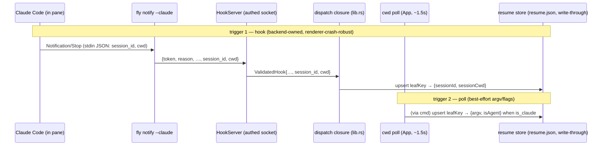
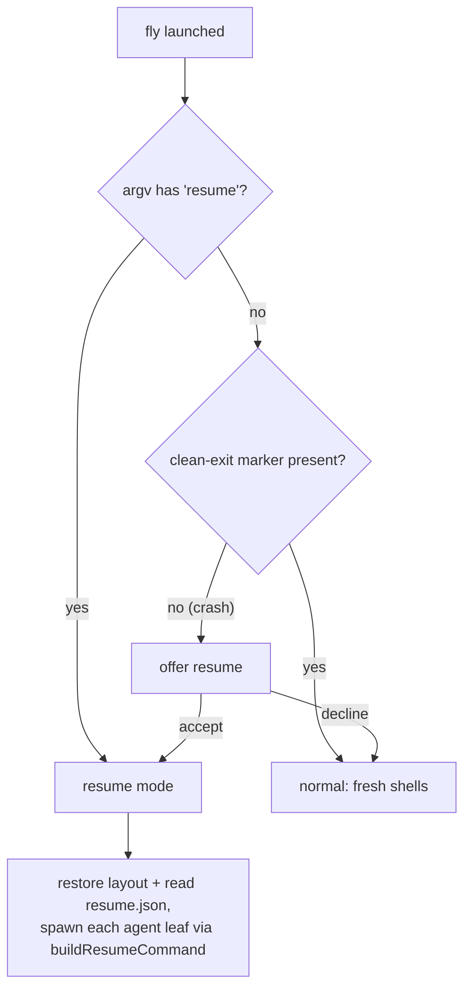

# feat: Resume Claude agents on relaunch (`fly resume`)

An explicit **`fly resume`** launch mode that brings your Claude Code agents back
after fly closes — **including after a crash**. Each pane that was running a Claude
agent reopens running **`claude --resume <session-id>`** with its **original
launch flags replayed** (so `--dangerously-skip-permissions`, `--model`, … carry
over), in the session's directory. The `session_id` and cwd ride in on the
**Claude Code hook fly already installs**; the launch flags come from `/proc`. All
of it is captured **write-through** into a small dedicated store the moment it's
known — so a crash that never runs fly's clean-shutdown path still leaves the
mapping on disk. A normal `fly` launch stays fresh; an *unclean* shutdown is
detected and resume is **auto-offered**.

---

## Problem Frame

Closing fly reaps every pane. Reopening rebuilds the layout and each pane's cwd
but spawns a **bare shell** — the agent is gone. This is deliberate (KTD10/R14):
restore is **explicitly lossy**, replays scrollback as inert text, and **never
auto-runs a restored command** (Zellij's "ENTER-to-run" safety lesson).
"Live-process preservation across quit" is a named non-goal. So today you manually
re-run `claude --continue`/`--resume` in every pane after a relaunch.

This plan adds a **narrow, explicit, opt-in** reversal of the never-auto-run
default, scoped to *detected Claude agent panes* and to *resume* entry points
only. Normal launches keep lossy restore; non-agent panes always reopen as bare
shells. The KTD10 safety rationale (never silently replay an opaque shell command)
holds: we re-attach a *known agent's conversation* behind a deliberate action.

**The crash insight (why this design, not the obvious one).** The naive version —
hold the session id in memory, write it in the debounced (~800ms) `session.json`,
rely on the clean-close flush — is weakest exactly when you most want it: an OOM
kill, `SIGKILL`, power loss, kernel panic, or a WebKit renderer crash skips the
clean-shutdown path, so the last-flushed state can be stale or missing. But two
facts make crash-resilient resume achievable:

1. **Claude Code is itself the durable store.** It appends every turn to
   `~/.claude/projects/<cwd-derived>/<session-id>.jsonl` *as it happens*. A crash
   cannot destroy the conversation — only fly's *mapping* of which session belongs
   to which pane. And `claude --continue` recovers the most-recent session *by
   directory* with zero fly-side state, so cwd alone is a recovery floor.
2. **The mapping is small and changes rarely** (a `session_id` per agent, on turn
   boundaries). So fly can afford to persist it **write-through** — immediately, to
   a dedicated store separate from the debounced layout blob — rather than batched.

The design therefore captures resume state write-through from the moment it's
known, keyed by the stable leaf key, with graceful degradation at every tier
(precise id → id + default flags → `--continue` → bare shell), and detects an
unclean shutdown so resume can be offered without you having to remember it.

Three confirmed pillars, each made cheap by an existing seam: **precise per-pane
session id** (the `Notification`/`Stop` hooks fly installs already deliver
`session_id` + `cwd` on stdin — fly currently parses the payload for the attention
reason and discards the rest); **explicit `fly resume` trigger** (plus the
crash auto-offer); and **replay detected launch flags** (the `/proc` read agent
detection already does yields the exact argv — necessary because Claude Code does
**not** preserve `--dangerously-skip-permissions` across a resume on its own, see
Sources).

---

## Requirements

- **R1** — `fly resume` is an explicit launch mode. A normal `fly` launch after a
  *clean* shutdown is unchanged: fresh shells, inert scrollback, no auto-run.
- **R2** — While an agent pane runs, its Claude `session_id`, session cwd, and
  launch argv are captured and persisted **per-pane, keyed by leaf key** (the same
  key as scrollback + notification history), so a resumed agent re-associates to
  its own leaf coherently.
- **R3** — Resume-critical state is persisted **write-through** — flushed the
  moment it is known, not on the debounced session save — so it survives an
  unclean shutdown (crash / kill / power loss / renderer crash).
- **R4** — On a resume, each pane that was a Claude agent reopens running
  `claude --resume <id>` with replayed flags, **in the session's captured cwd**.
- **R5** — Graceful degradation, never a failed launch, at every tier: id + argv →
  `--resume` with replayed flags; id, no argv → `--resume` with **configured
  default flags**; argv, no id → `--continue` with replayed flags; agent but
  neither → `--continue` with default flags; not an agent → bare shell.
- **R6** — `session_id` capture rides the **existing authenticated hook socket**
  (constant-time token compare + `SO_PEERCRED` + lockout + size bound). No new
  channel.
- **R7** — Resume preserves the **never-unmount / stable-leaf-key invariant**
  (KTD5): a resumed spawn is a normal first-mount; nothing remounts mid-session,
  no agent is silently respawned.
- **R8** — A configurable default flag set (default `--dangerously-skip-permissions`)
  is the flag floor when argv was not captured.
- **R9** — An **unclean shutdown is detected** on the next launch (a clean-exit
  marker absent) and resume is **auto-offered** (not silently auto-run).
- **R10** — Resume reads its state under the **same `FLY_APP_NAME` root** it was
  saved under, so `fly` vs `fly-dev` stay isolated.

### Acceptance Examples

- **AE1** — Three agents (one `--model opus`, all `--dangerously-skip-permissions`).
  You quit, run `fly resume`: all three reopen with conversations re-attached, in
  the right directories, each with its own original flags. (Covers R1, R2, R4.)
- **AE2** — Same quit, then a plain `fly` (clean shutdown). Every pane is a fresh
  shell with inert scrollback — no agent auto-runs. (Covers R1.)
- **AE3** — fly is **`SIGKILL`ed** mid-session. You relaunch `fly`; it detects the
  unclean exit and offers to resume. Accepting reopens the agents from the
  write-through store. (Covers R3, R9.)
- **AE4** — A **renderer crash** loses the `/proc` argv poll, but the backend had
  already captured `session_id` from the last hook. On resume the pane runs
  `claude --resume <id>` with the **configured default flags** (so
  `--dangerously-skip-permissions` is still applied). (Covers R3, R5, R8.)
- **AE5** — An agent that never fired a hook (no id) but was seen by the poll
  (argv captured) resumes via `claude --continue` with replayed flags, in its cwd.
  (Covers R5.)
- **AE6** — A pane running plain `bash` reopens as a bare shell on resume — never
  handed a `claude` command. (Covers R5.)
- **AE7** — `fly resume` while fly is already open just focuses the existing window
  (single-instance); no second instance, no re-attach into the running one.
  (Covers R1; documents the KTD-B limitation.)

---

## Key Technical Decisions

- **KTD-A — Capture write-through into a dedicated backend store, from two
  triggers.** A small `resume.json` (backend-owned, atomic, `0600`, keyed by leaf
  key) holds `{ sessionId, sessionCwd, argv, isAgent, updatedAt }` per agent leaf.
  Two writers, both routed through the backend so writes serialize: **(1) the hook
  path** — on a `session_id`-bearing `Notification`/`Stop`, the dispatch upserts
  `sessionId` + the payload's `cwd`; this is **backend-owned**, so it survives a
  *renderer* crash (the common case — WebKit dies, the Rust core lives). **(2) the
  poll path** — the always-on cwd poll, extended to read `/proc` argv + detect the
  agent, upserts `argv` + `isAgent`; best-effort (dies with the renderer), which is
  acceptable because argv is only the *flag* source and KTD-C has a floor for it.
  Decoupled entirely from the debounced `session.json`.
- **KTD-B — `fly resume` is an app *launch mode*, plus a crash auto-offer.** CLI
  subcommands (`notify`, `hooks`) `exit` without launching a window — wrong for
  resume. `lib.rs::run()` detects `resume` **after** the `is_cli_subcommand` check
  (where it already falls through) and records the intent in managed `LaunchMode`
  state the frontend reads via `get_launch_mode`. Separately, a **clean-exit
  marker** (KTD-G) lets a *normal* launch detect a prior crash and **offer** resume.
  **Cold-launch only:** single-instance focuses the existing window on a second
  invocation (AE7); forwarding intent into a live instance is deferred.
- **KTD-C — Replay detected argv with a configured default-flags floor.** A pure
  builder turns `(argv, sessionId)` into the spawn command: strip any pre-existing
  `--resume`/`--continue`/`-r`/`-c` and a trailing positional prompt (replaying one
  would re-send it), then append `--resume <id>` (or `--continue`). Replaying the
  captured argv re-supplies `--dangerously-skip-permissions` (**necessary** —
  Claude drops it on resume, issue #21974). When argv was **not** captured (renderer
  crash, or an agent the poll never saw), fall back to `config.resumeDefaultArgs`
  (default `["--dangerously-skip-permissions"]`, R8) so the permission posture is
  never lost. Lives in `src/lib/resume.ts` (the layer assembling spawn options).
- **KTD-D — Two stores, by change-rate and durability need.** `session.json`
  stays the debounced, opaque **layout** blob (large, changes often, ~800ms debounce
  is fine). `resume.json` is the write-through **agent mapping** (small, rare
  changes, must survive crashes). Splitting them means the frequent tiny resume
  writes don't rewrite the whole layout, and the layout's debounce doesn't gate
  crash-critical state. `SavedPane` is therefore **unchanged** (no schema bump);
  resume state lives in its own store and merges with the layout by leaf key at
  restore.
- **KTD-E — Spawn the resumed agent as the pane's program (`SpawnConfig.command`);
  this auto-run is the scoped KTD10 exception.** `SpawnConfig` gains
  `command: Option<Vec<String>>`; when set, `Pane::spawn` runs it instead of the
  `$SHELL` default, with identical env injection so the resumed agent's own hooks
  keep working. Auto-running on restore is what KTD10 forbids by default; permitted
  **only** under resume, **only** for a detected agent, **only** for the known
  `claude` shape. Honest caveat: a resumed agent that **exits** — `/quit`, or any
  resume-failure (stale/pruned session, bad id) — leaves a **dead, unusable pane**
  (no shell behind it; keystrokes hit a reaped pane) the user must close. The
  `onExit` callback in `Terminal.svelte` is the wiring point for a future
  auto-fallback-to-shell but is currently unwired at the App level (Open Questions).
- **KTD-F — A resumed session keeps its id**, appending to the same transcript
  (verified — Sources). The persisted id stays valid across repeated quit→resume
  cycles; the hook re-firing after resume re-writes the same value. One-time
  capture suffices.
- **KTD-G — Clean-exit marker → crash detection → auto-offer.** The backend writes
  a marker on the ordered clean shutdown and clears it at startup. On launch, a
  **missing** marker means the previous run died uncleanly → the frontend
  **offers** resume (a dismissible prompt), rather than silently auto-running
  (preserving KTD10's consent principle while closing the crash gap). Explicit
  `fly resume` bypasses the offer and always resumes.
- **KTD-H — Resume in the session's captured cwd, not the pane's last cwd.**
  `claude --resume <id>` is scoped to the session's project directory; the hook
  payload carries that `cwd`, so we capture and resume there. This fixes the
  mid-session `cd`-to-another-project mismatch for the precise-id tier for free.
  The `--continue` tier (no id, no hook cwd) uses the poll-captured cwd.

---

## High-Level Technical Design

### Capture flow (live agent → write-through resume store)

### Launch / resume decision

### Spawn decision (what each pane runs, resume mode)

| resume record | `sessionId` | `argv` | Pane runs |
|---|---|---|---|
| none (not an agent) | — | — | `$SHELL` (bare) |
| present | yes | yes | `claude --resume <id>` + replayed argv flags |
| present | yes | no | `claude --resume <id>` + `config.resumeDefaultArgs` |
| present | no | yes | `claude --continue` + replayed argv flags |
| present | no | no (isAgent) | `claude --continue` + `config.resumeDefaultArgs` |

Normal mode: every pane runs `$SHELL` (R1) — the table applies only under resume.

---

## Scope Boundaries

In scope: single-machine, crash-resilient resume of **Claude Code** agent panes via
explicit `fly resume` **and** a detected-crash auto-offer; write-through capture of
`session_id`/cwd (hook) + argv (poll); flag replay with a config floor; graceful
tiered fallback.

### Deferred to Follow-Up Work

- **Exit-to-shell continuity** for a resumed pane (drop to a prompt when the agent
  exits instead of the pane dying). v1 runs the agent as the pane program (KTD-E).
- **`SessionStart` hook** for guaranteed first-turn id capture (v1 relies on
  `Notification`/`Stop` + the `--continue` tier for the never-hooked-yet agent).
- **Resume into an already-running instance** (forward intent via the
  single-instance callback, which receives argv today, ignored).
- **Layout write-through.** `session.json` stays debounced; a pane *created* in the
  ~800ms before a crash may be absent from the restored layout (its resume record
  is then orphaned and ignored). A periodic layout flush or shorter debounce is the
  cheap mitigation — deferred (see Risks).
- Non-Claude agents; cross-machine sync; live (non-inert) scrollback restoration.

### Outside this product's identity

- Resurrecting the actual agent **process** (memory/PID) across quit. Resume
  re-attaches a *conversation* via Claude's own session store; it never preserves a
  live process (the foundation non-goal stands).

---

## Implementation Units

### U1. Extract `session_id` + `cwd` from the hook payload and carry them on the wire

**Goal:** Stop discarding the `session_id` and `cwd` Claude already sends; deliver
them to the dispatch, backward-compatibly.

**Requirements:** R2, R6, R4 (cwd). **Dependencies:** none.

**Files:**
- `src-tauri/src/cli/notify.rs` (`parse_claude_payload` also returns
  `session_id` + `cwd`; `send()` adds them; `run()` threads them)
- `src-tauri/src/hooks/protocol.rs` (`HookMessage` gains
  `#[serde(default)] session_id: Option<String>`, `#[serde(default)] cwd: Option<String>`)
- `src-tauri/src/hooks/server.rs` (`ValidatedHook` carries both; `handle_conn`
  threads them)
- tests in `cli/notify.rs` (+ `src-tauri/tests/cli_hooks.rs` if a CLI case fits)

**Approach:** Both fields are top-level strings on the Claude payload, present on
`Notification` and `Stop`. Optional + `#[serde(default)]` keeps an older
`fly notify` (no fields) deserializing — installed binary and app update
independently.

**Patterns to follow:** the existing `parse_claude_payload` extraction of
`message`/`hook_event_name`; the `HookMessage`/`ValidatedHook` optional-field style.

**Execution note:** Pure-function-first — extend the `parse_claude_payload` tests
before wiring `send()`.

**Test scenarios:**
- `Stop` payload with `session_id` + `cwd` → both extracted; reason `finished`.
- `Notification` payload → both extracted; reason mapped as today.
- Payload missing `session_id`/`cwd` → `None`, other fields unaffected.
- Malformed/oversized JSON → rejected exactly as today (no new panic path).
- `HookMessage`/`ValidatedHook` deserialize a wire object without the new fields.

### U2. Write-through resume store (backend module) + clean-exit marker

**Goal:** A small, crash-durable, backend-owned store of per-leaf resume records,
plus the clean-exit marker that drives crash detection.

**Requirements:** R2, R3, R9, R10. **Dependencies:** none.

**Files:**
- `src-tauri/src/session/resume.rs` (new): `upsert(leaf_key, partial)`,
  `load() -> Map<leafKey, ResumeRecord>`, `prune(leaf_key)`,
  `set_clean_exit(bool)` / `took_clean_exit() -> bool`; atomic temp+rename, `0600`
  in the `0700` data dir, resolved via `app_dir_name()` (R10)
- `src-tauri/src/lib.rs` (`load_resume_records` + `get_launch_mode` commands
  registered; clear/check marker at startup; set marker in the ordered shutdown)
- `src-tauri/src/lifecycle.rs` (write the clean-exit marker in the ordered
  shutdown, before reaping)
- `src/ipc.ts` (`loadResumeRecords()`, `getLaunchMode()` wrappers + types)

**Approach:** Upserts are field-merging (the hook writes `sessionId`/`sessionCwd`;
the poll writes `argv`/`isAgent`) and serialize through the backend, so the two
writers never race on the file. Write-through = each upsert flushes immediately
(atomic rename). The marker is a tiny file (or a field in the store): cleared at
startup, set on clean shutdown; **absent at next startup ⇒ prior run crashed**.

**Patterns to follow:** `session/mod.rs` atomic `write_session` (temp + `0600` +
rename), `data_dir()`/`session_path()` helpers, the `save_session`/`load_session`
command shape, the "register in both places" rule.

**Execution note:** Test-first on the pure store ops (round-trip, field-merge,
marker semantics) — they're filesystem-pure like the existing `session.rs` tests.

**Test scenarios:**
- Upsert `{sessionId}` then `{argv}` for one leaf merges into one record (no clobber).
- `load()` round-trips records; unknown/corrupt file returns empty + renames aside
  (mirror `session.rs` corrupt-fallback).
- File is `0600` in a `0700` dir.
- `prune(leaf)` removes one record, leaves others.
- Marker: set → `took_clean_exit()` true once; cleared at startup → false on a
  subsequent crash-simulated load.

### U3. leaf-key plumbing + hook-driven upsert

**Goal:** Let the backend key resume records by the stable leaf key, and write
`sessionId` + session cwd from the hook the moment it lands.

**Requirements:** R2, R3, R4. **Dependencies:** U1, U2.

**Files:**
- `src-tauri/src/stream/mod.rs` (`spawn_pane` gains `leaf_key: String`)
- `src-tauri/src/pty/{mod.rs,pane.rs}` (store `leaf_key` on `PaneShared`; accessor)
- `src-tauri/src/lib.rs` (the dispatch closure resolves `PaneId → leaf_key` and, on
  `session_id`-present, calls `resume::upsert(leaf_key, {sessionId, sessionCwd})`)
- `src/ipc.ts` + `src/lib/Terminal.svelte` + `src/App.svelte` (pass `leafKey` to
  `spawnPane` — the frontend already has it)

**Approach:** `leaf_key` is the only restart-stable per-pane identity, and it lives
in the frontend, so it's passed at spawn and stored on the pane. The dispatch
closure already holds the resolved `PaneId` and runs synchronously on the hook;
adding the upsert there keeps capture backend-owned and renderer-crash-robust.

**Patterns to follow:** the `cwd` parameter's path through `spawn_pane` →
`SpawnOpts` → `Terminal`; the dispatch closure beside `emit_attention` in `lib.rs`.

**Test scenarios:**
- `spawn_pane` stores `leaf_key`; accessor returns it.
- Dispatch with `session_id` present upserts a record for the right leaf
  (Rust-side where the dispatch is exercisable; else covered by U2 + the wire test).
- Dispatch with `session_id` absent writes nothing.

### U4. `/proc` argv reader + poll-driven upsert (argv + isAgent)

**Goal:** Capture each agent's launch argv (the flag source) and mark it an agent,
write-through, without waiting for a hook.

**Requirements:** R2, R3, R5. **Dependencies:** U2.

**Files:**
- `src-tauri/src/pty/mod.rs` (`PtyManager::pane_command(id) -> Option<Vec<String>>`,
  guarded by `is_claude`, mirroring `pane_cwd`)
- `src-tauri/src/stream/mod.rs` (`pane_command` command) + `src-tauri/src/lib.rs`
  (registration) + `src/ipc.ts` (`paneCommand` wrapper)
- `src/App.svelte` (extend the always-on cwd poll: when a pane is an agent, read
  `paneCommand` and upsert `{argv, isAgent}` via a `saveResumeRecord` command)
- `src-tauri/src/session/resume.rs` (`save_resume_record` command surface)

**Approach:** Resolve `foreground_pid` (dropping the registry lock), read
`proc_cmdline`, return it **only when** `is_claude` (KTD13 two-step; never a bare
shell's argv). The cwd poll already runs every ~1.5s regardless of the dashboard,
so it's the natural always-on capture point; the upsert routes through the backend
store (serialized with the hook writer). Best-effort: if the renderer is dead the
poll stops, but the hook path (U3) still captures `sessionId`, and KTD-C's flag
floor covers the missing argv.

**Patterns to follow:** `PtyManager::cwd`/`is_agent` two-step; the `pane_cwd` +
`paneCwd` command/wrapper pair; the `refreshCwds` poll in `App.svelte`.

**Test scenarios:**
- `is_claude`-positive argv returned intact; negative (`bash`) → `None`.
- Unknown pane id → `None`, no panic/lock poisoning.
- Argv with embedded spaces round-trips as distinct vector elements.

### U5. Pure resume-command builder + default-flags floor (`src/lib/resume.ts`)

**Goal:** Turn a resume record + config into the exact argv to run — or `null` for
bare shell — with all hygiene in one tested place.

**Requirements:** R4, R5, R8. **Dependencies:** none (pure).

**Files:**
- `src/lib/resume.ts` (`buildResumeCommand(record, defaultArgs): string[] | null`)
- `src/lib/resume.test.ts`
- `src-tauri/src/config/schema.rs` + `src/lib/config.ts` (`resumeDefaultArgs`,
  default `["--dangerously-skip-permissions"]`)

**Approach:** No record / not an agent → `null` (bare shell). Else pick the flag
source — captured `argv` when present, else `defaultArgs` — strip any existing
`--resume`/`-r`/`--continue`/`-c` (+ values) and a trailing positional prompt, then
append `--resume <sessionId>` when an id is present else `--continue`. Preserve
`argv[0]` verbatim (`claude` / absolute path / `node …/cli.js` shapes).

**Patterns to follow:** the pure-module + co-located vitest convention
(`home.ts`/`layout.ts`); the `config` schema/TS-mirror pair.

**Execution note:** Test-first — the unit most likely to harbor a flag bug.

**Test scenarios:**
- `null` record → `null`.
- `{argv:["claude","--dangerously-skip-permissions"], sessionId:"x"}` → `[...,"--resume","x"]`, flag preserved.
- `argv` with `--model opus` → flag preserved.
- id present, **no** argv → `["claude","--resume","<id>", ...defaultArgs]` (floor).
- agent, no id, no argv → `["claude","--continue", ...defaultArgs]`.
- argv already containing `--continue` + id → `--continue` stripped, `--resume <id>` appended.
- argv with a trailing positional prompt → prompt stripped (no re-send).
- `node`-wrapper argv + id → `argv[0..2]` preserved, `--resume <id>` appended.

### U6. `SpawnConfig` command override, threaded to the frontend

**Goal:** Let a pane run an arbitrary program instead of `$SHELL`, end to end, env
unchanged.

**Requirements:** R4, R7. **Dependencies:** none.

**Files:**
- `src-tauri/src/pty/mod.rs` (`SpawnConfig.command: Option<Vec<String>>`)
- `src-tauri/src/pty/pane.rs` (`Pane::spawn` prefers `command[0]` + `command[1..]`
  over the `$SHELL` default; **fix the spawn-error message + `let shell` naming** to
  name the actual program when `command` is set)
- `src-tauri/src/stream/mod.rs` (`spawn_pane` gains `command: Option<Vec<String>>`)
- `src/ipc.ts` (`SpawnOpts.command?: string[] | null`) + `src/lib/Terminal.svelte`
  (`command?` prop, read once at mount, passed to `spawnPane`)

**Approach:** Purely additive — `command: None` reproduces today's `$SHELL` exactly
(every existing call site unchanged). Build via `CommandBuilder::new(&command[0])` +
`cmd.arg(...)`, **not** `new_default_prog`. A bare `claude` resolves via `PATH`
because `Pane::spawn` already re-injects the inherited env into the builder. Keep
the identical `TERM`/`FLY`/`FLY_PANE_TOKEN`/`FLY_SOCKET_PATH` injection so the
resumed agent's hooks keep working (and keep capturing).

**Test scenarios:**
- `command: None` builds the same `$SHELL`/`bash` command as today.
- `command: Some([...])` builds a `CommandBuilder` for that program, env intact.
- *Manual/integration:* a pane spawned with `command:["echo","hi"]` runs it (async
  spawn has no unit harness — verified by running the app; noted, not faked).

### U7. `fly resume` launch mode + crash detection / auto-offer

**Goal:** Launch in resume mode without becoming an exiting subcommand; detect an
unclean prior shutdown and offer resume on a normal launch.

**Requirements:** R1, R9, R10. **Dependencies:** U2.

**Files:**
- `src-tauri/src/lib.rs` (`run()` detects `args.get(1) == "resume"` **after** the
  `is_cli_subcommand` check → managed `LaunchMode::Resume`; startup reads
  `took_clean_exit()` into a `LaunchMode::OfferResume` when the marker was absent;
  `get_launch_mode` command)
- `src-tauri/src/cli/mod.rs` (keep `is_cli_subcommand` excluding `resume`; extend
  usage/help)
- `src/App.svelte` (`restore()` reads `getLaunchMode()`; `resume` → resume directly;
  `offer` → a dismissible prompt that, on accept, runs the same resume path)

**Approach:** `resume` already isn't a CLI subcommand, so it falls through to launch
today; set `LaunchMode` from argv + the marker. Single-instance is registered first,
so `fly resume` while running focuses the existing window (AE7). Same-`FLY_APP_NAME`
resolution is automatic (the app reads its usual store).

**Patterns to follow:** `is_cli_subcommand` in `cli/mod.rs`; the managed-state +
command pattern in `lib.rs`; the overlay/prompt pattern in `App.svelte` for the
offer UI.

**Test scenarios:**
- `is_cli_subcommand("resume")` is `false`; `notify`/`hooks` unchanged.
- `run()` routing: `notify`/`hooks` exit; `resume` and bare `fly` reach app-launch.
- `get_launch_mode` → `resume` only via `fly resume`; → `offer` when the clean-exit
  marker was absent at startup; → `normal` after a clean exit.

### U8. Wire resume into `restore()`

**Goal:** On resume (explicit or accepted offer), compute each pane's command from
the resume store + config; on a normal launch, change nothing.

**Requirements:** R1, R4, R5, R7. **Dependencies:** U2, U5, U6, U7.

**Files:**
- `src/App.svelte` (`restore()`: `getLaunchMode()`; if resuming, `loadResumeRecords()`
  and per leaf `buildResumeCommand(record, config.resumeDefaultArgs)`; drill
  `command` to each `Terminal`; spawn in the record's `sessionCwd` when present)

**Approach:** In resume mode, build a per-leaf `commandByLeaf`; pass as the
`Terminal` `command` prop (mount spawns it), with the spawn cwd preferring the
record's `sessionCwd` (KTD-H). In normal mode every `command` is `undefined` → bare
shells (R1 intact). Records whose leaf isn't in the restored layout are ignored
(orphans from a pre-flush crash); prune opportunistically. Resume spawn is a normal
first-mount, so R7 holds; a resumed pane is `Live`, not `RestoredInert`.

**Patterns to follow:** the `cwd={cwdByLeaf[p.key] ?? null}` prop-drill in the
`App.svelte` render; `restore()`'s `cwdByLeaf` hydration.

**Test scenarios:**
- *Logic:* given a resume-store + layout fixture, `commandByLeaf` matches
  `buildResumeCommand` per pane (extract a testable helper if practical; else
  covered by U5 + manual).
- *Manual/integration (the AE suite):* AE1–AE7 end to end — async spawn/restore has
  no unit harness, verified by running the app.

---

## Risks & Dependencies

- **Reversing KTD10 (highest attention).** Auto-running on restore is the Zellij
  hazard. *Mitigation:* gated to resume + detected agents + the known `claude`
  shape; normal launches and non-agent panes keep never-auto-run; the crash path is
  an **offer**, not silent auto-run (KTD-G). Name KTD10/R14 + KTD-E in the new code.
- **Layout staleness after a crash (the main residual).** `session.json` stays
  debounced, so a pane *created* in the ~800ms before a crash is absent from the
  restored layout and its resume record is orphaned (ignored). *Mitigation:*
  accepted for v1; cheap follow-ups are a periodic layout flush or a shorter
  debounce (Deferred). Established agents in existing panes — the common case — are
  fully covered.
- **Dead pane on resume failure (KTD-E).** A resumed `claude` that exits (stale or
  pruned session, bad id) leaves an unusable pane until closed; auto-fallback-to-
  shell is deferred (Open Questions). Most acute with stale-session pruning below.
- **Stale sessions.** Claude prunes transcripts after `cleanupPeriodDays` (default
  30); an old id won't resolve and `--continue` can't help if the whole dir aged
  out → dead pane (above). Note; re-verify Claude's behavior at implementation.
- **cwd mismatch — largely fixed.** KTD-H resumes in the hook-captured session cwd,
  so a mid-session `cd` no longer breaks the precise-id tier. The `--continue` tier
  (no hook cwd) still uses the pane's last cwd; residual edge only there.
- **`--dangerously-skip-permissions` not preserved by Claude (#21974).** Why KTD-C
  replays argv / applies the config floor; a versioned behavioral dependency.
- **Two writers to `resume.json`.** Serialized through the backend (single owner);
  field-merging upserts avoid clobber.
- **Renderer crash vs whole-process kill.** Hook capture is backend-owned so it
  survives a renderer crash; the poll (argv) dies with the renderer — covered by the
  flag floor. A whole-process `SIGKILL` kills both, but each write-through upsert has
  already flushed, so the last-known mapping is on disk.
- **`/proc` concurrency (KTD13).** `pane_command` keeps the two-step
  lock-then-syscall discipline; a regression risks deadlock.
- **Security.** `session_id`/`cwd` cross the authenticated socket as size-bounded,
  sanitized fields (R6) — no new channel. `resume.json` is `0600`; a session id is
  an opaque identifier, but it (and the cwd) are now on disk by default — note in
  System-Wide Impact.

---

## Open Questions (resolve during implementation)

- **Auto-offer UX (KTD-G):** a top banner vs a modal; resume-all vs per-workspace
  selection; how it composes with the existing overlay/confirm machinery.
- **Layout-staleness mitigation:** is a periodic `session.json` flush (or shorter
  debounce) worth pulling into v1, or left deferred?
- **Exit-to-shell hosting (KTD-E):** ship direct-program for v1 (pane dies on exit)
  vs wire the `onExit` fallback-to-shell now?
- **Detect a failed `claude --resume`** (clean signal?) and auto-fallback to
  `--continue` then bare shell, rather than leaving a dead pane?
- **`SessionStart` hook** for guaranteed first-turn id capture — worth the added
  hook-setup + attention-decoupled record path?

---

## System-Wide Impact

- **Hook payload.** fly now reads `session_id` + `cwd` from the hook it already
  installs. No re-`setup`; existing installs work unchanged.
- **New on-disk store.** `resume.json` (write-through, `0600`, per `FLY_APP_NAME`
  root) holds session ids, cwds, and argv per agent leaf. **Privacy:** these are now
  persisted by default — identifiers and paths, not conversation content — worth a
  line in any privacy doc and a candidate for a "don't persist resume data" opt-out
  later. The clean-exit marker is a trivial sentinel.
- **Config.** New `resumeDefaultArgs` (default `["--dangerously-skip-permissions"]`).
- **New IPC surface.** Commands `load_resume_records`, `save_resume_record`,
  `pane_command`, `get_launch_mode`; `spawn_pane` gains `leaf_key` + `command`.
  Each registered in both `lib.rs` and `ipc.ts`.
- **CLI surface.** `fly resume` becomes a documented launch verb (distinct from the
  `notify`/`hooks` exiting subcommands); update usage/help.
- **Lifecycle.** The ordered shutdown now writes the clean-exit marker before
  reaping; startup clears/checks it.
- **Cross-references.** New code carries this plan's R/U/KTD IDs; KTD-E's doc
  comment names the KTD10/R14 exception.

---

## Alternatives Considered

- **In-memory id + debounced `session.json` (the naive design).** Rejected: it is
  weakest exactly at a crash, which is when resume matters most (the Problem Frame
  insight). Write-through to a dedicated store is the fix.
- **Frontend-driven write-through** (event/poll → command → write). Viable, but a
  renderer crash kills the JS before it flushes; **backend-owned** hook capture
  (KTD-A) survives that, and is why the precise-id tier is robust.
- **Single store** (resume fields on `SavedPane`). Rejected: the frequent tiny
  resume writes would rewrite the whole debounced layout blob, and the layout's
  debounce would gate crash-critical state. Two stores (KTD-D) separate the concerns.
- **`--continue`-only (no id capture).** Simpler, fully crash-resilient via Claude's
  store, but collides when two agents share a directory. Kept as the *fallback* tier
  (R5), not the primary.
- **Resume-by-default on every relaunch.** Rejected per the confirmed decision:
  resume is intentional; a clean-slate launch stays the zero-surprise default
  (the crash auto-offer, KTD-G, is the bounded exception).
- **`fly resume` as a CLI subcommand signalling a running app.** Rejected: CLI
  subcommands exit before launching a window, and the running-app case is a
  single-instance no-op; a launch mode (KTD-B) fits.

---

## Sources & Research

External research was load-bearing (it shaped KTD-C/F/H and the crash design).
Claude Code docs, verified:

- `Notification` and `Stop` hook payloads both include `session_id`, `cwd`,
  `transcript_path`, `hook_event_name` — [Hooks reference](https://code.claude.com/docs/en/hooks.md).
- `claude --resume <id>` resumes non-interactively but is **cwd-scoped** to the
  session's project dir (and its git worktrees); `claude --continue` resumes the
  most-recent session in the cwd — [Manage sessions](https://code.claude.com/docs/en/sessions.md).
- A resumed session **keeps the same id** and appends to the same transcript —
  [How Claude Code works](https://code.claude.com/docs/en/how-claude-code-works.md).
- Transcripts live at `~/.claude/projects/<project>/<session-id>.jsonl`, written as
  the conversation progresses; pruned after `cleanupPeriodDays` (default 30) —
  [Manage sessions](https://code.claude.com/docs/en/sessions.md). This durability is
  why a crash never loses the conversation, only fly's mapping.
- `--dangerously-skip-permissions` is **not preserved across resume** —
  [issue #21974](https://github.com/anthropics/claude-code/issues/21974) — the direct
  rationale for replaying flags + the config floor (KTD-C).

Repo precedents: the foundation restore/KTD10/R14
(`docs/plans/2026-06-16-001-feat-fly-agent-terminal-plan.md`), the agent-detection
/`/proc` + hook-as-security-boundary precedents
(`docs/plans/2026-06-22-002-feat-agent-dashboard-home-plan.md`), and the existing
session-store atomic-write + `migrateSession` patterns.
