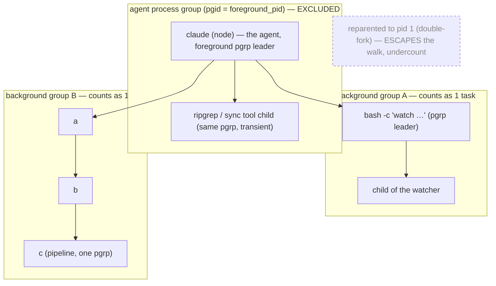
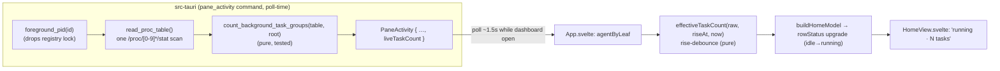

# feat: Dashboard `running · N tasks` state for busy-but-quiet agents

Add a fourth dashboard status — **`running · N tasks`** — for an agent that is
genuinely busy but producing no terminal output: parked on long-running
background polls (Claude Code's "N shells still running") or mid-turn on one long
*silent* command. Today such an agent reads `idle` after 75 s of output silence,
which the user flagged as unrepresentative. The signal is a **`/proc`
process-tree count of live background process groups** under the agent, threaded
through the existing per-pane `pane_activity` command and surfaced as a new,
**purely additive** dashboard state that only ever replaces what would otherwise
be `idle`.

This extends the agent dashboard from
`docs/plans/2026-06-22-002-feat-agent-dashboard-home-plan.md` — read it for the
KTD-A…F / U1–U7 cross-references this plan builds on.

---

## Problem Frame

The dashboard's `working` indicator is derived **purely from PTY output
activity** (`src-tauri/src/state/activity.rs`): a "current work stretch" that
ends after `IDLE_GAP_MS = 75_000` ms of terminal silence. With no output stretch
and no unseen attention, `src/lib/home.ts::rowStatus` falls through to `idle`.

So an agent that has spawned background work and gone quiet — exactly the user's
`persona` tab: *"Two background jobs are running… Pausing here until then,"* with
*"2 shells still running"* in Claude Code's status line — produces no terminal
output, drops its work stretch after 75 s, and reads `idle`. It is not idle. The
original dashboard plan named this precisely (KTD-A limitation, AE6, the
"idle-gap reset under-counts" risk) and recorded a Claude Code turn-start hook as
the deferred upgrade path.

This plan takes a different, hook-free signal that the codebase can read today:
**the agent's process tree.** A parked agent with live background jobs has live
descendant processes; a truly-idle agent sitting at a prompt does not. fly
already inspects `/proc` per pane for cwd and agent detection — counting live
background descendants is an extension of that same path, on the same poll
cadence, off the PTY hot path.

The number must mean something honest. It is **the count of live background
process groups under the agent** (≈ the number of background jobs), *not* a task
queue, *not* CPU, *not* "is the agent thinking." Two hard truths shape the
design:

- **Background output is indistinguishable from agent output** on the shared
  tty (one PTY read thread records every chunk; `src-tauri/src/pty/pane.rs`). So
  a *chatty* background task already keeps the work stretch alive and reads
  `working` today. The new state must therefore cover only the *silent* case —
  it is additive over `idle`, never a competitor to `working` (KTD1).
- **The count is a heuristic over `/proc`, not ground truth.** Reparented
  (double-forked) tasks escape a descendant walk; helper subprocesses may or may
  not share the agent's process group. The mitigations (distinct-pgid counting,
  a rise-debounce, an empirical pgid check) live in the KTDs, Risks, and Open
  Questions; the residual under-count is accepted, and the label stays honest.

---

## Requirements

- **R1** — An agent that is busy-but-quiet (no current output stretch) **and**
  has live background work no longer reads `idle`; it reads a new **`running`**
  status. This is the core ask.
- **R2** — The `running` row shows a **count** of live background tasks, rendered
  `running · N tasks` (`1 task` singular). The count is **distinct background
  process groups** under the agent (≈ logical jobs), not raw process count.
- **R3** — The count is derived from `/proc` inspection — live (non-zombie)
  descendant processes of the pane's foreground pid whose process group differs
  from the agent's — sampled on the **dashboard poll cadence only**, never on the
  PTY hot path, and only while the dashboard is open.
- **R4** — `running` is **purely additive**: it only ever replaces a status that
  would otherwise be `idle`. `waiting` (genuine unseen needs-you) and `working`
  (output actively flowing) keep their existing precedence and behavior.
- **R5** — The count is trustworthy: transient blips (turn-start helper spawns,
  pid reuse, resume/restart process swaps) do not flash `running` (a rise
  debounce); zombies and the agent's own same-group children are excluded.
- **R6** — The `/proc` walk follows the established lock discipline (resolve the
  pid, **release** the `panes` registry mutex, then read `/proc`), never
  regresses the never-unmount invariant (KTD5 of the foundation plan), and never
  changes existing `working`/`waiting`/`idle` outcomes.
- **R7** — When background work ends (count → 0), the row promptly (≤ ~1 poll)
  returns to its underlying state (`idle`, or `working`/`waiting` if applicable).

### Acceptance Examples

- **AE1** — The `persona` case: claude parked ("Pausing here until then") with
  two background shells still running. The dashboard row reads `running · 2
  tasks`, not `idle`. (Covers R1, R2.)
- **AE2** — An agent that has *backgrounded* a long-running command which then
  runs silently (no output for > 75 s) reads `running · 1 task`, not `idle` — the
  original plan's AE6 gap, now closed for backgrounded work. (Covers R1, R3.)
- **AE3** — An agent actively streaming output reads `working {timer}` even when
  it also has a live background task: output wins; `running` only ever replaces
  `idle`. (Covers R4.)
- **AE4** — An agent that genuinely needs you (raised, unseen) reads `waiting`
  even with live background tasks. (Covers R4.)
- **AE5** — A backgrounded pipeline `a | b | c &` (three processes, one process
  group) counts as `1 task`, not `3`; `npm run dev &` and its child subtree count
  as `1 task`. (Covers R2.)
- **AE6** — When the last background task exits, the row returns to `idle` within
  ~1 poll (≤ ~1.5 s). (Covers R7.)
- **AE7** — A brief blip — a transient child during turn-start, or a pid reused
  inside the poll window — does **not** flash `running`; the count must persist
  ≥ 2 polls to surface. (Covers R5.)
- **AE8** — A finished-but-unreaped (zombie) descendant is **not** counted; a
  background job whose only process has gone zombie reads `idle`, not
  `running · 1 task`. (Covers R5.)

---

## Key Technical Decisions

- **KTD1 — `running` is purely additive over `idle`; it never competes with
  `working`.** The PTY read thread records *every* above-threshold tty chunk
  with no source attribution (`pane.rs` `record_output`), so a *chatty*
  background task already refreshes the work stretch and reads `working` today.
  Therefore `running` is defined precisely as **"base status is `idle` AND the
  effective background-task count > 0."** Compute today's status unchanged
  (`raised → waiting`, `acknowledged → idle`, else `stretch → working` / `idle`),
  then upgrade `idle → running` when tasks are live. This makes the feature a
  one-cell change: it can never double-represent the same work as both `working`
  and `running`, and it leaves `waiting`/`working` semantics untouched (R4). The
  pre-existing `acknowledged → idle` suppression (a viewed agent shows no
  `working` timer) is **not** changed here — only its `idle` outcome gains the
  `running` upgrade.
- **KTD2 — Count distinct background process *groups*, not processes.** A
  backgrounded pipeline is N processes in one group; a background job that spawns
  a subtree is many processes in one group. Counting **distinct pgids among live
  descendants where pgid ≠ the agent's pgid** maps "N tasks" to logical jobs,
  matching the user's mental model and Claude Code's "N shells" line. Residual: a
  background task that itself calls `setsid`/starts new sessions re-inflates the
  count — accepted and documented. (Resolves flow-analysis 3.1/3.2.)
- **KTD3 — Tree root = the pane's foreground pid; background = a different
  process group.** `PtyManager::foreground_pid` returns the foreground
  process-group leader (portable-pty `process_group_leader()` = `tcgetpgrp`),
  whose pid equals the agent's pgid. Background jobs are PPID-descendants of the
  agent in a *different* pgrp (that is what backgrounding means), so a transitive
  descendant walk finds them while the pgid filter excludes the agent's own
  foreground children and same-group helpers. **Known blind spot:** if claude is
  itself backgrounded relative to the pane, `foreground_pid` returns the shell
  and both detection and the count are wrong (the row may even disappear via
  `is_agent`). Pre-existing limitation (foundation plan Risks); accepted here,
  decoupling detection is deferred.
- **KTD4 — Compute off the hot path, on the poll cadence, with the
  `pane_command` lock discipline.** The count is assembled inside the existing
  `pane_activity` command (poll-time, dashboard-gated), never in `read_loop`.
  Mirror `PtyManager::pane_command`: resolve `foreground_pid` (which takes and
  **releases** the `panes` mutex), then do all `/proc` reads with no lock held —
  *not* the atomics-only `activity()` pattern, because a tree walk is many
  blocking syscalls (KTD13/KTD9 of the foundation plan). Each command call takes
  **one `/proc` snapshot** and resolves the root and its descendants against that
  single snapshot, so it is internally consistent against pid reuse. A
  single-scan-per-tick batch across panes is deferred as a perf refinement.
- **KTD5 — Rise-debounce the count; fall immediately.** Surface `running` only
  after the raw count has been > 0 across the debounce window (~2 polls); drop to
  the base status the instant the count returns to 0. This absorbs turn-start
  helper spawns, pid-reuse blips, and resume/restart process swaps (flow 1.2 /
  2.2 / 2.3) without lagging the "work finished" transition. Implemented as a
  pure `effectiveTaskCount(raw, riseAt, now, window)` helper plus one non-reactive
  per-leaf `riseAt` map in `App.svelte`, mirroring `lastEngagedAt`.
- **KTD6 — The pgid filter is a hypothesis with an empirical gate.** Whether
  Claude Code's long-lived helpers (MCP servers, language servers) share claude's
  pgid (then the KTD2 filter already excludes them) or get their own (then every
  MCP-using agent would read `running` at rest — feature-breaking) is **verified
  against the real install before the predicate is locked** (Open Questions). The
  fallback discriminators if helpers leak: a comm/cmdline allowlist reusing the
  `is_claude` discipline, or counting only groups whose leader is a shell.

---

## High-Level Technical Design

### Status precedence (the load-bearing logic)

`running` is the additive upgrade of `idle`. Base status is exactly today's
`rowStatus`; the final status applies one rule on top.

| attention      | output stretch | effective task count | base status | **final**     |
| -------------- | -------------- | -------------------- | ----------- | ------------- |
| `raised`       | any            | any                  | `waiting`   | `waiting`     |
| `acknowledged` | any            | `0`                  | `idle`      | `idle`        |
| `acknowledged` | any            | `> 0`                | `idle`      | **`running`** |
| idle           | active         | any                  | `working`   | `working`     |
| idle           | none           | `0`                  | `idle`      | `idle`        |
| idle           | none           | `> 0`                | `idle`      | **`running`** |

Rule: `final = (base === "idle" && effectiveTaskCount > 0) ? "running" : base`.
`waiting` and `working` are never reached by the new branch, so the feature
cannot regress them (R4). *Table is authoritative for the label; prose governs on
any disagreement.*

### What gets counted (process tree under one pane)

Count = distinct pgids among **live** (non-zombie) **descendants of the agent**
whose pgid ≠ the agent's pgid. Here that is **2** (groups A and B). The agent's
own group and a reparented orphan are not counted.

### Data path (signal → glanceable label)

*Diagrams are authoritative for the data path and what-counts; prose governs on
any disagreement.*

---

## Scope Boundaries

**In scope:** the pure background-task-group counter (R2, KTD2), the `/proc`
process-table reader (R3), threading `liveTaskCount` through the `pane_activity`
command + IPC (R3, R6), the additive `running` status + rise-debounce in the
view-model (R1, R4, R5, R7, KTD1/KTD5), and the `running · N tasks` rendering
(R2).

### Deferred to Follow-Up Work

- **Single-`/proc`-scan-per-tick batch command** across all panes — a perf/
  consistency refinement over the per-pane scan; unnecessary at v1 pane counts.
- **Decoupling agent detection from `tcgetpgrp`** (scan the pane subtree for a
  `claude` comm) so a backgrounded-claude row does not disappear — a separate
  robustness fix (flow 2.1); the user's case keeps claude in the foreground.
- **Output-source separation** to fix `lastOutputAgoMs` contamination of the
  engagement-grace and stale-ping heuristics by chatty background output (flow
  4.3) — pre-existing; needs per-source tagging the single-read-thread
  architecture does not provide.
- **A Claude Code turn-start hook** — the higher-confidence "actively working"
  signal; still deferred from the original dashboard plan.
- **Config-exposed debounce window / count predicate.**
- **Surfacing in-flight background work alongside `waiting`** — when raised +
  tasks, only `waiting` shows (flow 1.5); accepted information loss for v1.
- **Counting while the dashboard is closed** — stays dashboard-gated.

---

## Implementation Units

### U1. Pure background-task-group counter

**Goal:** A pure function that turns a `/proc`-derived process table + the agent
root pid into the count of distinct live background process groups (KTD2/KTD3) —
the core tested unit.

**Requirements:** R2. **Dependencies:** none.

**Files:**
- `src-tauri/src/cwd/mod.rs` (add `ProcEntry` + `count_background_task_groups`,
  beside `is_claude` — the established home for pure `/proc` classifiers)

**Approach:** Define `ProcEntry { pid: u32, ppid: u32, pgid: u32, state: char,
comm: String }` (comm carried for the KTD6 fallback, unused by v1 logic).
`count_background_task_groups(table: &[ProcEntry], root_pid: u32) -> u32`:
build the transitive descendant set of `root_pid` via `ppid` edges; from
descendants whose `state` is live (not `'Z'`/`'X'`) and whose `pgid != root_pid`,
return the number of **distinct** `pgid` values. `root_pid` is the agent's pgid
(it is the foreground pgrp leader), so `pgid != root_pid` ⟺ "backgrounded." Pure,
no I/O — the table is an argument, matching `is_claude` / `activity::record`.

**Patterns to follow:** `cwd::is_claude` (pure matcher + `#[cfg(test)] mod
tests`), `state/activity.rs` (table-driven tests).

**Execution note:** Test-first — write the synthetic-table transition cases
before the function.

**Test scenarios:**
- Agent with two background groups (a watcher subtree in pgrp A, a 3-process
  pipeline in pgrp B) → `2`. (Covers AE5.)
- A 3-process pipeline sharing one pgid → `1`, not `3`. (Covers AE5.)
- A background job whose subtree has many same-pgid children → `1`. (Covers AE5.)
- Foreground children sharing the agent's pgid → not counted (`0`).
- A zombie (`state == 'Z'`) descendant in its own pgrp → not counted. (Covers AE8.)
- A descendant reparented away (no longer under `root_pid`) → not counted
  (undercount, by design — KTD3).
- Transitive depth: a background group leader two+ hops below the root is still
  found and counted once.
- Empty table, or root with no descendants → `0`.
- Cycle/self-parent safety: a malformed table (pid == ppid, or a ppid cycle) does
  not infinite-loop (visited set / bounded traversal).

---

### U2. `/proc` process-table reader

**Goal:** A thin, best-effort reader that snapshots the live process table for
U1 (KTD4) — one `/proc` scan per call.

**Requirements:** R3. **Dependencies:** U1 (for the `ProcEntry` type).

**Files:**
- `src-tauri/src/cwd/mod.rs` (`read_proc_table() -> Vec<ProcEntry>`, beside
  `proc_cwd` / `proc_comm` / `proc_cmdline`)

**Approach:** Enumerate `/proc`, keep all-numeric entries, read each
`/proc/<pid>/stat`. **Parse carefully:** `comm` (field 2) is parenthesized and
may contain spaces and parens — split on the **last** `')'`, take `comm` between
the first `'('` and that last `')'`, then space-split the remainder where
`state` = field 0, `ppid` = field 1, `pgrp` = field 2. Skip entries that fail to
read or parse (process exited mid-scan, permission) — best-effort, never panic.
Returns whatever was readable.

**Patterns to follow:** `cwd::proc_cmdline` (thin `/proc` reader returning a
collection, unreadable → empty), the module header's "sampled on a low cadence,
never on the hot path" rule.

**Test scenarios:**
- `Test expectation: thin I/O.` One sanity test: `read_proc_table()` includes the
  current process (`std::process::id()`) with a plausible `ppid`/`pgid` and a
  live state.
- A `stat` line with spaces/parens in `comm` (synthetic string fed to an
  extracted pure `parse_stat_line(&str) -> Option<ProcEntry>`) parses `state`/
  `ppid`/`pgid` correctly — the parsing gotcha is the real risk, so the line
  parser is factored out and unit-tested directly.
- A malformed/truncated `stat` line → `None`, no panic.

---

### U3. Thread `liveTaskCount` through `pane_activity` + IPC

**Goal:** Assemble the count in the existing per-pane command and expose it to the
frontend (KTD4), with the correct lock discipline.

**Requirements:** R3, R6. **Dependencies:** U1, U2.

**Files:**
- `src-tauri/src/pty/mod.rs` (`PaneActivity` struct gains `live_task_count: u32`;
  `pane_activity` command body composes the count; a `PtyManager` helper that
  resolves `foreground_pid` then counts off-lock)
- `src/ipc.ts` (`PaneActivity` interface gains `liveTaskCount: number`)
- `src/lib/home.test.ts` (the `agent()` factory gains the new field)

**Approach:** Add `live_task_count: u32` to the `#[serde(rename_all =
"camelCase")] PaneActivity` return struct (→ `liveTaskCount`). In the command,
after the existing `is_agent` early-return, resolve `foreground_pid(id)` (this
already drops the registry lock), then — with no lock held — call
`read_proc_table()` (U2) and `count_background_task_groups(table, fg_pid)` (U1).
Prefer resolving `foreground_pid` **once** and reusing it for both the existing
`is_claude` check and the count (avoid a double pgrp resolution). The command is
already registered in `lib.rs`; only the struct/body change. Default
`live_task_count` to `0` for non-agent / unknown panes. No change to
`PaneShared`, the activity snapshot, or `read_loop` — the count is a `/proc`
read, not an atomic.

**Patterns to follow:** `PtyManager::pane_command` (resolve pid → drop lock →
`/proc` reads — the exact template); the `PaneActivity` serialize/camelCase
convention; "add a command in both `lib.rs` and `ipc.ts`" (here only the field
changes, since the command exists).

**Test scenarios:**
- `Test expectation: thin composition — logic is in U1/U2.` Guard: the count
  path returns `0` for a non-agent / unknown pane id (graceful default, no panic,
  no lock poisoning), asserted via the `PtyManager` helper.
- A Rust integration test (extending the existing real-pane test harness, if
  present) spawning a child with a backgrounded sub-job observes
  `live_task_count >= 1` for that pane; a bare-shell pane stays `is_agent: false`
  with `live_task_count: 0`. (Best-effort — gated on the harness; otherwise
  covered by U1/U2.)

---

### U4. Frontend view-model: additive `running` state + rise-debounce

**Goal:** Turn the polled `liveTaskCount` into the additive `running` status with
a debounced, trustworthy count (KTD1/KTD5) — pure, tested.

**Requirements:** R1, R4, R5, R7. **Dependencies:** U3.

**Files:**
- `src/lib/home.ts` (`AgentStatus` gains `"running"`; `AgentRow` gains
  `liveTaskCount`; `rowStatus` upgrade rule; `effectiveTaskCount` pure helper)
- `src/lib/home.test.ts`
- `src/App.svelte` (carry `liveTaskCount` from `agentByLeaf`; a non-reactive
  per-leaf `taskRiseAt` map updated each poll; apply `effectiveTaskCount` before
  `buildHomeModel`, alongside `gracedAgents` / `effectiveAttention`)

**Approach:**
- `AgentStatus = "working" | "waiting" | "idle" | "running"`. Keep today's
  `rowStatus` as the base; final status applies `base === "idle" &&
  effectiveTaskCount > 0 ? "running" : base` (the decision table). `AgentRow`
  carries `liveTaskCount` for the label.
- `effectiveTaskCount(raw: number, riseAt: number | null, now: number, windowMs:
  number): number` — returns `raw` when `raw > 0 && riseAt != null && now -
  riseAt >= windowMs`, else `0`. Pure; `now`/`riseAt` injected.
- In `App.svelte`, maintain `taskRiseAt[leaf]`: set to `now` when a leaf's raw
  count transitions `0 → >0`, clear to `null` when it returns to `0` (immediate
  fall — KTD5). Compute the effective count per leaf before `buildHomeModel`, so
  the model stays pure over its inputs (same shape as `gracedAgents`). Concretely
  — mirroring how `gracedAgents` rewrites `workingForMs` — App overwrites each
  per-leaf `PaneActivity` copy's `liveTaskCount` with its debounced effective
  value before passing the map to `buildHomeModel`, so `buildHomeModel` /
  `rowStatus` read the already-effective `liveTaskCount` and need no new
  parameter. `windowMs` ~2 polls (≈ 3000 ms; tune live).

**Patterns to follow:** `gracedAgents` / `effectiveAttention` (App massages maps
against one `now` before `buildHomeModel`); `lastEngagedAt` (non-reactive
per-leaf map updated in the poll); the existing `rowStatus` decision point.

**Test scenarios:**
- Full precedence matrix from the decision table: each row maps base + count to
  the expected final status — especially `acknowledged + count>0 → running`,
  `idle-attention + no-stretch + count>0 → running`, and the negatives where
  `waiting`/`working` must survive unchanged. (Covers R4, AE1–AE4.)
- `running` never appears when the base is `working` or `waiting`, for any count.
  (Covers R4, AE3, AE4.)
- `liveTaskCount` is carried onto `AgentRow` and is `0` for idle rows.
- `effectiveTaskCount`: raw>0 but within the window → `0` (debounced); raw>0 past
  the window → raw (surfaced); raw 0 → `0` regardless of `riseAt`. (Covers R5, AE7.)
- Falling edge: raw drops `>0 → 0` → effective `0` immediately (no fall debounce).
  (Covers R7, AE6.)
- `running · 0` is unreachable: a `0` effective count yields base `idle`, never a
  `running` row.

---

### U5. HomeView rendering: `running` label + task count + color

**Goal:** Render the new state and its count in the dashboard row (R1, R2).

**Requirements:** R1, R2. **Dependencies:** U4.

**Files:**
- `src/lib/HomeView.svelte` (status color for `.status.running`; render the
  count; a `formatTaskCount` helper for pluralization)

**Approach:** Add a `.status.running` color distinct from `working` (green),
`waiting` (amber), `idle` (gray) — a blue/teal. In the row, when `status ===
"running"` render the count in the existing duration column slot as `N tasks`
(`1 task` singular) instead of the work timer (which only renders for `working`).
The status cell itself renders only the word `running` (fitting the existing
84 px status column like the other statuses); the `running · N tasks` form used
elsewhere in this plan is the row's combined reading across the status and
duration columns, not a single string in the status cell. A tiny
`formatTaskCount(n)` (`1 → "1 task"`, `n → "N tasks"`). No new layout — reuse the
`status | dur | cwd` grid.

**Patterns to follow:** the existing `.status.{working,waiting,idle}` styles and
the `{row.status === "working" ? formatDuration(...) : ""}` duration cell in
`HomeView.svelte`; `formatDuration` for the helper shape.

**Execution note:** This repo unit-tests pure modules, not Svelte components —
the logic lives in `home.ts` (U4). Verify by running the app.

**Test scenarios:**
- `Test expectation: presentational — logic covered by home.ts (U4).` If
  `formatTaskCount` is co-located as a pure export, unit-test its pluralization
  (`1 → "1 task"`, `2 → "2 tasks"`); otherwise keep it inline.
- **Live verification (run the app):**
  - The `persona`-style pane (parked, two background shells) shows `running · 2
    tasks` in a distinct color, not `idle`. (AE1.)
  - An agent streaming output still reads `working {timer}`; one needing input
    still reads `waiting`. (AE3, AE4.)
  - Killing the background jobs returns the row to `idle` within ~1 poll. (AE6.)
  - A truly-idle agent at a prompt (no background work) still reads `idle`.

---

## Alternatives Considered

- **Count processes, not process groups.** Simpler, but a pipeline or a
  job-with-children inflates `N` to its process count, and the user reads `N` as
  jobs. Rejected for KTD2 (distinct pgids ≈ jobs).
- **A competing `running` precedence (check tasks before the output stretch).**
  Would let `running` override `working`, but since background output already
  reads as `working` via the shared tty, the same work would flip between
  `working` and `running` on output cadence, and a genuinely-working foreground
  agent with one `&` job would lose its timer. Rejected for the additive KTD1.
- **A single batch `/proc` scan per tick across all panes.** Perf-optimal and
  cross-pane consistent, but a larger frontend change (one batched call replacing
  the per-pane loop). The per-pane single-snapshot scan is internally consistent
  and adequate at v1 pane counts; batching is deferred.
- **A Claude Code turn-start hook** (the original plan's recorded upgrade path).
  Higher-confidence "is the agent working," but net-new work on the
  authenticated socket + hook setup, binds to Claude Code, and would not fire for
  the user's parked case (the turn has *ended*; background jobs run on). The
  process-tree signal needs no hook and covers parked + mid-turn-silent alike.

---

## Risks & Dependencies

- **Helper/MCP pgid pollution (make-or-break).** If Claude Code's long-lived
  helpers (MCP servers, language servers) run in their own process groups, the
  KTD2 filter counts them and every MCP-using agent reads `running · N` at rest,
  defeating the idle/running distinction. *Mitigation:* the KTD6 empirical check
  before locking the predicate; fallback discriminators (comm/cmdline allowlist
  via the `is_claude` discipline, or shell-led groups only). This is the #1 Open
  Question.
- **`foreground_pid` fallback / row disappearance (KTD3).** If claude is itself
  backgrounded relative to the pane, `foreground_pid` returns the shell — the
  walk roots on the wrong subtree and `is_agent` may go false, removing the row
  entirely. Pre-existing accepted limitation; decoupling detection is deferred.
  The user's interactive-TUI case keeps claude in the foreground.
- **Reparented/daemonized tasks undercount.** A double-forked task reparents to
  pid 1 and escapes the descendant walk. Accepted (KTD3). Do **not** try to
  recover by pgid — pid/pgid reuse would cross-attribute foreign processes to the
  pane.
- **`lastOutputAgoMs` contamination (pre-existing).** Background output already
  feeds the engagement-grace and stale-ping heuristics via the shared read
  thread, so a chatty background job can keep a viewed agent reading `working`
  and resurrect `waiting`. This feature shares that signal but does not worsen
  it; a real fix needs output-source separation (deferred).
- **`working ↔ running` transition for a long background task** whose output
  cadence straddles the 75 s gap (chatty → `working`, quiet → `running`). Under
  KTD1 both mean "busy" and the transition is meaningful, but the label changes
  with no change in the agent — documented as expected, not a bug.
- **Perf.** A per-pane `/proc/[0-9]*/stat` scan per 1.5 s tick is
  O(total processes) × agent panes, but only while the dashboard is open and
  negligible at v1 pane counts; the batch scan is the deferred optimization
  (KTD4). Must stay off the read thread / backpressure path (KTD4, foundation
  KTD4/KTD9).
- **pid reuse in the poll window.** Resolve the root and descendants against one
  snapshot per call (KTD4); the rise-debounce (KTD5) absorbs single-sample blips.
- **No new external dependencies.** Internal dependencies: the `cwd` `/proc`
  readers, the `pane_activity` command + `PaneActivity`/`ipc.ts` shape, the
  `App.svelte` poll + map-massage path, and the `home.ts` `rowStatus` decision
  point — all reused, none restructured.

---

## Open Questions (resolve during implementation — empirical)

- **Do Claude Code's helper/MCP subprocesses share claude's pgid?** The
  load-bearing check (KTD6). Inspect a real session with MCP servers: if they
  share the agent pgid, the KTD2 filter already excludes them and v1 is done; if
  they get their own pgid, apply a fallback discriminator before shipping.
- **Lock the exact background-task predicate** against the real "N shells still
  running" line: distinct background pgids vs. only shell-led groups. Confirm the
  count the user sees matches what Claude Code reports.
- **Debounce window** (~2 polls / ≈ 3 s) — tune against real turn-start and
  resume-swap timing so `running` neither flashes nor lags.
- **`/proc/<pid>/stat` parsing** — verify the last-`')'` split handles real comm
  strings (spaces, nested parens) on the dev box.
- **Per-pane scan cost** — confirm the scan is negligible at the user's real pane
  counts before deciding the batch optimization is unneeded.

---

## System-Wide Impact

This adds a **fourth dashboard status** layered on the existing three, kept
additive so it cannot regress `working`/`waiting`/`idle` (KTD1). It introduces
the first **process-tree** read in fly (prior `/proc` use was single-pid:
cwd, comm, cmdline), on the dashboard poll path only (gated to dashboard-open),
off the PTY hot path, under the established resolve-pid-then-drop-lock discipline
(KTD4). It threads one field through `PaneActivity` / `ipc.ts`, adds one pure
counter + one `/proc` reader in `cwd`, and one debounce helper + one non-reactive
map in the frontend. No change to the hook/security boundary, session
persistence, the attention pipeline, or backpressure. The standing maintenance
cost worth naming: the count is a `/proc` heuristic with documented blind spots
(reparenting, helper-pgid, backgrounded-claude) — the label is deliberately
honest about being "live background work," not ground-truth task state.

> After this lands it is a strong `/ce-compound` candidate alongside the original
> dashboard heuristic — the process-tree liveness signal (distinct-pgid counting,
> the `foreground_pid`/`tcgetpgrp` blind spot, helper-vs-job discrimination) is
> exactly the kind of non-obvious finding worth capturing in `docs/solutions/`.
