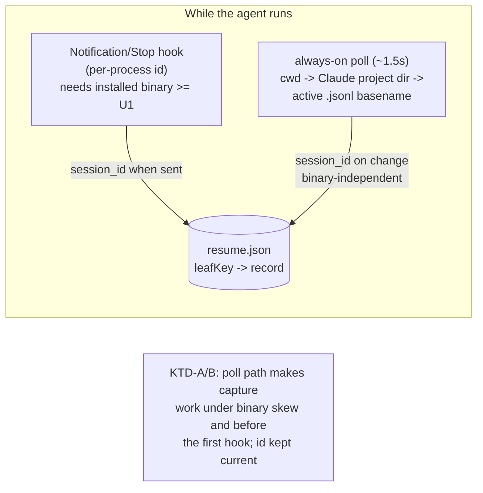
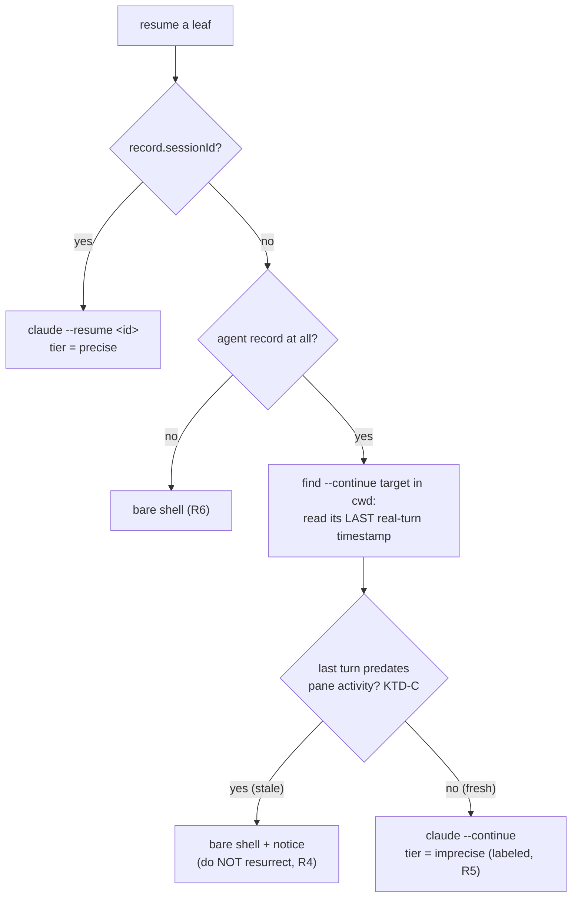

# fix: Resume selects the correct Claude session

`fly resume` is re-attaching the **wrong** Claude session. In the `play`
directory it reopened a stale 2026-06-19 "what are the contents of this repo"
chat instead of the session the pane was last running. This plan makes precise
session-id capture **independent of the installed-binary version** (the actual
root cause) and makes the degraded fallback **safe and transparent** so a capture
miss can never again silently resurrect an unrelated session.

This is a follow-up fix to the shipped resume feature
(see origin: `docs/plans/2026-06-23-001-feat-resume-agents-plan.md`); that plan's
design is sound — one of its capture paths has a version-coupling that defeats it
in practice.

---

## Problem Frame

The resume design (origin KTD-A) captures a pane's precise Claude `session_id`
from the **`Notification`/`Stop` hook**, then resumes with `claude --resume <id>`.
When no id was captured it degrades to `claude --continue` (origin R5), which
resolves to "the most-recent session in the cwd." The observed bug is that the
precise tier **silently never engages**, and the `--continue` fallback then picks
a stale, unrelated session.

**Verified root cause — a version skew, not a logic bug.** The capture chain
breaks at a seam the design did not account for:

1. The global Claude hook in `~/.claude/settings.json` invokes the **installed**
   binary: `"/usr/bin/fly" notify finished --claude`.
2. That installed binary is built **2026-06-23 05:59**. The commit that makes
   `fly notify` transmit `session_id` over the socket (origin U1, `d18f1d7`) landed
   **2026-06-23 08:30** — *after* the installed build. So the installed
   `fly notify` sends **no `session_id`**.
3. The **running app is `fly-dev`** (the supported side-by-side dev workflow,
   `pnpm flavor:dev`) with the latest code. Its dispatch closure
   (`src-tauri/src/lib.rs:215`) upserts the id correctly — but only
   `if let Some(session_id) = hook.session_id`, which is always `None` because the
   stale *sender* omitted it.
4. The poll path (origin U4) is dev-side and binary-independent, so it **did**
   capture `argv` + `isAgent`. The on-disk record proves the asymmetry:

   ```json
   { "leaf-5": { "sessionId": null, "sessionCwd": null,
                 "argv": ["claude","--dangerously-skip-permissions","--continue"],
                 "isAgent": true } }
   ```

   Because upserts field-merge and the poll only writes `argv`/`isAgent`, a
   `null` `sessionId` is **proof the hook path never wrote an id** for this leaf.
5. With `sessionId: null`, `buildResumeCommand` builds `claude --continue`
   (`src/lib/resume.ts:123`); `computeResumeForRestore` finds no `sessionCwd`, so
   it spawns that in the pane's **layout cwd** (`/home/evan/projects/play`).
6. `claude --continue` in `play` resolves to that directory's only transcript,
   `04d56f41-…jsonl` — the 06-19 first-chat. Its file mtime is 06-23 only because
   repeated metadata-only `--continue` opens bumped it; its last real turn is
   06-19. So "most recent" picked an ancient session.

**The deeper lesson.** Precise capture rides a binary (`/usr/bin/fly`) whose
version is **decoupled** from the running app. The side-by-side dev workflow
*guarantees* this skew while the resume feature is itself being iterated, and any
release/installed drift reproduces it. Rebuilding the `.deb` fixes this one
instance, but the coupling will silently bite again. The durable fix is a capture
path that does **not** depend on the installed binary at all — Claude's own
transcript store, which the origin Problem Frame already identifies as "the
durable store," is exactly that signal.

---

## Requirements

- **R1** — A resumed pane re-attaches to the session it actually ran, via a
  precise `session_id`, whenever that id is knowable — **independent of the
  installed `fly` binary's version**.
- **R2** — Precise capture has a **hook-independent path**: fly derives the pane's
  active `session_id` from Claude's live transcript (`.jsonl`), so capture works
  under binary skew and **before** the first `Notification`/`Stop` fires.
- **R3** — The captured id is **kept current** for the pane's life: when the
  active session changes (`/clear`, a new conversation), the stored id follows it
  (capture-on-change, not capture-once).
- **R4** — When no precise id is available, the `claude --continue` fallback is
  **stale-guarded**: fly must not resume a session whose last real turn predates
  the pane's own last activity. A stale candidate yields a **bare shell**, never a
  silent wrong session.
- **R5** — Resume **tier is transparent**: a pane resumed imprecisely
  (`--continue`, most-recent-in-folder) is visibly distinguished from one resumed
  precisely (`--resume <id>`).
- **R6** — All existing resume guarantees are preserved unchanged: clean launches
  never auto-run (origin R1); the never-unmount / stable-leaf-key invariant
  (origin R7 / KTD5) holds; non-agent panes reopen as bare shells.
- **R7** — Capture and restore read/write only under the `FLY_APP_NAME` root
  (origin R10), so `fly` and `fly-dev` stay isolated.

### Acceptance Examples

- **AE1** — *(the reported bug)* A pane ran a session in `play`, then was relaunched
  via `--continue` several times (bumping an old session's mtime). On `fly resume`
  the pane re-attaches the session it **last ran** by precise id; capture happened
  via the transcript path even though the installed binary is pre-U1 and the app is
  `fly-dev`. (Covers R1, R2.)
- **AE2** — In a pane, `/clear` starts a new session. Quit and `fly resume`
  re-attaches the **new** session, not the pre-`/clear` one. (Covers R3.)
- **AE3** — A pane whose only same-cwd transcript is the stale 06-19 chat, with no
  precise id captured, resumes to a **bare shell** (with a notice), **not** the
  06-19 chat. (Covers R4, R5.)
- **AE4** — A pane resumed precisely shows "re-attached `<short-id>`"; a pane
  resumed via `--continue` shows "resumed most-recent session in `<cwd>`". The two
  are never conflated. (Covers R5.)
- **AE5** — A clean `fly` launch still reopens every pane as a fresh shell with
  inert scrollback. (Covers R6.)

---

## Key Technical Decisions

- **KTD-A — Hook-independent session-id capture from the transcript store.** The
  always-on poll resolves a pane's active session by encoding its cwd to Claude's
  project dir and taking the **basename of the actively-written `.jsonl`** (the
  filename *is* the session id). This is binary-version-proof and fires as soon as
  the transcript exists (before the first hook). It **layers with** the existing
  hook path (origin KTD-A), which stays the unambiguous *per-process* source when
  binaries align; both writers target the same active session, so a field-merge
  "last writer wins" is harmless. The hook is no longer the *only* precise source.
- **KTD-B — Capture-on-change, not capture-once.** `argv` is fixed for a pane's
  life and captured once (origin U4); a `session_id` is **not** — `/clear` or a new
  conversation rotates it. The poll upserts only when the resolved active id
  **differs** from the last one seen for that leaf (an in-memory guard keeps the
  write-through store churn-free at the ~1.5s cadence).
- **KTD-C — Stale-guard `--continue` by last real turn vs pane activity, not file
  mtime.** Metadata-only `--continue` opens bump a transcript's **mtime** without
  adding turns (precisely why the 06-19 session looked "recent"), so mtime is not a
  freshness signal. The guard compares the candidate session's **last `user`/
  `assistant` timestamp** to the pane's own captured activity (`record.updatedAt`):
  if the candidate's last turn predates the pane's life, it cannot be this pane's
  session → bare shell.
- **KTD-D — Surface the resume tier.** The crash/offer prompt and a minimal
  per-pane notice distinguish precise (`--resume <id>`) from imprecise
  (`--continue`) resumes, so the degraded path is never silently passed off as
  exact. Reuses the existing offer/overlay machinery rather than a new system.
- **KTD-E — Encode the cwd; degrade gracefully on a miss; never full-scan.** The
  project dir is found in O(1) by Claude's scheme — `/` **and** `.` both map to `-`
  (verified against real dirs: `/home/evan/projects/play` →
  `-home-evan-projects-play`; a `/.obsidian/` segment → `--obsidian`). A miss
  (scheme change, unusual chars) degrades to the now-stale-guarded `--continue`,
  never an error. The transcript's own recorded `cwd` field is available to
  *confirm* a match when disambiguating (refinement, see Open Questions).

---

## High-Level Technical Design

### Capture: two precise sources feeding one record



### Restore: tiered, with a stale-guarded, transparent fallback



Normal (clean) launch is unchanged: every pane is a bare shell, no tiering (R6).

---

## Scope Boundaries

In scope: a hook-independent transcript-derived precise-id capture that keeps the
id current; a stale-guard + tier transparency on the `--continue` fallback; the
backend plumbing and pure helpers to support both, with tests.

### Deferred to Follow-Up Work

- **Installed-binary version-skew warning** (the declined Option 3): a one-time
  notice when the hook's sender binary is older than the running app. KTD-A makes
  capture robust *without* it; the warning is defense-in-depth, deferred.
- **Multi-agent-same-cwd disambiguation** beyond the hook: when two live panes
  share a cwd, the transcript path's "most-recently-written" heuristic can attribute
  the wrong id; the per-process hook disambiguates when binaries align. PID/
  session-start correlation is a future refinement (Open Questions).
- **Exit-to-shell continuity** and the **`SessionStart` hook** remain deferred
  exactly as in the origin plan.

### Outside this product's identity

- Resurrecting the agent **process**; cross-machine session sync. Unchanged from
  the origin non-goals — this fix only changes *which* conversation re-attaches and
  *how robustly* it is identified.

---

## Implementation Units

### U1. Backend: resolve a pane's active Claude session id from the transcript store

**Goal:** A binary-independent way to read the precise session id (and a candidate
session's last-turn time) from Claude's own `.jsonl` store, given a cwd or pane.

**Requirements:** R1, R2, R7. **Dependencies:** none.

**Files:**
- `src-tauri/src/session/transcript.rs` (new): `claude_project_dir(cwd) -> PathBuf`
  (encode `[/.]`→`-` under `~/.claude/projects/`); `active_session_id(entries) ->
  Option<String>` (basename of the max-mtime `.jsonl`, recency-guarded; `entries`
  injected as `(name, mtime)` for purity); `session_last_turn_ms(path) ->
  Option<u64>` (tail-parse the last `user`/`assistant` `timestamp`, ignoring
  trailing metadata-only entries)
- `src-tauri/src/pty/mod.rs`: `PtyManager::pane_session_id(id) -> Option<String>`,
  guarded by `is_claude`, mirroring the `pane_cwd`/`pane_command` two-step (resolve
  foreground pid → cwd → project dir → active id)
- `src-tauri/src/stream/mod.rs` (`pane_session_id` command) +
  `src-tauri/src/lib.rs` (registration) + `src/ipc.ts` (`paneSessionId` wrapper)

**Approach:** The filename of the actively-written transcript *is* the session id,
so capture needs no content parse (only the stale-guard in U3 reads turn
timestamps). Reading Claude's store directly removes the dependency on the
installed binary's wire version entirely (KTD-A). `is_claude`-gate so a bare shell
never resolves an id. A missing/garbled project dir returns `None` → graceful
degrade (KTD-E).

**Patterns to follow:** `PtyManager::cwd`/`is_agent` two-step and the
`pane_cwd`/`paneCwd` command/wrapper pair (origin U4); `session/resume.rs`
filesystem-pure test style.

**Execution note:** Test-first — the encoding and active-pick are pure and the
unit most likely to harbor a path-munging bug.

**Test scenarios:**
- `claude_project_dir`: `/home/evan/projects/play` → `…/-home-evan-projects-play`;
  a path with a `/.dir/` segment → `--dir` double-dash; trailing slash normalized.
- `active_session_id`: picks the max-mtime basename; empty list → `None`; with a
  recency floor, an all-old set → `None`.
- `session_last_turn_ms`: a fixture whose tail is metadata-only after a 06-19 turn
  returns the **06-19** turn time (not the file mtime); corrupt/empty → `None`.
- `pane_session_id`: non-claude (`bash`) pane → `None`; unknown id → `None` (no
  panic, no lock poisoning).

### U2. Poll captures the session id write-through, kept current

**Goal:** Capture the precise id from the transcript path during the agent's life,
updating it whenever the active session changes — without the hook.

**Requirements:** R2, R3, R7. **Dependencies:** U1.

**Files:**
- `src-tauri/src/session/resume.rs`: `save_resume_session(leaf_key, session_id,
  session_cwd)` command (field-merges `sessionId`+`sessionCwd`, mirroring
  `save_resume_record`) + `src-tauri/src/lib.rs` registration + `src/ipc.ts` wrapper
- `src/App.svelte`: extend the always-on poll (beside `captureResumeArgv`,
  `src/App.svelte:772`) with `captureResumeSession(entries)` — for each agent leaf,
  `paneSessionId(pid)`; upsert only when the resolved id differs from the last id
  seen for that leaf (a `Map<leafKey,string>` guard, like `resumeArgvCaptured` but
  change-tracking rather than once-only)

**Approach:** Capture-on-change (KTD-B) is the behavioral crux: an id, unlike argv,
rotates within a pane's life, so a capture-once guard would re-pin the first id —
the very failure mode being fixed. The in-memory last-seen guard means the
write-through store is touched only on a real session change. Routes through the
backend store so it serializes with the hook writer (no clobber).

**Patterns to follow:** `refreshCwds` → `captureResumeArgv` poll shape
(`src/App.svelte:750`); the `save_resume_record` command + `saveResumeRecord`
wrapper; the field-merge upsert in `session/resume.rs`.

**Test scenarios:**
- Pure helper `shouldCaptureSession(lastSeen, resolved)`: `null`→id is capture;
  same id is skip; changed id is capture; `resolved == null` is skip.
- `save_resume_session` field-merges `sessionId`/`sessionCwd` without clobbering an
  existing `argv`/`isAgent` (mirror the `field_merging_upsert_does_not_clobber`
  test in `session/resume.rs`).
- *Manual/integration:* a live pane's id is captured with the **pre-U1 installed
  binary** (no hook id); `/clear` rotates the stored id to the new session.

### U3. Stale-guard the `--continue` fallback + classify resume tier

**Goal:** Never resurrect a session older than the pane's own life; tag each
resumed pane precise-vs-imprecise for U4.

**Requirements:** R4, R5, R6. **Dependencies:** U1.

**Files:**
- `src-tauri/src/session/transcript.rs`: `continue_target(cwd) -> Option<{
  session_id, last_turn_ms }>` command — the session `--continue` would pick
  (max-mtime in the project dir) plus its last real-turn time (via
  `session_last_turn_ms`) + `lib.rs` registration + `src/ipc.ts` wrapper
- `src/lib/resume.ts`: pure `resumeStaleVerdict({candidateLastTurnMs,
  paneActivityMs, marginMs}) -> "fresh" | "stale"`; pure `classifyResumeTier(record)
  -> "precise" | "imprecise"`
- `src/lib/resume.test.ts`: verdict + tier cases
- `src/App.svelte`: in `computeResumeForRestore` (`src/App.svelte:979`), for a
  degraded leaf (no `sessionId`) consult `continueTarget(cwd)` and drop the leaf
  from `commands` when the verdict is `stale` (→ bare shell, R6 default); build a
  `resumeTierByLeaf` map returned alongside the commands

**Approach:** The guard's signal is **last real turn vs `record.updatedAt`** (KTD-C),
not mtime — the play case has a fresh mtime but a 06-19 last turn, and only the
turn-timestamp comparison catches it. A missing candidate timestamp is treated as
`stale` (conservative: prefer a clean shell over a wrong session). Precise-id
leaves bypass the guard entirely (their tier is `precise`).

**Patterns to follow:** the `computeResumeForRestore` orchestration and its
`sessionCwd` cwd-override loop (`src/App.svelte:1007`); the pure-module + co-located
vitest convention of `src/lib/resume.ts`.

**Execution note:** Test-first on `resumeStaleVerdict` — it encodes the exact bug
and must be unambiguous.

**Test scenarios:**
- `resumeStaleVerdict`: candidate last-turn **before** pane activity − margin →
  `stale`; within/after → `fresh`; `candidateLastTurnMs == null` → `stale`.
- The AE1/AE3 fixture: `candidateLastTurnMs` = 06-19, `paneActivityMs` = 06-23 →
  `stale` → leaf omitted from `commands` (bare shell).
- `classifyResumeTier`: record with `sessionId` → `precise`; without → `imprecise`.
- *Logic:* given a records+layout fixture, `computeResumeForRestore` keeps a
  precise leaf, keeps a fresh imprecise leaf as `--continue`, and drops a stale one.

### U4. Surface the resume tier (transparency)

**Goal:** Make an imprecise resume visibly imprecise, so `--continue` is never
silently presented as an exact re-attach.

**Requirements:** R5. **Dependencies:** U3.

**Files:**
- `src/App.svelte`: feed `resumeTierByLeaf` into the resume **offer** prompt
  (`resumeOffer`, `src/App.svelte:426`) as a breakdown (e.g. "3 agents — 2 exact,
  1 most-recent-in-folder"); on explicit `fly resume` (no offer), emit a transient
  notice for imprecise panes
- `src/lib/resume.ts`: pure `resumeTierSummary(tierByLeaf) -> {precise, imprecise}`
- optional `src/lib/Terminal.svelte`: a brief, dismissible "resumed most-recent
  session in `<cwd>`" banner for an imprecise pane (kept minimal; the offer
  breakdown is the primary surface)

**Approach:** Reuse the existing offer/overlay machinery (KTD-D) rather than
building a new indicator system. The summary is a pure fold so it is unit-tested;
the rendering is thin.

**Patterns to follow:** the `resumeOffer` overlay + `answerResumeOffer` flow
(`src/App.svelte:426`); the passive-notice style of `HotkeyMenu.svelte`.

**Test scenarios:**
- `resumeTierSummary`: mixed map → correct `{precise, imprecise}` counts; empty →
  zeros.
- *Manual/integration:* the offer shows the breakdown; an explicit `fly resume`
  with one imprecise pane shows its notice; an all-precise resume shows no
  imprecise labeling.

---

## Risks & Dependencies

- **Transcript-encoding fragility (top risk).** KTD-A depends on Claude's
  cwd→dir scheme (`[/.]`→`-`). If Claude changes it, the project dir isn't found.
  *Mitigation:* a miss degrades to the stale-guarded `--continue` (KTD-E) — no
  worse than today, minus the silent wrong-session — and the hook path still
  provides precise ids once binaries align. Pin the scheme with tests against real
  dir names; re-verify at implementation.
- **Multi-agent, same cwd.** "Most-recently-written `.jsonl`" can attribute the
  wrong id when two live panes share a directory. *Mitigation:* the per-process
  hook disambiguates when binaries align; the common one-agent-per-cwd case is
  exact. Deferred refinement (Open Questions).
- **Stale-guard margin tuning.** Too tight a margin could drop a legitimately-fresh
  session; too loose re-admits a stale one. *Mitigation:* compare to the pane's own
  `updatedAt` (not an absolute age) with a small clock-jitter margin; expose the
  margin as a constant (Open Questions).
- **Poll cadence vs a very short session.** A pane that writes a transcript and is
  quit within one ~1.5s poll window may miss capture. *Mitigation:* the hook still
  fires on `Stop`; and the stale-guard prevents a wrong resume in that gap.
- **Privacy/footprint unchanged.** Still only session ids + cwds on disk (origin
  System-Wide Impact); reading `~/.claude/projects/` adds no new persisted data.
- **Dependency:** the immediate unblock (rebuild the `.deb`) is independent of this
  plan and can land first; this plan removes the need to remember it.

---

## Open Questions (resolve during implementation)

- **Stale-guard margin:** what jitter margin against `record.updatedAt`, and is a
  config knob warranted or is a constant fine?
- **Imprecise-pane UX depth:** is the offer breakdown sufficient, or is the
  per-pane `Terminal` banner (U4 optional) worth shipping in v1?
- **Same-cwd disambiguation:** correlate a transcript's first-event time / recorded
  `cwd` with pane spawn to pick the right file when sessions collide — now or
  deferred?
- **Capture cadence:** keep session-id capture on the existing ~1.5s cwd poll, or
  trigger it additionally on a pane's foreground-process change for faster pickup?

---

## System-Wide Impact

- **New IPC surface.** `pane_session_id`, `save_resume_session`, `continue_target`
  — each registered in both `src-tauri/src/lib.rs` and `src/ipc.ts` (the
  "register in both places" rule).
- **New backend module.** `src-tauri/src/session/transcript.rs` reads (never
  writes) `~/.claude/projects/`. No new persisted state.
- **Capture semantics.** Session-id capture gains a second, binary-independent
  source and becomes change-tracking (KTD-B); the hook path is unchanged and still
  contributes. Records written by either path are interchangeable at restore.
- **Restore semantics.** The degraded `--continue` path can now resolve to a
  **bare shell** (when stale) where it previously always ran something — a
  deliberate safety change (R4), surfaced via the tier UX (R5).
- **No schema bump.** `ResumeRecord` is unchanged; `sessionId`/`sessionCwd` already
  exist and are merely populated more reliably.

---

## Operational Notes

- **Immediate unblock (independent of this plan):** rebuild and reinstall the
  release so the hook's sender is current —
  `pnpm tauri build --bundles deb` then `sudo apt install ./src-tauri/target/release/bundle/deb/fly_<ver>_amd64.deb`.
  This restores hook-based capture for the installed binary right now. Once U1/U2
  land, capture no longer depends on this staying in sync.
- **Existing bad record:** the live `~/.local/share/fly-dev/resume.json` `leaf-5`
  record has `sessionId: null`; it will self-correct on the next poll once U2 ships
  (no manual edit required), and `prune_resume_records` already drops orphans.

---

## Alternatives Considered

- **Just rebuild the `.deb` (status quo + discipline).** Fixes this instance but
  the version coupling silently recurs on the next wire change or dev iteration —
  rejected as the *durable* fix, kept as the immediate unblock.
- **Install a flavor-matched hook** (`fly hooks setup` points the hook at the
  running binary). Addresses dev skew but not general installed drift, fights the
  global/shared hook, and still misses the pre-first-`Stop` window. Transcript
  derivation (KTD-A) is more general.
- **Restore-time transcript derivation.** Deriving the id at restore adds no
  precision over `--continue` (the agent is dead, so "active/most-recent" collapse
  to the same pick). The signal only exists *during* the session — hence capture in
  the poll, not at restore.
- **Full-scan `~/.claude/projects/*` by recorded `cwd`.** Encoding-independent but
  O(many dirs) per poll. Rejected as primary; retained as a disambiguation
  refinement (KTD-E, Open Questions).
- **Hard version handshake / warning (Option 3).** Deferred — KTD-A removes the
  dependency that the warning would guard, so the warning is defense-in-depth, not
  a fix.

---

## Sources & Research

- **On-disk evidence (this machine).** `~/.local/share/fly-dev/resume.json`
  (`leaf-5` with `sessionId: null`, `argv` ending `--continue`);
  `~/.claude/projects/-home-evan-projects-play/` holding a single transcript whose
  **last real turn is 2026-06-19** though its mtime is 2026-06-23 (metadata-only
  `--continue` opens); installed `/usr/bin/fly` built **05:59** vs origin-U1 commit
  `d18f1d7` at **08:30**.
- **Encoding verified** against real project-dir names (`/` and `.` → `-`).
- **Origin design:** `docs/plans/2026-06-23-001-feat-resume-agents-plan.md`
  (KTD-A capture, KTD-C builder, KTD-F id-stability, R5 tiered fallback). Claude's
  transcript store (`~/.claude/projects/<project>/<session-id>.jsonl`, written live)
  is the durable signal this fix leans on — the origin Sources already establish it.
- **Code seams:** `src/lib/resume.ts` (builder), `src-tauri/src/session/resume.rs`
  (store), `src-tauri/src/lib.rs:215` (hook upsert), `src/App.svelte:750` (poll),
  `src/App.svelte:979` (`computeResumeForRestore`).
