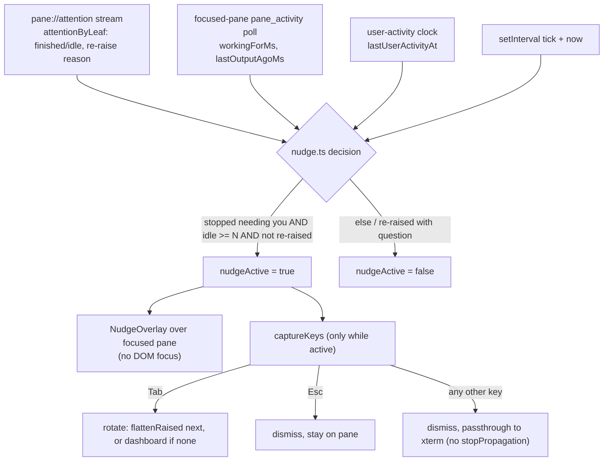

# feat: Dashboard home base + attention-triage nudge

## Summary

Make the dashboard (`src/lib/HomeView.svelte`) fly's home base and the hub of an
attention-triage loop. fly opens to it and rests on it; you jump to an agent by a
stable per-agent number (or Enter for the first one needing attention); and once
you've handled a focused agent, a permeable "nudge" overlay rotates you with `Tab`
to the next agent needing attention, or back to the dashboard when none remain.
This is a frontend layer on the existing attention pipeline — no backend
attention, suppression, or OS-notification changes.

---

## Problem Frame

The working pattern is 3–5 agents at once, and the only reason to return to a
given one is that it needs attention. Today the dashboard is a surface you summon
(`leader d` → `toggleHome`) that hides the grid while it's up, but nothing brings
you *to* it. After you answer an agent you're left in that pane with no signal to
move on, so finding the next agent that needs you is manual hunting across tabs
and workspaces. The dashboard is treated as a side panel, not the place you
operate from. This plan flips that: launch into the dashboard, rest on it, jump
out to whoever's calling, and get routed back.

See `origin: docs/brainstorms/2026-06-30-dashboard-home-base-requirements.md` for
the full requirements (R1–R16), flows (F1–F3), and acceptance examples (AE1–AE7).

---

## Requirements

Carried from the origin document. Grouped by concern; see origin for full text.

**Dashboard home base & triage launchpad**

- R1. fly opens to the dashboard on launch (not the last active pane); restored panes spawn and run hidden behind it.
- R2. The dashboard is the resting state and the terminus of the rotation when no agent needs attention.
- R3. The dashboard stays summonable/dismissable via its existing toggle.
- R4. Each agent shows a number fixed to its position in the flattened workspace→tab→pane order; the number does not change as attention states change.
- R5. Agents needing attention are visually distinguished on the dashboard.
- R6. Pressing an agent's number jumps focus to that agent, wherever it lives.
- R7. Pressing Enter jumps to the first agent needing attention in rotation order; no-op when none need attention.
- R8. Numbers cover the first ten agents (1–9 then 0); agents beyond that are reachable by click or Tab rotation.

**Attention nudge & rotation**

- R9. After you engage the focused agent, once it stops needing you (resumed working or finished/went idle) and you have not typed for N seconds, a nudge overlay appears on that pane.
- R10. The nudge does not appear if the agent re-raises with a question/permission; you answer in place.
- R11. The nudge appears only for the pane you are viewing; background raises don't trigger a nudge.
- R12. While the nudge shows, Tab rotates to the next agent needing attention in stable rotation order, or to the dashboard when none remain.
- R13. While the nudge shows, Esc dismisses it and keeps you on the current agent.
- R14. While the nudge shows, any key other than Tab/Esc dismisses it and passes through to the agent with no keystroke lost.
- R15. Outside the nudge window, Tab passes through to the PTY as normal; rotate-on-Tab is scoped to the nudge.
- R16. The idle delay N has a sensible default and is configurable.

---

## Key Technical Decisions

- KTD1. **Dual-signal nudge trigger, with a per-leaf reason map.** The backend
  attention machine (`src-tauri/src/state/attention.rs`) has no output-driven
  transition, so "agent resumed working" never reaches the streamed
  `pane://attention`. The trigger reads two sources: the attention stream for
  finished/idle and for re-raise suppression, and a focused-pane `pane_activity`
  poll (`workingForMs`, `lastOutputAgoMs`) for resumed-working — run only for the
  focused pane while the dashboard is closed (see origin Dependencies).
  Critically, `attentionByLeaf` stores state only and the focused pane collapses
  to `acknowledged` on any raise, so state alone can't tell a `finished` raise
  (nudge) from a `question`/`permission` raise (suppress, R10). The
  `AttentionReason` is the only discriminator, and `onAttention` currently
  discards it — so this trigger requires a new reactive `reasonByLeaf:
  Record<string, AttentionReason | null>` populated in `onAttention`, fed into the
  decision module.

- KTD2. **Permeable capture overlay (inverts the existing overlays).** The nudge
  takes no DOM focus (the `HotkeyMenu.svelte` archetype), so the focused xterm
  keeps focus. A `captureKeys` window listener, registered only while the nudge is
  active, intercepts `Tab` (`preventDefault` + `stopPropagation` → rotate) and
  `Esc` (→ dismiss-and-stay). Every other key clears the nudge and returns
  **without** `preventDefault`/`stopPropagation`, so the keystroke reaches xterm
  with nothing lost (R14). Every existing capture overlay `stopPropagation`s on
  all keys; this one must not. `Tab` also needs `preventDefault` to suppress
  browser focus traversal.

- KTD3. **Positional per-agent numbers.** A number is the agent's position in the
  flattened workspace→tab→pane order (1–9 then 0), assigned in `buildHomeModel` —
  stable against attention changes (R4) with no persisted registry. Adding,
  closing, or moving a pane reshuffles numbers; a lifetime-stable `leafKey→number`
  registry is deferred.

- KTD4. **Dashboard key repurposing.** Bare digits on the dashboard move from
  per-workspace jump (`home.ts` `workspaceJumpTarget`) to per-agent jump, and
  Enter moves from activate-highlighted-row to jump-to-first-raised (no-op when
  none). Jump targets key on the stable `leafKey` via `focusPane`, mirroring
  `cycleAttention`.

- KTD5. **Launch-to-dashboard sequencing (no grid flash).** Set
  `homeViewOpen = true` at the end of `restore()` right after `ready = true`, not
  in a post-resolve continuation. The resume offer is already awaited earlier
  inside `restore()` (via `computeResumeForRestore`), and the resume-offer overlay
  is a separate fixed backdrop, so opening the dashboard underneath it doesn't
  clobber it. Setting it late (after `restore()` resolves and the
  `onCloseRequested` registration awaits) would flash the last-active grid before
  snapping to the dashboard — the worse of the two orderings. Never-unmount is
  preserved (HomeView is a sibling; the grid is hidden via `class:hidden`). Pure
  runtime default — no `SavedSession` field.

- KTD6. **Nudge timing via a dedicated interval; idle clock is keystroke-only.**
  The time-based trigger (user idle ≥ N) uses its own `setInterval`-driven
  `$effect` with an injected `now`, not the `homeModel` `$derived` (which only
  recomputes on dependency change). The user-activity clock stamps
  `lastUserActivityAt` from `onWindowKeydown` only — **no pointer listener**.
  R9 gates on "not typed," and a pointer listener would let reading or selecting
  the agent's output (mouse move/select with no keystroke) reset the clock and
  suppress the nudge forever — exactly when the user is reading the reply they
  waited for. The stamp must sit *before* the `.xterm` early-return in
  `onWindowKeydown` so it fires while typing into a focused pane. It does not
  reuse `lastEngagedAt`, which is attention-driven and won't reset on continued
  typing.

- KTD7. **Config for N.** Add `nudge_idle_ms` (integer ms, serde-default) to
  `src-tauri/src/config/schema.rs` and `nudgeIdleMs` to `src/lib/config.ts`, read
  in `App.restore()` alongside the other config fields. Default ≈ 4000 ms. Timer
  and duration math uses saturating/checked arithmetic — release builds have
  `overflow-checks` off.

- KTD8. **Pure decision module.** "Should the nudge show, and what does a key do?"
  lives in a framework-free `src/lib/nudge.ts` with an injected `now` and explicit
  inputs, unit-tested like `home.ts` and `keymap.ts`. Wiring (U5/U6) computes the
  real signals and feeds the module.

---

## High-Level Technical Design

The feature fans three signal sources into a pure decision, which drives a
permeable overlay and key routing:

---

## Implementation Units

### U1. Launch to the dashboard and rest there

- **Goal:** fly opens to and rests on the dashboard, with restored panes spawned hidden behind it.
- **Requirements:** R1, R2, R3.
- **Dependencies:** none.
- **Files:** `src/App.svelte`.
- **Approach:** set `homeViewOpen = true` at the end of `restore()` immediately after `ready = true` (the resume offer is already awaited earlier inside `restore()` via `computeResumeForRestore`), so the dashboard is the first painted view with no last-active-grid flash — see KTD5. Preserve never-unmount (HomeView rendered as a sibling of `.layout`; grid hidden via `class:hidden` — already in place). No `SavedSession` field is added. Expect a brief empty-dashboard state at launch until panes spawn and the now-active poll detects `isAgent`; render it through the same path as the genuine zero-agents state (see Open Questions).
- **Patterns to follow:** `toggleHome` in `src/App.svelte` (the `homeViewOpen` toggle + `focusActivePane` on close); `restore()`/`onMount` and the resume-offer await; the never-unmount render contract (KTD-F) from `docs/plans/2026-06-22-002-feat-agent-dashboard-home-plan.md`; launch-mode ordering from `docs/plans/2026-06-23-001-feat-resume-agents-plan.md`.
- **Test scenarios:** `Test expectation: none` — runtime view-default wiring with no extractable pure logic. Verified by live launch validation under Verification.
- **Verification:** cold launch shows the dashboard with panes mounted and running behind it; a crash-resume offer still appears first and is not clobbered; switching into and out of a pane behaves as before.

### U2. Config: nudge idle delay N

- **Goal:** expose N as a configurable setting with a sensible default.
- **Requirements:** R16.
- **Dependencies:** none.
- **Files:** `src-tauri/src/config/schema.rs`, `src/lib/config.ts`, `src/App.svelte`.
- **Approach:** add `nudge_idle_ms` (integer ms; keep the struct's `Eq` derive — no `f64`) with a serde default and a value in `Default::default()` (≈ 4000). Add `nudgeIdleMs: number` to the `Config` type in `src/lib/config.ts`. Read it in `App.restore()` via the existing `getConfig()` call. No new Tauri command — `get_config` already returns the struct.
- **Patterns to follow:** the `font_size` default-15 path across `src-tauri/src/config/schema.rs`, `src/lib/config.ts`, and `App.restore()`; the existing numeric fields `attention_debounce_ms` / `scrollback_lines`.
- **Test scenarios:** `Test expectation: none` — config field plumbing; the default value is exercised through U5's trigger logic. (Add a serde round-trip test only if a config test module already exists.)
- **Verification:** `get_config` returns `nudgeIdleMs`; `cargo test --offline` and `pnpm check` pass.

### U3. Pure nudge-decision module

- **Goal:** a framework-free module that decides whether the nudge should show for the focused agent and what each key does.
- **Requirements:** R9, R10, R11 (decision logic); supports R12–R14 (key mapping).
- **Dependencies:** none.
- **Files:** `src/lib/nudge.ts` (new), `src/lib/nudge.test.ts` (new).
- **Approach:** define `nudge.ts`'s complete public API here so the module is specified in one place (U5 consumes these, it does not add new exports). Pure functions with an injected `now`: `shouldShowNudge(input)` where `input` carries the focused leaf's attention state + reason, a became-busy/became-idle transition, `userIdleMs`, `nudgeIdleMs`, and an `engaged` flag; `deriveBusyIdle(prevWorkingForMs, currWorkingForMs)` returning the null↔non-null transition; `userIdleMs(now, lastActivityAt)`; and `keyAction(key)` returning `'rotate' | 'dismiss-stay' | 'dismiss-passthrough'`. `shouldShowNudge` shows when the agent has stopped needing you — became busy after engagement, or finished/idle — AND `userIdleMs >= nudgeIdleMs` AND it has not re-raised with `question`/`permission`. Never show before you've engaged the focused agent. Match on the literal `e.key`; do not condition on `shiftKey`.
- **Patterns to follow:** `effectiveAttention` in `src/lib/home.ts` (pure, injected `now`); the pure state machine + tests in `src-tauri/src/state/activity.rs`; fixture/spy style in `src/lib/keymap.test.ts` and `src/lib/home.test.ts`.
- **Test scenarios:**
  - Covers AE1. Focused agent became busy after engagement and `userIdleMs >= N` → show.
  - Covers AE2. Focused agent finished/idle after engagement and `userIdleMs >= N` → show.
  - Covers AE3. Agent re-raised with reason `question` (and `permission`) → never show, regardless of idle.
  - Agent busy/finished but `userIdleMs < N` → no show (not idle long enough).
  - Not-yet-engaged focused agent → no show.
  - `keyAction`: `Tab` → `'rotate'`; `Esc` → `'dismiss-stay'`; printable / Enter / Ctrl-C → `'dismiss-passthrough'` (covers R12–R14 mapping).
  - `deriveBusyIdle`: null→non-null → became-busy; non-null→null → became-idle; null→null and non-null→non-null → no transition.
  - `userIdleMs`: returns `now - lastActivityAt`; boundary exactly at N treated as "idle long enough."
  - Edge: `workingForMs` / `lastOutputAgoMs` null → no crash, sensible default.
- **Verification:** `pnpm vitest run src/lib/nudge.test.ts` green; the module imports no Svelte or DOM APIs.

### U4. Dashboard per-agent numbering, jump-by-number, and Enter→first-raised

- **Goal:** number every agent stably, highlight raised ones, jump by number, and Enter to the first raised.
- **Requirements:** R4, R5, R6, R7, R8.
- **Dependencies:** none.
- **Files:** `src/lib/home.ts`, `src/lib/home.test.ts`, `src/lib/HomeView.svelte`, `src/App.svelte`.
- **Approach:** add a `num` to `AgentRow`, assigned positionally 1..N over the flat workspace→tab→pane order in `buildHomeModel` (10th → 0; 11th+ → no number). Add a pure `firstRaised` selector over the flat rows. In `HomeView.svelte`, render the per-agent number badge and a clear highlight for `needsAttention` rows. Reconcile `onKeydown`: bare 1–9/0 → `onJumpAgent(num)` (replacing the per-workspace `workspaceJumpTarget` branch); Enter → jump to `firstRaised`, intercepted before the row button's native click, no-op when none. Wire `onJumpAgent` in `App.svelte` to resolve the `num`'s `leafKey` and call `focusPane`.
- **Patterns to follow:** `buildHomeModel` / `effectiveAttention` / `workspaceJumpTarget` in `src/lib/home.ts`; the digit branch + leafKey selection in `src/lib/HomeView.svelte`; the digit-chord gotchas (shifted digits and numpad fall through; `0`/out-of-range are consumed no-ops) from `docs/plans/2026-06-22-001-feat-tab-workspace-qol-plan.md`; `jumpFromHome` / `focusPane` in `src/App.svelte`.
- **Test scenarios:**
  - Covers R4, R8. `buildHomeModel` assigns `num` positionally over the flat order; 10th → 0; 11th+ → undefined; numbers are unchanged when attention states flip.
  - Covers R5. `needsAttention` rows are flagged for highlight.
  - Covers R7. `firstRaised` returns the first `needsAttention` row in flat order, and null when none.
  - Covers R6. resolving a `num` yields the correct `leafKey`; out-of-range or `0` with fewer than ten agents yields no target.
  - Edge: numbering reshuffles when a pane is added/removed (documented limitation per KTD3).
  - Replace the existing `workspaceJumpTarget` digit tests in `home.test.ts` — that branch is removed (KTD4), so its assertions must be deleted or repointed to per-agent jump, or they fail on the next run.
- **Verification:** `pnpm vitest run src/lib/home.test.ts` green; on the dashboard, a number jumps to that agent and Enter jumps to the first raised (manual).

### U5. Nudge signal wiring → `nudgeActive`

- **Goal:** feed real signals into the pure decision module and drive a `nudgeActive` flag for the focused pane while the dashboard is closed.
- **Requirements:** R9, R10, R11.
- **Dependencies:** U2, U3.
- **Files:** `src/App.svelte` (consumes `src/lib/nudge.ts` from U3; `nudge.ts` itself is owned by U3).
- **Approach:** (a) user-activity clock — stamp `lastUserActivityAt` from `onWindowKeydown` only, *before* the `.xterm` early-return so it fires while typing into a focused pane. No pointer listener (KTD6). (b) reason capture — change `onAttention` to stop discarding the reason and populate a reactive `reasonByLeaf: Record<string, AttentionReason | null>` alongside `attentionByLeaf`; this is the finished-vs-question discriminator the trigger needs (KTD1). (c) focused-pane activity poll — a `$effect` keyed on `activeTab?.focusedLeafKey` and `!homeViewOpen` that polls `pane_activity` for just that leaf (`paneIdByLeaf` is non-reactive) on an interval, feeding previous vs current `workingForMs` through `deriveBusyIdle`. Gate became-busy on the `engaged` state so a residual pre-engagement work stretch (raw `pane_activity` is not graced) doesn't read as a fresh resumed-working immediately after you reply. (d) engagement gate — reuse `attentionByLeaf` / `lastEngagedAt` to know the focused agent was engaged. (e) a `setInterval`-driven `$effect` (own tick + one `now`) calls `shouldShowNudge(...)` with the focused leaf's state, `reasonByLeaf` value, busy/idle transition, and `userIdleMs`, and sets `nudgeActive`; it clears when the dashboard opens, focus changes, or the agent re-raises. Do not piggyback on the `homeModel` `$derived`.
- **Patterns to follow:** the `refreshAgents` poll `$effect` gated on `homeViewOpen` in `src/App.svelte`; the 1s tick in `src/lib/HomeView.svelte`; the non-reactive per-leaf timestamp maps + "massage the maps with one `now` before building" convention from `docs/plans/2026-06-23-002-feat-dashboard-running-state-plan.md`; the existing `pane_activity` command in `src-tauri/src/pty/mod.rs`.
- **Test scenarios:** (the pure derivations `deriveBusyIdle` and `userIdleMs` are defined and unit-tested in U3; U5 wires them.)
  - Integration/manual: dashboard closed, focused on an agent — after replying and the agent works/finishes and you stop typing for N, `nudgeActive` flips true; continued typing keeps it false; a re-raise (reason `question`/`permission` in `reasonByLeaf`) keeps it false (AE1–AE3).
  - Integration/manual: moving or selecting with the mouse (no keystroke) does NOT defer the nudge (keystroke-only idle clock).
- **Verification:** `nudgeActive` flips per AE1/AE2, stays silent for AE3 and for mouse-only activity; `reasonByLeaf` is populated on raise.

### U6. Nudge overlay, permeable key capture, and rotation/terminus

- **Goal:** render the nudge over the focused pane and handle Tab/Esc/type-through plus rotation to the next raised agent or the dashboard.
- **Requirements:** R2, R12, R13, R14, R15.
- **Dependencies:** U3, U5.
- **Files:** `src/lib/NudgeOverlay.svelte` (new), `src/App.svelte`. (`src/lib/Terminal.svelte` only if the in-`Terminal` render placement is chosen over an App-level overlay — see Open Questions.)
- **Approach:** `NudgeOverlay.svelte` is presentational, takes no DOM focus, shows when `nudgeActive`, and is positioned over the focused pane's slot as a partial overlay with the Tab/Esc hint. A `captureKeys` `$effect` gated on `nudgeActive` (mirroring the existing capture effects): `Tab` → `preventDefault` + `stopPropagation`, then **rotate via a dedicated helper — do NOT delegate to `cycleAttention`**, whose `if (raised.length === 0) return;` early-return would silently never open the dashboard and strand you on the last agent. Compute the raised set as `flattenRaised(workspaces, effectiveAttention(...))` — the **same** `effectiveAttention` set the dashboard highlight (R5) and Enter/`firstRaised` (R7) use, so a stale-pinged parked agent is never a Tab-only target — then branch: empty → `homeViewOpen = true` (terminus, R2/R12); else `focusPane` to the next entry. `Esc` → `preventDefault` + `stopPropagation`, clear `nudgeActive` AND set a per-engagement suppression so the nudge does not immediately re-fire for the current idle episode (its trigger conditions still hold); it re-arms only after the agent re-raises and is answered again. Any other key → clear `nudgeActive` **without** `preventDefault`/`stopPropagation` (passthrough, R14). Add `nudgeActive` to the `onWindowKeydown` guard list as insurance. Because the capture effect exists only while `nudgeActive`, Tab passes to the PTY normally otherwise (R15).
- **Patterns to follow:** `captureKeys` and the menu/confirm/resume capture effects in `src/App.svelte`; the no-DOM-focus archetype of `src/lib/HotkeyMenu.svelte`; the in-pane overlay precedents (status badge, resume banner) in `src/lib/Terminal.svelte`; `flattenRaised` / `effectiveAttention` / `focusPane` and `toggleHome` in `src/App.svelte` and `src/lib/home.ts`.
- **Test scenarios:**
  - Covers AE4. Tab with other raised agents → focus moves to the next in rotation order.
  - Covers AE5. Tab with no other raised agents → the dashboard opens.
  - Covers AE6. A printable key while the nudge shows → the nudge dismisses and the key reaches the agent (asserted via the `keyAction` mapping in U3 plus manual no-lost-keystroke check).
  - Covers AE7. Esc → dismiss and stay.
  - After Esc, the nudge does not re-appear for the same idle episode even though the agent stays idle; it re-arms only after a new re-raise + answer.
  - Covers AE5 (terminus). Tab when the only raised agent is the one you're on → the dashboard opens (does not rotate to self or no-op).
  - R15. Tab while the nudge is inactive → reaches the PTY (manual: shell/agent completion still works).
- **Verification:** live AE4–AE7 and R15 hold; `keyAction` mapping tests (U3) green; with 3–5 idle agents resting on the dashboard, panes do not blank (DOM renderer stays the default).

---

## Scope Boundaries

**Out of scope (from origin)**

- An always-docked / ambient attention rail — the choice is a full-surface home base you switch to.
- Auto-advance — the nudge never rotates on its own; the loop is always keypress-driven.
- No changes to OS-notification behavior, the suppression matrix, or the backend attention/lifecycle pipeline.

**Deferred to Follow-Up Work**

- A persisted, lifetime-stable `leafKey→number` registry (v1 uses positional numbering per KTD3).
- A `docs/solutions/` learnings entry capturing this feature once it lands — the store does not exist yet, and several prior plans already flagged candidates with no home.

---

## Risks & Dependencies

- **Resumed-working signal (primary complexity).** It is not in the attention stream, so it requires a focused-pane `pane_activity` poll while the dashboard is closed (KTD1). Mitigate by extracting the became-busy derivation as pure logic (U5) and validating live.
- **Permeable overlay correctness (riskiest UI).** It must intercept only Tab/Esc and never regress leader/PTY passthrough; Tab needs `preventDefault` to stop browser focus traversal. Mitigate with the pure `keyAction` mapping (U3) and a manual key matrix (U6).
- **WebKitGTK renderer.** A resting home base with several idle agents is exactly the scenario that blanked panes under WebGL. The DOM renderer is the default now (commit `4d06565`); keep it and live-validate that idle panes don't blank.
- **Release `overflow-checks` off.** Timer/duration math wraps silently in release; use saturating/checked arithmetic (KTD7).
- **Launch ordering.** Opening to the dashboard must sequence after the resume-offer dialog so the crash-resume path isn't clobbered (KTD5).
- **Confirmed behavior change.** Repurposing the dashboard's digit and Enter keys removes the per-workspace digit jump there (user-confirmed at planning).

---

## Open Questions

Deferred to planning / implementation — none block starting.

- N's default (≈ 4000 ms is a starting guess) — validate live and adjust. Note the detection latency on top of N: became-busy needs two polls at the ~1.5 s precedent cadence, so the nudge can appear up to ~3 s after N elapses. Factor this in when tuning.
- `cycleAttention` set divergence: `cycleAttention` (leader u) currently reads the **raw** `attentionByLeaf`, not `effectiveAttention`. The nudge rotation, Enter/`firstRaised`, and the dashboard highlight all standardize on `effectiveAttention` (U6). Decide whether to also update `cycleAttention`/leader-u to `effectiveAttention` so the raw-vs-effective sets don't diverge between the nudge rotation and the leader-key cycle.
- Esc-as-interrupt: Esc dismisses-and-stays, so it won't reach the agent as an interrupt on the first press. Revisit if interrupting right after replying turns out to be common. (The separate re-appear-after-Esc concern is resolved in U6 via per-engagement suppression.)
- Nudge overlay content (design): default to a bottom-anchored partial banner with a static hint ("Tab → next · Esc to stay"), no queue-depth count, for v1 — confirm before building U6. Placement is App-level overlay vs. in-`Terminal` banner; both have precedent.
- Enter affordance (design): default to a footer hint shown only when `firstRaised !== null` (e.g., "⏎ first needing attention") so it isn't a persistent no-op.
- Launch empty-state (design): render the brief pre-detection state through the same path as the genuine zero-agents state — no separate loading branch — unless that window proves long enough on large restores to warrant a "Starting agents…" message.
- Number overflow beyond ten agents: 11th+ reachable by click/Tab only. For un-numbered rows, render no badge but keep a fixed-width badge slot so column alignment holds; confirm no paging is needed.

---

## Sources & Research

**Origin**

- `docs/brainstorms/2026-06-30-dashboard-home-base-requirements.md`

**Precedent plans**

- `docs/plans/2026-06-22-002-feat-agent-dashboard-home-plan.md` — home view, never-unmount render contract, `buildHomeModel`, dashboard-gated poll.
- `docs/plans/2026-06-22-001-feat-tab-workspace-qol-plan.md` — the digit-chord jump pattern and its gotchas.
- `docs/plans/2026-06-18-001-feat-hotkey-menu-plan.md` — the capture-overlay discipline and key-matching subtleties.
- `docs/plans/2026-06-19-001-feat-notification-parity-suppression-plan.md` — the attention-pipeline boundary; key on `leafKey`, not `paneId`.
- `docs/plans/2026-06-23-001-feat-resume-agents-plan.md` — launch modes and restore ordering.
- `docs/plans/2026-06-23-002-feat-dashboard-running-state-plan.md` — the rise-debounce/grace timing convention and pure `effective*` helpers.

**Key code locations**

- `src/App.svelte` — `toggleHome` / `homeViewOpen` render + grid `class:hidden`; `restore()` / `onMount`; `onWindowKeydown` + `captureKeys`; the `refreshAgents` poll `$effect`; `jumpFromHome` / `focusPane` / `focusActivePane`; `cycleAttention` / `flattenRaised`; `onAttention` / `attentionByLeaf` / `lastEngagedAt`; the `homeModel` `$derived`.
- `src/lib/HomeView.svelte` — `onKeydown` digit branch, leafKey selection, workspace number badge.
- `src/lib/home.ts` — `buildHomeModel`, `AgentRow`, `effectiveAttention`, `workspaceJumpTarget`.
- `src/lib/keymap.ts` — `Keymap.handle` / `BINDINGS` / `dispatch` (digit-chord precedent).
- `src/lib/Terminal.svelte` — the `pane://attention` listener, `focus()`, in-pane overlay precedents.
- `src/ipc.ts` — `PaneActivity` (`workingForMs`, `lastOutputAgoMs`, `liveTaskCount`), `AttentionState` / `AttentionReason`; the `pane_activity` command in `src-tauri/src/pty/mod.rs`.
- `src/lib/config.ts` + `src-tauri/src/config/schema.rs` — the `font_size` default pattern to mirror for `nudgeIdleMs`.
- `src/lib/serialize.ts` — `SavedSession` (no view field; launch-to-dashboard is a pure runtime default).
- `src/lib/home.test.ts`, `src/lib/keymap.test.ts` — fixture and spy patterns for the new pure-module tests.
