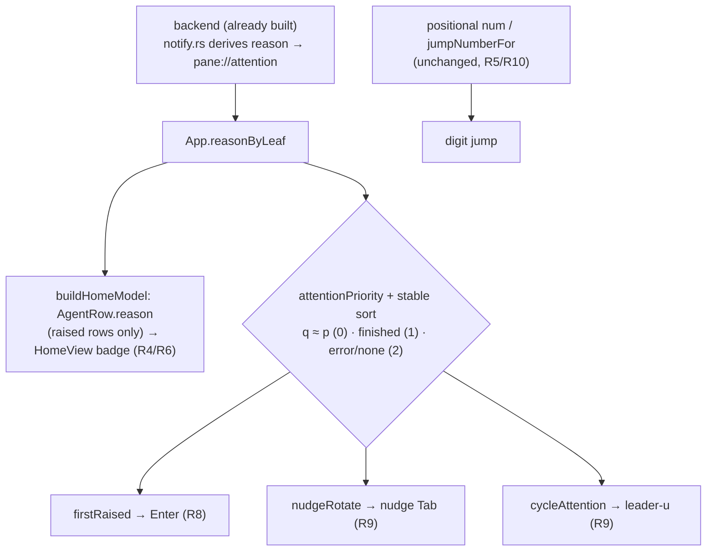

# feat: Reason-typed attention triage

## Summary

Surface *why* each raised agent needs you — question, permission, or finished —
on the dashboard, and order triage by payoff so the fast-unlock reasons (question,
permission) come before the slow-turnaround one (finished). A reason badge lands on
each raised dashboard row, and a shared reason-priority comparator drives the three
selection surfaces (the dashboard's Enter, the nudge's Tab rotation, and the
leader-u cross-pane cycle). Stable jump numbers are untouched. Error stays deferred.

---

## Problem Frame

With 3–5 agents raised at once, the right one to attend to first depends on *why*
each is calling: a question or permission prompt is a few seconds of input that
unblocks the agent, while a finished agent is a longer review-and-hand-off. Today
the dashboard shows *that* an agent needs you but not *why*, and every selection
surface picks the next agent positionally — so you open each raised agent to find
the cheap unlock.

The backend groundwork already landed on this branch: `fly notify` derives the
reason from the Claude Code `Notification` payload (`idle_prompt → Question`,
`permission_prompt → Permission`, `Stop → Finished`), the reason flows end-to-end,
and the frontend already stores it per pane in `reasonByLeaf`. What is missing is
the dashboard surface and the payoff ordering — this plan adds both.

See `origin: docs/brainstorms/2026-07-01-reason-typed-attention-triage-requirements.md`
for the full requirements (R1–R10), flows (F1–F2), and acceptance examples (AE1–AE6).

---

## Requirements

Carried from the origin document. Grouped by concern; see origin for full text.

**Reason detection**

- R1. fly distinguishes three reasons for a raised agent: question (waiting for your input), permission (requesting permission), finished (turn ended / idle).
- R2. The permission-vs-question split derives from the `Notification` payload's `notification_type` (`permission_prompt` → permission, `idle_prompt` → question); `Stop` yields finished.
- R3. Error is not produced in v1; the reasons surfaced are question, permission, finished only. `Reason::Error` stays unfed.

**Reason on the dashboard**

- R4. Each raised agent on the dashboard shows a badge identifying its reason, visually distinct across question, permission, finished.
- R5. An agent's jump number stays fixed to its workspace→tab→pane position and does not change as its reason changes.
- R6. Only raised agents carry a reason badge; non-raised agents show none.

**Payoff-ordered triage**

- R7. Triage priority ranks question and permission (co-equal, fast unlock) ahead of finished; within a tier, order falls back to stable positional order.
- R8. Pressing Enter from the dashboard jumps to the highest-priority raised agent in triage order (updates home-base R7 from positional to payoff order); no-op when none raised.
- R9. Rotation — the nudge's Tab and the leader-u cross-pane cycle — visits raised agents in triage order rather than positional order (updates home-base R12 and the existing cycle behavior).
- R10. A number key still jumps to that agent by its stable number regardless of reason or triage priority.

---

## Key Technical Decisions

- KTD1. **Backend derivation already exists — this plan is frontend-first.**
  `parse_claude_payload` in `src-tauri/src/cli/notify.rs:175-182` already maps
  `notification_type` containing "permission" → `Permission`, "idle"/"input" →
  `Question`, and `Stop`/`SubagentStop` → `Finished`, and the payload reason
  overrides the fixed CLI-arg reason (`notify.rs:76-79`). The reason travels the
  socket → state machine → `pane://attention` → `App.reasonByLeaf` unchanged
  (`src/App.svelte:125-130`, populated in `onAttention` at `:792-806`). So R1/R2
  need no new pipeline code — backend work is a missing test plus a fallback
  decision (KTD5). The derivation was added in commit `faafe266` and only
  restructured (not introduced) by `d18f1d7`, so the brainstorm's premise that
  deriving from `notification_type` "is the change" was already stale at plan
  time; the actual remaining work is the dashboard badge and payoff ordering.

- KTD2. **One shared reason-priority comparator, applied at every ordering surface.**
  A pure `attentionPriority(reason)` maps question and permission to tier 0,
  finished to tier 1, and error/absent to tier 2; a stable sort by that tier turns
  the existing positional order into `(priority, positional)`. The same helper is
  applied at all three selection sites — `firstRaised` (Enter), `nudgeRotate` (nudge
  Tab), and `cycleAttention` (leader-u) — so their ordering cannot drift. JS
  `Array.prototype.sort` is stable (ES2019+), so sorting the positional
  `flattenRaised` output by tier preserves within-tier positional order (the R7
  tie-break) for free.

- KTD3. **Badge reflects effective attention, raised rows only.** The row's reason
  is set only when `effectiveAttention` for that leaf is `raised`, so a stale-ping
  row that has been downgraded to idle shows no badge and no misleading reason (R6).
  Reuse the `REASON_LABEL` convention already in `src/lib/Terminal.svelte:85-90`
  (which renders the per-*pane* reason badge) rather than inventing a second label
  map.

- KTD4. **Stable numbers are untouched.** `num` / `jumpNumberFor` / `agentJumpTarget`
  stay positional (`src/lib/home.ts`); payoff ordering changes only which agent a
  *default* selection (Enter, Tab, leader-u) lands on, never the number→agent
  mapping (R5, R10). The digit-jump path is not modified.

- KTD5. **Keep the current unrecognized-type fallback (Permission).** An absent or
  unrecognized `notification_type` returns `None` from the parser and falls back to
  the installed hook's CLI-arg reason, which for a `Notification` is `Permission`
  (`src-tauri/src/cli/hooks.rs:17-20`). Keep that: an unclassifiable notification is
  closer to "you must act" than a casual question, and question/permission are
  co-equal in triage priority so the tier is unchanged either way. Only add the
  missing `idle_prompt → Question` test.

---

## High-Level Technical Design

One source (`reasonByLeaf`, already fed by the backend) fans out to the badge and,
through the shared comparator, to the three selection surfaces. Stable numbering is
a separate positional path that the feature does not touch.

---

## Implementation Units

### U1. Backend: cover the Question derivation and pin the fallback

- **Goal:** confirm and test that a `Notification` derives question vs permission from the payload, and pin the unrecognized-type fallback.
- **Requirements:** R1, R2, R3.
- **Dependencies:** none.
- **Files:** `src-tauri/src/cli/notify.rs` (`parse_claude_payload` + `mod tests`).
- **Approach:** no behavior change to `parse_claude_payload` — it already derives the three reasons (`notify.rs:175-182`) and the payload reason overrides the CLI arg (`notify.rs:76-79`). Keep the forgiving substring matching (`.contains("permission")`, `.contains("idle") || .contains("input")`) so it survives `notification_type` wording drift across Claude Code versions. Keep the Permission fallback for `None` (KTD5). Add the missing test coverage described below; touch `src-tauri/src/cli/hooks.rs` only if the fallback decision changes (it does not).
- **Patterns to follow:** the existing `mod tests` with direct `parse_claude_payload(...)` assertions (`notify.rs:191-231`), including the `notification_type: "permission_request"` case at `:207-216`.
- **Test scenarios:**
  - Covers R1, R2. `notification_type: "idle_prompt"` → `Reason::Question` (currently untested — the gap this unit closes).
  - Covers R2. `notification_type: "permission_prompt"` → `Reason::Permission` (extends the existing `permission_request` case).
  - Covers R2. `hook_event_name: "Stop"` → `Reason::Finished` regardless of any `notification_type`.
  - Absent / unrecognized `notification_type` → parser returns `None` (so the CLI-arg fallback applies) — documents the KTD5 behavior.
  - Covers R3. No payload input produces `Reason::Error`.
- **Verification:** `cargo test --offline --manifest-path src-tauri/Cargo.toml notify` green; a hand-fed `idle_prompt` payload through `fly notify … --claude` resolves to question.

### U2. Pure reason-priority comparator

- **Goal:** a framework-free comparator that ranks raised agents by reason payoff, ties broken by positional order.
- **Requirements:** R7 (priority model); underpins R8, R9.
- **Dependencies:** none.
- **Files:** `src/lib/workspaces.ts`, `src/lib/workspaces.test.ts`.
- **Approach:** add `attentionPriority(reason: AttentionReason | null): number` → question 0, permission 0, finished 1, error/null 2. Add a stable sort helper (e.g. `sortByAttentionPriority(keys, reasonByLeaf)`) that reorders an already-positional list of leaf keys by `attentionPriority`, relying on stable sort to preserve within-tier positional order (KTD2). Keep `flattenRaised` itself positional and unchanged; the payoff order is a sort applied on top at the call sites (U4), so the positional primitive stays the single ordering source. Export both helpers.
- **Patterns to follow:** the pure, argument-injected helpers in `src/lib/workspaces.ts` (`flattenRaised` at `:135-146`) and `src/lib/home.ts` (`effectiveAttention`); fixture style in `src/lib/workspaces.test.ts:240-248`.
- **Test scenarios:**
  - `attentionPriority`: question === permission < finished < error === null.
  - Sorting a mixed raised list yields questions/permissions first, then finished, then error/null.
  - Covers AE2. Within the top tier (a question and a permission), positional order is preserved — the tie-break.
  - A list already in priority order is unchanged; a reversed list is fully reordered.
  - Empty list → empty; single entry → unchanged.
- **Verification:** `pnpm vitest run src/lib/workspaces.test.ts` green; the module imports no Svelte or DOM APIs.

### U3. Dashboard reason badge

- **Goal:** thread the reason onto raised dashboard rows and render a distinct badge per reason.
- **Requirements:** R4, R6; preserves R5.
- **Dependencies:** none (consumes `App.reasonByLeaf`, which already exists).
- **Files:** `src/lib/home.ts`, `src/lib/home.test.ts`, `src/lib/HomeView.svelte`, `src/App.svelte`.
- **Approach:** add `reason: AttentionReason | null` to `AgentRow`. Give `buildHomeModel` a `reasonByLeaf` param and set `row.reason` only when the row's `effectiveAttention` is `raised`, else `null` (KTD3, R6). Adding the param changes `buildHomeModel`'s arity — update its existing call sites in `home.test.ts` and `App.svelte` in this unit. In `HomeView.svelte`, render a reason chip in the row grid (`:150-176`; grid template at `:448`), shown only when `row.needsAttention`, styled like the existing `.status`/`.num` chips (`:477-513`). Two row-layout decisions: (a) give the badge its own grid column and render an empty placeholder element when `row.reason` is null, mirroring the existing `.num` empty-placeholder idiom, so status/duration/cwd stay column-aligned as agents raise and clear; (b) on raised rows the badge replaces the generic `.status` "waiting" label (redundant with the raised highlight) so a row never reads a contradictory "waiting … finished" — non-raised rows keep their normal status label. Use concise labels sized to the status column (e.g. question / permission / finished), not `Terminal.svelte`'s longer phrases (`REASON_LABEL` is component-local; extract a shared short map or define a dashboard-local one). Pass `reasonByLeaf` into `buildHomeModel` from `App.svelte`. Leave `num` / `jumpNumberFor` / `agentJumpTarget` positional and untouched (R5).
- **Patterns to follow:** `buildHomeModel` / `effectiveAttention` / `AgentRow` in `src/lib/home.ts:29-143`; the row render, chip classes, and the `.num` empty-placeholder idiom for column alignment in `src/lib/HomeView.svelte`; `REASON_LABEL` in `src/lib/Terminal.svelte:85-90` as the label reference.
- **Test scenarios:**
  - Covers R4, R6. `buildHomeModel` sets `row.reason` on raised rows to the effective reason, and leaves it `null` on non-raised rows even when `reasonByLeaf` holds a stale value for that leaf.
  - Covers R5. `num` is unchanged when a row's reason flips (extend the existing "numbers unchanged when attention flips" test at `home.test.ts:200`).
  - A downgraded stale-ping row (effective idle) carries `reason: null` → no badge.
- **Verification:** `pnpm vitest run src/lib/home.test.ts` green; on the dashboard, raised rows show a distinct badge per reason and non-raised rows show none, and columns stay aligned as agents raise and clear.

### U4. Payoff-ordered Enter, nudge Tab, and leader-u cycle

- **Goal:** make the three selection surfaces pick in payoff order via the shared comparator.
- **Requirements:** R7, R8, R9; preserves R10.
- **Dependencies:** U2, U3.
- **Files:** `src/lib/home.ts`, `src/lib/home.test.ts`, `src/App.svelte`.
- **Approach:** (a) `firstRaised` (`home.ts:242-251`) — select the highest-priority raised row using `attentionPriority(row.reason)` with positional tie-break, instead of the first-in-flat-order row; return `null` when none (preserve R8 no-op). (b) `cycleAttention` (`App.svelte:388-399`) — sort the `flattenRaised` result with `sortByAttentionPriority(…, reasonByLeaf)` before computing the current-index-relative next, so leader-u cycles in payoff order. (c) `nudgeRotate` (`App.svelte:1206-1222`) — sort the remaining raised set the same way, focus the first, and keep the dashboard terminus when none remain. Do not touch `agentJumpTarget` / digit handling (R10).
- **Patterns to follow:** `firstRaised` in `src/lib/home.ts:242-251`; `cycleAttention` (`App.svelte:388`) and `nudgeRotate` (`App.svelte:1206`); the U2 comparator; `focusPane` / `homeViewOpen` terminus in `App.svelte`.
- **Test scenarios:**
  - Covers AE1. `firstRaised` with one question and one finished raised → returns the question.
  - Covers AE2. `firstRaised` with a question and a permission raised → returns the positionally-first of the two (co-equal tier).
  - `firstRaised` with only finished agents → returns the (positionally-first) finished agent; with none raised → `null`.
  - Covers AE3 (ordering). The rotation list built for the nudge/leader-u places question/permission before finished (asserted through the U2 comparator; wiring checked live).
  - R10. Digit jump still resolves to the positional agent, unaffected by reason.
- **Verification:** `pnpm vitest run src/lib/home.test.ts` green; live — Enter, the nudge's Tab, and leader-u all land on question/permission before finished, and number keys are unchanged.

---

## Scope Boundaries

**Out of scope (from origin)**

- Error as a produced reason — deferred until there's a trustworthy signal; `Reason::Error` stays unfed (R3).
- The heavier observability layer — per-agent activity timeline, tool-emoji event stream, live pulse chart, and any server/WebSocket storage.
- Enriching the OS desktop notification or tinting the pane ring with the reason — the per-pane `Terminal` badge already exists; the dashboard badge is the surface this plan adds.

**Deferred to Follow-Up Work**

- Aligning `cycleAttention`'s membership set (it reads the raw `attentionByLeaf`) with the `effectiveAttention` set used by the nudge and `firstRaised`. This is a pre-existing divergence flagged by the home-base plan; this plan changes rotation *order*, not membership. Fold it in only if it proves confusing in practice.
- A `docs/solutions/` learnings entry once this lands — the store does not exist yet.

---

## Risks & Dependencies

- **Builds on the home-base branch.** `reasonByLeaf`, `firstRaised`, `nudgeRotate`, and the nudge capture overlay exist on `feat/dashboard-home-base`; this plan extends them rather than adding a pipeline. If any is still in flight, land it first.
- **`notification_type` wording drift.** Claude Code could change the exact type strings; the substring matching tolerates variants, and the new `idle_prompt → Question` test guards the path most likely to silently regress to the Permission fallback.
- **Stable-sort reliance.** The positional tie-break (R7) depends on `Array.prototype.sort` stability — guaranteed in the modern WebKitGTK/Vite target; no polyfill needed.
- **Confirmed behavior change.** Enter, the nudge's Tab, and leader-u change their default landing order from positional to payoff (user-confirmed; updates home-base R7/R12 and the leader-u cycle).

---

## Open Questions

Deferred to implementation — none block starting.

- Unrecognized `notification_type` fallback defaults to Permission (KTD5); revisit only if a common notification lands unclassified and reads wrong.
- Finished→question latency is inherent — `Stop` carries no completion-type field, so a question reads as finished until the later `idle_prompt` arrives (see origin). No action; documented so the badge's brief "finished" flash on a just-asked question isn't mistaken for a bug.
- Badge visual design (color and/or glyph per reason) — pick during U3 implementation, using concise labels (question / permission / finished) and the existing chip styling. The badge-vs-status overlap is resolved in U3 (badge replaces the generic "waiting" on raised rows); revisit only if showing both turns out to be preferable.

---

## Sources & Research

**Origin**

- `docs/brainstorms/2026-07-01-reason-typed-attention-triage-requirements.md`

**Precedent plans**

- `docs/plans/2026-06-30-001-feat-dashboard-home-base-plan.md` — `reasonByLeaf`, `firstRaised`, `nudgeRotate`, the permeable capture overlay, and the positional-numbering invariant this plan preserves.
- `docs/plans/2026-06-19-001-feat-notification-parity-suppression-plan.md` — the attention-pipeline boundary; key on `leafKey`, not `paneId`.
- `docs/plans/2026-06-23-002-feat-dashboard-running-state-plan.md` — the pure `effective*` helpers and "massage the maps with one `now`" convention.

**Key code locations**

- Backend derivation (already built): `src-tauri/src/cli/notify.rs:76-89` (payload override) and `:175-182` (`notification_type` → reason); tests at `:191-231`. Fixed fallback: `src-tauri/src/cli/hooks.rs:17-20`.
- Reason pipeline (reason already end-to-end): `src-tauri/src/hooks/protocol.rs:34-46`, `src-tauri/src/hooks/server.rs:145-155`, `src-tauri/src/lib.rs:230-235`, `src-tauri/src/stream/mod.rs:33-51`, `src-tauri/src/state/attention.rs:15-43`.
- Frontend reason state: `src/ipc.ts:43-52` (`AttentionReason`, `AttentionEvent`), `src/App.svelte:125-130` + `:792-806` (`reasonByLeaf`), `src/lib/Terminal.svelte:85-90` + `:229-233` (per-pane badge + listener).
- Dashboard: `src/lib/home.ts:29-143` (`AgentRow`, `buildHomeModel`, `effectiveAttention`), `:242-251` (`firstRaised`), `:228-236` (`agentJumpTarget`, keep positional); `src/lib/HomeView.svelte:150-176`, `:448`, `:477-513`.
- Ordering surfaces: `src/lib/workspaces.ts:135-146` (`flattenRaised`); `src/App.svelte:388-399` (`cycleAttention`), `:1206-1222` (`nudgeRotate`).
- Tests: `src/lib/home.test.ts` (`firstRaised` at `:213`, num-stability at `:200`), `src/lib/workspaces.test.ts:240-248`.

**External (confirmed during brainstorm)**

- Claude Code hooks guide (`code.claude.com/docs/en/hooks-guide`) — `Notification` carries `notification_type` with `permission_prompt` / `idle_prompt`; `Stop` has no completion-type field.
- Inspiration: `github.com/disler/claude-code-hooks-multi-agent-observability` — the reason-richness (`notification_type` split) is what fly borrows; its central-server architecture is out of scope.
