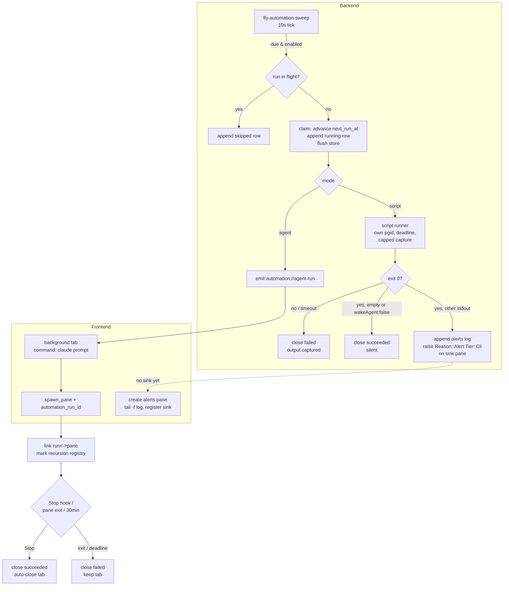
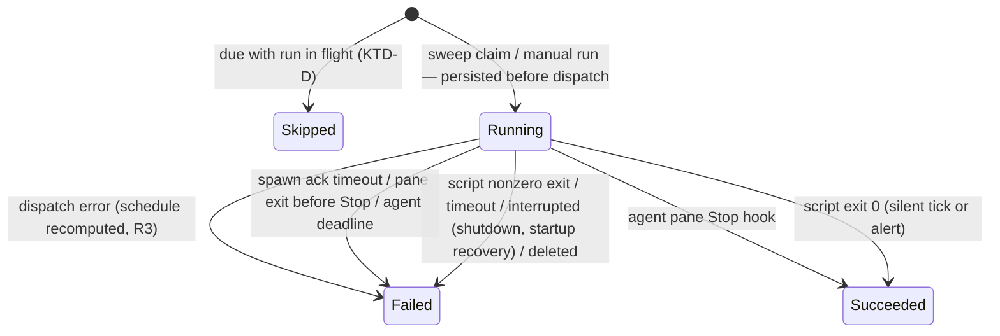

# feat: Automations — scheduled agent and script runs

## Summary

Port bb's automations concept (github.com/ymichael/bb) into fly: cron-scheduled tasks that, when due, either spawn a fresh pane running Claude Code with a stored prompt (**agent** mode) or run a stored script with no model spend (**script** mode). Script runs use bb's silent-tick wake gate — empty stdout or a trailing `{"wakeAgent": false}` line is a silent success; any other stdout is an alert surfaced in a dedicated alerts pane and raised through fly's existing attention/notification pipeline. Scheduling is bb's sweep + persist-before-run claim adapted to fly's single-process desktop shape. Creation is CLI-first (`fly automation …`) over the existing authenticated hook socket, with bb's origin-stamping and no-recursion gate. The dashboard gains a read-only automations panel.

---

## Problem Frame

fly's core loop is reactive: an agent raises attention, the user responds. There is no way to *originate* work on a schedule — "every 15 minutes, tell me if disk crosses 90%" or "at 9am, have an agent summarize overnight CI". bb demonstrates the shape: cheap script watchdogs that stay silent until they have something to say, and scheduled agent prompts, both created by agents themselves. fly already has every substrate this needs — pane spawning with a custom command and cwd (used by resume), an unwired `Tier::Cli` attention tier, an authenticated per-pane-token socket, and a write-through file store pattern — so the port is mostly wiring, not invention.

---

## Requirements

**Scheduling & persistence**

- R1. An automation is a named, per-cwd task with a 5-field cron expression + IANA timezone, an enabled flag, and one of two modes (agent | script). Minimum effective cadence is 5 minutes, enforced by clamping at advance time (`next_run_at = max(cron_next, now + 5min)`), with a best-effort validation warning at create time.
- R2. A sweep loop (~10s tick) claims due automations by advancing `next_run_at`, appending a `running` run row, and flushing to disk **before** dispatching (crash never loses or double-fires a schedule).
- R3. Dispatch failure rolls the schedule back by **recomputing** `next_run_at` from the cron (never restoring the pre-claim value, which could clobber a concurrent edit) and marks the run failed.
- R4. Runs missed while the app was closed or the machine was asleep collapse into at most one run: advancement always computes the next occurrence from `now`.
- R5. On startup, run rows still marked `running` are closed as failed ("interrupted"); on shutdown, in-flight runs are closed the same way. Only **agent** dispatch waits for a frontend-ready signal (agent-run events need a listener); the sweep, startup recovery, and script runs start unconditionally, so a webview that never loads still runs script watchdogs rather than silently disabling every automation.
- R6. The store is an in-memory authority behind a mutex with write-through atomic flush (temp + rename, `0600`/`0700`). A corrupt store file is renamed aside (`.bad.bak`), never overwritten, and the degradation is surfaced in the dashboard and on stderr.
- R7. If an automation is due while it still has a run in flight, the occurrence is skipped and recorded as a `skipped` row (no overlapping runs per automation). "In flight" includes a deadline-failed agent run whose linked pane is still alive (R11) — otherwise a stuck agent would spawn a fresh concurrent pane every cadence.
- R8. Each automation keeps a bounded run history (last 20 runs; stored output capped at an 8 KiB tail).

**Agent runs**

- R9. An agent run spawns a fresh pane running `claude "<prompt>"` in the automation's cwd, in a background tab (no focus or workspace switch), titled with the automation name, placed in the automation's origin workspace (first workspace if it is gone). Origin is the workspace identity resolved and stored at create time, not a raw pane id — pane ids reset to 1 each launch, so a stored pane id would resolve to an unrelated live pane after restart.
- R10. The run↔pane link is made atomically at spawn (run id threaded through `spawn_pane`), and a claim→spawn ack timeout (~30s) fails runs whose spawn never happens. A `spawn_pane` arriving after that timeout (run no longer `Running`) fails the spawn so no ghost pane runs against a closed row.
- R11. An agent run closes: succeeded on the pane's first `Stop` hook event; failed if the pane process exits before any `Stop`, or after a run deadline (30 min) with the pane left alive.
- R12. Panes spawned for automation runs are recorded in a backend registry (feeds R22's recursion gate) and their tabs auto-close on success (kept on failure). Automation-spawned tabs and the alerts pane are excluded from session persistence (they would restore as dead shells).

**Script runs**

- R13. Script children run in their own process group with cwd set, piped stdout+stderr captured up to 64 KiB, and a wait deadline (default 120s, max 900s) escalating SIGHUP → grace → SIGKILL to the whole group. App shutdown kills in-flight script groups.
- R14. Script env is cleared and rebuilt from an allowlist (`PATH`, `HOME`, `USER`, `SHELL`, `LANG`, `LC_ALL`, `LC_CTYPE`, `TERM`) plus `FLY_AUTOMATION_ID` / `FLY_AUTOMATION_RUN_ID`. `FLY_PANE_TOKEN` and `FLY_SOCKET_PATH` are never present. Deliberately narrower than a login shell — notably no `SSH_AUTH_SOCK`: an unattended, potentially silent scheduled script must not inherit the user's live SSH identity by default (per-automation env additions are deferred).
- R15. Wake gate: exit 0 with empty or whitespace-only stdout, or whose last non-empty stdout line parses as `{"wakeAgent": false}`, is a silent success. The sentinel is evaluated on the untruncated capture tail, before the storage cap. stderr-only output is silent success with stderr captured. Any other stdout on exit 0 is an alert. Non-zero exit or timeout is a failed run with output captured.

**Alert surfacing**

- R16. Alerts append one stamped line to an alerts log (`$XDG_DATA_HOME/<app>/automation-alerts.log`, truncated to a tail on startup) and raise attention on a dedicated alerts pane — a real PTY pane running `tail -n 50 -f` on that log — with `Signal { reason: Alert, tier: Cli }` through the normal suppression matrix and `NotificationGate`. The log is created `0600` in the `0700` app-data dir (same as the store, R6 — it holds the same class of captured script output). Every log line (including the automation-name prefix) passes the control-character sanitizer **at write time** — nothing unsanitized ever reaches the log, since `tail` re-renders raw bytes into an escape-interpreting terminal (ANSI/OSC injection: clipboard writes, prompt spoofing). Control-char stripping also removes embedded newlines, so an alert cannot forge a second log entry.
- R17. The alerts pane is created on demand by the frontend (creation single-flighted), registered with the backend, re-created if the user closed it, and its registration clears on pane exit. Alerts arriving with no sink registered are held and flushed once the sink registers.
- R18. A new `Reason::Alert` flows end-to-end: per-reason effects in config, suppression policy, the dashboard triage comparator (ranked below question/permission, above finished), badge, and an OS banner titled with the automation name, sanitized via the existing `notify` sanitizers.

**CLI & security**

- R19. `fly automation create|list|show|runs|pause|resume|run|delete` works inside any fly pane; every command supports `--json`.
- R20. Mutations travel over the existing hook socket, authenticated by the per-pane token, via a backward-compatible protocol extension: an optional op discriminator (`#[serde(default)]` = notify) and a JSON response written only for automation ops. Old `fly notify` clients are unaffected. Server-side invariants: response bytes are written only **after** successful token validation — auth failures and lockouts stay byte-silent (no token/lockout oracle); the response write carries a timeout and concurrent handler threads are bounded (handlers now hold the store lock and write back, so a never-reading peer must not wedge threads). The CLI applies a read timeout; its failure message distinguishes "no response" and notes both that the mutation may still have committed ("run `fly automation list`") and that a silent drop can mean the app predates automations. Reads (`list`/`show`/`runs`) read the store file directly (stale-tolerant) and work without a token.
- R21. Validation errors (cron, timezone, timeout bounds) come back in the socket response with actionable messages.
- R22. Every mutation that could arm or disarm a schedule — `create`, `run`, `pause`, `resume`, `delete` — is rejected from a pane in the automation-spawned registry ("automation-spawned panes cannot manage automations"). Gating only `create`/`run` would let a compromised run silently `pause`/`delete` the user's watchdog automations — a worse capability than the fan-out the gate targets. Every automation records its origin (creating pane id + resolved workspace, `cli` origin label). Two registry invariants are load-bearing: entries are inserted atomically before the child spawns, and they survive automation delete until the pane exits (otherwise create → delete un-gates the still-live pane). The gate assumes pane ids are never reused within a launch (monotonic allocation — the same invariant `hooks/token.rs` relies on); cross-restart origin resolution keys on the stored workspace identity, not the pane id (R9).
- R23. Pause nulls `next_run_at`; resume recomputes it from now (a stale past value must not fire instantly). `run` (manual) is allowed on a paused automation, does not advance the schedule, and respects R7. Delete kills an in-flight script group, unlinks (but does not kill) an in-flight agent pane, closes open rows as failed ("deleted"), and removes stored script content.
- R24. Every successful `create` is user-visible: an OS banner (sanitized automation name + mode) fires regardless of origin. An automation is a persistence primitive — durable scheduled execution that outlives the creating pane and can be configured silent — so its creation must never be silent.

**Dashboard**

- R25. The dashboard shows a read-only automations panel: name, human schedule, paused state, next run, last run status + relative time, last error; refreshed by an `automation://changed` event plus fetch-on-open. Includes the R6 corruption warning row. Rows for automations with a currently-open agent tab (running, or kept-on-failure) carry a jump affordance matching the existing agent-list rows; a never-run automation renders `Never run` in the last-run cell.

---

## Key Technical Decisions

- KTD-A. **Cron engine: `croner` + `chrono-tz`** (new crates). croner parses native 5-field expressions (no seconds-field trap), ships a documented DST contract (spring-forward: interval jobs skip the gap; fall-back: interval jobs fire each duplicated occurrence), and exposes an occurrence iterator for gap sampling. The more popular `cron` crate requires a seconds field and, as of its current release (0.17.0, 2026-06-18), still carries an unreleased fall-back-DST fix (PR #145) and an open spring-forward PR (#150). Occurrence math always uses zoned `chrono_tz::Tz` datetimes — never naive-then-convert. Min-gap validation samples occurrences in local wall-clock time (bb parity: ~256 occurrences / 2-day window) but is advisory; the R1 clamp is the enforcement.
- KTD-B. **Store = in-memory mutex authority with write-through atomic flush**, not `session/resume.rs`-style file read-modify-write. Writers span the sweep thread, per-connection socket threads, the hook dispatch path, and Tauri commands; unsynchronized RMW would lose updates (a claim flush racing a pause drops the pause). The flush reuses the atomic temp+rename shape of `write_session` (`src-tauri/src/session/mod.rs`). Script content lives on disk under `automation-scripts/<id>/`, not in the JSON (bb parity). **Lock discipline:** never dispatch, emit Tauri events, join threads, or write a socket response while holding the store lock — the sweep snapshots and flushes claims under the lock, releases, then dispatches; a CLI handler computes its result and flushes under the lock, releases, then writes the response (otherwise one peer that never reads its reply wedges the single store mutex for the whole write timeout, stalling every sweep tick); shutdown kills/joins script reapers outside the lock, then closes rows; the alerts pending queue drains outside the sink-registry lock before calling dispatch (precedent: `state/manager.rs` drops one lock before taking the next).
- KTD-C. **Scheduling = named `std::thread` sweep (10s), no daemon, no tokio timer** — matches the repo's background-loop precedent (`fly-hook-accept` etc.). Persist-before-run claim (bb's `claimAutomationScheduledRun` adapted: the mutex replaces the SQL compare-and-swap; the disk flush before dispatch supplies crash safety). Advance-from-now collapse covers both app-closed and system-sleep backlogs with one rule.
- KTD-D. **Overlap policy: skip-if-running.** A due automation with a run in flight records a `skipped` row. Without this, a 12-minute agent run on a 5-minute cron fans out concurrent Claude agents fighting in one cwd. Two producers of the `skipped` status: this per-automation overlap check, and the global script-capacity check (U5). Both skip in the sweep's pre-claim phase — they never persist a `running` row and then abandon it, since the run-state machine (U1) has no `Running → Skipped` edge.
- KTD-E. **Agent dispatch rides the resume pane-command mechanism**: backend emits `automation://agent-run`; the frontend creates a background tab whose leaf carries `command: ["claude", "<prompt>"]` + cwd; `Terminal.svelte` mounts and calls `spawn_pane`, which gains an optional `automation_run_id` arg so the backend links run↔pane and marks the recursion registry atomically at spawn — no after-the-fact link call to race a fast exit. Backend cannot spawn UI panes itself (the output `Channel` is frontend-created), so the event/round-trip is required, and the ack timeout (R10) covers a dropped event.
- KTD-F. **Agent-run closure keys on the hook dispatch, not attention outcomes.** Succeeded on the linked pane's first `Stop` event (match the hook event name — `parse_claude_payload` maps `SubagentStop` to `Finished` too, and a debounced or born-acknowledged signal must still close the run); failed on pane exit before `Stop` or at the 30-minute deadline. The pane is never killed by a deadline — only the row closes.
- KTD-G. **Automation panes are ephemeral-by-design**: automation-spawned tabs and the alerts pane are excluded from session save rather than persisting `command` in the session schema. `SavedPane` has no `command` field, so restored panes would come back as dead bare shells; exclusion avoids a schema migration. The agent's Claude session survives independently and stays resumable via the existing resume store.
- KTD-H. **Alert surface = append-only log + `tail -f` pane + `Reason::Alert` at `Tier::Cli`.** A real PTY pane keeps every leaf a Terminal (layout invariant intact) and reuses the attention pipeline untouched. A new `Reason` variant is added rather than overloading `error`/`finished` because reason drives per-reason effects, triage rank, and banner titles — all wrong for alerts otherwise. Three deliberate semantic consequences: (1) `Reason`'s doc contract widens from "what the agent needs from the user" to "why this pane is raised for the user" — automations are the first non-agent producer, and the doc at `src-tauri/src/state/attention.rs` must say so; (2) because `Reason` rides the hook wire format, any pane can now send `reason: "alert"` via `fly notify` — accepted as valid (the socket is per-pane authenticated and panes already control title/body); (3) `Tier::Cli`'s doc updates to "trusted local non-hook signal" — the alert raise is backend-internal, first wiring of the tier (already High confidence). The inline dispatch closure in `lib.rs::run` is extracted into a reusable raise function so automations use the identical path hooks do.
- KTD-I. **Script children get their own process group and group-wide signaling.** Claude Code and shell scripts spawn nested process groups (see the dashboard pgid finding); signaling only the direct child leaks grandchildren. Spawn with `process_group(0)`, signal `-pgid`, escalate SIGHUP → grace → SIGKILL (the `pty/pane.rs` teardown shape), and hook `lifecycle::shutdown` so quitting fly never orphans a script (`notify/command.rs` is the spawn/reap/cap precedent but lacks timeout-kill and pipes stdout to null — the runner extends it).
- KTD-J. **CLI transport = hook-socket protocol extension with per-op responses.** Requests gain an optional op discriminator defaulting to notify (`#[serde(default)]`, the protocol's established compat convention); the server writes a one-line JSON response only for automation ops (notify clients never read, so nothing changes for them). Mutations require the pane token (preserves single-writer discipline through the manager); list-shaped reads go straight to the store file, which atomic rename keeps consistent. This asymmetry — reads anywhere, mutations only inside a fly pane — is documented CLI behavior with a clear error.
- KTD-K. **No-recursion gate = backend registry of automation-spawned pane ids**, checked server-side on `create` and `run` (both start runs). Registry membership is assigned by the backend at spawn (KTD-E), so it cannot be spoofed from the pane side. The alerts sink pane is not in the registry — it is infrastructure a human types into. **Trust framing (what the gate does and does not defend):** the material threat is a prompt-injected agent in an *ordinary* user pane creating a persistent, silent automation — that pane is not in the registry, so the gate cannot stop the first malicious automation; it only prevents fan-out (automations breeding automations). The v1 mitigation for initial arming is R24 visibility (creation always banners). Separately, the socket auth + gate protect only the API path: any same-UID process can write the store file directly, so the automation store is a same-UID trust domain — the gate's guarantees must not be over-read.

---

## High-Level Technical Design

Pipeline (sweep → claim → dispatch → surfaces):



Run-row state machine (pure module; every transition and its producer):



CLI transport (one round-trip per mutation):

```mermaid
sequenceDiagram
    participant P as fly automation (CLI, inside pane)
    participant S as HookServer (unix socket)
    participant M as AutomationManager
    P->>S: JSON { op: "automation/create", token, payload }
    S->>S: token validate + SO_PEERCRED (existing)
    S->>M: create (origin = pane id; recursion gate)
    M->>M: validate cron/tz, persist, emit automation://changed
    M-->>S: result
    S-->>P: one-line JSON response { ok, id | error }
```

---

## Implementation Units

### Phase 1 — Engine (backend only)

### U1. Domain model and run state machine

- **Goal:** Pure types and transitions for automations and run rows — the vocabulary every other unit consumes.
- **Requirements:** R1, R3, R5, R7, R8
- **Dependencies:** none
- **Files:** `src-tauri/src/automations/mod.rs` (module decl), `src-tauri/src/automations/model.rs` (new, inline tests)
- **Approach:** `Automation` (id, name, cron, timezone, enabled, cwd, mode config — `Agent { prompt }` | `Script { script_file, interpreter, timeout_ms }` — origin pane, timestamps, `next_run_at`, embedded bounded run history) and `RunRow` (id, mode, trigger schedule|manual, status, pane id, output, exit code, error, scheduled_for/started/finished). Status enum: `Running | Succeeded | Failed | Skipped` — interrupted/timeout/deleted are `Failed` with distinct error strings (a distinct canceled status is deferred). Transitions as pure functions taking `now_ms`: `claim`, `skip`, `close`, `rollback_recompute` (takes the recomputed next occurrence as an argument — no cron dependency here). Serde camelCase; ids are short unique strings minted by the manager.
- **Execution note:** Test-first, mirroring `state/attention.rs` — the flow analysis showed half the edge cases fall out of enumerating these transitions.
- **Patterns to follow:** `state/attention.rs` + `state/manager.rs` (pure machine, injected clock, behavior-sentence test names citing plan IDs).
- **Test scenarios:** claim on an enabled due automation advances `next_run_at` and appends a running row; claim rejects a disabled automation; skip appends a skipped row without touching `next_run_at`; close(succeeded/failed) sets finished_at and last-status mirrors; rollback recompute overwrites `next_run_at` with the supplied value; history evicts beyond 20 rows oldest-first; stored output truncates to an 8 KiB tail; serde round-trip preserves camelCase field names.
- **Verification:** `cargo test --offline` green on the new module; no I/O or wall-clock reads inside `model.rs`.

### U2. Schedule module (croner + chrono-tz)

- **Goal:** Validate cron + timezone and compute DST-correct next occurrences.
- **Requirements:** R1
- **Dependencies:** none
- **Files:** `src-tauri/src/automations/schedule.rs` (new, inline tests), `src-tauri/Cargo.toml`
- **Approach:** `validate(cron, tz)` — exactly 5 whitespace fields, tz parses as `chrono_tz::Tz`, croner parses, plus an advisory min-gap sample (consecutive occurrences in local wall-clock, ~256 occurrences / 2-day window from a fixed reference instant). `next_occurrence_ms(cron, tz, after_ms)` returns epoch ms. `advance(cron, tz, now_ms)` applies the R1 clamp: `max(next_occurrence, now + 5min)`. All datetime math in zoned `Tz` values.
- **Execution note:** Test-first. New crates: the first `cargo build` resolving them must run with the sandbox disabled (crates.io is blocked in-sandbox); afterwards `--offline` works.
- **Patterns to follow:** pure module with injected `now_ms`; bound all sampling loops (release builds have no overflow checks — never trust arithmetic on parsed input).
- **Test scenarios:** `*/5 * * * *` validates and steps 5 min; `* * * * *` fails the advisory gap check but `advance` still clamps it to ≥5 min; 6-field expression rejected; invalid tz rejected with a message naming the tz; `1,2 * * * *` (1-minute gap once an hour) passes or fails advisory deterministically — documented either way — and is clamped at advance; spring-forward gap (`30 2 * * *` in America/New_York on the skip day) and fall-back duplication produce croner's documented behavior, asserted in tests; clamp: cron next in 30s → advance returns now+5min.
- **Verification:** unit tests green; `Cargo.lock` gains only `croner`, `chrono-tz`, and their subtree.

### U3. Store: mutex authority with write-through flush

- **Goal:** Crash-safe persistence with no lost updates across threads.
- **Requirements:** R6, R8
- **Dependencies:** U1
- **Files:** `src-tauri/src/automations/store.rs` (new, inline tests using `tempfile`)
- **Approach:** `Store` owns `Mutex<BTreeMap<String, Automation>>` plus a `store_health` flag; every mutation happens under the lock and flushes the full document atomically (temp + rename, mode `0600` pre-rename, dir `0700` — extract or mirror the `write_session` helper). Load at startup: corrupt file → rename to `.bad.bak`, start empty, set `store_health` degraded, log to stderr. Script content files under `$XDG_DATA_HOME/<app>/automation-scripts/<id>/script` written on create, removed on delete. Path-taking pure core (`load_at`, `mutate_at`) with default-path wrappers.
- **Patterns to follow:** `session/resume.rs` for the path-taking shape and corrupt-fallback; KTD-B for why RMW is not enough.
- **Test scenarios:** mutation persists and reloads identically; two threads mutating concurrently lose neither update (loop N interleaved mutations, assert final count); corrupt JSON → `.bad.bak` created, empty store, degraded health; delete removes the script file and its directory; flush failure (read-only dir) surfaces an error without poisoning the in-memory state.
- **Verification:** unit tests green including the concurrency test; store file is `0600` in a `0700` dir.

### U4. AutomationManager, sweep loop, recovery, shutdown

- **Goal:** The scheduler: managed state, the sweep thread, claim→dispatch with rollback, startup recovery, and ordered shutdown.
- **Requirements:** R2, R3, R4, R5, R7, R23 (pause/resume/delete semantics)
- **Dependencies:** U1, U2, U3
- **Files:** `src-tauri/src/automations/mod.rs` (manager + sweep, inline tests), `src-tauri/src/lib.rs` (`.manage()`, thread start, frontend-ready command), `src-tauri/src/lifecycle.rs`
- **Approach:** `Arc<AutomationManager>` managed like `PtyManager`; named thread `fly-automation-sweep` ticks 10s. Due = enabled ∧ `next_run_at <= now`; in-flight check → skip row (KTD-D); claim = advance via U2 + running row + flush, then dispatch through an injected `Dispatcher` trait (agent-event emitter / script runner) so sweep logic tests with a fake. Dispatch error → `rollback_recompute` + close failed. Manager API: create (validating via U2), pause (nulls `next_run_at`), resume (recomputes from now), delete (R23 teardown), manual run (ignores schedule advance, respects overlap), list snapshot. Every mutation emits `automation://changed`. Startup: close orphaned running rows failed("interrupted"); defer first sweep until an `automations_frontend_ready` command arrives (App calls it after restore). Shutdown hook in `lifecycle::shutdown` before `pty.close_all()`: stop sweep, kill in-flight script groups (U5 exposes this), close all in-flight rows failed("interrupted").
- **Patterns to follow:** `state/manager.rs` (thin locked shell over pure core), `lifecycle.rs` ordered shutdown doc comments.
- **Test scenarios:** due automation claims exactly once per occurrence (tick twice at same `now`); failing dispatcher → schedule recomputed, row failed, next tick retries; in-flight run → skipped row, schedule still advances; `next_run_at` 3 days past → single claim, next occurrence computed from now (collapse, R4); startup recovery flips running→failed("interrupted"); resume after pause recomputes from now (no instant fire from a stale past value); manual run on paused automation runs without advancing the schedule; manual run during in-flight run is skipped; delete with in-flight agent run closes the row failed("deleted") and leaves the pane registry entry until pane exit.
- **Verification:** unit tests green with a fake dispatcher and fake clock; app builds with the thread started and shutdown ordered before PTY reap.

### U5. Script runner and wake gate

- **Goal:** Execute script-mode runs safely and classify their outcomes.
- **Requirements:** R13, R14, R15
- **Dependencies:** U4
- **Files:** `src-tauri/src/automations/script.rs` (new, inline tests)
- **Approach:** Spawn interpreter + script path via `Command` with `process_group(0)`, cwd from the automation, `env_clear()` + R14 allowlist + `FLY_AUTOMATION_*`. Reader threads drain piped stdout/stderr into 64 KiB-capped buffers (keep the tail on overflow — the sentinel is a trailing line). Wait with deadline (`timeout_ms` clamped to [1s, 900s], default 120s): on expiry signal `-pgid` SIGHUP → 2s grace → SIGKILL, reap on a named thread (never SIGCHLD — GTK owns it). Classify per R15 and close the row via U4; alert outputs hand off to U6 (until U6 lands, alert-classified runs close succeeded with output captured — log-append only). Global in-flight cap (4, `notify/command.rs` precedent) is checked by the sweep **before** claiming: a due script automation at cap records a `skipped("capacity")` row without claiming (KTD-D), never a stranded `running` row. Expose `inflight_count()` for that pre-claim check and `kill_all_inflight()` for the U4 shutdown hook. PATH note: the allowlisted `PATH` is the app process's launch PATH (a GNOME-launcher env), not the interactive shell's — document that a script depending on `nvm`/`pyenv`/`cargo` shims must set them up itself, since it is the classic cron surprise.
- **Patterns to follow:** `notify/command.rs` (spawn/allowlist/reap/cap), `pty/pane.rs::teardown` (signal escalation, reused-pid guard).
- **Test scenarios:** exit 0 + empty stdout → succeeded, silent, output null; whitespace-only stdout → silent; last line `{"wakeAgent": false}` → silent even with earlier output; sentinel mid-output (not last line) → alert; output overflowing 64 KiB with a trailing sentinel → still silent (sentinel read from capture tail before storage cap); exit 3 → failed, exit code recorded, output captured; stderr-only on exit 0 → silent succeeded with stderr captured; timeout: `sh -c 'sleep 100 & sleep 100'` killed within grace, no surviving grandchildren (poll process group); env: script echoing `FLY_PANE_TOKEN`/`FLY_SOCKET_PATH` sees them empty, `FLY_AUTOMATION_RUN_ID` set; nonexistent cwd → failed with a clear error.
- **Verification:** unit tests green (they spawn real `sh` children — keep them fast with sub-second sleeps except the timeout test); no zombie accumulation after the suite.

### Phase 2 — Surfaces

### U11. Ephemeral tabs (session and scrollback exclusion)

- **Goal:** A tab flag that keeps automation-created panes out of persisted state — they would restore as dead bare shells (`SavedPane` has no command field).
- **Requirements:** R12 (exclusion half)
- **Dependencies:** none
- **Files:** `src/lib/workspaces.ts` (+ `workspaces.test.ts`), `src/lib/serialize.ts` (+ `serialize.test.ts`), `src/App.svelte` (skip scrollback save for ephemeral leaves)
- **Approach:** `Tab` gains an `ephemeral` flag (default absent); serialization skips ephemeral tabs; scrollback save skips their leaves so no orphaned scrollback files accumulate (leaf keys key the scrollback files, and the session doc is the only record that would identify them for pruning). Consumed by U6 (alerts pane) and U8 (agent-run tabs) — extracted so the agent path never depends on the script/alert stack.
- **Patterns to follow:** `workspaces.ts` pure model with injected factories; `serialize.ts` versioned shape (no version bump — the flag never serializes).
- **Test scenarios:** ephemeral tab absent from serialized session while sibling tabs persist; old sessions deserialize unaffected; scrollback-save candidate list excludes ephemeral leaves; closing an ephemeral tab behaves like any tab close.
- **Verification:** `pnpm test:unit` green; a manually flagged tab does not reappear after restart and leaves no scrollback file.

### U12. Reason::Alert plumbing

- **Goal:** The `alert` reason exists end-to-end (enum → config → banner subtitle → triage) before anything produces it.
- **Requirements:** R18
- **Dependencies:** none
- **Files:** `src-tauri/src/state/attention.rs` (variant; widen the `Reason` doc contract; `Tier::Cli` doc — KTD-H), `src-tauri/src/config/schema.rs` (per-reason effects entry via the struct-level `#[serde(default)]` convention), `src-tauri/src/notify/mod.rs` (`reason_subtitle` exhaustive match gains the alert arm), `src/lib/workspaces.ts` (`attentionPriority` tier insertion + `workspaces.test.ts`), `src/lib/home.ts` (badge), `src/ipc.ts` (`AttentionReason` union gains `"alert"`), `src/lib/notifications.ts` (reason derivation), tests colocated (`home.test.ts`, `notifications.test.ts`, Rust inline)
- **Approach:** Purely additive, no producer yet. `state/policy.rs` needs no change — `policy::decide` is reason-blind; the per-reason mapping lives in `ReasonEffectsConfig::for_reason` (`config/schema.rs`). The triage comparator to extend is `attentionPriority`/`sortByAttentionPriority` in `src/lib/workspaces.ts` (not `home.ts`, which only consumes it), and the `AttentionReason` string union that must gain `"alert"` is in `src/ipc.ts` (`notifications.ts`'s `REASONS` coercion derives from it — without touching it `pnpm check` fails). Alert ranks below the co-equal question/permission tier and above finished. This unit is deliberately small because it touches code the reason-typed triage plan landed on main today — keep that plan's IDs accurate on shared lines.
- **Patterns to follow:** reason plumbing shape from `docs/plans/2026-07-01-001-feat-reason-typed-attention-triage-plan.md`.
- **Test scenarios:** Rust — `Reason::Alert` serde round-trips as `"alert"`; `reason_subtitle` returns the alert subtitle; a config without the `alert` key loads with all-on defaults; hook-borne `reason: "alert"` parses (KTD-H). Frontend — comparator orders question/permission (co-equal) > alert > finished > none; badge/derivation for alert.
- **Verification:** `cargo test --offline` + `pnpm test:unit` green; existing configs load unchanged.

### U6. Alert surfacing: alerts module and sink pane

- **Goal:** Non-silent script output reaches the user through the attention pipeline.
- **Requirements:** R16, R17
- **Dependencies:** U5, U11, U12
- **Files:** `src-tauri/src/automations/alerts.rs` (new: sanitized log append, startup truncation, sink registry, pending queue), `src-tauri/src/lib.rs` (extract the raise path; wire sink-exit cleanup), `src/App.svelte` (alert-pending listener, sink tab creation), `src/ipc.ts` (sink-register command + event types)
- **Approach:** Backend: pass the log line (`[HH:MM name] first-line…`) through the control-char sanitizer **before** writing to the alerts log (R16; truncate the log to a 64 KiB tail at startup); if a sink pane is registered, raise `Signal { reason: Alert, tier: Cli }` with banner title `Automation: <name>` via `notify::sanitize_title`; otherwise queue and emit `automation://alert-pending`. **Extraction seam:** the reusable function is the raise-surface path *below* the resume upsert inside the `lib.rs` dispatch closure — `raise(pane, signal, title, body)` — with the hook `Dispatch` remaining a thin wrapper (resume capture + reason mapping), so alerts neither fabricate a `ValidatedHook` nor drag resume upserts along. The pending queue drains outside the registry lock (KTD-B). Frontend: single-flight-create a background ephemeral "Automations" tab (U11 flag) running `tail -n 50 -f <log>`, register its pane id; backend flushes pending on registration, clears registration on that pane's exit.
- **Technical design (directional):** sink lifecycle is `Unregistered → Creating (single-flight) → Registered → (pane exit) → Unregistered`, with the pending queue drained on entry to Registered.
- **Patterns to follow:** the `Dispatch` closure in `lib.rs::run` (extract, don't duplicate); `notify::sanitize_title/body` caps.
- **Test scenarios:** Rust — a log line containing ANSI/OSC escapes or embedded newlines is stripped before write (file bytes asserted); alert with no sink queues then flushes exactly once on registration; sink exit clears registration and a later alert re-emits pending; suppression matrix intact (visible sink pane suppresses the banner). Frontend — two rapid alert-pending events create one tab; the sink tab carries the U11 ephemeral flag.
- **Verification:** manual end-to-end: a script automation echoing output rings the alerts pane, shows a banner titled with the automation name, and the line is visible in the pane; a script echoing an OSC-52 clipboard escape shows stripped text — no clipboard write.

### U7. Agent-run dispatch and lifecycle (backend)

- **Goal:** Claimed agent runs become spawned panes with race-free linkage and guaranteed closure.
- **Requirements:** R9 (backend half), R10, R11, R12 (registry)
- **Dependencies:** U4
- **Files:** `src-tauri/src/stream/mod.rs` (optional `automation_run_id` on `spawn_pane`), `src-tauri/src/automations/mod.rs` (agent dispatcher, deadlines, closure), `src-tauri/src/lib.rs` (hook-dispatch tap for Stop; pane-exit tap), `src-tauri/src/hooks/protocol.rs` + `src-tauri/src/hooks/server.rs` (thread a `#[serde(default)] hook_event: Option<String>` through `HookMessage`/`ValidatedHook`), `src-tauri/src/cli/notify.rs` (`parse_claude_payload` captures the event name; `send()` forwards it)
- **Approach:** Dispatcher emits `automation://agent-run { runId, name, prompt, cwd, originWorkspaceHint }`. `spawn_pane` with `automation_run_id`: backend links pane↔run and inserts the pane id into the recursion registry before the child spawns; spawn error closes the run failed. A late `spawn_pane` whose run is no longer `Running` (its ack timeout already fired) fails the spawn — the frontend drops the ephemeral tab — so no ghost pane runs against a closed row. Claim→spawn ack timeout (30s, checked by the sweep tick) fails unacked runs — covers dropped events. **Wire change (KTD-F):** the hook event name never reaches the backend today (`parse_claude_payload` maps `Stop`/`SubagentStop` to `Reason::Finished` before `send()`, and neither `HookMessage` nor `ValidatedHook` carries it), so closure-on-`Stop` requires threading an optional `hook_event` field end-to-end on the `#[serde(default)]` compat convention. Skew rule: a `Finished` hook with `hook_event` absent (older installed `fly notify`) does **not** close the run — it falls through to the 30-min deadline, matching the "hooks not installed" degradation. Closure taps: the hook dispatch path (match `hook_event == "Stop"`, close succeeded on first occurrence, then emit `automation://run-closed` so U8 can retire the tab) and the pane-exit path (close failed if still running). Run deadline 30 min → close failed("timed out"), pane untouched — but the linked pane, while still alive, keeps the automation in-flight for R7 so the next occurrence skips rather than spawning a second concurrent agent.
- **Patterns to follow:** resume's command-injection spawn (the scoped KTD10 exception); `stream::emit_attention` for event emission; `hooks/protocol.rs` `#[serde(default)]` field-addition convention.
- **Test scenarios:** spawn with run id links atomically (registry contains pane before any hook can fire); a `Stop`-event Finished closes succeeded exactly once (second Stop is a no-op); a `SubagentStop`-event Finished does not close the run; a `Finished` with `hook_event` absent does not close the run (falls to deadline); pane exit before Stop closes failed; unacked run fails at 30s; a `spawn_pane` arriving after the ack timeout fails the spawn (no ghost pane); deadline fires at 30 min with pane alive, and the next occurrence records skipped while that pane lives; registry clears on pane exit; delete mid-run unlinks so a later Stop is a no-op.
- **Verification:** unit tests with fake dispatch/clock green; `pnpm check` clean after the `spawn_pane` signature change (frontend wrapper updated in the same commit).

### U8. Agent-run pane creation and retention (frontend)

- **Goal:** Agent runs land as background tabs that don't steal focus and don't accumulate.
- **Requirements:** R9, R12
- **Dependencies:** U7, U11 (ephemeral flag)
- **Files:** `src/App.svelte`, `src/ipc.ts`, `src/lib/workspaces.ts` (+ `workspaces.test.ts`), `src/lib/automation-panes.ts` (new pure helpers + colocated test)
- **Approach:** On `automation://agent-run`: build a tab (title = automation name, leaf command `["claude", prompt]`, cwd seeded before mount) appended to the origin workspace (resolved from the automation record, R9) without changing the active workspace/tab/focus; origin gone → first workspace. Tab flagged ephemeral (U11). On `automation://run-closed { status }`: failed → keep the tab (its attention state guides the user); succeeded → retire per the resolved output-preservation policy. Pure helpers decide placement and retention so vitest covers them without DOM.
- **Execution note:** The succeeded-tab retirement rule is blocked on the "Agent-run output preservation vs auto-close" open question — do not implement bare auto-close-on-success until it is resolved, or the agent's final message is destroyed.
- **Patterns to follow:** resume's tab-spawn flow in `App.svelte`; `workspaces.ts` factories-injected model; never-unmount invariant (background creation must not re-key existing leaves).
- **Test scenarios:** placement picks origin workspace, falls back when missing; creation leaves active workspace/tab/focus untouched; retention closes on succeeded, keeps on failed; run-closed for an already-user-closed tab is a no-op.
- **Verification:** manual: a due agent automation opens a background tab running claude with the prompt; on Stop the tab disappears; user focus never moves.

### Phase 3 — Control and visibility

### U9. CLI subcommand and socket protocol extension

- **Goal:** `fly automation …` end-to-end, with auth, origin stamping, and the recursion gate.
- **Requirements:** R19, R20, R21, R22, R23 (CLI surface), R24
- **Dependencies:** U4 (manager ops); U2 (validation errors)
- **Files:** `src-tauri/src/cli/mod.rs` (subcommand arm), `src-tauri/src/cli/automation.rs` (new), `src-tauri/src/hooks/protocol.rs` (op discriminator + response type), `src-tauri/src/hooks/server.rs` (automation-op dispatch + response write), `src-tauri/tests/automation_cli.rs` (new integration test)
- **Approach:** Protocol: `#[serde(default)] op` (default notify — old clients unaffected); server writes one JSON response line for automation ops only, then closes — and only **after** successful token validation (R20: rejects and lockouts stay byte-silent), with a write timeout and a bound on concurrent handler threads. Mutations (`create`, `pause`, `resume`, `run`, `delete`) require `FLY_PANE_TOKEN`/`FLY_SOCKET_PATH`; client read timeout ~5s with the R20 failure wording (may-have-committed + possible version skew). Reads (`list`, `show`, `runs [--output <runId>]`) load the store file via `app_dir_name()` paths — work in any terminal, stale-tolerant. Create flags: `--name --cron --tz [--cwd] (--prompt | --script <inline> | --script-file <path>) [--interpreter bash|sh|node|python3] [--timeout <ms>]`; `--script-file` is read into content **client-side** before sending (the app never opens a client-supplied path); the interpreter is a closed enum resolved server-side to fixed binary names, never a free-form string (argv-injection guard); cwd defaults to the invoking process cwd; `--json` on every command. Server parse is two-stage — deserialize to `serde_json::Value`, read the defaulted `op`, then parse the op-specific payload — since `HookMessage.reason` is required and a tagged enum cannot default to the notify variant. `runs --output` routes stored output through the same control-char sanitizer as the R16 log write before printing in the default (non-JSON) path — captured stdout is the same untrusted-escape class as an alert line. Server-side: origin = validated pane id + resolved workspace stamped on the record; registry membership rejects `create`/`run`/`pause`/`resume`/`delete` with the R22 message; successful create fires the R24 banner (sanitized name + mode).
- **Patterns to follow:** `cli/notify.rs` (env discovery, graceful degradation), `hooks/protocol.rs` `#[serde(default)]` compat convention, `tests/hook_auth.rs` (real socket + tempdir harness).
- **Test scenarios:** integration — create over the socket with a valid token persists, returns the id, and fires the create banner; invalid token gets **zero response bytes** and the CLI reports the distinct error; legacy notify JSON (no op) still dispatches attention; create from a registry-marked pane returns the R22 rejection; bad cron returns the validation message; `run` from a registry pane rejected; list/show read back what create wrote (via file); `runs --output` prints a failed run's captured output; `runs --output` on a run whose output embeds ANSI/OSC escapes prints them stripped in the default path (raw only under `--json`). Unit — flag parsing (mode exclusivity: prompt XOR script), `--interpreter` rejects any value outside the enum (e.g. `"sh -c x"`), timeout clamp rejection message; two-stage parse: a legacy notify JSON with no `op` still deserializes.
- **Verification:** `cargo test --offline --manifest-path src-tauri/Cargo.toml --test automation_cli` green; manual `fly automation create/list` round-trip inside a dev pane.

### U10. Dashboard panel and docs

- **Goal:** Read-only visibility: what exists, when it runs next, what happened last.
- **Requirements:** R25, R6 (surfacing)
- **Dependencies:** U4; richer with U5–U9 landed
- **Files:** `src/lib/automations.ts` (new pure view model) + `src/lib/automations.test.ts`, `src/lib/HomeView.svelte` (third region), `src/App.svelte` (fetch-on-open + `automation://changed` listener), `src/ipc.ts` (`listAutomations`), `src-tauri/src/automations/mod.rs` (`#[tauri::command] list_automations` returning records + `store_health`), `src-tauri/src/lib.rs` (register), `CLAUDE.md` (module map, commands table, attention-pipeline note for `Reason::Alert`/`Tier::Cli`; fix the stale `state/suppress.rs` reference to `state/policy.rs`)
- **Approach:** View model rows: name, human schedule ("every 5 min · America/New_York" — coarse humanization, cron string as fallback), paused flag, next run relative time, last status + relative time (`Never run` when there is no last run, R25), last error (truncated, pre-sanitized). Sorted next-run ascending, paused last. A row whose automation has a currently-open agent tab (running, or kept-on-failure) exposes a jump target reusing the existing agent-list jump path (`agentJumpTarget`/`onJump`), so a user who sees a failure can reach the very tab R12 preserved. Degraded `store_health` renders a warning row naming the `.bad.bak` path. Panel placement: a stacked region below the agent list in the left column (not a third column squeezing the 300px usage panel); rows are static text with the single jump affordance, not part of the agent list's keyboard-selection model. Data: fetch on dashboard open + refetch on `automation://changed` (CLI mutations reflect while open); no polling timer.
- **Patterns to follow:** `home.ts`/`home.test.ts` (pure view model + presentational `HomeView`); `agentJumpTarget`/`onJump` for the jump affordance; `usage_snapshot` (fetch-on-open + error-as-string).
- **Test scenarios:** ordering (soonest first, paused last); humanization falls back to raw cron for irregular expressions; relative time formatting at boundary values (now, 1 min, 1 day); a never-run automation renders `Never run`; a row with an open tab exposes a jump target, one without does not; degraded health produces the warning row; empty store renders an empty-state hint naming the CLI.
- **Verification:** `pnpm check` + `pnpm test:unit` green; manual: panel lists a created automation, updates on pause/resume from the CLI while open.

---

## System-Wide Impact

- **Attention semantics widen.** `Reason` gains its first non-agent producer (KTD-H): the enum doc contract, the hook wire format (any pane may now send `alert`), and the coalesced banner all shift — the coalesce text ("N agents need attention") counts alert raises too; accept or reword to "N panes" while touching `notify/mod.rs` in U12.
- **Session and scrollback.** Ephemeral tabs (U11) are the only leaves excluded from persistence; they must also skip scrollback save, or leaf-keyed scrollback files accumulate with no session record left to prune them.
- **Socket protocol skew, both directions.** Old `fly notify` → new server: unaffected (defaulted op). New `fly automation` CLI → old app — real under the stable+dev side-by-side setup, where PATH picks the binary: the old server silently rejects the unknown message and the CLI read-times-out; the R20 error text names this case so it is diagnosable.
- **Config compatibility.** The `alert` per-reason effects key loads via the existing struct-level `#[serde(default)]` convention — existing user configs are untouched and default all-on (U12).
- **Sensitive data at rest.** Agent prompts and captured script output (8 KiB tails, 20-run history) persist in the store JSON at `0600`. Keep the mode, never move script bodies into the JSON, and treat captured output as potentially secret-bearing wherever it is surfaced (dashboard truncation + sanitization already apply).

---

## Open Questions

- **Agent-run output preservation vs auto-close (blocks U8).** R12 auto-closes an agent tab on the first `Stop`, but the plan's own example — a 9am agent that summarizes overnight CI — delivers its value *in* that final message, which dies with the pane; the tab captures no output and its scrollback isn't saved (U11). The same rule kills a pane the instant the agent asks a clarifying question (its first turn-ending Stop). Options to resolve before U8: capture the agent's last message onto the run row (needs a source — a transcript read or a hook payload field) and keep it viewable in the dashboard; or keep succeeded tabs open for a grace window; or make auto-close opt-in per automation. Do not implement R12's auto-close until this is decided — it is the one genuinely load-bearing product choice the reviews surfaced.
- **Creation-rate visibility (KTD-K / R24).** The create banner is the sole v1 mitigation for a prompt-injected pane arming a persistent automation, but nothing bounds creation volume, and a burst could coalesce through `NotificationGate` into one easily-dismissed banner. Decide whether create banners bypass coalescing/rate-limiting, and whether a per-pane creation-rate cap is worth v1.
- **5-minute-floor clamp drift (R1 / KTD-C). — RESOLVED (implemented in U2).** For a floor-cadence cron (`*/5 * * * *`) the claim always lands after the boundary, so the `max(cron_next, now+5min)` clamp wins every time and the run phase walks forward by the sweep latency each occurrence (9:00 → 9:05:07 → 9:10:14 …). Nothing breaks, but boundary-aligned expressions show drifting next-run times. **Resolution:** `schedule::advance` snaps to the cron boundary when it is ≥ (now + 5min − `SNAP_EPSILON_MS`), so the effective floor is 4:30 and boundary-aligned crons stop drifting. Consequence to note for any literal reading of R1: the guaranteed minimum delay is 4:30, not 5:00.
- **Alerts pane interactivity (R17 / U6).** The sink is an ordinary PTY pane, so Ctrl-C kills its `tail -f` and the pane goes dead until the next alert re-creates one (leaving a stale husk beside it). Decide whether to signal that the tab is a read-only feed (title marker / in-pane banner) and whether to auto-close a dead sink husk.
- **CLI discoverability (U10 / R19).** The only in-app pointer to `fly automation` is the dashboard panel's empty-state hint. Consider adding an entry to the `HotkeyMenu` cheat-sheet or `CommandPalette` so a user who never opens the dashboard can discover the feature — weighed against automations being agent-created by design.

---

## Acceptance Examples

- AE1. **Silent tick.** Given a script automation whose script exits 0 printing nothing, when it runs, then the run row is succeeded with null output, no pane rings, and no banner shows.
- AE2. **Wake-gate suppression.** Given a script printing diagnostics and a final line `{"wakeAgent": false}`, when it runs and exits 0, then the run is a silent success (AE1 outcome).
- AE3. **Alert.** Given a script printing `Disk at 93%` and exiting 0, when it runs, then the alerts pane exists (created if needed), shows the line, rings with reason alert, and an OS banner titled `Automation: <name>` appears unless suppressed by the policy matrix.
- AE4. **Skip-if-running.** Given a 5-minute agent automation whose previous run is still in flight, when the next occurrence is due, then a skipped row is recorded and no second pane spawns.
- AE5. **Recursion gate.** Given a pane spawned by an agent run, when `fly automation create` or `fly automation run` executes inside it, then the socket response is the R22 rejection and nothing persists.
- AE6. **Collapse.** Given an hourly automation and fly closed (or the machine asleep) for 8 hours, when fly next launches (or wakes past due), then exactly one run fires and `next_run_at` is computed from now.
- AE7. **Unpause safety.** Given an automation paused for a week, when resumed, then `next_run_at` is in the future — no instant catch-up fire.

---

## Scope Boundaries

**In scope:** everything in Requirements; both run modes; CLI + read-only dashboard panel.

### Deferred to Follow-Up Work

- Re-prompting an existing pane (bb's target-thread mode) — v1 is fresh-pane-per-run by decision.
- `fly automation edit` (v1: delete + recreate; loses history, mints a new id — documented).
- Per-automation catch-up flag (skip stale occurrence vs run once) — global collapse-and-run-once for now.
- Distinct `canceled`/`interrupted`/`timed-out` statuses (v1 folds into `failed` with error strings).
- Alerts-log rotation beyond startup tail-truncation.
- CLI mutations from outside a fly pane (would need a non-pane auth story).
- An operator config gate for script runs (bb's `automationsAllowScriptRuns`). Its single-user value is anti-persistence, not multi-tenancy — v1's mitigation for silent persistence is the R24 creation banner; revisit the gate if that proves insufficient.
- Per-automation extra env (e.g. `SSH_AUTH_SOCK`) — dropped from the v1 allowlist as a blast-radius decision (R14).
- Idempotency keys for `create`/`run` (bb has them; v1 relies on the R20 may-have-committed message).
- Excluding automation panes from the resume-store argv capture (verified harmless: `sanitizeFlags` strips the trailing prompt, so crash-resume never re-executes it).
- Name uniqueness (not enforced; id is identity).
- A UI editor for automations (create/edit in the dashboard).

---

## Risks & Dependencies

- **New crates (`croner`, `chrono-tz`).** First build must run outside the Bash sandbox (crates.io blocked); pin versions and verify the DST tests against the shipped release. croner's DST contract is documented but the spring-forward/fall-back tests in U2 are the guard.
- **Extends just-landed triage code.** U12 touches the comparator, badge, and per-reason effects the reason-typed triage plan landed on main today (`src/lib/home.ts`, `config/schema.rs`). U12 is deliberately small and additive; keep that plan's IDs accurate on shared lines.
- **CLI timeout vs server commit desync.** A `create` can commit server-side after the CLI gave up; names are not unique, so a natural retry mints a duplicate schedule. Mitigated by the R20 may-have-committed message; idempotency keys are deferred.
- **Registry-wide token lockout is now user-visible.** 50 bad tokens lock the socket 5s app-wide (existing behavior); during a lockout, automation mutations surface as failed CLI commands instead of silently dropped notifications. Accepted — the R20 distinct error makes it diagnosable.
- **`spawn_pane` signature change (U7).** App-internal only — CLI and app ship in one binary, and the frontend wrapper updates in the same commit; no skew surface.
- **Release builds wrap on overflow** (repo memory): clamp `timeout_ms`, bound occurrence-sampling loops, and treat all store/CLI numeric input as untrusted.
- **Agent-run closure depends on fly's Claude hooks being installed** (`fly hooks setup`). Without them no `Stop` ever arrives and every agent run ends at the 30-minute deadline. The dashboard's failed("timed out") rows make this visible; the CLI create response should warn when the hook config is absent (cheap check of `~/.claude/settings.json`).
- **`claude` binary availability/PATH** for agent runs: spawn failure is a failed run with the shell error captured — acceptable, but worth a clear error string.
- **Store growth.** 20-run history × 8 KiB caps bound the file; the flush rewrites the whole document per mutation — fine at desktop scale (tens of automations), noted as the scaling ceiling.

---

## Sources & Research

- **bb (reference implementation, explored in-session):** `apps/server/src/services/scheduling/automation-sweep.ts` (sweep + claim + rollback), `automation-run.ts` (`isWakeAgentSuppressed`, `mapScriptResultToRun`, run closure), `schedule-helpers.ts` (5-field validation + gap sampling), `packages/db/src/data/automations.ts` (`claimAutomationScheduledRun` transactional claim), `apps/server/src/routes/automations.ts` (`assertNotRecursiveCreation`), `packages/templates/src/templates/bb-guide-automations.md` (the agent-facing contract: silent-tick design, script-vs-agent guidance).
- **fly integration points:** `src-tauri/src/stream/mod.rs` (`spawn_pane`, custom command precedent), `src-tauri/src/state/attention.rs:17` (`Reason`), `src-tauri/src/state/policy.rs` (suppression), `src-tauri/src/notify/` (gate, sanitizers, `command.rs` child-process precedent), `src-tauri/src/hooks/{protocol,server,token}.rs` (socket + compat convention), `src-tauri/src/session/{mod,resume}.rs` (atomic write, write-through store), `src-tauri/src/pty/pane.rs` (signal escalation), `src/lib/workspaces.ts:156` (`attentionPriority`, the triage comparator), `src/ipc.ts:44` (`AttentionReason` union), `src/lib/serialize.ts:8` (`SavedPane` — no command field, motivating KTD-G), `src-tauri/src/pty/mod.rs:101` (`next_id` per-process pane-id allocator, motivating R9's stored-workspace origin).
- **Crate research (2026-07-01):** croner 3.0.1 — native 5-field, documented DST contract, `iter_from` for gap sampling; `cron` 0.17.0 (2026-06-18) requires a seconds field and its fall-back-DST fix (zslayton/cron PR #145, merged 2026-06-21) is unreleased, spring-forward handling open in PR #150; `saffron` abandoned since 2021; `chrono-tz` is the IANA backbone all options use.
- **Flow analysis:** the run↔pane race, overlap policy, store-locking, pgid, tab-retention, and sleep-collapse decisions (KTD-B/D/E/F/G/I, R4/R5/R7/R10/R11/R12) came out of an adversarial flow pass over the draft design; its remaining minor items are recorded under Scope Boundaries.
- **Prior fly plans:** `docs/plans/2026-06-23-001-feat-resume-agents-plan.md` (pane-command injection precedent), `docs/plans/2026-07-01-001-feat-reason-typed-attention-triage-plan.md` (reason plumbing U6 extends).
