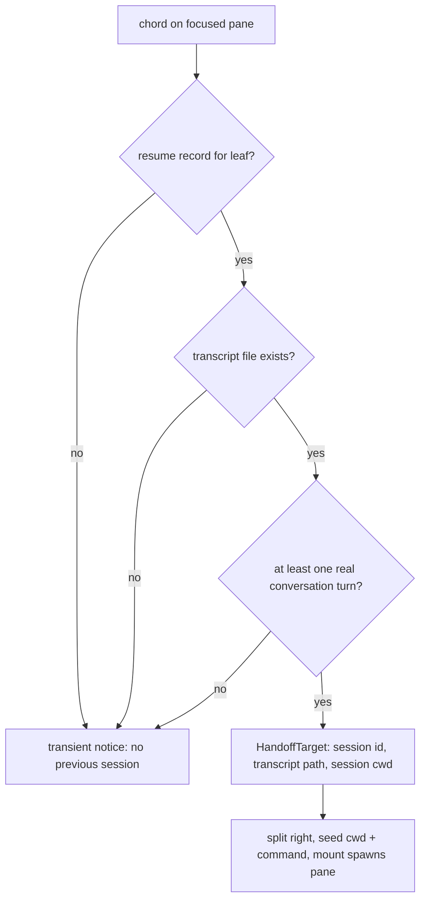
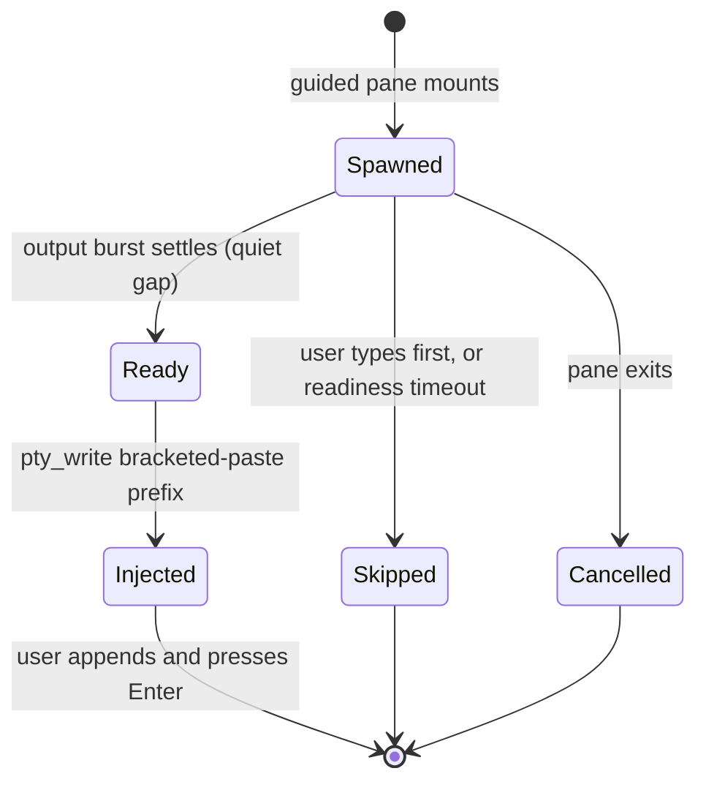

# feat: Session handoff — fresh agent from a stale pane

## Summary

Two new leader chords hand a stale agent pane off to a fresh Claude Code instance in a split alongside. Quick handoff spawns `claude` with a stock pickup prompt (naming the previous session's exact transcript) sent immediately; guided handoff spawns bare `claude` and pre-types the same prompt unsent so the user appends direction and sends it themselves. When no previous session resolves, nothing spawns and a brief notice says why.

---

## Problem Frame

A long-running Claude session accumulates 200k+ tokens of mostly stale context; the outstanding work rarely needs it. Recovering today means manually splitting, launching `claude`, and typing a handoff paragraph on every return-to-desk (see origin: docs/brainstorms/2026-07-02-session-handoff-requirements.md). The origin doc pins the product shape (transcript as source, split alongside, two chords, ordinary panes); this plan pins how to build it.

---

## Requirements

**Trigger and placement**

- R1. Two leader-key actions on the focused pane: quick handoff and guided handoff (origin R1). Proposed keys `f` / `F` (both free); trivially changeable in one `BINDINGS` entry each.
- R2. Both actions appear in the hotkey cheat-sheet and palette with no extra wiring (origin R2) — automatic via `BINDINGS` derivation.
- R3. Either action splits the focused pane to the right, spawns alongside, and moves focus to the new pane; the old pane is not closed, killed, or warned (origin R3).

**Session resolution**

- R4. Resolution happens at chord time from the focused leaf's durable resume record, and works whether the old instance is running or exited hours ago (origin R4).
- R5. A session qualifies only when its resume record exists, its transcript file exists, and the transcript contains at least one real conversation turn — metadata-only transcripts do not qualify.
- R6. When no session qualifies, neither action spawns anything; a transient notice explains why (origin R8).

**Spawn and prompt**

- R7. Quick handoff passes the stock prompt as the trailing positional argv so the fresh instance starts working with no further input (origin R6).
- R8. The stock prompt names the exact transcript path and directs the instance to read its recent portion — not the whole file — determine the outstanding work, and continue (origin R5).
- R9. Guided handoff pre-types the stock prompt into the fresh instance's composer unsent; nothing is sent until the user presses Enter, and typed text appends after the prefix (origin R7).
- R10. Handoff panes launch in the user's default permission mode — no `--dangerously-skip-permissions` — plus read access scoped to the session's transcript directory via `--add-dir`, so the first transcript read needs no approval (origin R9).
- R11. Handoff panes carry no automation linkage: no run id, no recursion-gate registration, no completion deadline, full fly-feature access from inside the pane (origin R10).
- R12. The fresh pane spawns in the session's recorded cwd when present, falling back to the pane's live cwd — the transcript and the worktree the new agent sees stay coherent.

---

## Key Technical Decisions

- **Resolve from the leaf-keyed resume record, backend-derived path, real-turn predicate.** `load_resume_records()` persists `session_id` + `session_cwd` per leaf after exit (`src-tauri/src/session/resume.rs`); the live-only `pane_session_id` has a 15-minute window and fails for exited agents. Transcript-path derivation (`claude_project_dir`, cwd encoding) stays backend-only — a new Tauri command returns the resolved target or `None`. Real-turn qualification reuses `session_last_turn_ms` (`src-tauri/src/session/transcript.rs`), which already distinguishes turns from metadata and uses bounded, checked timestamp arithmetic (release builds run with overflow-checks off). Resolution at chord time, never from a snapshot — session ids rotate on `/clear`. Known limitation, accepted: session capture is cwd-based, so two claude panes in one cwd can mis-attribute; the precise hook-keyed capture fix is follow-up work.
- **Transcript access via `--add-dir`, not permission-mode changes.** Default mode would prompt on the first read of `~/.claude/projects/…` (outside the pane's cwd), breaking "two keystrokes to working." `--add-dir <project dir>` grants narrow read access while leaving the permission mode untouched. Runtime-verify in U4; fallback if it doesn't suppress the prompt: accept one approval and note it in the stock prompt's success criteria.
- **Frontend-orchestrated spawn through a new `handoffCommandByLeaf` seed map.** The backend cannot spawn UI panes (the output channel is frontend-created). Follow the sink-pane precedent: a plain command map with no run id keeps the pane out of the recursion registry by construction. The prompt rides as trailing argv, which the resume capture's `sanitizeFlags` already strips — a restart never re-fires the pickup prompt. `SavedPane` has no command field, so a handoff pane session-restores as an ordinary agent pane via the resume store: conscious acceptance, not an oversight.
- **Guided injection is a pure state machine.** No native Claude Code flag pre-fills the composer (verified against current CLI docs), so guided handoff writes bytes to the PTY via the existing `pty_write` seam after launch. The controller is a pure TS reducer (repo convention: state machines take time/inputs as arguments) with states spawned → ready → injected, and terminal escapes for user-typed-first (skip — the user's intent wins), pane exit (cancel), and readiness timeout (skip; the pane stays a usable bare `claude`). Readiness is an output-quiescence heuristic — first output burst followed by a quiet gap — finalized at implementation. The payload is control-char-sanitized and wrapped in bracketed-paste markers so embedded newlines land in the composer instead of submitting; no trailing carriage return.
- **No concurrency guardrails.** The old agent may still be running (two agents can touch one worktree), double-fire spawns two successors, and a restart loses an un-sent pre-typed prefix. All accepted: handoff panes are ordinary panes, and guardrails here would be scope creep ahead of the staleness-detection fast-follow.

---

## High-Level Technical Design

Chord-time resolution is a short decision chain ending in spawn or notice:

The guided-injection controller (U3), as a state machine:

Diagrams are directional; prose and per-unit approach fields are authoritative.

---

## Implementation Units

### U1. Backend handoff-target resolution command

- **Goal:** A Tauri command resolves the focused leaf's previous session into a spawnable target, or `None`.
- **Requirements:** R4, R5, R12 (feeds R6).
- **Dependencies:** none.
- **Files:** `src-tauri/src/session/handoff.rs` (new; inline `#[cfg(test)]` with `tempfile`), `src-tauri/src/session/mod.rs`, `src-tauri/src/lib.rs` (register in `invoke_handler`), `src/ipc.ts` (typed wrapper + `HandoffTarget` type).
- **Approach:** `resolve_handoff_target(leaf_key) -> Option<HandoffTarget { session_id, transcript_path, session_cwd, last_turn_ms }>`. Read the leaf's `ResumeRecord`; derive the transcript path from `session_cwd` + `session_id` via the existing project-dir/encoding helpers in `session/transcript.rs`; qualify with `session_last_turn_ms`. Serde camelCase (matches the repo's wire-contract convention). No new capture machinery.
- **Execution note:** Test-first — the resolution core is pure/path-taking, matching `transcript.rs` conventions.
- **Test scenarios:**
  - Record with a turnful transcript → `Some` with the exact expected path (assert encoding of `/` and `.` in cwd).
  - No record for the leaf → `None`.
  - Record present, transcript file deleted → `None`.
  - Covers AE3 (origin). Record present, transcript contains only metadata lines (no timestamped turns) → `None`.
  - Record whose `session_cwd` differs from a caller-supplied live cwd → target carries the record's cwd (R12 precedence decided here, applied in U2).
- **Verification:** `cargo test --offline` green; wrapper invocable from the dev build's console path.

### U2. Bindings, quick handoff, and the notice

- **Goal:** Both chords exist end-to-end; quick handoff spawns a working primed pane; failures surface the notice.
- **Requirements:** R1, R2, R3, R6, R7, R8, R10, R11, R12.
- **Dependencies:** U1.
- **Files:** `src/lib/keymap.ts` (two `KeymapActions` members + `BINDINGS` rows), `src/lib/handoff.ts` (new pure module: stock prompt constant, `buildHandoffCommand(target, mode)`), `src/lib/handoff.test.ts`, `src/lib/keymap.test.ts` (chord additions), `src/App.svelte` (handlers, `handoffCommandByLeaf` map + precedence-chain entry, notice generalization).
- **Approach:** Handlers follow the `split()` idiom: capture focused leaf key + pane id synchronously, `await` resolution, then re-check the source still exists and do all seeding + tree mutation in one synchronous block (Terminal reads `cwd`/`command` once at mount). Seed `cwdByLeaf[newKey]` from `target.sessionCwd ?? live cwd` and `handoffCommandByLeaf[newKey]` from `buildHandoffCommand`. Quick argv: `["claude", "--add-dir", <project dir>, <stock prompt>]`; guided argv omits the prompt. Pass `automationRunId: null`. For R6, generalize the existing `resumeNotice` toast into a reusable transient notice rather than adding a new surface.
- **Patterns to follow:** `toggleHome` binding recipe (docs/plans/2026-06-22-002-feat-agent-dashboard-home-plan.md); `handleAgentRun` seeding shape minus `--dangerously-skip-permissions` and run id; `split()` staleness bail (src/App.svelte).
- **Test scenarios:**
  - Covers AE1 (origin). `buildHandoffCommand(target, "quick")` → argv with `--add-dir`, prompt trailing, no permissions-skip flag; prompt string contains the transcript path and the read-recent-portion instruction.
  - `buildHandoffCommand(target, "guided")` → same argv without the trailing prompt.
  - Both new chords are unique in `BINDINGS` (existing uniqueness test extends automatically) and the palette derivation picks them up.
  - Prompt builder rejects/escapes a transcript path containing control characters.
- **Verification:** In the dev build, quick handoff on a pane with an idle prior session opens a split whose first message names the transcript; a bare-shell pane shows the notice and spawns nothing (AE3).

### U3. Guided injection controller

- **Goal:** Guided handoff pre-types the stock prompt unsent, safely, with explicit terminal states.
- **Requirements:** R9 (with R3 focus semantics).
- **Dependencies:** U2.
- **Files:** `src/lib/handoff.ts` (pure reducer + payload builder), `src/lib/handoff.test.ts`, `src/lib/Terminal.svelte` or `src/App.svelte` (wiring: feed output/user-input/exit events; on `inject`, call `ptyWrite`).
- **Approach:** Pure reducer over events `{spawned, output(t), userInput, paneExit, tick(t)}` emitting at most one `inject(payload)`. Readiness: first output observed, then a quiet gap (initial candidate ~400ms, tuned in U4) — capped by an overall timeout (~10s) that resolves to `Skipped`. `userInput` before injection → `Skipped` (never interleave with the user's typing). `paneExit` → `Cancelled`. Payload: sanitized prompt wrapped in `ESC[200~ … ESC[201~`, no trailing `\r`. Focus moves to the new pane immediately (R3); injection lands whenever ready.
- **Execution note:** Test-first — the reducer is pure by construction; wire it only once transitions are pinned.
- **Test scenarios:**
  - Covers AE2 (origin). Output burst then quiet gap → single `inject` whose payload is bracket-wrapped, newline-embedded, CR-free.
  - `userInput` before readiness → `Skipped`, no inject ever (even if quiet gap follows).
  - `paneExit` in every pre-injection state → `Cancelled`, no inject.
  - No output at all until timeout → `Skipped`.
  - Second `output` events after injection → no second inject (idempotent terminal state).
- **Verification:** In the dev build, guided handoff shows the prompt sitting editable in the composer; typing an addition and pressing Enter sends one combined message; killing the pane pre-injection produces no error.

### U4. Stock prompt tuning, runtime verification, docs

- **Goal:** The pickup prompt reliably produces "continue the outstanding work" on real sessions, and the two runtime assumptions are verified.
- **Requirements:** R8, R10; origin success criteria (two-keystroke quick path; pickup without restating context or re-ingesting the full transcript).
- **Dependencies:** U2, U3.
- **Files:** `src/lib/handoff.ts` (prompt constant), `CLAUDE.md` (frontend module-map line for the handoff feature).
- **Approach:** Iterate the prompt on real handoffs from this repo's own sessions. Verify: (a) `--add-dir` suppresses the first-read approval in default mode — if not, fall back per KTD2 and adjust the success-criteria wording; (b) the readiness heuristic's quiet-gap and timeout values against the real Claude Code startup (including a slow first paint).
- **Test scenarios:** Test expectation: none beyond U2/U3's — this unit tunes constants and verifies runtime behavior; enumerated manual checks are its verification.
- **Verification:** AE1–AE3 (origin) pass live in the dev build; a real mostly-finished session hands off with the fresh instance's opening move correctly identifying the outstanding work; quick path is two keystrokes with zero approval prompts (or the documented one-approval fallback).

---

## Scope Boundaries

**Deferred for later** (carried from origin):

- Staleness detection ("this pane is heavy — hand off?") and its click affordance.
- Automated retirement of the old pane.

**Deferred to Follow-Up Work:**

- Resume exclusivity: after a restart, an old pane with no captured session id can imprecise-`--continue` onto the handoff pane's session (two panes, one session). Fix belongs in `src/lib/resume.ts` candidate selection (exclude ids precisely claimed by another leaf). Handoff makes this pre-existing edge more likely but does not cause it.
- Precise per-pane session capture (hook-token-keyed rather than cwd-based) — removes the shared-cwd mis-attribution limitation accepted in KTD1.

**Rejected** (origin): the old session writing a curated handoff note; Claude-native `--resume`/fork/`/compact` as the vehicle.

---

## Risks & Dependencies

- **Composer-readiness heuristic is version-fragile.** Claude Code's TUI startup can change shape. Mitigations: quiescence + timeout degrade to `Skipped` (pane stays usable), and the reducer isolates the heuristic to one tested module.
- **`--add-dir` approval suppression is assumed, not yet observed** in default mode. U4 verifies; the fallback (one approval on first read) is planned wording, not a redesign.
- **Prompt quality is the load-bearing risk** (origin): U4 exists to iterate it against real sessions before the feature is called done.
- **Two agents, one worktree** when handing off a still-running session — accepted posture (KTD5), no guard.

---

## Sources & Research

- Verified seams: `load_resume_records` / `ResumeRecord` (`src-tauri/src/session/resume.rs`); `session_last_turn_ms`, `claude_project_dir`, cwd encoding, `ACTIVE_SESSION_MAX_AGE` (`src-tauri/src/session/transcript.rs`); `pty_write` (`src-tauri/src/pty/mod.rs`); split-and-seed idiom, seed maps, precedence chain, `resumeNotice` toast (`src/App.svelte`); `BINDINGS` → palette/cheat-sheet derivation (`src/lib/keymap.ts`, `src/lib/palette.ts`).
- Prior plans carrying applicable learnings: docs/plans/2026-06-23-003-fix-resume-session-selection-plan.md (mtime lies, `/clear` rotation, encoding traps, bounded timestamp arithmetic); docs/plans/2026-07-01-002-feat-automations-plan.md (frontend-orchestrated spawn, trailing-argv prompt, `sanitizeFlags` restart safety); docs/plans/2026-06-16-001-feat-fly-agent-terminal-plan.md (bracketed paste; write-time sanitization).
- Claude Code CLI (docs current as of 2026-07): `claude "prompt"` starts interactive and submits immediately; no native prefill-without-submit; `--add-dir` grants additional directory access; permission defaults via `--permission-mode` / settings `defaultMode`. PTY-injection behavior (paste handling, composer timing) is undocumented — hence U3's runtime-verified heuristic.
- Free leader keys at plan time: `a e f g i o q s t v y z` lowercase (plus most uppercase variants).
