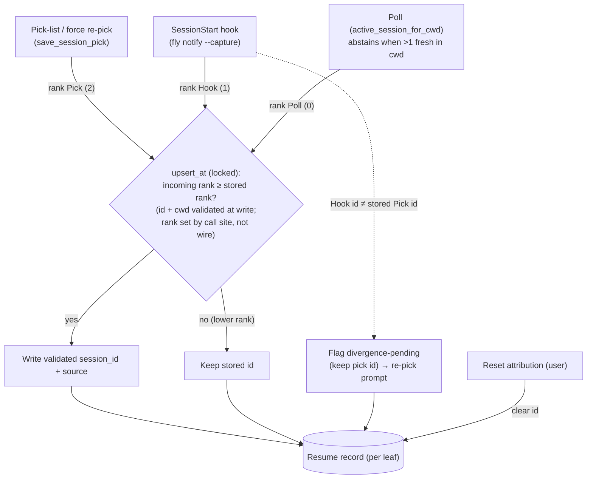
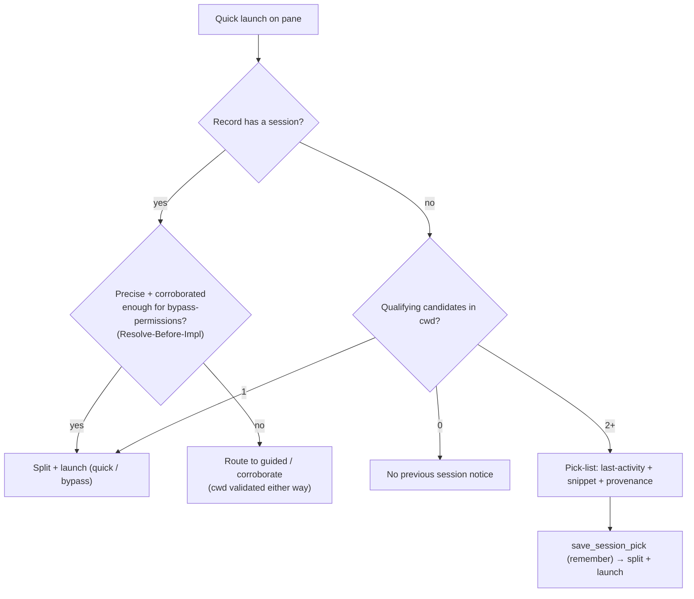

# fix: Distinguish same-cwd Claude sessions in quick launch and resume

## Summary

Attribute each pane's Claude session precisely so quick launch and crash-resume
act on the pane's *own* session, not whichever transcript in the shared working
directory wrote last. Install a capture-only `SessionStart` hook that tags a
session to its exact pane at birth, rank the capture sources by *trust*
(`Poll < Hook < Pick`) so a precise id can't be clobbered by the cwd-level poll —
and a human pick can't be overridden or silently cleared by a forgeable hook —
make the poll abstain when it can't tell two same-cwd sessions apart, and fall
back to a pick-list at launch time when fly still can't be sure. A user-initiated
reset is the escape valve when a stored precise id goes stale.

---

## Problem Frame

A pane's session id is captured by an always-on poll (`active_session_for_cwd`
in `src-tauri/src/session/transcript.rs`) that picks the newest-mtime `.jsonl`
in `~/.claude/projects/<encoded-cwd>/`. That key is the *directory alone* —
nothing pane-specific. Two `claude` sessions in one repo therefore overwrite each
other's per-leaf resume records, and quick launch/handoff resolves whichever
session wrote last. Observed: in pane B with a newer pane A, quick launch picked
up A — silently, no error (see origin).

The `/proc` check during the brainstorm proved post-hoc attribution is
impossible: a running `claude` holds no transcript fd open and exposes no session
id in its environ. The only precise, pane-specific signal is a Claude hook
carrying the id, attributed to the pane by `FLY_PANE_TOKEN`. fly installs only
`Notification`/`Stop` hooks today, which fire far too late to protect an early
launch. `SessionStart` fires at session birth for a plain `claude`, which is the
missing signal — but it arrives over a socket that authenticates the *pane*, not
the honesty of the code running in it, so a captured id is precise only when the
pane's agent is honest. That shapes the trust model below.

---

## Requirements

R1–R13 carried from origin
(`docs/brainstorms/2026-07-03-quick-launch-session-attribution-requirements.md`);
IDs preserved for traceability. R14–R16 are plan-introduced hardening from the
security and architecture review.

**Capture and attribution**

- R1. fly installs a capture-only `SessionStart` Claude hook that reports a
  session's id to its originating pane at session start, attributed by the pane
  token like the existing hooks.
- R2. `SessionStart` capture raises no attention — no ring, no OS notification,
  no notification-history entry. It only updates the pane's resume record.
- R3. Capture is pane-precise: a pane's resume record holds the id of the session
  that pane is running, never a sibling's, even when several live sessions share
  the working directory.
- R4. When more than one live session shares a pane's cwd, the poll captures no
  id for that pane — an ambiguous cwd yields abstention, not a newest-mtime guess.
- R5. A precise capture (hook or remembered pick) is authoritative; the poll never
  overwrites it with a cwd-level guess.

**Disambiguation at launch**

- R6. When quick launch fires on a pane whose session can't be determined with
  confidence, fly presents a pick-list of the cwd's candidate sessions instead of
  launching against a guess.
- R7. Each candidate is identified well enough to recognize — at minimum its
  last-activity time and a recent-turn snippet.
- R8. Selecting a candidate proceeds with handoff exactly as if that session had
  been precisely captured.
- R9. When the pane's cwd holds only one qualifying session, quick launch stays
  zero-prompt — no pick-list appears.
- R10. A pick is remembered: fly binds the chosen session to the pane's leaf and
  it is superseded only by an explicit user action. A hook reporting a divergent
  live id flags the pick for re-pick but never clears or rebinds it (see R14, KTD2).

**Failure and compatibility**

- R11. If no candidate qualifies (no transcript with a real turn in the cwd),
  quick launch shows the existing "no previous session" notice — never an empty
  pick-list.
- R12. On installs that predate the `SessionStart` hook, attribution degrades to
  the ambiguity-aware poll plus the pick-list; fly does not force or nag a
  re-setup.
- R13. Crash-resume resolves each pane to its own session whenever a precise
  (hook or pick) id was captured; a leaf whose stored source is `Poll`/unset and
  whose cwd holds more than one qualifying transcript at resume time is surfaced
  as higher-risk in the resume offer rather than silently resumed into a sibling.

**Robustness and hardening**

- R14. A stranded, mis-attributed, or diverged precise id is always correctable by
  an explicit user action (reset / force re-pick / re-pick prompt); no automatic
  writer trusts an unverified capture to overwrite *or clear* a user decision.
- R15. Both `session_id` and `session_cwd` are validated at write time — id is
  nonempty `[A-Za-z0-9._-]` with no `..`; cwd is an absolute, control-char-free
  path — and an implausible value is not stored. The handoff spawn directory is
  additionally constrained at launch (existing dir, pinned to the pane's live cwd)
  for **both** quick and guided handoff.
- R16. Resume-store writes serialize so the source-precedence read-compare-write
  is atomic; concurrent hook and poll writes never lose a higher-ranked id or
  corrupt the store.

---

## Key Technical Decisions

- KTD1. Capture-only is decided in the running app's dispatch, not by a new
  attention reason. The resume upsert in the `lib.rs` dispatch closure already
  runs before the attention gate; a capture message short-circuits with `return`
  immediately after the upsert, so it never builds a `Signal` — no ring, history,
  or banner. `fly notify --capture` sets an explicit `capture_only` flag; the
  dispatch also treats a `SessionStart` `hook_event` as capture-only, so a stale
  installed `fly notify` that forwards the event but not the flag still can't turn
  session birth into a ring (binary-skew safety). A capture message's `reason` is
  ignored: a message carrying both a raising reason and `capture_only`/`SessionStart`
  raises nothing. The capture return is ordered before the `Stop`-close, an
  accepted self-scoped interaction.

- KTD2. A `session_source` marker ranks captures `Poll < Hook < Pick`, and
  `upsert_at` overwrites the stored `session_id` only when the incoming rank ≥ the
  stored rank. Rank encodes **trust, not just precision**, and is assigned by the
  dispatch call site per code path — a socket hook is always `Hook`, `Poll`/`Pick`
  are reachable only through frontend-only Tauri commands — never read from the
  wire payload, so a client can't self-declare a higher rank. A user's explicit
  pick is the highest authority. A `Hook` id is pane-precise but *forgeable* (it
  authenticates the pane, not the honesty of in-pane code), so it supersedes the
  poll's guess but not a pick. Same-source rotation is allowed (poll→poll;
  hook→hook on `/clear`). A `Hook` that reports a *different* live id than a stored
  `Pick` does **not** clear or rebind it — it flags the leaf **divergence-pending**
  (keeping the pick id) so the handoff UI can prompt "live session differs from
  your pick — re-pick?", and only an explicit user action rebinds. Destructive
  invalidation was rejected: it would let a forged hook clear a pick and let the
  single-candidate launch path (R9) silently redirect a bypass spawn.

- KTD3. The poll abstains rather than guesses when >1 fresh session shares the cwd.
  Post-hoc attribution is impossible, so a guess is unsafe; abstention returns
  `None`, which the frontend's change-tracked capture treats as a no-op, so it
  never overwrites a precise id. Silent-wrong becomes capture-nothing, handing
  disambiguation to the hook or the pick-list.

- KTD4. The pick-list is a focus-taking modal the handoff flow `await`s, modeled
  on the `NotificationPanel` archetype and the `resumeOffer` promise pattern.
  Handoff resolves a single precise target as today; only when that resolve is
  empty *and* candidates exist does it await the picker, re-check split-source
  staleness, then feed the chosen target into the same spawn path. Candidates are
  **all real-turn-qualified transcripts in the cwd**, ordered by recency but not
  gated by the poll's freshness window (KTD7), so an aged-out target stays
  reachable. An ambiguous-launch pick persists as `Pick`; a user **force re-pick**
  is always available so a pane that already resolves stale can still be corrected.
  The target's provenance (picked / hook / poll) is shown so a rebind is never
  invisible.

- KTD5. The `SessionStart` hook installs through the existing hook-install
  machinery. The fly-command marker keys on `fly notify`, so a `--capture` variant
  is still recognized by idempotency/teardown unchanged. An empty matcher captures
  all sources (`startup`/`resume`/`clear`/`compact`), keeping `/clear` rotation
  precise — contingent on U1 confirming a distinct id re-fires on those sources.
  The capture callback rides the same authenticated socket — no new
  unauthenticated route.

- KTD6. Session/transcript data stays defensively parsed and binary-independent.
  The `SessionStart` payload and transcript line shapes are undocumented Claude
  contracts (pin with fixtures, re-verify at implementation); release builds wrap
  on overflow, so any new arithmetic on transcript numbers stays bounded/checked,
  mirroring `iso8601_to_ms`.

- KTD7. Precedence buys correctness (no sibling clobber) by giving up the poll's
  self-healing, and the strand-vs-idle-sibling ambiguity is the plan's own
  impossibility — so no automatic writer can safely correct a stale precise id.
  The escape valve is a user-initiated reset that clears the leaf's id, after
  which resolution returns empty and the pick-list re-captures. Reset is
  **non-lossy**: the pick-list lists every real-turn-qualified transcript in the
  cwd, not just fresh ones, so a true target that has aged out of the recency
  window is still selectable after a reset. This single affordance covers a
  stranded hook, a stale pick, and a diverged pick.

- KTD8. Session data is validated at ingestion, not only at the single read site.
  The basename validator that guards `resolve_in_root` today is applied at every
  write (`upsert_at`, `save_session_pick`) and every producer
  (`list_handoff_candidates`) for `session_id`; `session_cwd` is validated the
  same way at write time (absolute, control-char-free). Separately, the handoff
  spawn cwd is constrained at launch for **both** quick and guided handoff (each
  auto-spawns `claude`, which auto-loads that directory's project config before
  the user reviews anything): it must be an existing dir pinned to the pane's live
  cwd. Guided is not exempt — a divergent `session_cwd` steers the fresh agent's
  working dir and its auto-loaded config regardless of permission mode.

- KTD9. All resume-store writes (`upsert_at`, `save_session_pick`, `prune_at`,
  `retain_at`, and reset) serialize under one lock so the precedence
  read-compare-write is atomic, and each write uses a unique temp filename before
  the rename. Without this the `Pick > Hook > Poll` guarantee is racy — interleaved
  writers can lose-update a higher-ranked id — and `SessionStart`'s per-birth
  capture writes exactly when the poll is noticing the same new session, so shared
  fixed-temp writes can truncate each other into the corruption (`.bad.bak`) path.

---

## High-Level Technical Design

Capture sources feed one per-leaf resume record, gated by trust rank under a lock:

Resolution at quick-launch time:

Capture-only dispatch seam: a `SessionStart` message runs the (locked, validated)
resume upsert, then returns before the attention machine — the same closure the
`Notification`/`Stop` path uses, branched one line earlier.

---

## Implementation Units

### U1. Verify the SessionStart linchpin across all sources

- **Goal:** Confirm empirically, before building on it, that a `SessionStart`
  hook command inherits `FLY_PANE_TOKEN`, and that it re-fires with a usable,
  distinct `session_id` not only at `startup` but on `/clear` and `--resume` —
  the rotation the trust model depends on.
- **Requirements:** R1, R3 (de-risks the whole approach).
- **Dependencies:** none.
- **Files:** none permanent — a throwaway `SessionStart` hook entry in a scratch
  settings file plus a shell probe; capture the observed payloads as fixture notes.
- **Approach:** Install a temporary `SessionStart` command hook that dumps its
  stdin and environment. In one probe pane: start a plain `claude` (expect
  `source: startup`), then `/clear` (expect `source: clear` with a *different*
  id), then `claude --resume` (expect `source: resume`). Verify each dump carries
  `session_id`/`transcript_path`/`cwd`/`hook_event_name` and `FLY_PANE_TOKEN`, and
  that the `/clear` id differs from the startup id.
- **Test expectation:** none — spike. Output is a go/no-go plus the confirmed
  payload field set and rotation behavior that pin later fixtures and gate KTD2
  rotation / KTD5's empty-matcher decision.
- **Verification:** startup, clear, and resume each show the token and fields, and
  `/clear` yields a distinct id. Also confirm the empty/omitted matcher fires for
  all four sources and that a non-zero `fly notify --capture` exit neither blocks
  nor delays session startup. If the token is absent, or `/clear` does not re-fire
  with a distinct id, stop and take the Risks fallback before U7 — do not build
  rotation on an unverified source.

### U2. Capture-only signal through notify → dispatch

- **Goal:** Let a hook message update the resume record without raising attention.
- **Requirements:** R2.
- **Dependencies:** U1.
- **Files:** `src-tauri/src/cli/notify.rs`, `src-tauri/src/hooks/protocol.rs`,
  `src-tauri/src/hooks/server.rs`, `src-tauri/src/lib.rs`,
  `src-tauri/tests/hook_auth.rs`.
- **Approach:** Add a `capture_only` bool (`#[serde(default)]`) to `HookMessage`
  and `ValidatedHook`, set by a new `--capture` flag on `fly notify`. In the
  dispatch closure, after the upsert block, `return` when `capture_only` (or when
  `hook_event` is `SessionStart`) — before any `Signal`. The socket write path
  assigns `session_source = Hook` at the call site; no wire field selects rank.
- **Patterns to follow:** the existing optional `#[serde(default)]` fields on
  `HookMessage` and the resume-upsert-before-attention ordering; `protocol.rs`
  back-compat tests.
- **Test scenarios:**
  - Covers R2. A `capture_only` message upserts the record but emits no
    `pane://attention`, history, or banner.
  - A message carrying both a raising `reason` and `capture_only` (or
    `hook_event: SessionStart`) raises nothing.
  - The socket path writes `session_source = Hook`; no `HookMessage` field can
    select `Pick`/`Poll` rank.
  - A normal `Notification`/`Stop` message still raises as today.
  - Back-compat: JSON without `capture_only` parses (defaults false).
  - Auth unchanged: a capture message with a bad token / wrong peer UID is still
    rejected.
- **Verification:** `cargo test --offline --manifest-path src-tauri/Cargo.toml
  --test hook_auth` passes with the new cases; a capture message leaves attention
  state untouched.

### U3. Trust-ranked, atomic, validated resume-store writes

- **Goal:** Make precise captures authoritative, human picks un-overridable and
  un-clearable by a hook, writes atomic, and both id and cwd validated at ingestion.
- **Requirements:** R3, R5, R10, R15, R16.
- **Dependencies:** none (consumed by U2, U6, U8).
- **Files:** `src-tauri/src/session/resume.rs`, `src-tauri/src/session/handoff.rs`
  (share the validators).
- **Approach:** Add `enum SessionSource { Poll, Hook, Pick }` (serde snake_case),
  a `session_source` field on `ResumeRecord` (camelCase, `#[serde(default)]` →
  `Poll`) and `Option<SessionSource>` on `ResumePartial`. In `upsert_at`: overwrite
  only when incoming rank ≥ stored rank (`Poll`=0, `Hook`=1, `Pick`=2); validate
  the incoming `session_id` and `session_cwd` with the shared validators and drop
  an implausible value; when a `Hook` id differs from a stored `Pick` id, set a
  `divergence_pending` flag on the record but keep the pick id and source
  (non-destructive). Each writer stamps its source at its call site — the dispatch
  hook upsert (`lib.rs`, U2) → `Hook`, `save_resume_session` (poll) → `Poll`,
  `save_session_pick` (pick) → `Pick`; rank is never read from the wire. Wrap all
  store writes in a single mutex (atomic read-compare-write) and give
  `write_records` a unique temp filename. `save_resume_session` /
  `save_session_pick` return the effective stored id + source +
  `divergence_pending` so the pick flow can show the re-pick prompt.
- **Execution note:** Test-first — a lock-guarded field-merge module.
- **Patterns to follow:** the field-merging `upsert_at` and its merge tests; the
  `is_plausible_transcript_basename` guard in `handoff.rs` (now shared).
- **Test scenarios:**
  - Poll-over-poll rotation still succeeds (`sess-A` → `sess-B`).
  - Hook overwrites a poll id; pick overwrites a poll id; pick overwrites a hook id.
  - Hook does not overwrite a pick id; poll does not overwrite a hook or pick id.
  - A Hook id differing from a stored Pick id sets `divergence_pending` and keeps
    the pick id/source (does not clear or rebind).
  - A write whose `session_id` has `/`, `..`, or control chars, or whose
    `session_cwd` is relative/control-char-bearing, stores no value.
  - Interleaved Hook and Poll upserts: the higher rank wins deterministically and
    the store never corrupts (concurrency test under the lock).
  - Back-compat: a store written without `sessionSource` loads as `Poll`.
- **Verification:** all precedence/validation/concurrency scenarios hold; the prior
  `resume.rs` suite still passes.

### U4. Poll abstains on cwd ambiguity

- **Goal:** The always-on capture writes nothing when it can't tell two same-cwd
  sessions apart.
- **Requirements:** R4.
- **Dependencies:** none.
- **Files:** `src-tauri/src/session/transcript.rs`.
- **Approach:** Add a pure `fresh_session_ids(entries, now, max_age) ->
  Vec<String>` beside `active_session_id`, and have `active_session_for_cwd`
  return `None` when it finds more than one. The frontend poll already skips a
  `null` result, so abstention never clobbers a stored id.
- **Execution note:** Test-first — pure over injected `(name, mtime)` entries.
- **Patterns to follow:** `active_session_id`'s recency-window filter and tests.
- **Test scenarios:**
  - Exactly one fresh transcript → `Some(id)` (unchanged single-session behavior).
  - Two fresh transcripts in-window → `None` (abstain).
  - Zero fresh → `None`.
  - One fresh + N stale → `Some(fresh)` (stale siblings ignored, not abstain).
- **Verification:** the pure helper and `active_session_for_cwd` behave per the
  scenarios; existing `active_session_id` tests still pass.

### U5. Candidate listing for the pick-list

- **Goal:** Surface the cwd's qualifying sessions with enough to recognize each,
  including aged-out targets so reset stays non-lossy.
- **Requirements:** R6, R7, R11, R14.
- **Dependencies:** U4.
- **Files:** `src-tauri/src/session/transcript.rs`,
  `src-tauri/src/session/handoff.rs`, `src-tauri/src/lib.rs`, `src/ipc.ts`.
- **Approach:** Add `list_handoff_candidates(leaf_key, live_cwd)` building a
  `Vec<HandoffTarget>` from **all** real-turn-qualified transcripts in the
  record's/live cwd — qualified by `session_last_turn_ms`, ordered by last-activity
  descending, **not** gated by the poll's freshness window — each carrying
  `last_turn_ms` and a short recent-turn snippet. Emit only validated basenames
  (KTD8). Register in `lib.rs` and add the `ipc.ts` wrapper.
- **Patterns to follow:** `resolve_in_root`'s qualify-by-real-turn logic and the
  `HandoffTarget` DTO; `session_last_turn_ms`; bounded reads (KTD6).
- **Test scenarios:**
  - N qualifying transcripts (mix of fresh and aged-out) → N candidates, ordered
    by last-activity descending (an aged-out true target is present).
  - A metadata-only transcript is excluded; an implausible-basename file is excluded.
  - Empty/none-qualifying → empty vec (drives the R11 notice, not a picker).
- **Verification:** candidates match qualifying transcripts, aged-out included,
  with correct stamps and snippets.

### U6. Pick-list UI, handoff interception, remembered pick, divergence prompt

- **Goal:** When launch is ambiguous, let the user pick the right session, remember
  it, see provenance, and be prompted when a hook diverges from a pick.
- **Requirements:** R6, R7, R8, R9, R10, R15.
- **Dependencies:** U3, U5.
- **Files:** `src/lib/SessionPicker.svelte` (new), `src/lib/session-picker.ts`
  (new pure view-model), `src/App.svelte`, `src/lib/handoff.ts`,
  `src-tauri/src/session/resume.rs` (`save_session_pick` writing a `Pick` id),
  `src-tauri/src/lib.rs`, `src/ipc.ts`.
- **Approach:** Model the picker on `NotificationPanel` (focus-taking list,
  ↑↓/Enter/Esc). In `handoff()`, keep the single-target path; when it returns
  `None` but candidates exist, `await` the picker, re-check `splitSourceStale`,
  feed the chosen target into the existing spawn block, persist via
  `save_session_pick`. Constrain the spawn cwd (KTD8) for **both** quick and guided
  — pin to the pane's live cwd, reject a divergent/relative/control-char
  `session_cwd`. When the resolved target's record is `divergence_pending`, surface
  a "live session differs from your pick — re-pick?" prompt before spawning. Leave
  the poll-dedup cache (`resumeSessionByLeaf`) tracking the poll's last-resolved id
  as today — handoff reads backend truth directly via `resolveHandoffTarget`, so
  repointing the cache at the backend id would fire a precedence-rejected write
  every poll tick; the `divergence_pending` signal comes from the resolve/return
  path, not the cache. Show provenance (picked / hook / poll). Keep
  candidate-to-rows mapping in `session-picker.ts`.
- **Patterns to follow:** `NotificationPanel.svelte` focus discipline; the
  `resumeOffer`/`resolveResumeOffer`/`answerResumeOffer` pattern; overlay
  mutual-exclusion; `focusActivePane()` on close; pure view-models.
- **Test scenarios:**
  - Covers AE2. Two candidates, no precise capture → picker lists both; selecting
    one hands it off; a second launch does not re-prompt.
  - Covers R9. One qualifying session, not divergence-pending → no picker.
  - Covers AE4 / R11. Zero qualifying candidates → the existing notice, no picker.
  - Covers R15. A target whose `session_cwd` is relative, control-char-bearing, or
    differs from the live cwd does not spawn there — for guided as well as quick.
  - Covers AE6. A `divergence_pending` leaf surfaces the re-pick prompt before spawn.
  - A precise-id leaf whose live session differs does not churn the store — the
    poll's precedence-rejected write does not repeat every tick.
  - View-model unit: rows render in last-activity order; empty input → empty rows;
    selection index clamps.
- **Verification:** `pnpm vitest run src/lib/session-picker.test.ts` passes; the
  two-session repro resolves to the picked session.

### U7. Install the SessionStart capture hook

- **Goal:** Emit the precise capture at session birth for every pane.
- **Requirements:** R1, R12.
- **Dependencies:** U2, U1 (rotation confirmed).
- **Files:** `src-tauri/src/cli/hooks.rs`, its tests.
- **Approach:** Replace the `&[(&str, Reason)]` event table with a `HookKind`
  (`Attention(Reason)` | `Capture`) so `apply()` emits `notify <reason> --claude`
  for the two attention events and `notify --claude --capture` for `SessionStart`,
  installed with an empty matcher (all sources). Teardown drops the `SessionStart`
  group symmetrically. The `is_fly_command` marker (first two tokens `fly notify`)
  is unchanged, so idempotent re-setup and teardown keep working.
- **Patterns to follow:** the existing `apply`/`teardown`/`backup_once` flow and
  `group_is_fly`; the settings.json back-compat tests.
- **Test scenarios:**
  - Setup installs a `SessionStart` capture group and leaves `Notification`/`Stop`
    intact.
  - Teardown removes the `SessionStart` group and the others, dropping empty arrays.
  - Re-running setup is idempotent.
  - An existing non-fly `SessionStart` hook is preserved.
- **Verification:** `cargo test --offline --manifest-path src-tauri/Cargo.toml
  hooks` passes; `fly hooks setup` then inspecting `~/.claude/settings.json` shows
  the capture group.

### U8. Reset / force-re-pick escape valve

- **Goal:** Make a stranded, stale, or diverged precise id user-correctable, since
  no automatic writer can (KTD7).
- **Requirements:** R14; supports R13.
- **Dependencies:** U3, U5, U6.
- **Files:** `src-tauri/src/session/resume.rs` (a reset command clearing
  `session_id`/`session_source`/`divergence_pending`), `src-tauri/src/lib.rs`,
  `src/ipc.ts`, `src/App.svelte`, `src/lib/handoff.ts`, `src/lib/keymap.ts` (the
  reset binding, shared with the palette and hotkey menu).
- **Approach:** A `reset_pane_attribution(leaf_key)` command clears the leaf's id →
  resolution returns `None` → the next launch drives the pick-list (U5/U6, which
  now includes aged-out targets, so reset is non-lossy). Expose a **force re-pick**
  handoff affordance that runs reset-then-pick even when a stale id currently
  resolves, and wire the `divergence_pending` re-pick prompt (U6) to the same path.
  Trigger surfaces: a new `BINDINGS` action (leader chord) for reset that flows
  through `dispatch()`, the hotkey menu, and the command palette via the shared
  table (so they can't drift), plus a force-re-pick control in the pick-list UI.
- **Test scenarios:**
  - A stranded Hook id (re-fire never arrives) is cleared by reset → next launch
    re-picks.
  - A stale/diverged Pick reaches the picker via force re-pick or the divergence
    prompt.
  - After reset, an aged-out true target is still selectable (via U5's non-fresh
    candidate list).
  - Reset on an unset leaf is a no-op.
- **Verification:** after reset, resolution returns `None`, the pick-list drives the
  next launch, and an aged-out target is reachable.

### U9. Resume-offer risk surfacing for ambiguous imprecise leaves

- **Goal:** At crash-resume, warn on a no-precise-id leaf in an ambiguous cwd
  instead of silently `--continue`-ing it into a sibling (R13/AE5).
- **Requirements:** R13.
- **Dependencies:** U3.
- **Files:** `src/lib/resume.ts` (`resumeOfferBreakdown`/`resumeNoticeText`),
  `src/App.svelte` (resume-offer rendering), backend transcript-count helper if
  needed (`src-tauri/src/session/transcript.rs`).
- **Approach:** Classify a leaf as higher-risk when its stored `session_source` is
  `Poll`/unset **and** its cwd holds more than one qualifying transcript **at
  resume time** — keyed on transcript count, not live freshness (post-crash nothing
  is fresh, so a freshness signal is structurally zero and would never fire).
  Surface such a leaf distinctly in `resumeOfferBreakdown`/`resumeNoticeText`
  rather than the benign "most-recent-in-folder" wording.
- **Execution note:** Test-first for the pure classification in `resume.ts`.
- **Patterns to follow:** the existing `classifyResumeTier`/`resumeStaleVerdict`
  shape in `resume.ts`; pure view-model testing.
- **Test scenarios:**
  - Covers AE5. A `Poll`/unset leaf whose cwd holds >1 qualifying transcript at
    resume → classified higher-risk, distinct offer text.
  - A precise (hook/pick) leaf, or a `Poll` leaf whose cwd holds one transcript →
    unchanged benign path.
- **Verification:** `pnpm vitest run` covers the classification; the resume offer
  shows the higher-risk wording for the ambiguous imprecise case.

---

## System-Wide Impact

- **Crash-resume (R13):** the capture-layer fix (U3, U4) corrects resume when a
  precise id exists. Under R12 degrade with cwd ambiguity there is no precise id,
  so resume falls back to `--continue` (newest-mtime) and could re-attach a
  sibling. U9 classifies such a leaf as higher-risk from stored source rank plus
  transcript count in the cwd at resume time (crash-resume runs at startup when
  nothing is live, so a live-freshness signal would never fire — the count is the
  usable signal).
- **Attention pipeline:** a new capture-only path must never raise. U2's tests are
  the guard.
- **Concurrency:** `SessionStart` adds a per-birth writer to the resume store
  exactly when the poll is active — U3's lock + unique temp filename are the guard
  (KTD9); the store is now written from the hook-connection threads and the poll.
- **Hook socket trust boundary:** capture rides the authenticated socket
  (`src-tauri/src/hooks/CLAUDE.md`); no new route; `capture_only` is parsed after
  token validation; rank is call-site-assigned, not from the wire; `hook_auth`
  re-runs.
- **Handoff spawn cwd:** `session_cwd` reaches the spawn raw today for both quick
  and guided; U6 constrains both (KTD8), and U3 validates it at ingestion.
- **Global hook entry:** `~/.claude/settings.json` is shared across `fly`/`fly-dev`
  and points at whichever binary ran `fly hooks setup` (existing property).

---

## Risks & Dependencies

- **Bypass-permissions handoff trusts the pane's captured id (security).** Quick
  handoff spawns an unattended `--dangerously-skip-permissions` agent against the
  resolved target. A `Hook` id is forgeable by in-pane code. Write-time validation
  (R15), the ingestion cwd check and dual-path spawn-cwd constraint (KTD8), and
  non-destructive divergence (KTD2) bound this; the residual — whether an
  uncorroborated target may authorize the zero-prompt bypass launch — is an Open
  Question (Resolve Before Implementation).
- **SessionStart payload + rotation are undocumented Claude contracts.** Parse
  defensive, pin with U1 fixtures (startup/clear/resume), degrade to "no id" on a
  miss. If `/clear` does not re-fire a distinct id, KTD2 rotation is not viable and
  the pick-list carries more load.
- **Env inheritance is undocumented.** U1 verifies `FLY_PANE_TOKEN` reaches the
  hook command. If it fails, U2/U7 are blocked and the fallback is poll-abstain +
  pick-list alone (U3–U6, U8, U9) — still a real fix.
- **Hook authority is not durable across an old-app write.** `session_source`'s
  `#[serde(default)] = Poll` means an older binary touching the store demotes a
  precise id to `Poll` (a downgrade, or a stale debug build on the same flavor),
  reintroducing the clobber until the next hook re-fire. Acceptable, not durable.
- **Lock contention.** KTD9 serializes all store writes under one lock; a pane
  flooding `fly notify --capture` contends it against every other pane's writes.
  Low impact given store size, but worth watching if capture cadence rises.
- **Mixed-version window.** A newly installed `SessionStart` hook feeding an older
  running app could raise a spurious ring at session start — low severity,
  self-corrects on update, mitigated by the app also gating on the event name.
- **Release overflow-checks off.** New arithmetic on transcript numbers stays
  bounded/`checked_*` (`transcript.rs:193-211`).
- **No git remote / cargo sandbox.** New-crate builds (none expected) need
  `dangerouslyDisableSandbox`; commits land on a branch but can't be pushed.

---

## Open Questions

Resolve before implementation:

- **Bypass-permissions vs provenance.** Should a quick (bypass-permissions,
  unattended) handoff fire against a target that is not corroborated as the pane's
  own session? Note the coupling: in the multi-session case this fix targets, the
  poll *abstains* (R4/KTD3), so a `Hook` capture is **always** uncorroborated
  there — meaning a naive "route uncorroborated to guided" would make AE1's
  zero-prompt path never fire for exactly the target scenario. The two candidate
  resolutions differ sharply in felt experience:
  - *Guided fallback* — every launch on that pane downgrades to a guided (in-loop)
    flow. Permanent friction, and it does not close the cwd-steering hole because
    guided is not permission-gated (KTD8 constrains cwd for guided anyway).
  - *Corroborate-then-remember (recommended)* — a one-time pick-list disambiguation
    persists as a `Pick` (R10), after which future quick launches corroborate and
    stay zero-prompt. Same guard against a forged `Hook`, at a one-time cost rather
    than a standing downgrade.
  Make an explicit call before U6/U7 land — a candidate to take back to
  `ce-brainstorm`.

Deferred to implementation:

- Ambiguity-recency refinement (reinstated from origin): should the poll's
  fresh-count ignore a just-exited sibling so a single live session isn't held
  ambiguous — and resume-degraded — forever?
- Pick-list snippet content — first user turn vs. last turn — and length; and any
  cap on the (now un-freshness-gated) candidate count for a long-lived cwd.
- Capture-only gate — `--capture` flag, `SessionStart` event name, or both (KTD1
  uses both); settle when wiring U2.

---

## Acceptance Examples

- AE1. Covers R3, R9. Pane A and pane B in one repo, A more recently active,
  `SessionStart` has tagged each; quick launch from B hands off B's own session
  with no prompt.
- AE2. Covers R6, R8, R10. Two live sessions share a cwd, neither precisely
  captured; quick launch shows a pick-list of both, picking one hands it off, and
  a second launch from that pane does not re-prompt.
- AE3. Covers R4, R5. Two sessions share a cwd; the poll captures no id for the
  ambiguous leaves and leaves any prior precise id intact.
- AE4. Covers R11. A cwd whose only transcripts are metadata-only; quick launch
  shows the "no previous session" notice, not an empty pick-list.
- AE5. Covers R13. A leaf with a `Poll`/unset source whose cwd holds more than one
  qualifying transcript at resume time is surfaced as higher-risk in the resume
  offer (not silently `--continue`-d into the sibling).
- AE6. Covers R10, R14, KTD2. A forged capture (in-pane, valid token) with a
  crafted `session_id` does not override a remembered pick and does not clear it —
  a divergent `Hook` sets `divergence_pending` and prompts re-pick, so the
  single-candidate launch path can't silently redirect a bypass spawn; the user
  can force re-pick.
- AE7. Covers R15. A capture/pick write whose `session_id` or `session_cwd` is
  malformed stores no value; a handoff — quick or guided — whose `session_cwd`
  diverges from the live cwd does not spawn there.

---

## Sources & Research

- Bug locus and capture chain: `src-tauri/src/session/transcript.rs`
  (`active_session_for_cwd`, `active_session_id`), `src-tauri/src/pty/mod.rs`
  (`pane_session_id`), `src/App.svelte` (`captureResumeSession`), `src/lib/resume.ts`
  (`shouldCaptureSession`, `classifyResumeTier`, `resumeOfferBreakdown`).
- Resume record + merge: `src-tauri/src/session/resume.rs` (`ResumeRecord`,
  `ResumePartial`, `upsert_at`, `write_records` fixed temp name / no mutex).
- Hook capture attributed by token: `src-tauri/src/lib.rs` dispatch closure
  (~L253-295, unlocked `upsert_at`); notify/protocol/server path:
  `src-tauri/src/cli/notify.rs` (`parse_claude_payload`),
  `src-tauri/src/hooks/protocol.rs`, `src-tauri/src/hooks/server.rs`,
  `src-tauri/src/hooks/token.rs` (token binds a message to one pane).
- Hook install: `src-tauri/src/cli/hooks.rs` (`CLAUDE_HOOK_EVENTS`, `apply`,
  `teardown`, `group_is_fly`); socket boundary: `src-tauri/src/hooks/CLAUDE.md`.
- Handoff + spawn: `src-tauri/src/session/handoff.rs`
  (`is_plausible_transcript_basename`, `resolve_in_root`), `src/lib/handoff.ts`
  (bypass-permissions argv; `sessionCwd` → raw spawn cwd for quick and guided),
  `src/App.svelte` (`handoff`, `resumeOffer`, `~L427-465`).
- Overlay archetype: `src/lib/NotificationPanel.svelte`; pure view-models:
  `src/lib/home.ts`, `src/lib/nudge.ts`.
- SessionStart contract (Claude Code docs): fires on plain `claude`
  (`source: startup`) plus `resume`/`clear`/`compact`; delivers `session_id`,
  `transcript_path`, `cwd`, `hook_event_name`; capture-only command (exit 0, no
  JSON) is non-blocking. Env inheritance and per-source rotation undocumented —
  hence U1. `--session-id <uuid>` confirmed (deferred use).
- Review findings folded into this plan — security: forgeable `Hook` must not
  outrank or silently clear a `Pick`; validate id *and* cwd at write time;
  constrain spawn cwd for quick *and* guided; rank is call-site-assigned; serialize
  writes. Architecture: precedence removes self-healing, so reset (non-lossy) is
  the required escape valve; `R13`-for-free overstated. Adversarial: the forged
  divergence-clear → single-candidate → bypass chain; the resume-offer trigger must
  use transcript count at resume, not live freshness; U1 must verify rotation
  sources. Product: guided-fallback would defeat AE1's zero-prompt in the target
  case; corroborate-then-remember preserves it.
- Prior art: `docs/plans/2026-06-23-003-fix-resume-session-selection-plan.md`,
  `docs/plans/2026-07-02-001-feat-session-handoff-plan.md`. Quick handoff now
  launches bypass-permissions (current `CLAUDE.md`), superseding that plan's R10.
- Learnings: release builds wrap on overflow (bound/checked transcript math);
  `~/.claude` is read-only except the settings hook; the settings hook entry is
  global across flavors and rides the installed binary.

---

## Scope Boundaries

Deferred to follow-up work:

- Minting `--session-id` at launch for fly-spawned handoff/automation panes
  (precise by construction; sidesteps the forgeable-`Hook` concern for those panes).
- fly as a first-class agent launcher, and a `claude` PATH shim for hand-typed
  invocations.

Out of scope (rejected in origin):

- Recovering pid→session from process state — proven impossible.
- Newest-mtime as a disambiguator — the bug itself.
