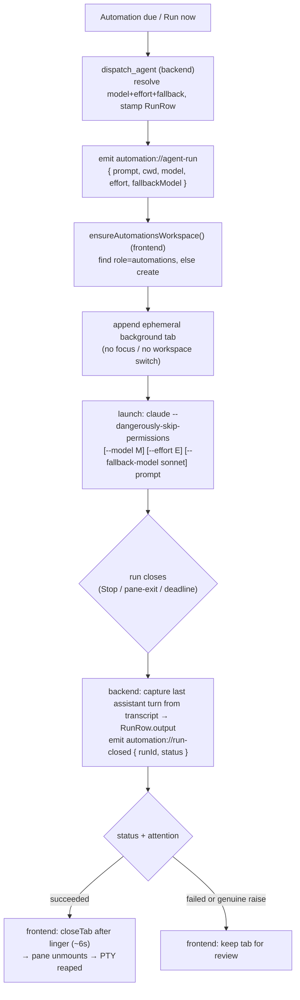

# feat: Automations dedicated workspace + configurable model

## Summary

Two follow-on improvements to the automations subsystem (original U1–U12 shipped),
both scoped to **Agent-mode** runs:

1. **A dedicated Automations workspace.** All automation agent runs — scheduled
   and "Run now" — plus the alerts-log tab open in one persistent workspace
   identified by a **durable role marker** (workspace ids are in-memory only, so
   today's origin-hint placement is effectively random after restart). The
   workspace is auto-provisioned when a run needs it and silently recreated if
   the user deletes it. Successful run tabs auto-close after a brief linger;
   failed or attention-raising runs keep their tab for review — finally resolving
   the auto-close-on-Stop decision the original plan parked.

2. **Per-automation model + reasoning effort.** Each Agent-mode automation can
   pin a `--model` and `--effort`, resolved deterministically
   (automation → shared automations default → Claude Code's own default), always
   passed explicitly so a run never inherits the last interactive pick. A fixed
   `--fallback-model sonnet` degrades unattended over-quota runs. The model and
   effort a run launched with are recorded on the run and shown in the dashboard;
   the agent's final message is captured from its transcript so it survives
   auto-close.

**Origin:** `docs/brainstorms/2026-07-03-automations-workspace-and-model-requirements.md`.
The installed `claude` (v2.1.199) supports `--model`, `--effort <level>`, and
`--fallback-model <model>`, so no flag is speculative.

---

## Problem Frame

Automation agent runs open as background tabs placed in the workspace where each
automation was *created* (its stored `origin.workspace_id`), falling back to
`workspaces[0]` when that origin no longer resolves. Because workspace ids are
in-memory only and reset every launch (`src/lib/workspaces.ts:28-34`,
`src/App.svelte:130-139`), the fallback is the common case after a restart — so
placement feels random, and runs pile into workspaces focused on unrelated work.
The tabs are never removed on their own (`src/App.svelte:577-579`): a finished
run's tab stays until the user closes it or restarts.

Separately, a run launches `["claude", "--dangerously-skip-permissions", prompt]`
with **no model flag** (`src/App.svelte:599-602`), so it inherits whatever model
was last selected in the Claude Code UI. A nightly automation can silently run on
an expensive model, or an important one on a cheap model, with no per-automation
control and no record of which model a run used.

The original automations plan **deliberately refused** to auto-close agent tabs:
its blocking open question was that "the agent's final message dies with the
pane," and agent-run closes still pass `output: None`
(`src-tauri/src/automations/mod.rs:654,669,1104`) — only *script* output is
captured. This plan's auto-close is therefore coupled to capturing the agent's
final message durably (R8), which the transcript-read unit provides.

---

## Requirements Traceability

| ID | Requirement (origin) | Unit(s) |
| --- | --- | --- |
| R1 | Agent runs open in the dedicated Automations workspace | U7 |
| R2 | Workspace identified by a durable marker surviving restart | U6 |
| R3 | Auto-provisioned when needed; recreated if deleted; only one | U7 |
| R4 | Alerts-log tab lives in the Automations workspace | U7 |
| R5 | "Run now" runs land in the Automations workspace too | U7 |
| R6 | Successful run tab auto-closes after a brief linger | U5, U8 |
| R7 | Failed / attention run tab stays open | U5, U8 |
| R8 | Durable history (status, output tail, model, effort) in dashboard | U1, U4b, U9 |
| R9 | Per-automation model (alias or full id) | U1, U2 |
| R10 | Per-automation reasoning effort (low..max) | U1, U2 |
| R11 | Resolved model/effort applied deterministically at launch | U4a, U7 |
| R12 | Resolution order: automation → shared default → Claude default | U3, U4a |
| R13 | Model/effort actually used recorded on the run and shown | U1, U4a, U9 |
| R14 | `create` accepts optional model/effort (edit path deferred) | U2 |
| R15 | Unavailable/over-quota model degrades via fallback | U3, U4a |

Note on R14's "edit path": no field-editing automation command exists today
(`create`/`pause`/`resume`/`run`/`delete` only). Model/effort are settable at
`create`; changing them on an existing automation is deferred (see Scope
Boundaries).

---

## High-Level Technical Design

### Agent-run lifecycle (dispatch → placement → outcome)



### Model / effort / fallback resolution (backend, per dispatch)

Directional — resolved in `dispatch_agent`, not a signature:

```
model   = automation.agent.model  ?? config.automationDefaults.model  ?? None  // None → omit --model (Claude default)
effort  = automation.agent.effort ?? config.automationDefaults.effort ?? None  // None → omit --effort
fallback = config.automationDefaults.fallbackModel ("sonnet")                  // omit when == resolved model
record RunRow.model = model; RunRow.effort = effort                            // R13 (what fly launched with)
```

`--fallback-model` takes a single model, so the brainstorm's "fallback chain"
collapses to primary + one fallback (`sonnet`).

### Durable workspace identity

Workspaces carry no persisted identity today (`SavedWorkspace` persists only
`name`, `tabs`, `activeTabIndex` — `src/lib/serialize.ts:9-31`). The fix is a new
**persisted** `role?: "automations"` field on `Workspace`/`SavedWorkspace`;
resolution matches on `role`, never on the ephemeral `ws-N` id. Absent role on an
older session ⇒ `undefined` ⇒ resolver provisions a fresh Automations workspace.

---

## Key Technical Decisions

- **KTD1 — Durable role marker, resolved by role not id.** Add a persisted
  `role?: "automations"` to `Workspace` and `SavedWorkspace`. All automation
  placement resolves by scanning for `role === "automations"`. This is the single
  fix for the in-memory-id problem (R2); it needs a new serialized field but no
  schema-version bump (absent ⇒ `undefined`, back-compatible).

- **KTD2 — Ordinary, deletable, auto-recreated (no guard).** The Automations
  workspace is a normal workspace named "Automations" — user-deletable, silently
  recreated on the next run. No pin, no delete-guard, no sidebar marking
  (chosen over pinned/protected variants for minimal frontend surface and literal
  fidelity to R3's "recreated if deleted"). Single-instance is enforced by
  resolving-then-creating: create only when no role-marked workspace exists.

- **KTD3 — Model/effort live inside `Mode::Agent`, backend-resolved and
  recorded.** New `model`/`effort` fields go on `Mode::Agent` (agent-only, so
  script mode stays clean) and are recorded on `RunRow`. Resolution happens once
  in the backend `dispatch_agent` (single source of truth co-located with the
  run row and config), and the resolved values ride the `automation://agent-run`
  event; the frontend only appends flags. This avoids a frontend→backend
  round-trip to record "actually used."

- **KTD4 — Fixed `sonnet` fallback via config default.** `--fallback-model` is
  set from `config.automationDefaults.fallbackModel` (default `"sonnet"`,
  overridable), omitted when it equals the resolved primary. Satisfies R15
  without a model-management UI.

- **KTD5 — Auto-close driven by a new `automation://run-closed` event, keyed on
  status not the bare raised bit.** The parked event is finally built: the backend
  emits `{ runId, automationId, status }` after each agent-run close
  (post-store-lock, honoring KTD-B). **Caveat the naive guard misses (feasibility
  review):** the same Claude Code Stop hook that closes a run `succeeded`
  (`lib.rs:288-293`) *also* raises attention on that pane one block earlier
  (`lib.rs:279-282`, unconditional), and the frontend records it in
  `attentionByLeaf` (`App.svelte:1012-1020`); a background automation pane is never
  focused, so a successful run is *always* left raised — a `succeeded && !isRaised`
  guard would therefore never auto-close. Resolution: **suppress the
  completion-attention-raise for automation-linked agent panes** (a background,
  unattended run should not ring the triage UI on normal completion — the
  dashboard is its status surface), then auto-close on `status === "succeeded"`
  after a ~6s linger and keep on `failed`. With the completion raise suppressed,
  any *remaining* unacknowledged raise is a genuine mid-run signal (a real
  `Notification`/`Alert` reason) and still keeps the tab, honoring R7.

- **KTD6 — R8 output = last assistant turn from the transcript, not raw PTY.**
  On close, resolve the run's Claude transcript and extract the final assistant
  message into `RunRow.output` (capped by the existing `output_tail`). Reuses
  `src-tauri/src/session/transcript.rs`. Raw PTY capture was rejected: `claude`
  is a full-screen TUI, so an 8 KiB byte tail is ANSI/redraw noise. This is the
  enabler that makes auto-close safe (the original plan's blocker).

- **KTD7 — Auto-close removes the leaf (reaps the child), preserving the
  never-unmount invariant.** `closeTab` drops the tab from `workspaces`, so
  `allPanes` no longer renders its leaf and `<Terminal>.onDestroy` calls
  `closePane` (kills + reaps the PTY child — `src/lib/Terminal.svelte:363-374`).
  Auto-close must *remove* a leaf, never re-key existing leaves.

- **KTD8 — Config is read outside the store lock; resolution + stamp live in the
  manager.** Backend resolution needs `Config`; inject the `ConfigStore`
  (`RwLock<Config>`) into the `AutomationManager` and read it during off-lock
  dispatch orchestration. **The `AgentDispatcher` holds only an `AppHandle` and a
  cloned `Automation` (`mod.rs:889`), so it cannot persist the run row** —
  resolution and the `RunRow` model/effort stamp happen manager-side (mirroring
  `set_run_pane`), then the resolved values are passed into `dispatch_agent`. Never
  take the config read while holding the automations store lock (store →
  nothing-else ordering, KTD-B).

---

## Implementation Units

Grouped into four phases. Backend data + config first (nothing else compiles
without the model fields), then backend dispatch/close/events, then the frontend
workspace + lifecycle, then dashboard + docs.

### Phase A — Backend data model & config

#### U1. Model/effort on `Mode::Agent` and `RunRow` (wire contract)

- **Goal:** Extend the single serde wire contract so an automation can carry a
  pinned model/effort and a run can record the model/effort it launched with.
- **Requirements:** R8 (record), R9, R10, R13.
- **Dependencies:** none.
- **Files:** `src-tauri/src/automations/model.rs` (Mode::Agent, RunRow, tests),
  `src-tauri/src/automations/mod.rs` (`CreateMode::Agent`, `CreateSpec` — lines
  208-235), `src/ipc.ts` (`AutomationSpec` ~189-191, `RunRow` ~172-186,
  `Automation` mirror).
- **Approach:** Add `model: Option<String>` and `effort: Option<String>` to
  `Mode::Agent` with `#[serde(default)]` (the `Mode` enum has no container
  default, so each new field needs its own). Add the same two fields to `RunRow`
  with `#[serde(default)]`. Thread them through `CreateMode::Agent` /
  `CreateSpec`. Mirror the optional fields in the TS types. Keep camelCase.
- **Patterns to follow:** the existing camelCase round-trip test
  (`model.rs:687-739`); `RunRow`'s existing optional fields (`pane_id`, `output`).
- **Test scenarios:**
  - Covers R9/R10. A `Mode::Agent { prompt, model: Some("opus"), effort:
    Some("high") }` serde round-trips preserving `model`/`effort` (camelCase).
  - Back-compat: legacy JSON for `Mode::Agent` with only `{ kind, prompt }`
    deserializes with `model: None, effort: None`.
  - Back-compat: a legacy `RunRow` JSON without `model`/`effort` deserializes to
    `None` for both (no error).
  - A `RunRow` with `model`/`effort` set round-trips (camelCase `model`,
    `effort`).
- **Verification:** `cargo test --offline` model round-trip + back-compat green;
  `pnpm check` clean with the new optional TS fields.

#### U2. CLI `--model` / `--effort` on `create`

- **Goal:** `fly automation create` accepts optional `--model` and `--effort`,
  carried over the socket into `Mode::Agent`.
- **Requirements:** R9, R10, R14.
- **Dependencies:** U1.
- **Files:** `src-tauri/src/cli/automation.rs` (`handle_create` 206-339,
  `AutomationRequest` 35-59, `--help` text), `src-tauri/src/lib.rs`
  (`automation/create` arm 622-655).
- **Approach:** Parse `--model <str>` and `--effort <level>`; validate `effort` ∈
  `{low, medium, high, xhigh, max}` (reject others, exit 2). Add optional
  `model`/`effort` to `AutomationRequest`. In the create arm, thread them into
  `CreateMode::Agent { prompt, model, effort }`. Reject `--model`/`--effort`
  combined with `--script` (agent-only; exit 2). No validation of the model
  string itself (aliases and full ids both pass through to `claude`).
- **Patterns to follow:** the existing flag-parse arms and mutual-exclusion
  checks in `handle_create`; `send_and_report`.
- **Test scenarios (integration `src-tauri/tests/automation_cli.rs`):**
  - `create --prompt … --model opus --effort high` persists `model`/`effort` on
    the stored `Mode::Agent` (round-trip via the store file).
  - `create --prompt … ` without the flags stores `model: None, effort: None`.
  - `create … --effort bogus` exits 2 with a validation message; store unchanged.
  - `create --script … --model opus` exits 2 (agent-only).
- **Verification:** integration tests green; `fly automation create --help` lists
  the two flags.

#### U3. Shared automations default in fly config

- **Goal:** A shared default model/effort + a configurable fallback model live in
  fly's own config.
- **Requirements:** R12, R15.
- **Dependencies:** none.
- **Files:** `src-tauri/src/config/schema.rs` (Config 78-119, `impl Default`
  121-142, tests), `src/lib/config.ts` (Config 21-43).
- **Approach:** Add a nested `automation_defaults: AutomationDefaults` struct with
  `model: Option<String>`, `effort: Option<String>`, `fallback_model: String`.
  Apply the nested-struct serde gotcha: `#[serde(default)]` on **both** the parent
  field and the `AutomationDefaults` struct, or a partial nested object drops
  sibling fields (documented at `schema.rs:33-49`). Default: `model: None,
  effort: None, fallback_model: "sonnet"`. Mirror in `config.ts` as
  `automationDefaults: { model: string | null; effort: string | null;
  fallbackModel: string }`.
- **Patterns to follow:** the `reason_effects: ReasonEffectsConfig` nested-config
  precedent; the `font_size` default recipe.
- **Test scenarios (`config/schema.rs` inline):**
  - An empty `{}` config loads with `automationDefaults.fallbackModel == "sonnet"`
    and `model`/`effort` `None`.
  - A partial nested object `{"automationDefaults":{"model":"opus"}}` keeps
    `fallbackModel == "sonnet"` (sibling default retained — the gotcha).
  - Full round-trip preserves camelCase `automationDefaults`/`fallbackModel`.
- **Verification:** `cargo test --offline` config tests green; `pnpm check` clean.

### Phase B — Backend dispatch, close & events

#### U4a. Deterministic resolution + record + event payload

- **Goal:** At dispatch, resolve model/effort/fallback deterministically, record
  them on the run, and carry them to the frontend.
- **Requirements:** R11, R12, R13, R15.
- **Dependencies:** U1, U3.
- **Files:** `src-tauri/src/automations/mod.rs` (`AutomationManager` dispatch
  orchestration + a `set_run_launch`-style store mutation mirroring `set_run_pane`;
  the `AgentDispatcher` / `Dispatcher` trait signature + `AgentRunEvent` 170-179; a
  pure resolver + tests), `src-tauri/src/lib.rs` (inject `Arc<ConfigStore>` into the
  manager), `src/ipc.ts` (`AgentRunEvent` 103-111).
- **Approach:** Add a pure `resolve_agent_launch(agent_model, agent_effort,
  defaults) -> ResolvedLaunch { model: Option, effort: Option, fallback:
  Option }` implementing the resolution sketch above (fallback omitted when equal
  to the resolved model). **Resolve + stamp in the manager's off-lock dispatch
  orchestration (sweep phase 2 / `manual_run` phase 2), NOT in `dispatch_agent`
  (feasibility review):** `AgentDispatcher` holds only an `AppHandle` and receives
  a *cloned* `Automation`, so it cannot mutate the persisted run row. Inject
  `Arc<ConfigStore>` into the `AutomationManager`; resolve there (off the store
  lock, KTD8); stamp `RunRow.model`/`RunRow.effort` via a small store mutation
  mirroring `set_run_pane` (R13); then pass the resolved model/effort/fallback into
  `dispatch_agent` (a `Dispatcher`-trait signature change) so they ride the
  `AgentRunEvent`. Extend `AgentRunEvent` with `model`/`effort`/`fallback_model`
  (Rust snake_case fields; serialized `fallbackModel` on the wire) and the TS
  mirror.
- **Patterns to follow:** the existing `AgentRunEvent` emission and camelCase
  serde; `ConfigStore`'s `RwLock` read.
- **Test scenarios (`mod.rs` inline):**
  - Automation model/effort win over the shared default.
  - Absent automation values fall through to the shared default.
  - Both absent ⇒ `model: None, effort: None` (Claude default; flags omitted).
  - `fallback` omitted when it equals the resolved primary; present otherwise.
  - `dispatch_agent` records the resolved `model`/`effort` on the new `RunRow`.
- **Verification:** resolver unit tests green; a dispatched run's `RunRow` shows
  the resolved model/effort in the store file.

#### U4b. Capture the agent's final message from its transcript on close

- **Goal:** On agent-run close, populate `RunRow.output` with the last assistant
  turn so the record survives auto-close (R8).
- **Requirements:** R8.
- **Dependencies:** U1.
- **Files:** `src-tauri/src/automations/mod.rs` (`close_run_by_pane_with` 678-700
  and the Stop/pane-exit/deadline closers that pass `output: None`; a new injected
  seam to reach `PtyManager` + the resume store for precise session resolution),
  `src-tauri/src/lib.rs` (wire that seam),
  `src-tauri/src/session/transcript.rs` (add a last-assistant-turn extractor +
  tests).
- **Approach:** Add a transcript reader that, given a transcript path, returns the
  final assistant message text. At close, resolve the run's transcript for the
  linked pane and set `RunRow.output = Some(output_tail(text))` instead of `None`;
  on any resolution/read failure, leave `output: None` (graceful — never fail the
  close). Sanitize control chars on the extracted text; **treat the captured text
  as potentially sensitive** — Agent-mode runs use `--dangerously-skip-permissions`
  and can read `.env`/credential files, so a final summary may quote a secret (see
  the redaction decision in Open Questions before this ships).
  **Session/transcript resolution (implementation detail — confirm in ce-work):**
  prefer the pane's recorded session id, which requires the manager to reach
  `PtyManager` (pane→leaf) + the resume store (leaf→session id) via a new injected
  seam (like the pane-alive probe) — add that seam + `lib.rs` wiring to the files.
  Fall back to the newest transcript under the automation's cwd
  (`~/.claude/projects/<encoded-cwd>/`, buildable from the cwd alone, no new seam).
  **Disambiguate the fallback concretely** (this worktree lacks the pane-precise
  SessionStart-capture hook): leave `output: None` whenever more than one
  transcript under the cwd was modified after the run's dispatch time — never read
  another session's content into this run's row (a cross-automation confidentiality
  leak, not just mis-attribution).
- **Execution note:** start with a fixture-transcript test for the extractor
  before wiring it into the close path.
- **Patterns to follow:** `transcript.rs`'s existing JSONL parsing;
  `model::output_tail` for the 8 KiB cap; `notify::sanitize_*`.
- **Test scenarios:**
  - Given a fixture transcript JSONL with several turns, the extractor returns the
    **last** assistant turn's text.
  - Extracted text longer than the cap is truncated to an 8 KiB tail on a char
    boundary.
  - Missing / unreadable / empty transcript ⇒ extractor returns `None`; close
    still succeeds with `output: None`.
  - A `close_run_by_pane` on an agent run sets `RunRow.output` from the transcript
    (integration-style with a fixture); a script-mode close path is unchanged.
- **Verification:** `cargo test --offline` transcript + close tests green; a
  closed agent run shows a readable `output` tail in the store file.

#### U5. `automation://run-closed` event

- **Goal:** Notify the frontend when an agent run closes, with its terminal
  status, so the tab lifecycle can react.
- **Requirements:** R6, R7 (enabler).
- **Dependencies:** U4b (so the record is populated before the event fires).
- **Files:** `src-tauri/src/automations/mod.rs` (emit alongside the existing
  `automation://changed` seam), `src/ipc.ts` (`RunClosedEvent` + `onRunClosed`),
  `src/App.svelte` (register the listener in `onMount` next to the other three).
- **Approach:** Define `RunClosedEvent { run_id, automation_id, status }`
  (camelCase). Emit it for **agent-linked** run closes only, **after** the store
  mutation and outside the store lock (KTD-B — mirror how `automation://changed`
  is emitted). Add the TS listener; wiring the reaction is U9.
- **Patterns to follow:** the `AUTOMATION_CHANGED_EVENT` emission point and the
  post-lock discipline; `onAgentRun`/`onAlertPending` listener registration
  (`src/App.svelte:1740-1756`).
- **Test scenarios:**
  - Closing an agent run (Stop) emits `run-closed` with `status: "succeeded"`.
  - A pane-exit / deadline close emits `run-closed` with `status: "failed"`.
  - A script-mode run does not emit `run-closed`.
  - Emission happens without holding the store lock (assert via the existing
    lock-discipline test shape).
- **Verification:** `cargo test --offline` green; frontend receives the event
  (manual `pnpm flavor:dev` check deferred to the test checklist).

### Phase C — Frontend workspace identity & run lifecycle

#### U6. Durable Automations-workspace role marker + persistence + resolver

- **Goal:** Give workspaces a persisted role marker and a pure resolver for the
  Automations workspace.
- **Requirements:** R2.
- **Dependencies:** none (frontend-only; parallel to Phase A/B).
- **Files:** `src/lib/workspaces.ts` (`Workspace` type),
  `src/lib/serialize.ts` (`SavedWorkspace` 9-31, `toSavedWorkspaces` 69-87,
  `migrateSession` 102-140), `src/App.svelte` (restore rehydration 1641-1657),
  `src/lib/automation-panes.ts` (`findAutomationsWorkspace`),
  `src/lib/serialize.test.ts` (create if absent),
  `src/lib/automation-panes.test.ts`.
- **Approach:** Add `role?: "automations"` to `Workspace` and `SavedWorkspace`.
  Persist it in `toSavedWorkspaces`; restore it onto the rehydrated workspace
  (`migrateSession` carries it through both the current and legacy shapes — legacy
  has none). Add pure `findAutomationsWorkspace(workspaces): string | null` →
  the id of the (first) role-marked workspace, else `null`.
- **Patterns to follow:** `Tab.ephemeral`'s optional-flag shape; the array-order
  persistence convention; the existing `automation-panes.ts` pure-helper style.
- **Test scenarios:**
  - `role` round-trips through `toSavedWorkspaces` → restore.
  - `migrateSession` on a current-shape session preserves `role`; on a legacy
    (`{tabs,activeIndex}`) session yields no role (the wrapped default is
    unmarked).
  - `findAutomationsWorkspace` returns the marked id; `null` when none; the
    **first** marked id when (defensively) more than one exists.
  - A session JSON without `role` restores with `role === undefined` (back-compat).
- **Verification:** `pnpm vitest run` new tests green; `pnpm check` clean.

#### U7. Route agent runs + alerts into the Automations workspace, with launch flags

- **Goal:** Every agent run and the alerts-log tab resolve to (and provision) the
  Automations workspace, and runs launch with the resolved model/effort/fallback
  flags.
- **Requirements:** R1, R3, R4, R5, R11.
- **Dependencies:** U4a (event payload fields), U6 (resolver + marker).
- **Files:** `src/App.svelte` (`handleAgentRun` 580-609, `handleAlertPending`
  616-643), `src/lib/automation-panes.ts` (add `buildAgentArgv`; remove
  `resolveTargetWorkspace`), `src/lib/automation-panes.test.ts`.
- **Approach:** Add `ensureAutomationsWorkspace(): string` in `App.svelte` — call
  `findAutomationsWorkspace`; if `null`, create `makeWorkspace("Automations")`,
  set `role = "automations"`, append to `workspaces`, and return its id (dedupe:
  if two marked exist, keep the first). Replace `resolveTargetWorkspace(...)` in
  both `handleAgentRun` and `handleAlertPending` with `ensureAutomationsWorkspace()`.
  Delete the now-unused `resolveTargetWorkspace` and its test. Add pure
  `buildAgentArgv(prompt, { model, effort, fallbackModel })` →
  `["claude", "--dangerously-skip-permissions", …flags, prompt]`, appending each
  flag only when set, prompt **last**; use it in `handleAgentRun`. "Run now"
  already flows through the same `automation://agent-run` event, so R5 is covered
  by the shared path.
- **Patterns to follow:** the background-append pattern that leaves
  `activeWorkspaceId`/`activeTabId` untouched (no focus steal); handoff's
  argv-ordering lesson (positional prompt last).
- **Test scenarios (`automation-panes.test.ts`):**
  - `buildAgentArgv` includes `--model`/`--effort`/`--fallback-model` when set,
    omits each when `null`, keeps `--dangerously-skip-permissions`, and puts the
    prompt last.
  - `buildAgentArgv` with all flags null returns exactly today's argv (regression
    guard).
  - (Provisioning is exercised via `findAutomationsWorkspace` in U6; the impure
    `ensureAutomationsWorkspace` is covered by the live checklist.)
- **Verification:** `pnpm check` clean; a scheduled run, a "Run now", and an alert
  all land in one "Automations" workspace (live checklist).

#### U8. Auto-close on success / keep on failure or attention

- **Goal:** A succeeded run's tab auto-closes after a linger; a failed or
  genuinely-attention-raising run's tab stays.
- **Requirements:** R6, R7.
- **Dependencies:** U5 (event), U7 (runs are placed + linked).
- **Files:** `src/App.svelte` (`handleRunClosed`; register listener; suppress the
  completion-raise for automation-linked leaves — see KTD5),
  `src-tauri/src/…` (the attention-raise seam, if suppression is done backend-side),
  `src/lib/automation-panes.ts` (`shouldAutoCloseRun`),
  `src/lib/automation-panes.test.ts`.
- **Approach:** First close the KTD5 gap: the completion Stop both closes the run
  `succeeded` and raises attention on the pane, so suppress that completion-raise
  for automation-linked agent panes (skip recording it in `attentionByLeaf`, or
  gate the raise on reason) — otherwise auto-close never fires. Then add pure
  `shouldAutoCloseRun(status: RunStatus, isRaised: boolean): boolean` →
  `status === "succeeded" && !isRaised`, where `isRaised` now reflects only a
  *genuine* post-suppression raise. In `handleRunClosed`, map `runId → leaf` via
  `automationRunIdByLeaf`, find the enclosing tab, and if
  `shouldAutoCloseRun(status, <genuine raise on leaf>)` schedule
  `setTimeout(() => closeTab(tabId), AGENT_RUN_CLOSE_LINGER_MS)` (const ~6000).
  Keep on `failed` or a genuine raise. A `run-closed` for an already-closed /
  unknown run is a no-op (leaf lookup misses). `closeTab` removes the leaf → pane
  unmounts → child reaped (KTD7).
- **Execution note:** verify against `lib.rs:279-293` that the completion raise is
  suppressed before relying on `isRaised` — a test that a plain succeeded run
  auto-closes is the guard.
- **Patterns to follow:** `closeTab`/`closeTabIn`; `attentionByLeaf` reads;
  the pure-helper + impure-wiring split.
- **Test scenarios:**
  - A plain succeeded automation run (completion-raise suppressed) auto-closes —
    the completion Stop must not leave the pane `isRaised` (regression guard for
    the KTD5 gap).
  - `shouldAutoCloseRun("succeeded", false) === true`.
  - `shouldAutoCloseRun("succeeded", true) === false` (a genuine mid-run raise
    keeps it, R7).
  - `shouldAutoCloseRun("failed", false) === false` (R7).
  - `handleRunClosed` for a runId with no live leaf performs no close (guard).
- **Verification:** `pnpm vitest run` green; live: a clean run's tab disappears
  after the linger, a failing run's stays (checklist).

### Phase D — Dashboard & docs

#### U9. Dashboard shows model / effort

- **Goal:** The automations dashboard shows each automation's configured
  model/effort and the last run's actual model/effort.
- **Requirements:** R13, R8 (surfacing).
- **Dependencies:** U1 (fields exist).
- **Files:** `src/lib/automations.ts` (`automationsToRows`),
  `src/lib/automations.test.ts`, `src/lib/HomeView.svelte`.
- **Approach:** Extend the row view-model with `model`/`effort` (from
  `Mode::Agent`) and `lastRunModel`/`lastRunEffort` (from the last `RunRow`).
  Render a compact chip; show "Claude default" when the configured model is
  `null`, "—" for script automations. Static text like the rest of the panel.
- **Patterns to follow:** the existing `automationsToRows` derivation and
  `HomeView` read-only rows.
- **Test scenarios:**
  - A row carries the automation's configured `model`/`effort`.
  - `null` model renders as "Claude default"; a script automation shows "—".
  - The last run's actual model/effort is derived from the last `RunRow`.
- **Verification:** `pnpm vitest run` green; `pnpm check` clean.

#### U10. Docs

- **Goal:** Keep the automations module map accurate.
- **Requirements:** none (housekeeping).
- **Dependencies:** U1–U9.
- **Files:** `CLAUDE.md` (automations module map: workspace routing, model/effort
  resolution, `automation://run-closed`, transcript output capture).
- **Approach:** Update the Automations section to describe role-based placement,
  the resolution order + fallback, the run-closed event, and transcript capture.
  Keep cross-reference IDs accurate.
- **Test expectation:** none — docs only.
- **Verification:** the module map matches the shipped behavior.

---

## Scope Boundaries

### In scope
- Full brainstorm coverage: dedicated Automations workspace (provision, route,
  auto-close/keep) and per-automation model + effort (resolve, record, display,
  fallback), Agent-mode only.

### Deferred to Follow-Up Work
- **Editing model/effort on an existing automation.** No field-edit command
  exists (`create`/`pause`/`resume`/`run`/`delete` only). Settable at `create`;
  changing later means delete + recreate until an `update` op is added.
- **Full agent-output streaming into the run row.** U4b captures the *final
  assistant turn* from the transcript; capturing the full run transcript or a live
  output stream is a later enhancement.
- **Auto-closing the alerts-log (`tail -f`) husk.** Still open from the original
  plan; unchanged here.
- **Config-tunable auto-close linger.** Shipped as a constant (~6s); promote to a
  config field if users want it.
- **Sidebar pin / visual marking of the Automations workspace.** Chosen against
  in KTD2; revisit if placement needs to be more discoverable.

### Out of scope (origin scope boundaries, preserved)
- General per-workspace routing rules for non-automation panes.
- Model/effort for Script-mode automations (no agent).
- A full model-management or usage/quota UI beyond the per-automation picker and
  the single shared default.
- Persisting runtime workspace ids (the role marker carries identity instead).

---

## Risks & Dependencies

- **Transcript resolution ambiguity is a confidentiality risk, not just
  mis-attribution (U4b).** Without the pane-precise SessionStart-capture hook (a
  separate branch), resolving a run's transcript by cwd is ambiguous when two
  sessions share a cwd — and the wrong session's final message would be persisted
  into this run's dashboard-visible `RunRow.output`, leaking one automation's (or a
  user session's) output into another's record. Mitigation: prefer the pane's
  durable session id; for the cwd fallback, leave `output: None` whenever >1
  transcript under the cwd was modified after the run's dispatch time. Precise
  capture improves when that hook merges.
- **Captured output may contain secrets (U4b).** Agent-mode runs use
  `--dangerously-skip-permissions` and can read credential files, so a captured
  final message may quote a secret now persisted at rest (0600) and shown in the
  dashboard / `fly automation runs --output`. Control-char sanitization does not
  redact secrets; the mitigation approach is an open decision (see Open Questions).
- **Transcript flush timing (U4b).** The final assistant turn must be on disk by
  the time the Stop-triggered close reads it. Claude writes the transcript before
  the Stop hook fires, so this generally holds; if a read races empty, the
  graceful `None` path applies (no crash, just a missing tail).
- **Auto-close vs. a user watching the tab (U8).** A background success tab may
  vanish ~6s after close even if the user just focused it. Accepted (it is a
  background automation; the dashboard + transcript retain the record). The
  attention guard already keeps anything that raised.
- **Lock discipline (U4a/U5).** Config reads and event emits must stay outside
  the automations store lock (KTD-B / KTD8). Reuse the existing post-lock emit
  seam; do not introduce a new lock order.
- **Serde back-compat (U1/U3/U6).** Every new field is optional/defaulted; old
  store files, run rows, and session blobs must load unchanged. Covered by
  explicit back-compat tests in each unit.
- **`--effort` version skew.** The installed `claude` (2.1.199) accepts
  `--effort`; an older `claude` could reject it and fail the run visibly. No
  runtime version probe is planned (the flag is passed as configured); revisit if
  older installs matter.

---

## Open Questions

- **Redaction of captured output (security — decide before U4b ships).** Captured
  transcript output can contain secrets an unattended agent read. Options: a
  lightweight secret-pattern scrub before persist (recommended), reveal-on-demand
  in the dashboard/CLI, or accept the 0600 store as sufficient.
- **Auto-close linger duration.** Shipped as a ~6s constant. Confirm the value
  feels right in live use before considering a config knob.
- **Recording fallback activation.** `RunRow` records the *launched* model/effort;
  whether `--fallback-model` actually engaged at runtime is not independently
  detected (would require parsing claude output/transcript). Left unrecorded for
  now — is "launched-with" sufficient for the dashboard?
- **First-run empty shell tab.** A freshly provisioned Automations workspace
  carries `makeWorkspace`'s default (non-ephemeral) shell tab alongside the run
  tab. Kept for the never-empty invariant; confirm that scratch shell is
  acceptable rather than seeding the workspace empty.

---

## Sources & Research

- **Placement / identity:** `src/lib/automation-panes.ts:16-23`
  (`resolveTargetWorkspace`), `src/App.svelte:580-609` (`handleAgentRun`),
  `:616-643` (`handleAlertPending`), `:130-139` (`makeWorkspace`, in-memory ids),
  `src/lib/workspaces.ts:28-34` (in-memory id comment).
- **Persistence:** `src/lib/serialize.ts:9-31` (`SavedWorkspace` — no id/role),
  `:69-87` (`toSavedWorkspaces`), `:102-140` (`migrateSession`),
  `src/App.svelte:1641-1657` (restore re-mints ids).
- **Domain model / wire contract:** `src-tauri/src/automations/model.rs:49-64`
  (`Mode::Agent`), `:126-149` (`RunRow`), `:312-338` (`Automation::close`),
  `:687-739` (camelCase round-trip); `mod.rs:170-179` (`AgentRunEvent`),
  `:182-198` (`dispatch_agent`), `:208-235` (`CreateSpec`/`CreateMode`),
  `:654,669,1104` (agent close passes `output: None`).
- **Config:** `src-tauri/src/config/schema.rs:78-142` (Config + defaults),
  `:33-49` (nested-serde gotcha), `src/lib/config.ts:21-43`.
- **CLI:** `src-tauri/src/cli/automation.rs:206-339` (`handle_create`), `:35-73`
  (`AutomationRequest`/`AutomationResponse`), `src-tauri/src/lib.rs:622-655`
  (create arm), `hooks/protocol.rs:42-56` (envelope).
- **Tab close / pane reap:** `src/lib/workspaces.ts:84-103` (`closeTabIn`),
  `src/App.svelte:565-568` (`closeTab`), `src/lib/Terminal.svelte:363-374`
  (`onDestroy` → `closePane`).
- **Transcript reuse:** `src-tauri/src/session/transcript.rs`
  (session-id-from-filename + JSONL parsing).
- **Prior art:** `docs/plans/2026-07-01-002-feat-automations-plan.md` (parked
  auto-close open question; KTD-B lock discipline; camelCase contract),
  `docs/plans/2026-06-23-001-feat-resume-agents-plan.md` (argv flag hygiene,
  `--model` preserved-through-replay, `--dangerously-skip-permissions` not
  preserved by resume), `docs/plans/2026-07-02-001-feat-session-handoff-plan.md`
  (positional-before-variadic argv ordering).
- **CLI flags (installed `claude` 2.1.199):** `--model`, `--effort <level>`,
  `--fallback-model <model>`, `--permission-mode` all present.
