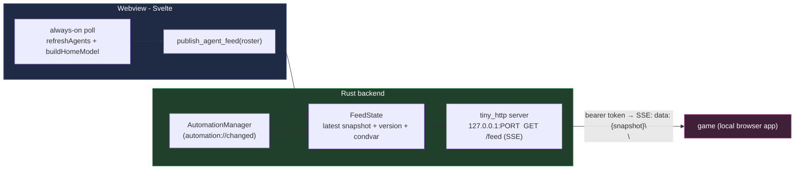
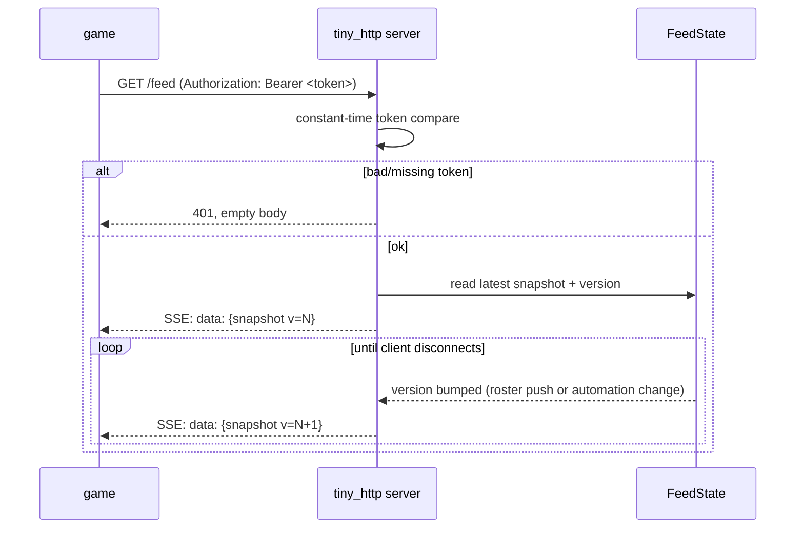

# feat: Local read-only agent/automation feed for the `game` portfolio

> **Addendum (2026-07-16) — wire sketch superseded by the shipped contract.**
> The entry shapes sketched below have drifted as later plans enriched the
> feed (feed-agent-reply-io, feed-pending-question, feed-conversation-tail,
> feed-other-answer, and the feed-monitor-enrichment note): `AgentEntry`
> dropped `title` and gained `num`/`lastReplyAt`/`questionPendingAt`;
> `AutomationEntry` renamed `schedule`→`cron`+`timezone` and `paused`→`enabled`
> and gained `monitor`/`retiredAt`/`lastVerdict`. The live contract is
> `src-tauri/src/feed/wire.rs`, mirrored in `src/lib/feed.ts`.

## Summary

Expose fly's live picture of **what agents are running** and **what automations
exist** to an external, locally-deployed consumer — the `game` 3D web portfolio —
over a **read-only, loopback-only SSE endpoint** guarded by a bearer token.

The design deliberately takes the cheap/low-risk path established in the design
discussion: fly's aggregated agent roster (grouping, status, debounce, topology)
is computed **only in the webview** (`src/lib/home.ts`), and rebuilding that in
Rust would mean duplicating logic that already works. So the frontend **pushes**
its already-assembled roster to a small backend cache, and the backend re-serves
it — merged with automations it reads directly from its own authoritative store —
as a Server-Sent Events stream. A second change lifts the agent poll out of the
"dashboard is open" gate so the feed stays live whenever fly is running.

No control surface: `game` can *see* agents and automations, not act on them.

---

## Problem Frame

From the investigation earlier in this session:

- fly has **no single backend source of truth** for "running agents." Live state
  is fragmented across `PtyManager.panes` (which panes exist + activity atomics),
  on-demand `/proc` agent detection, and `AttentionManager.machines` (attention) —
  never joined in the backend.
- The **complete, grouped, status-labeled roster** is a frontend artifact:
  `refreshAgents()` in `src/App.svelte` fans `paneActivity()` over live panes,
  and `buildHomeModel()` (`src/lib/home.ts`) folds the result plus topology
  (`paneIdByLeaf`, the workspace tree) and the debounce/grace/stale-ping guards
  into `AgentRow`s. None of that topology or status logic exists in Rust.
- The only existing IPC ingress (the hook UDS, `src-tauri/src/hooks/`) is
  authenticated, local-only, and **intentionally exposes zero read/enumeration
  surface** — `hooks/CLAUDE.md` lists "enumerate panes" as a defended-against
  threat, and the browser-reachable HTTP endpoint (KTD7) was explicitly deferred.
- **Automations are the exception**: already backend-authoritative and persisted
  (`src-tauri/src/automations/store.rs`), surfaced by the `list_automations`
  command as an `AutomationsDashboard`.

`game` runs in a browser and cannot reach a Tauri `invoke` or a Unix socket. It
needs an actual HTTP surface. That surface is precisely the KTD7 piece fly
deferred — this plan builds a **narrowly-scoped, read-only** version of it.

**Goal:** `game` can render (a) a live view of in-flight agents (working /
waiting / idle / running, with cwd + title + attention) and (b) the automations
roster with schedule + last-run status — updating live, from a local endpoint.

---

## Requirements

- **R1** — A local HTTP endpoint streams a JSON snapshot of agents + automations
  over SSE, pushing an update whenever the picture changes.
- **R2** — The endpoint binds **loopback only** (`127.0.0.1`) and requires a
  **bearer token**; missing/invalid tokens are rejected without leaking state.
- **R3** — The agent roster served is the same one fly's own dashboard shows
  (status precedence, debounce, grace) — reuse `buildHomeModel`, do not re-derive.
- **R4** — The feed stays live **whenever fly is running**, not only while the
  dashboard is open.
- **R5** — Automations flow through the **same** endpoint, sourced from the
  backend store (no dependency on the frontend or the dashboard being mounted).
- **R6** — A **stable, documented wire contract** exists so `game` can be built
  against a mock before fly ships the endpoint.
- **R7** — The feature is config-gated (port, token, enable flag) and shuts down
  cleanly with the app (no orphaned listener thread).
- **R8** — Read-only: no route mutates fly state.

---

## Key Technical Decisions

- **KTD1 — Frontend-fed, backend-served.** The frontend pushes its assembled
  roster (`AgentRow[]`) to the backend via a new `publish_agent_feed` command;
  the backend caches it and merges with automations from its own store. Rationale:
  the roster's topology + status logic lives only in the webview; pushing it is
  far cheaper and lower-risk than reimplementing aggregation in Rust, and it keeps
  a single status source (no drift between the dashboard and the feed). Trade-off:
  the agent half of the feed is only as fresh as the frontend poll, and goes
  stale if the webview is gone (acceptable — if fly's window is closed there are
  no live agents to show anyway).

- **KTD2 — `tiny_http`, not an async stack.** fly is entirely synchronous,
  thread-per-connection (`hooks/server.rs` is the template; no tokio/axum in the
  tree). `tiny_http` is the minimal, well-established sync HTTP crate and fits the
  existing idiom. SSE is implemented by handing the connection a blocking `Read`er
  that wakes on a version bump. Rationale: no new async runtime, mirrors the hook
  server's shape. Alternative rejected: pulling in `axum`+`tokio` — large surface
  for a single read endpoint.

- **KTD3 — Token is the boundary, loopback is the reduction.** A `127.0.0.1`
  listener is reachable by *any* local process (any user) — same reason the hook
  path originally chose a UDS + `SO_PEERCRED`. TCP can't use `SO_PEERCRED`, so the
  **bearer token** is what scopes the feed to `game`. Compare it in **constant
  time** (reuse `subtle::ConstantTimeEq`, as `hooks/token.rs` does). Reject bad
  tokens with a bare 401 and no body — don't leak whether agents exist.

- **KTD4 — Automations sourced backend-side, version-bumped on change.** The
  backend builds the automation half of the snapshot from `AutomationManager`
  directly, and the feed subscribes to the existing `automation://changed` event
  to bump the stream version. Rationale: keeps automations live even with no
  frontend push, and reuses the mutation signal already emitted (U4/`mod.rs`).

- **KTD5 — Version-gated emission.** The backend holds a monotonic `version` and
  a latest snapshot; it only bumps `version` (and wakes SSE readers) when the
  pushed roster or the automations actually change. Rationale: idle agents must
  not churn the stream every poll tick.

- **KTD6 — Enabled by default, config-gated.** For this single-user tool the feed
  ships enabled (loopback + token). Port, token, and an `enabled` flag live in
  `Config`; the token is CSPRNG-minted on first run and persisted. See Open
  Questions for the "if fly ever distributes broadly, default off" note.

---

## High-Level Technical Design

Two write paths feed one cache; one read path streams it out.



Connection lifecycle for one `game` client:



The `mermaid` diagrams render authoritative content; prose governs on any
disagreement.

---

## Output Structure

New backend module plus one new frontend module. Existing files modified in place.

```text
src-tauri/src/
  feed/
    mod.rs          # FeedState, snapshot assembly, publish entry point
    server.rs       # tiny_http loopback server + SSE streaming + token auth
    wire.rs         # serde structs for the wire contract (mirror of src/lib/feed.ts)
src/lib/
  feed.ts           # pure: FeedSnapshot/AgentEntry/AutomationEntry types + payload builder
```

---

## Implementation Units

### U1. Wire contract (`game`'s consumption shape)

**Goal:** Pin the JSON `game` consumes so it can be built against a mock before
the endpoint exists. This is the anchor for every other unit.

**Requirements:** R6.

**Dependencies:** none.

**Files:**
- `src/lib/feed.ts` (new) — TS types + a pure `buildFeedPayload(rows, cwdByLeaf)`
  that maps the dashboard's `AgentRow`s to `AgentEntry[]`.
- `src-tauri/src/feed/wire.rs` (new) — matching serde structs (`#[serde(rename_all
  = "camelCase")]`, mirroring the automations wire-contract convention).
- `src/lib/feed.test.ts` (new).

**Approach:** The snapshot shape:
- `FeedSnapshot { version, emittedAt, agents: AgentEntry[], automations: AutomationEntry[] }`
- `AgentEntry { leafKey, workspace, tab, cwd, title, status, reason?, workingForMs?, liveTaskCount, needsAttention }`
  — derived from `AgentRow` in `src/lib/home.ts` (`wsId/tabId/leafKey/tabTitle/cwd/status/reason/workingForMs/liveTaskCount/needsAttention`).
- `AutomationEntry { id, name, schedule, nextRunAt?, paused, lastStatus?, lastRunAt? }`
  — derived from `Automation` + latest `RunRow` (`src-tauri/src/automations/model.rs`).
- `status` is the existing union `"working" | "waiting" | "idle" | "running"`.
Keep `feed.ts` framework-free and pure, like `home.ts`/`notifications.ts`.

**Patterns to follow:** camelCase serde wire contract in
`src-tauri/src/automations/model.rs`; pure view-model modules in `src/lib/`.

**Test scenarios:**
- `buildFeedPayload` maps a working agent row to an `AgentEntry` with `status:
  "working"` and its `cwd`/`title`/`leafKey` carried through.
- A waiting (attention-raised) row maps to `needsAttention: true` with its
  `reason` preserved.
- Empty roster → `agents: []` (not null/undefined).
- Rust: a `FeedSnapshot` round-trips serde to the exact camelCase JSON a golden
  sample fixture asserts (guards frontend/backend drift).

---

### U2. Backend feed state + snapshot assembly

**Goal:** A cache holding the latest pushed agent roster + a monotonic version,
plus assembly that merges it with automations from the store into a `FeedSnapshot`.

**Requirements:** R1, R3, R5, R8, KTD1, KTD4, KTD5.

**Dependencies:** U1.

**Files:**
- `src-tauri/src/feed/mod.rs` (new) — `FeedState { agents: Mutex<Vec<AgentEntry>>,
  version: AtomicU64, changed: Condvar + Mutex<u64> }`; `publish(roster)` (bumps
  version only on a real change); `snapshot(&automations) -> FeedSnapshot`.
- `src-tauri/src/lib.rs` (modify) — register a `publish_agent_feed` command in the
  `invoke_handler!`; `.manage(FeedState)`.
- `src/ipc.ts` (modify) — typed `publishAgentFeed(payload)` wrapper.

**Approach:** `publish_agent_feed(roster)` stores the roster and, if it differs
from the last, bumps `version` and notifies the `Condvar`. `snapshot()` reads the
cached roster and calls into `AutomationManager` for the automations half (map
`Automation` + latest `RunRow` → `AutomationEntry`). Subscribing the feed to the
`automation://changed` Tauri event (wired in U6) bumps the version on automation
mutations. Version-change detection compares serialized payloads or a cheap hash —
directional; implementer picks.

**Patterns to follow:** `AttentionManager` mutex-guarded registry
(`src-tauri/src/state/manager.rs`); command registration + `src/ipc.ts` wrapper
pairing described in `CLAUDE.md`.

**Test scenarios:**
- `publish` with a new roster bumps `version`; publishing an identical roster does
  **not** bump it (KTD5).
- `snapshot()` merges cached agents with automations pulled from an injected
  manager/store double.
- Concurrent `publish` + `snapshot` do not deadlock or tear a snapshot (hold the
  lock only to clone).
- A waiting SSE reader (blocked on the condvar) wakes exactly once per version bump.

---

### U3. Local SSE HTTP server (loopback + bearer token)

**Goal:** A `tiny_http` server on `127.0.0.1:<port>` serving `GET /feed` as an
authenticated SSE stream, plus a trivial `GET /healthz`.

**Requirements:** R1, R2, R8, KTD2, KTD3.

**Dependencies:** U2.

**Files:**
- `src-tauri/src/feed/server.rs` (new) — accept loop (own thread), route `/feed`
  and `/healthz`, bearer-token auth, SSE streaming via a blocking `Read`er that
  wakes on `FeedState` version bumps.
- `src-tauri/tests/feed_server.rs` (new) — integration test for the auth + SSE
  behavior, mirroring `src-tauri/tests/hook_auth.rs`.
- `src-tauri/Cargo.toml` (modify) — add `tiny_http`.

**Approach:** On `/feed`: read the `Authorization: Bearer <token>` header,
constant-time compare against the configured token (`subtle::ConstantTimeEq`);
on mismatch/absence respond `401` with an empty body. On success, write SSE
headers (`Content-Type: text/event-stream`, no-cache, keep-alive), emit the
current snapshot as one `data: <json>\n\n` frame, then block on the `FeedState`
condvar and emit a fresh frame per version bump until the client disconnects.
Send a periodic `: keepalive\n\n` comment (e.g. every ~20s) so dead peers are
detected. Bound header read size and apply write timeouts (mirror the hook
server's `MAX_MESSAGE` / timeout posture). `/healthz` returns `200 ok` without
auth (no state leaked).

**Execution note:** Add `tiny_http` with `dangerouslyDisableSandbox: true` (new
crate; `index.crates.io` is blocked under the sandbox — see the cargo memory),
then build `--offline` normally.

**Patterns to follow:** `src-tauri/src/hooks/server.rs` — accept loop, bounds,
timeouts, silent rejection; `src-tauri/src/hooks/token.rs` — constant-time compare.

**Test scenarios:**
- `GET /feed` with no `Authorization` header → `401`, empty body.
- `GET /feed` with a wrong token → `401`; with the right token → `200` +
  `text/event-stream` and an initial `data:` frame.
- After a `FeedState` version bump, a connected client receives a second `data:`
  frame carrying the new version.
- `GET /healthz` → `200` without a token.
- The server binds `127.0.0.1` only (assert the bound addr is loopback).
- A slow/dead client does not wedge the accept loop (each connection on its own
  thread; write timeout trips).

---

### U4. Config: feed port, token, enable flag

**Goal:** `Config` carries the feed settings; the token is CSPRNG-minted and
persisted on first run.

**Requirements:** R2, R7, KTD6.

**Dependencies:** none (can land alongside U2/U3).

**Files:**
- `src-tauri/src/config/schema.rs` (modify) — add `feed: FeedConfig { enabled:
  bool (default true), port: u16 (default e.g. 4939), token: Option<String> }`
  with `#[serde(default)]` for back-compat.
- `src-tauri/src/config/mod.rs` (modify) — mint a token if absent on load and
  persist via the existing write-through `set`.

**Approach:** Follow the `AutomationDefaults` precedent for an additive,
`#[serde(default)]` config block so existing config files still parse. Reuse the
CSPRNG token minting from `hooks/token.rs` (or the same `rand`/`getrandom` path).
Document where `game`'s local server reads the token (the config file path under
`~/.config/<app>/`); a `fly feed token` CLI helper is deferred (see Scope).

**Patterns to follow:** `AutomationDefaults` additive config
(`src-tauri/src/config/schema.rs`); `ConfigStore::set` write-through persistence.

**Test scenarios:**
- A config file without a `feed` block loads with defaults (enabled, default port,
  no token yet).
- Loading with no token mints one and persists it; a second load reads the **same**
  token (stable, not re-minted).
- An explicit `enabled: false` is preserved across load/save.
- `Test expectation` covers behavior; token value is asserted non-empty and stable,
  never logged.

---

### U5. Frontend: always-on feed publisher (decouple the poll)

**Goal:** Run the agent poll whenever fly is running (not only while the dashboard
is open) and publish the resulting roster to the backend each time it changes.

**Requirements:** R3, R4, KTD1.

**Dependencies:** U1, U2.

**Files:**
- `src/App.svelte` (modify) — lift the `refreshAgents()` interval out of the
  `homeViewOpen`-gated `$effect` into an always-on interval; after each rebuild,
  call `publishAgentFeed(buildFeedPayload(...))`.

**Approach:** Today `refreshAgents` is gated to `homeViewOpen` (KTD-C, to avoid
always-on IPC for a toggle-only surface). Decouple it: maintain the agent maps
(`agentByLeaf`, attention, cwd) on an always-on interval so both the dashboard and
the feed read the same live picture. The dashboard keeps reading the same
`homeModel`; the publisher reuses that pipeline and pushes on change. Preserve the
leaf-key invariants (`CLAUDE.md`) — the payload keys off `leafKey`, not `paneId`.
Guard against publishing when disabled (skip if the backend reports the feed off —
or simply always publish; the backend no-ops if disabled).

**Patterns to follow:** the existing `refreshAgents` + `homeModel` pipeline in
`src/App.svelte`; pure payload building in `src/lib/feed.ts` (U1).

**Test scenarios:**
- `buildFeedPayload` (unit, in U1) covers the shape; here assert the publisher
  fires on a roster change and is skipped when the roster is unchanged.
- Poll continues to produce a roster when the dashboard is closed (no regression:
  opening the dashboard still shows agents; closing it does not stop the feed).
- Integration: a status change on a pane (working → waiting) results in a new
  published payload with the updated `status`.

---

### U6. Lifecycle: start in setup, ordered shutdown, automation-change wiring

**Goal:** Start the feed server + subscribe to `automation://changed` during app
setup; tear the listener down cleanly on shutdown.

**Requirements:** R5, R7, KTD4.

**Dependencies:** U2, U3, U4.

**Files:**
- `src-tauri/src/lib.rs` (modify) — in `.setup()`, if `config.feed.enabled`,
  `.manage(FeedState)`, spawn the `tiny_http` server thread (U3), and register a
  listener on the `automation://changed` event that bumps `FeedState` (KTD4).
- `src-tauri/src/lifecycle.rs` (modify) — join/stop the feed thread in the ordered
  shutdown sequence (stop accepting, close connections) so no listener leaks.

**Approach:** Mirror how `HookServer` and the automations sweep are managed and
spawned in `.setup()` (`src-tauri/src/lib.rs` ~line 232–600). Hold a shutdown
signal (an `AtomicBool` + waking the accept loop, or dropping the server handle)
so `lifecycle.rs` can stop it in order with the other subsystems.

**Patterns to follow:** `HookServer` setup + `app.manage(server)`
(`src-tauri/src/lib.rs`); the automations sweep thread + ordered shutdown in
`src-tauri/src/lifecycle.rs`.

**Test scenarios:**
- With `feed.enabled = false`, no listener binds (a connect attempt to the port
  fails).
- With the feed enabled, the server is reachable after setup and `GET /healthz`
  succeeds.
- An `automation://changed` event bumps `FeedState.version` (a connected SSE
  client receives a fresh frame).
- Shutdown stops the listener and joins its thread (no orphaned thread; port frees).

---

## Scope Boundaries

**In scope:** the read-only loopback SSE feed (agents + automations), the wire
contract, the always-on publisher, config + token, and lifecycle wiring.

**Out of scope (non-goals):**
- Any **control** surface — no route mutates fly state (R8).
- Pushing topology/status aggregation **down into Rust** — explicitly the
  expensive alternative this plan avoids (KTD1).
- **Remote / non-loopback** exposure, TLS, tunnels, or auth beyond the bearer
  token — `game` is deployed locally; loopback + token is the whole threat model.

### Deferred to Follow-Up Work
- A `fly feed token` / `fly feed status` CLI helper so `game`'s local server can
  fetch the token/URL instead of reading the config file. Natural fit for the
  existing `cli/` surface; not needed for a first local integration.
- A `game`-side mock server + fixtures built against the U1 contract (lives in the
  `game` repo, not fly).
- Diffing/patch frames (send only changed agents) if the full-snapshot-per-bump
  stream ever gets heavy — premature now.

---

## Open Questions

- **Default-on vs default-off.** This plan defaults the feed **enabled** (KTD6)
  for a single-user tool. If fly is ever distributed more broadly, an always-on
  local HTTP listener should likely flip to **opt-in** — revisit the default then.
- **Token handoff to `game`.** Plan of record: `game`'s local server reads the
  token from fly's config file. If that proves awkward in practice, pull the
  deferred `fly feed token` CLI helper forward.
- **Port default + collision.** Pick a default port unlikely to collide; decide
  whether a bind failure is fatal (log + disable feed) or retried. Leaning:
  log and continue without the feed (never block app launch).

---

## Risks & Dependencies

- **New dependency (`tiny_http`).** Small, established, sync — but adding it needs
  a sandbox-off build (cargo memory). Low risk; isolated to `feed/server.rs`.
- **Always-on poll cost (R4).** Decoupling the poll means a `/proc` probe per pane
  every ~1.5s continuously. Cheap, but note it; version-gated emission (KTD5)
  keeps it from churning the SSE stream.
- **Security boundary.** A loopback TCP listener is reachable by any local process;
  the token is the only thing scoping it (KTD3). Treat `feed/server.rs` with the
  same care as `hooks/` — constant-time compare, silent rejection, bounded I/O.
  Do **not** log the token or snapshot bodies.
- **Frontend-fed staleness.** The agent half is only as fresh as the webview poll
  and empty if the window is gone (accepted — no window means no live agents).

---

## System-Wide Impact

- **New trust surface.** fly gains its first outward network listener (however
  local). The `hooks/CLAUDE.md` reasoning about enumeration applies — this endpoint
  intentionally exposes a read view that the hook socket refuses to, so the token
  guard is load-bearing, not decorative.
- **Behavioral change to the poll.** Lifting `refreshAgents` out of the
  dashboard-open gate (KTD-C) changes a documented optimization; the dashboard
  must still behave identically (it reads the same maps).
- **New command + wire contract.** `publish_agent_feed` joins the `invoke_handler!`
  and `src/ipc.ts` (per `CLAUDE.md`); the U1 contract is a new stable shape shared
  across the socket-free HTTP boundary and the `game` repo.

---

## Sources & Research

- In-session architecture investigation (agent-state tracking): `src-tauri/src/pty/mod.rs`,
  `src-tauri/src/state/manager.rs`, `src/lib/home.ts`, `src/App.svelte`,
  `src-tauri/src/automations/`, `src-tauri/src/hooks/`.
- Prior-pattern templates: `src-tauri/src/hooks/server.rs` (authenticated
  thread-per-connection server), `src-tauri/src/hooks/token.rs` (constant-time
  token compare), `src-tauri/src/config/schema.rs` (additive config), `CLAUDE.md`
  (command + `ipc.ts` pairing, leaf-key invariants), `src-tauri/src/hooks/CLAUDE.md`
  (socket security boundary reasoning; KTD7 deferred HTTP endpoint).
- No external research: local patterns are strong (3+ direct examples of the
  server/config/setup shape); `tiny_http` is the settled minimal sync-HTTP choice.
