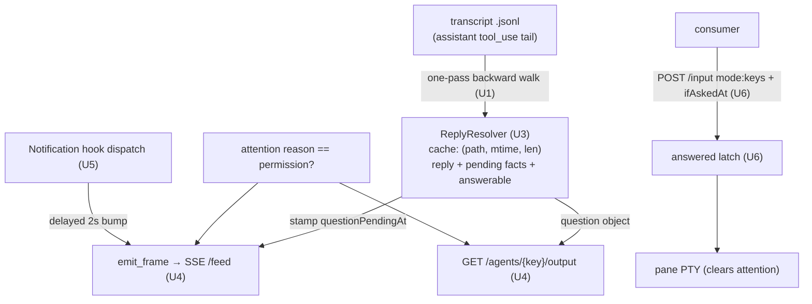
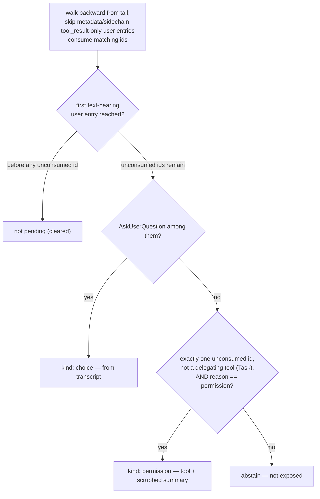

# feat: Expose pending agent questions over the local feed (`feed-pending-question`)

## Summary

When an agent stops to ask the user something — an AskUserQuestion
multiple-choice prompt or a tool permission request — the feed exposes what is
being asked: the full structured question on `GET /agents/{key}/output`, a
`questionPendingAt` marker on every `/feed` frame, and a verified way to answer
it through `POST /agents/{key}/input`.

## Problem Frame

The `game` consumer correctly saw `reason: "permission"` on a waiting agent but
had no way to render the question being posed or the context sentence above it
(observed live on an automation pane running an AskUserQuestion prompt). The
content exists nowhere fly currently reads it out:

- `GET /agents/{key}/output` resolves the last *completed* assistant text turn
  (`session/transcript.rs::last_assistant_reply`); a pending question is a
  `tool_use` block, which every current transcript extractor deliberately
  skips.
- The Notification hook payload carries only a human summary string
  (`message`, e.g. "Claude needs your permission to use Bash"), never the
  question content — and AskUserQuestion fires **no hook at all** (GitHub
  #59908/#15872: no Notification, no PreToolUse; closed as not-planned).
- Verified against a real transcript: the AskUserQuestion `tool_use` entry
  (with `questions[].question/header/multiSelect/options[{label,description}]`)
  is written with its own timestamp ~99s before the answering `tool_result`,
  and the context sentence is a separate, earlier assistant `text` entry.

So the transcript is the only source that has the content, and fly already owns
the machinery to read it per leaf (the `ReplyResolver` chain).

---

## Requirements

**Content exposure**

- R1. A pending AskUserQuestion exposes its full structured content on
  `GET /agents/{key}/output`: every question's text, header, `multiSelect`
  flag, and options (label + description), plus when it was asked.
- R2. The context sentence is included only when it provably belongs to the
  ask: a text block in the same assistant entry, or in an immediately
  preceding assistant entry with no other real conversational entry
  (excluding metadata/sidechain) between. Otherwise it is omitted — never an
  older reply masquerading as context.
- R3. A pending tool permission request exposes the tool name and a
  secret-scrubbed input summary, only while the agent's attention reason is
  `permission` (best-effort; see KTD3 for the known misses and the delegating-
  tool abstention).

**Wire contract & consistency**

- R4. Every `/feed` frame agent entry carries `questionPendingAt`
  (epoch ms | null), stamped backend-side at emit time. For a **choice**
  question it is resolver-cache-derived and therefore equal to
  `GET /agents/{key}/output`'s `question.askedAt` for the same question (the
  `lastReplyAt ≡ repliedAt` precedent). For a **permission** question the
  marker is best-effort and may briefly lead or lag `/output` (the attention
  gate is evaluated independently at emit and at request; see KTD4). A changed
  `questionPendingAt` means a new question.
- R5. Wire changes are back-compat both ways: old webview pushes (no new
  field) still deserialize; the `/output` `question` object is omitted (not
  null) when nothing is pending; a consumer ignoring the new fields sees
  today's behavior unchanged.
- R6. The marker and question clear when the question is resolved by any
  path: answered remotely, answered in the terminal, Esc-interrupted, the
  conversation moving on, `/clear` session rotation, or the pane exiting
  (roster removal).
- R7. The `question` object carries `answerable` (bool): true only for the one
  shape v1 can complete remotely — a single single-select question — so the
  consumer never builds answer UX the guard will reject. Everything else is
  read-only in v1 (multi-question batches, multiSelect, free-text-only options).

**Safety**

- R8. All exposed strings are agent-authored and untrusted. Ordering is fixed:
  pass the **full, untruncated** string through `automations/redact.rs` secret
  scrubbing **first**, then control-sanitize (`notify::sanitize_*`, R16 posture)
  and truncate to the pinned ceiling — so a secret straddling the truncation
  boundary is masked before its tail is cut. A string that sanitizes to blank
  is absent.
- R9. The input boundary does not widen beyond "send keys/text": no raw
  control bytes, no paste-marker forgery. The keys answer mode admits only
  characters passing `char::is_control() == false` (or a stricter ASCII
  `0x20..=0x7E` allowlist), never a byte-level check that would pass multi-byte
  C1 encodings, with a small length cap, and it clears pane attention on
  delivery exactly as the submit path does (KTD6).
- R10. The feed bearer token is persisted with `0600` mode durably — enforced
  at the config persistence layer so it survives every later rewrite, not only
  the mint — matching the `0600` automations store.

**Answering**

- R11. The answer path is live-verified against a real picker before its API
  shape ships (U6's checklist). A stale-answer guard prevents answering an
  already-resolved question **and** a concurrent double-answer: `ifAskedAt`
  gates against the resolver's pending timestamp, and a server-side per-leaf
  answered latch 409s a second delivery carrying the same `ifAskedAt` before
  the transcript reflects the first (the resolver lags the answer by ≥100ms).

---

## Key Technical Decisions

- **KTD1 — the transcript is the single content source.** Hook payloads carry
  only a summary string; AskUserQuestion has zero hook support. The pending
  question is parsed from the transcript tail via the existing
  leaf → resume record → transcript chain. Content shapes are undocumented
  Claude contracts, so parsing is defensive: abstain on any surprise rather
  than guess.
- **KTD2 — the pending predicate (backward walk, tail-results safe).** Claude
  Code flushes one `tool_use` per assistant line and appends each `tool_result`
  as its own `user` entry — and in a parallel batch the auto-resolved siblings'
  `tool_result` entries land *after* all the `tool_use` lines, so "the trailing
  run of assistant entries" can be empty. The scan must therefore **walk
  backward from the tail**, treating metadata, `isSidechain`, and
  `tool_result`-only `user` entries as **transparent to contiguity** (skipped,
  but the walk continues), collecting `tool_use` ids from assistant entries and
  **consuming** an id when a later `tool_result`-only entry matches it. The walk
  is bounded by the first **text-bearing** `user` entry (real conversation
  resuming), which clears pending. After the walk: expose AskUserQuestion if it
  is among the unconsumed ids (`kind: "choice"`); else the sole unconsumed tool
  (`kind: "permission"`, gated per KTD3); abstain when more than one
  non-AskUserQuestion id remains unconsumed — the on-screen dialog serializes to
  the first, which post-hoc parsing can't identify (the `sole_transcript_since`
  abstention posture). This resolves the tail-results and partial-batch shapes
  and both Esc-interrupt shapes (a synthesized `[Request interrupted]`
  tool_result, or an interrupt user entry) uniformly.
- **KTD3 — waiting vs executing, delegating-tool abstention, honest misses.**
  AskUserQuestion never "executes" — its pending `tool_use` always means
  waiting, classified from the transcript alone. Any other tool's pending
  `tool_use` means *executing* unless corroborated by the agent's attention
  reason being `permission`. Two exposure rules keep this from surfacing wrong
  content: **(1)** abstain from `kind: "permission"` — and refuse `mode: "keys"`
  answers — whenever the sole unconsumed tool is a **delegating** tool (`Task`),
  because the on-screen dialog is a tool *inside* the subagent (an `isSidechain`
  entry the scan skips), so the named tool and summary would not match what a
  keystroke approves — a confused-deputy hole, not a benign miss. **(2)** the
  primary `game` use case (fly backgrounded) keeps the pane `Raised`, so the
  reason reaches the roster and the gate works. Remaining accepted miss,
  degrading to "not exposed": a permission prompt on a **focused** pane is
  acknowledged on a glance (visibility change transitions `Raised →
  Acknowledged`, nulling the roster reason) — but the terminal is right there in
  that case. Closing the focused-pane miss durably (capture the permission fact
  at hook dispatch) and the delegating-tool exposure (see the real inner tool)
  are deferred follow-ups.
- **KTD4 — one resolver, pure cache, gate outside the cache.** The
  `ReplyResolver` becomes the single source for reply **and** pending facts,
  produced in one transcript read and cached together under the existing
  `(path, mtime, len)` key. Only transcript-derived facts are cached (tool name,
  `askedAt`, question payload, scrubbed input summary, context, `answerable`);
  the attention-dependent permission gate is applied at emit/response time,
  outside the cache. Because the gate reads live `reason` at two independent
  moments (frame emit and each `/output` request), a permission marker can lead
  or lag `/output` briefly — hence R4 scopes the strict frame≡output equality to
  choice-kind. The gate is conjunctive (cached pending fact AND reason
  `permission`), so staleness degrades to "not exposed" **only while the reason
  stays fresh** — which is why a keys-mode answer must clear attention (R9), or
  a stale `reason: permission` could mislabel the next executing tool.
- **KTD5 — settle bump on Notification; bless working-while-pending.**
  `FeedState::publish` dedups identical rosters, so a permission frame that
  emits before the `tool_use` flushes would never self-correct if the roster
  went static. Hook dispatch schedules one delayed (2s) `FeedState::bump` per
  attention-raising Notification, placed **after** the capture-only and
  automation-suppression early returns but **not** gated on `recordable`, on a
  spawned thread (Claude Code blocks on hooks), mirroring the post-Stop bump.
  AskUserQuestion fires no hook, so the choice marker rides the normal ~1.5s
  roster poll (the pane counts as `working` for `IDLE_GAP_MS` ≈ 75s after the
  picker draws, and `workingForMs` growth defeats publish dedup). Consequence
  the wire blesses: a consumer can see `status: "working"` **with**
  `questionPendingAt` set for up to ~75s — questions are not exclusive to
  `waiting` agents.
- **KTD6 — answering: constrained keys mode + mandatory guard + latch, single-
  select only.** Digit keys select picker options instantly without Enter
  (GitHub #25624), so the existing paste + auto-Enter contract would misfire.
  The input body gains optional `mode: "keys"`: raw bytes, R9-filtered, hard
  length cap, no paste wrap, no auto-Enter, and it **clears pane attention on
  delivery** (`attention.on_input`, as the submit path does) so a remote answer
  can't leave `reason: permission` stale. Because a digit on a permission dialog
  can pick a durable "Yes, don't ask again" — turning the bearer token into a
  remote permission-approval credential — `ifAskedAt` is **mandatory** for
  `mode: "keys"`. v1 answers exactly one **single-select** question or free text
  (`answerable == true`, R7); **multiSelect is out of v1** — the answered latch
  keys on the single `askedAt` and would 409 the second toggle of a multi-toggle
  sequence, so multi-toggle answering cannot work under the guard and is not
  attempted. The permission-approval subset of keys answering is the subject of
  an Open Question below (opt-in gate vs rank-gate vs read-only).
- **KTD7 — secret scrubbing spans the whole new surface, scrub-before-truncate.**
  Per R8, every newly exposed string (question/header/context text, option
  labels/descriptions, permission summaries) passes `automations/redact.rs` on
  its full untruncated form before sanitize+truncate. Replies remain unscrubbed
  on this boundary (unchanged, deferred parity — see Risks), so KTD7 is not read
  as boundary-wide coverage; the trust model stays "token holder ≈ user at the
  keyboard".

---

## High-Level Technical Design

Data flow — the pending question rides the exact seams `lastReplyAt` proved
out (directional, not prescriptive):

Pending classification (KTD2/KTD3):

Wire additions (shapes directional; serde camelCase like everything crossing
this boundary):

- `AgentEntry.questionPendingAt: Option<u64>` — `#[serde(default)]`, webview
  never pushes it, backend stamps at emit (the `lastReplyAt` pattern).
- `AgentOutputBody.question` (omitted when absent):
  `{ askedAt, kind: "choice" | "permission", tool, answerable, context?,
  questions?[], request? }`. **During a pending question, `text`/`repliedAt` on
  the same body legitimately equal the question's own context sentence** (the
  last text-bearing assistant entry *is* the context) — expected duplication,
  the reply is not suppressed.
- `POST /agents/{key}/input` body: `{ text, mode?: "submit" | "keys",
  ifAskedAt?: number }` — `mode` defaults to today's paste+Enter; `ifAskedAt`
  mandatory when `mode == "keys"`.

---

## Implementation Units

### U1. Pending-interaction scan in the transcript parser

- **Goal:** A pure scan that reports the transcript's pending interaction (or
  its absence), plus a body-taking entry point that returns the last reply and
  the pending interaction from one parse (so U3 folds both into a single read).
- **Requirements:** R1, R2, R6 (detection half), R7 (`answerable`), KTD1/KTD2.
- **Dependencies:** none.
- **Files:** `src-tauri/src/session/transcript.rs`.
- **Approach:** Add `pending_interaction_from_str` implementing the KTD2
  backward walk: from the tail, skip metadata/`isSidechain`, consume `tool_use`
  ids via matching `tool_result`-only `user` entries, stop at the first
  text-bearing `user` entry. Classify AskUserQuestion by name, parsing
  `input.questions[]` defensively (missing fields → abstain that question; zero
  parseable → abstain). Set `answerable` = exactly one single-select question.
  Otherwise report the sole unconsumed tool + input; abstain on >1 or on a
  delegating tool (`Task`). Context per R2. Abstain when the pending entry has
  no parseable timestamp. Reuse `iso8601_to_ms`. Also expose a body-taking
  combined reader (or make `last_assistant_reply_from_str` `pub(crate)` beside
  the new scan) so U3 runs both over one `read_to_string`.
- **Execution note:** Before coding, verify against live transcripts (read-only,
  `tail` while a picker/dialog is on screen): (a) `tool_use` flushed at ask
  time; (b) `isSidechain` shape; (c) Esc-interrupt shape; (d) the
  **parallel-batch ordering** — confirm auto-resolved `tool_result` entries
  append *after* the `tool_use` lines (the shape KTD2's backward walk depends
  on); (e) whether a subagent permission surfaces as a main-chain `Task`
  `tool_use`.
- **Patterns to follow:** `scan_turns` / `last_assistant_reply_from_str`
  (skip-tolerant walk), inline `concat!` JSONL fixtures, KTD1 defensive posture.
- **Test scenarios:**
  - Real-shape AskUserQuestion `tool_use` (name `AskUserQuestion`, options as
    `{label, description}`) → pending choice, `askedAt` = entry timestamp,
    `answerable` true for one single-select question, false for multiSelect or
    for two questions.
  - Matching `tool_result` for the id → not pending; a `tool_result` for a
    *different* id → still pending (non-subsumption).
  - **Parallel-batch tail-results:** two `tool_use` lines (A, B) followed by a
    `tool_result` user entry for A only (appended after both) → pending on B
    (the backward walk sees B unconsumed past the transparent tail results);
    both resolved → not pending; both unresolved → abstain (>1).
  - Plain user text entry (no tool_result) → not pending; synthesized
    `[Request interrupted]` tool_result → not pending.
  - Trailing metadata (`mode`, `ai-title`) → still pending; `isSidechain`
    `tool_use` at the tail → ignored.
  - Sole pending tool `Task` → abstain (delegating-tool rule).
  - Bash `tool_use` pending → tool `Bash` + input captured, `answerable` false.
  - Context: same-entry text → captured; immediately-preceding assistant text →
    captured; a text user entry between → omitted.
  - Stampless pending entry → abstain; malformed lines skipped; empty → `None`.

### U2. Wire types for the question surface

- **Goal:** The boundary shapes both consumers and tests pin against.
- **Requirements:** R4, R5, R7.
- **Dependencies:** none.
- **Files:** `src-tauri/src/feed/wire.rs`, `src/lib/feed.ts`.
- **Approach:** `AgentEntry.question_pending_at: Option<u64>` with
  `#[serde(default)]`. `AgentOutputBody.question: Option<QuestionBody>` with
  `skip_serializing_if`; `QuestionBody` carries `answerable` and the
  `QuestionSpec` / `QuestionOption` shapes. Mirror the TypeScript types in
  `src/lib/feed.ts` (frontend never populates them).
- **Patterns to follow:** `wire.rs` golden-key serde tests
  (`snapshot_round_trips_camel_case`).
- **Test scenarios:**
  - Golden camelCase keys for a frame with `questionPendingAt` and an output
    body with a full `question` object (choice + permission variants, including
    `answerable`) — round-trips byte-equal.
  - Old-style push without the new field → `None`; no-question output body
    serializes with the `question` key absent.

### U3. Resolver: one pass, reply + pending, pure cache, scrub-then-truncate

- **Goal:** `ReplyResolver` resolves and caches `(reply, pending)` from one read
  so both wire surfaces read one source, with fixed scrub-before-truncate order
  and pinned ceilings.
- **Requirements:** R1, R4, R6, R8, KTD4, KTD7.
- **Dependencies:** U1, U2.
- **Files:** `src-tauri/src/feed/io.rs` (uses `src-tauri/src/automations/redact.rs`).
- **Approach:** Add a sibling resolution method returning a resolved-IO struct
  (`reply: Option<LastReply>`, `pending: Option<PendingInteraction>`) from U1's
  body-taking reader over one `read_to_string`; **keep the existing
  `resolve() -> Option<LastReply>` signature** so U4/U5 widen the seam
  atomically (U3 leaves the tree compiling — see U4). For every exposed string:
  `redact.rs` scrub the **full untruncated** value, *then* sanitize and truncate
  to the ceiling (R8 order). Pin ceilings, **truncate-and-serve** (never abstain
  — an oversized injected question must not suppress exposure): ≤4 questions, ≤8
  options each, ~512 B question/header, ~128 B label, ~1 KiB description, ~2 KiB
  context, ~512 B permission summary (exact values negotiable; pinning +
  truncate-not-abstain are the contract). Build the permission summary from
  well-known input fields (`Bash` → `command`, `Edit`/`Write` → `file_path`,
  else the tool name). Cache stores transcript facts only — no attention state.
- **Patterns to follow:** existing `ReplyResolver` tempdir `fixture()` tests.
- **Test scenarios:**
  - One fixture with a completed reply *and* a later pending question → both
    resolve; `askedAt` matches the tool_use stamp.
  - Cache: unchanged `(path, mtime, len)` serves the memo; appending the
    `tool_result` clears pending on re-read.
  - **Straddle test:** a secret-shaped substring spanning the truncation
    boundary is still fully masked (redact runs on the untruncated string).
  - Redaction over the whole surface: a secret in Bash input **and** in an
    option description are both masked.
  - Caps: 6 questions × 12 options with an oversized description → truncated to
    ceilings and still served (not abstained).
  - Control chars stripped; an option label that sanitizes to blank is dropped.
  - Missing resume record / transcript → `None` for both halves, never error.

### U4. Feed surfaces: frame marker, output question, gate, atomic seam widening

- **Goal:** Stamp `questionPendingAt` and serve the `question` object under the
  permission gate, widening the injected seam and its `lib.rs` satisfier in one
  compiling change.
- **Requirements:** R3, R4, R5, R7, KTD3, KTD4.
- **Dependencies:** U2, U3.
- **Files:** `src-tauri/src/feed/server.rs`, `src-tauri/src/feed/mod.rs`,
  `src-tauri/src/lib.rs`, `src-tauri/tests/feed_server.rs`.
- **Approach:** Widen `ReplyFn` (and `FeedServer::start`) to the resolved-IO
  shape **and** update the `lib.rs` closures + `start()` call in the same unit,
  so the crate compiles and U4's integration tests build (feasibility: the
  widening and its satisfier cannot straddle two units). `emit_frame` stamps
  `question_pending_at` per agent: always for a pending choice; for a pending
  permission tool only when that entry's own `reason` is `"permission"` (the
  roster entry is already in the snapshot). Add one `FeedState` accessor
  returning existence **and** reason in a single lock acquisition; `/output`
  builds the `question` object under the same gate from that one reason
  snapshot. Auth-first routing, 404, and status mapping stay untouched.
- **Test scenarios:**
  - Choice pending → SSE `questionPendingAt` equals `/output` `question.askedAt`
    (R4 choice-kind invariant across both surfaces).
  - Bash pending + roster reason `"permission"` → permission question on both
    surfaces; reason `null` → neither exposes it.
  - Sole pending `Task` + reason `"permission"` → abstains (KTD3 delegating-tool
    rule): no `question` object, no marker.
  - Choice pending on a `status: "working"` row → still exposed (KTD5).
  - No pending → frame field null, `question` key absent, `text`/`repliedAt`
    unchanged (regression guard).
  - Unknown key 404; unauthenticated bare 401; the combined existence+reason
    accessor unit test.

### U5. Wiring: Notification settle bump + durable 0600 token

- **Goal:** A racing transcript flush self-corrects on the wire, and the token
  file is `0600` durably.
- **Requirements:** R6, R10, KTD5.
- **Dependencies:** U4.
- **Files:** `src-tauri/src/lib.rs`, `src-tauri/src/config/mod.rs`.
- **Approach:** In hook dispatch, schedule one delayed (2s) `FeedState::bump`
  per attention-raising Notification — after the capture-only and
  automation-suppression early returns, not gated on `recordable`, on a spawned
  thread (KTD5). For R10, enforce `0600` at the **persistence layer**, not the
  mint call site: the feed token is a field in the shared `config.json` written
  through `ConfigStore::write_atomic` (write-temp + rename), which never chmods,
  and `ensure_feed_token` only writes on first mint — a mint-only chmod is
  clobbered on the next unrelated config write. Fix by either calling
  `set_permissions(0o600)` unconditionally after every `write_atomic` rename, or
  moving `feed.token` into its own dedicated `0600` file (mirroring the
  automations store's isolation). Note in Risks: `0600` narrows only the
  cross-user threat; a same-uid process still reads the token and the loopback
  port, so the token-holder-equals-user model is unchanged.
- **Test scenarios:** an assertion that the token-bearing file has `0600` mode
  **after a second, unrelated config write** (not only after mint) — the
  regression the durable-layer fix exists to prevent. The bump behavior is
  pinned by U4's integration tests + U7's live pass.

### U6. Answer path: live verification, then keys mode + guard + latch

- **Goal:** A consumer can answer a single-select question safely, or the scope
  narrows to free-text-only.
- **Requirements:** R9, R11, KTD6.
- **Dependencies:** U4 (the guard and latch need the resolver's pending
  `askedAt`).
- **Files:** `src-tauri/src/feed/io.rs`, `src-tauri/src/feed/server.rs`,
  `src-tauri/src/lib.rs`, `src-tauri/tests/feed_server.rs`.
- **Approach:** Two halves, in order:
  1. **Live verification checklist first** (against `pnpm flavor:dev` + a real
     agent; findings recorded in the ship commit): single-select — does a
     raw-byte digit select; does the paste+auto-Enter contract double-fire.
     Free-text paste while a picker is open. Keys/paste while a *permission*
     dialog is open (does a digit pick "don't ask again"). Whether a keys
     delivery clears attention. Whether AskUserQuestion fires any Notification.
     A fly restart with a question pending.
  2. **Ship per the decision tree:** raw digit selects → `mode: "keys"` (R9
     filter + attention clear, small cap, no wrap, no auto-Enter), `ifAskedAt`
     **mandatory**. Digits don't select via PTY writes → drop keys mode,
     document free-text-only answering, keep the guard. Either way add the
     server-side per-leaf **answered latch** recording the `askedAt` of the last
     guarded delivery and 409ing a repeat with the same `ifAskedAt` until
     pending clears (closes the TOCTOU `ifAskedAt` alone leaves open). `submit`
     with `ifAskedAt` absent preserves today's inject-anytime contract.
- **Patterns to follow:** `paste_payload` byte-contract tests; the input route's
  body-parse/status tests; the R9 no-control-bytes invariant
  (`src-tauri/src/hooks/CLAUDE.md` posture).
- **Test scenarios:**
  - Keys payload builder: strips every `char::is_control` char (ESC, `\r`, `\n`),
    enforces the cap, empty-after-strip → no write.
  - **Attention clear:** a keys-mode delivery invokes `on_input` (fake records
    the attention clear) — a remote answer can't leave `reason: permission`
    stale.
  - Status precedence in order: 401 (auth) → 404 (unpublished key) → 400 (bad
    body / unknown mode / keys without `ifAskedAt`) → 409 (guard or latch); an
    unpublished key 404s before any pending comparison.
  - `mode: "keys"` delivers raw bytes with no paste markers and no trailing
    SUBMIT; `ifAskedAt` mismatch → 409, nothing delivered; match → delivered.
  - Latch: two deliveries with the same valid `ifAskedAt` before the transcript
    changes → first 200, second 409, only one byte-write recorded.
  - Existing submit-mode tests pass byte-for-byte (regression guard).

### U7. End-to-end live pass

- **Goal:** The shipped pipeline observed working against real Claude Code.
- **Requirements:** R1–R11 (verification).
- **Dependencies:** U5, U6.
- **Files:** none (verification; findings land in the ship commit message).
- **Approach:** With `pnpm flavor:dev` and the feed enabled: trigger an
  AskUserQuestion → confirm the SSE frame gains `questionPendingAt` on the next
  poll, `/output` returns the full question with `answerable`, answering
  (keys mode or terminal) clears both within a poll tick, Esc-interrupt clears
  both, a Bash permission prompt (fly backgrounded) round-trips with a scrubbed
  summary, and a `Task`-fronted subagent permission is **not** exposed. Confirm
  reply behavior is unchanged for agents with no pending question, and that a
  working-status pane can carry a pending choice.
- **Test expectation:** none — live verification pass; automated coverage lives
  in U1–U6.

---

## Open Questions

- **How far to gate the permission-approval *write* path in v1.** Exposing and
  answering AskUserQuestion *choices* is low-stakes; letting a token holder
  approve a *permission* dialog (including a durable "don't ask again") turns
  the bearer token into a remote permission-approval credential and widens the
  blast radius of the deferred attribution risk (a Poll-ranked resume record can
  resolve a same-cwd sibling's transcript, and the resolver does **not**
  rank-gate at read time today — only capture-time abstention runs). Three
  resolutions, to pick before U6 ships: **(a)** gate keys-mode answering of
  *permission* dialogs (not choices) behind an explicit config opt-in, default
  off; **(b)** pull the deferred answer-path **rank-gating** forward — expose
  pending content and accept answers only for Hook/Pick-ranked resume records,
  abstaining for Poll/unset; **(c)** ship read-only visibility (U1–U5) first and
  defer the whole answer path (U6–U7) to a fast-follow gated on U6's live
  verification. This is the one genuine product/scope fork the plan leaves open;
  the correctness fixes above hold under any choice.

---

## Scope Boundaries

**Not in this plan**

- Game-side rendering and unread/answer UX — separate repo; it consumes the
  wire contract pinned here.
- Multi-question and multiSelect answering: `questions[]` is exposed faithfully
  (read-only), but v1 answers only a single single-select question or free text
  (`answerable`, R7). The answered latch keys on one `askedAt` per batch, so
  multi-toggle answering cannot work under the guard and is not attempted.
- Streaming question updates, reply history, per-consumer read cursors,
  non-loopback binds (unchanged from the reply-io plan's boundaries).

**Deferred to Follow-Up Work**

- Durable backend capture of the permission fact at hook-dispatch time, closing
  KTD3's focused-pane glance miss.
- Exposing the real inner tool behind a delegating (`Task`) permission prompt,
  so subagent permissions can be shown and answered (they abstain in v1).
- Secret-scrubbing the *reply* surface for parity with the question surface
  (replies are exposed raw today).
- Trust-rank gating of question exposure **and answering** to Hook/Pick-ranked
  resume records (unless pulled into v1 per the Open Question).
- Sidechain filtering for the *reply* scan if U1's empirical check shows
  sidechain tails occur there.

---

## Risks & Dependencies

- **The token becomes a remote permission-approval credential.** Keys mode lets
  a token holder pick a durable "always allow" on a permission dialog. Baseline:
  the existing route can already default-accept via a bare Enter, so keys mode
  is a precision upgrade — mitigated by mandatory `ifAskedAt` + the answered
  latch + the delegating-tool abstention (KTD3/KTD6), and by the durable `0600`
  token (R10). The residual is inherent to a mutation boundary whose token is
  the whole gate, and the Open Question decides how much further to gate it.
- **`0600` narrows only the cross-user threat.** A same-uid process still reads
  the token file and can reach the loopback port; the token-holder-equals-user
  trust model is unchanged. R10 closes at-rest exposure to *other* local users,
  not same-user processes.
- **Attribution — read and write halves, not rank-gated at read today.** A
  Poll-ranked resume record can resolve a same-cwd sibling's transcript: the
  consumer renders another session's question (read half), and a guarded answer
  then delivers keystrokes into *this* pane in an unknown UI state — `ifAskedAt`
  can't catch it (it compares against the same mis-attributed resolver). The
  resolver reads `session_id` unconditionally; the existing abstention runs only
  at capture time, so the read surface is **not** rank-gated as shipped. The
  Open Question's option (b) closes this; absent it, the risk is documented and
  accepted.
- **Flush-at-ask-time assumption.** Strong empirical evidence but not documented
  contract; U1's execution note verifies it first. If it fails, detection
  degrades to the settle-bump / next-frame path — content arrives late, never
  wrong.
- **Picker input behavior is version-dependent and unverified.** U6 sequences
  verification before the API shape; the decision tree bounds the fallout to
  "free-text-only answering".
- **Undocumented transcript shapes.** KTD1's abstain-on-surprise posture means
  drift degrades to "no question exposed", which the consumer already handles.
- **No new at-rest surface.** Question content is served live from Claude's
  transcripts, never persisted by fly; SSE frames carry only timestamps. This
  plan adds no new stored data (only the `0600` tightening of the existing token
  file).

---

## Acceptance Examples

- AE1. Agent calls AskUserQuestion ("Lag feel", 4 options) → on the next poll
  frame (~1.5s) the entry gains `questionPendingAt`; `/output` returns
  `kind: "choice"`, `answerable: true`, the context sentence, and all options.
- AE2. User answers in the terminal → the `tool_result` lands, the agent
  resumes output, the next frame drops the marker; `/output` no longer carries
  `question`.
- AE3. User presses Esc instead → whether Claude writes an interrupt user entry
  or a synthesized tool_result, KTD2's backward walk clears pending just the
  same.
- AE4. Bash asks for permission with fly backgrounded → `kind: "permission"`,
  tool `Bash`, scrubbed summary, `answerable: false`; approval clears it on the
  next roster change.
- AE5. A subagent (`Task`) raises a permission prompt for an inner Bash →
  nothing is exposed on either surface and no keys answer is accepted (KTD3
  delegating-tool abstention), rather than showing a mislabeled `Task` a digit
  could wrongly approve.
- AE6. A parallel batch runs tool A + B; A auto-resolves (its `tool_result`
  appends after both `tool_use` lines) while B blocks on permission → the
  backward walk still reports B pending, not "not pending".
- AE7. Two consumers race to answer the same question with `ifAskedAt` set → the
  first delivers, the answered latch 409s the second before the transcript
  reflects the first, and only one keystroke reaches the picker.
