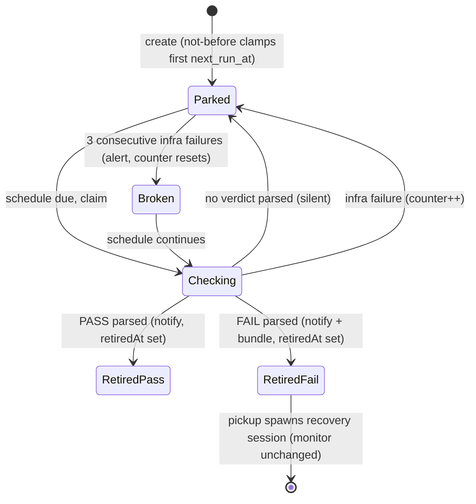
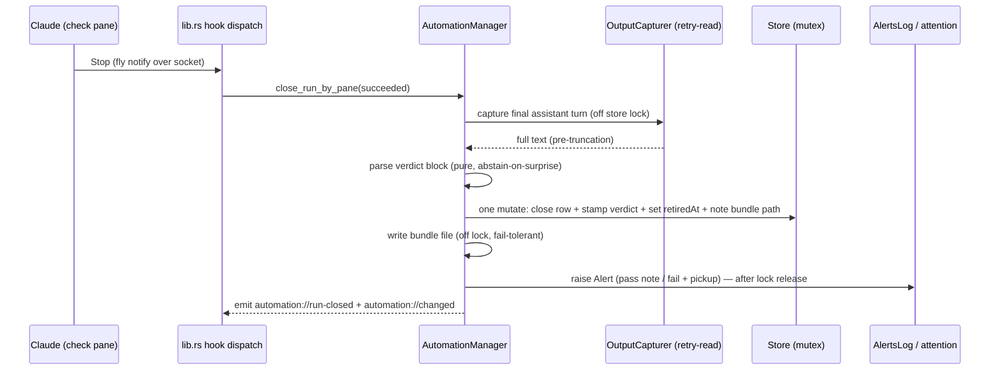

# feat: Monitor handoff — parked experiments become retiring automations

> **Addendum (2026-07-11) — check dispatch superseded.** This plan frames every
> check run as a spawned Claude *pane* (the sequence diagram's "check pane",
> `close_run_by_pane`). One day later,
> `2026-07-11-003-feat-headless-monitor-checks-plan.md` changed that: monitor
> checks now dispatch as backend-owned headless `claude -p --output-format
> stream-json` children — no pane or tab appears — with one shared
> verdict-close tail for the pane and headless paths. The verdict contract,
> retire-on-fire, bundles, and escalation below are unchanged; read the
> pane-based dispatch mechanics as the legacy path.

## Summary

Extend the automations subsystem with a monitor flavor: an agent-mode automation with a not-before time and a sparse re-check schedule that delivers one machine-readable verdict and retires. A Claude session hands its experiment monitor off via a new skill and `fly automation create --monitor`, capturing pickup pointers before its tab closes. Pass notifies; fail notifies with a durable failure bundle and a one-action dashboard pickup that spawns a fresh recovery session.

---

## Problem Frame

Long experiments currently park a full Claude session on a blocking Monitor call for hours or days: the tab clutters the GUI and a frontier session is held for work a smaller model can do (see origin: docs/brainstorms/2026-07-10-monitor-handoff-requirements.md). The origin doc treats "the monitor delivers a verdict and retires" as primitive; research showed it is the whole new mechanism — an automation-spawned pane cannot mutate automations (R22 recursion gate), so retirement must be backend-driven off a parsed verdict, and a check run that crashes or times out must not read as a healthcheck failure.

---

## Requirements

R-IDs below are plan-scoped; origin R-IDs are cited where carried forward.

**Monitor semantics**

- R1. A monitor is an agent-mode automation with a not-before time and a sparse re-check schedule; it never runs before the not-before time (origin R1).
- R2. The monitor's verdict is machine-readable: the check's final assistant message carries a structured verdict block (`PASS` / `FAIL` + note) that the backend parses at run close; unparseable output is a not-done check.
- R3. A parsed verdict retires the monitor: scheduling stops permanently, manual runs and claims are refused, without deleting the automation (origin R2).
- R4. A retired monitor's verdict, result note, and failure bundle remain accessible after retirement and app restarts (origin R3).
- R5. A check that finds the experiment still running (or parses no verdict) ends silently — no attention, no triage entry (origin R4).
- R6. A check run that fails without a verdict (timeout, crash, interruption) is an infrastructure failure, never a healthcheck verdict.
- R7. Three consecutive verdict-less failed checks raise a "monitor broken" alert; the counter resets on any clean check or after alerting.
- R8. Monitor checks resolve model/effort through the existing per-automation mechanism, defaulting to Sonnet at xhigh when unspecified (origin R5).
- R9. Monitors default `retry_on_interrupt` on, so an app-restart-interrupted check re-runs once instead of silently losing the tick.

**Handoff**

- R10. A skill teaches the parent session to write a self-contained monitor prompt (including the verdict-block contract) and register it; rough ergonomics are acceptable (origin R6).
- R11. Registration captures the pickup pointers — the parent's session id, transcript path, and cwd — at create time, pane-precise and qualified by at least one real transcript turn (origin R7).
- R12. If pointer capture fails, registration is refused with a clear error and the parent tab stays open (origin R8).
- R13. After successful registration the parent tab closes automatically (origin R9).

**Verdict and pickup**

- R14. Pass raises a notification carrying the verdict note; nothing else spawns (origin R10).
- R15. Fail raises a notification and persists a failure bundle: verdict, failure evidence, and the pickup pointers, stored outside the run-output tail cap (origin R11).
- R16. A failed monitor offers a single pickup action that spawns a fresh session pre-loaded with a prompt pointing at the bundle and the parent transcript tail (origin R12).
- R17. Pickup validates that the transcript and cwd still exist; when they don't, it shows the raw bundle with an explanation instead of a broken spawn.

**Visibility**

- R18. The dashboard distinguishes parked, retired-pass, retired-fail, broken, and paused monitors from ordinary recurring automations (origin R13).

---

## Key Technical Decisions

- **Verdict via parsed output, not a new socket verb.** The backend parses the verdict block from the check's captured final assistant turn inside the existing run-close path. A socket "report verdict" op was rejected: it would add a mutating surface at the authenticated-socket security boundary and need an R22 carve-out. Parsing follows the repo's abstain-on-surprise convention — anything unrecognized is a not-done check (R5), and R7's escalation bounds the failure mode of a persistently unparseable monitor.
- **Retirement is a new persisted marker, not pause and not delete.** Pause is `next_run_at = None` and stays resumable/manually-runnable and visually identical to user-paused rows; delete destroys run history (why origin R3 exists). A `retiredAt` field set in the same store mutation that closes the verdict run keeps the transition atomic under the KTD-B lock discipline with no strandable in-flight edge.
- **Not-before is a stored field clamping every `next_run_at` recompute** — create, resume, and post-skip recompute — using zoned time math, preserving the existing 5-min-clamp boundary-snap (no reintroduced drift), and treating the epoch-ms value as untrusted input (release builds have overflow-checks off; use checked/saturating arithmetic).
- **Bundle lives as a file; pointers live on the automation.** `RunRow.output` is tail-capped at 8 KiB — too small for stack traces — so the fail run writes a bundle file under the app data root, referenced from the run row; the short verdict note rides `RunRow.output` as usual. Pickup pointers captured at registration are stored on the `Automation` record itself so they survive run-history eviction.
- **Pickup pointers come from the registering pane's own attribution, not cwd+time inference.** The create handler resolves the origin pane's session (hook-stamped id preferred, per the `Poll < Hook < Pick` trust ranking) and qualifies its transcript the way the handoff resolver does (≥1 real turn, record-cwd-wins). Cwd+dispatch-time inference abstains in busy cwds and the parent tab is about to close — the capture must be pane-precise and happen now or refuse (R12).
- **Verdict attention rides the existing Alert path** (`Reason::Alert`, `Tier::Cli` via the alerts log and sink). The KTD5 completion-raise suppression for automation panes stays untouched — silent not-done checks (R5) fall out of existing behavior; only explicit verdict/broken alerts ring.
- **Monitors are a flavor of `Automation`, not a new entity.** New optional fields (`monitor`, `notBeforeMs`, `retiredAt`, pointers, per-run `verdict`/`bundlePath`) ride the existing camelCase serde wire contract with `#[serde(default)]` at every level and legacy-JSON round-trip tests, per the established back-compat pattern.
- **Parent tab close is app-driven.** The skill inside the pane cannot close its tab. After a successful monitor create, the backend emits `automation://monitor-registered` with the origin pane id; the frontend maps pane → leaf → tab and closes it.
- **Capture order on new paths is sanitize → scrub → truncate**, matching `feed/io.rs::clean`; the accepted residual finding that the automations capturer scrubs before sanitizing is fixed in passing where the verdict path touches it.
- **The skill ships rough**: a skill file in the repo with install-by-copy instructions, no installer machinery. It instructs Claude to list existing monitors by name before creating, which is the v1 duplicate-registration guard.
- **Missed ticks are accepted.** Verdicts arrive only while fly runs; the sweep recomputes from now with no catch-up. The not-before value composes with a recurring cron (never a one-shot expression), so a not-before moment that passes while fly is closed still yields a check at the next tick after launch.

---

## High-Level Technical Design

Monitor lifecycle (state machine over the new fields — `enabled`/`next_run_at`/`retiredAt`/failure counter):

Verdict delivery at run close (the one new mechanism; everything else reuses existing paths):

---

## Implementation Units

### U1. Monitor domain model and retire state machine

- **Goal:** `model.rs` gains the monitor vocabulary and the retire rules, pure and test-first.
- **Requirements:** R1, R3, R4, R6, R9 (foundations for all others).
- **Dependencies:** none.
- **Files:** `src-tauri/src/automations/model.rs`.
- **Approach:** New optional fields on `Automation` (`monitor: bool` via `#[serde(default)]`, `notBeforeMs`, `retiredAt`, pickup-pointer struct) and on `RunRow` (`verdict`, `bundlePath`), all camelCase with `#[serde(default)]` at parent and nested levels. `claim` and manual-run gating refuse when `retiredAt` is set (a new `ClaimError` variant); retire is idempotent; delete behavior unchanged. A monitor's consecutive-infra-failure count is derived from run history (trailing `Failed` rows without verdicts), not stored — no new state to strand.
- **Patterns to follow:** the `retry_on_interrupt` field addition and the legacy-JSON round-trip tests (`legacy_agent_mode_without_model_effort_defaults_to_none`); run-row state-machine tests around `claim`/`skip`/`close`.
- **Test scenarios:**
  - Legacy store JSON without monitor fields deserializes with defaults (round-trip both directions).
  - Claim on a retired monitor returns the retired error; manual run likewise; close of an in-flight run on a just-retired monitor still lands (idempotent, no stranded `Running` row).
  - Derived failure count: trailing `Failed`-no-verdict rows count; a `Succeeded` or verdict row resets; `Skipped` rows are neutral.
  - History eviction never evicts the verdict-bearing row while `Running` rows exist (existing eviction rules still hold with new fields).
- **Verification:** `cargo test --offline` model tests green; a pre-change store file loads unchanged.

### U2. Not-before scheduling

- **Goal:** the not-before time clamps every `next_run_at` computation without disturbing existing cadence math.
- **Requirements:** R1.
- **Dependencies:** U1.
- **Files:** `src-tauri/src/automations/schedule.rs`, `src-tauri/src/automations/mod.rs` (create / resume / `advance_or_pause` / rollback-recompute call sites).
- **Approach:** A pure composition over `advance()`: effective now = `max(now, not_before)`, saturating arithmetic on the stored epoch-ms. Applied at create's initial advance, resume's recompute, and post-skip recompute so no path schedules early.
- **Patterns to follow:** `schedule.rs` pure epoch-ms functions with injected now; the `SNAP_EPSILON_MS` boundary-snap tests (do not reintroduce drift); DST tests using zoned `chrono_tz` datetimes.
- **Test scenarios:**
  - Not-before in the past is a no-op (schedule identical with/without).
  - Not-before in the future: first `next_run_at` ≥ not-before and on a cron occurrence; a not-before moment missed while "fly was closed" (now > not-before at create/recompute) still yields the next occurrence from now.
  - Resume of a paused monitor before its not-before does not schedule early.
  - Boundary-aligned cron + not-before does not drift across occurrences; u64 near-max not-before does not overflow.
- **Verification:** schedule tests green including existing drift/DST suites.

### U3. Verdict parsing, retire-on-fire, bundle, and escalation

- **Goal:** the run-close path turns a check's output into a verdict, retires the monitor, persists the bundle, and escalates broken monitors.
- **Requirements:** R2, R3, R4, R5, R6, R7, R14, R15.
- **Dependencies:** U1.
- **Files:** `src-tauri/src/automations/verdict.rs` (new), `src-tauri/src/automations/mod.rs` (close path), `src-tauri/src/lib.rs` (capturer wiring), `src-tauri/src/automations/redact.rs` (order fix), tests in-module.
- **Approach:** `verdict.rs` is a pure parser over the captured final-turn text: recognizes one fenced verdict block shape (`PASS`/`FAIL` + free-text note), abstains on anything else. In `close_run_by_pane_with` for monitor automations: run the existing capture (retry-read; apply sanitize → scrub → truncate order), parse before truncation, then one store mutation closes the row, stamps the verdict, sets `retiredAt`, and records the bundle path; bundle-file write and alert raise happen after lock release (KTD-B). Fail bundle = verdict note + full captured turn + pickup pointers, written under the `FLY_APP_NAME` data root. Infra-failure closes (timeout/interrupt/pane-exit) never parse a verdict; when the derived consecutive count reaches 3, raise a "monitor broken" alert once and let the schedule continue. Capture abstention (busy cwd) counts as verdict-less for the escalation, so a monitor whose output can never be attributed eventually rings instead of running silent.
- **Execution note:** parser and escalation-count logic test-first as pure functions; the close-path integration rides existing manager tests.
- **Test scenarios:**
  - Parser: clean PASS, clean FAIL with multi-line note, no block → abstain, two blocks → abstain (surprise), block plus surrounding prose → parses.
  - Close with PASS: row `Succeeded` + verdict stamped + `retiredAt` set + `next_run_at` cleared in one mutation; alert raised after release; no bundle file.
  - Close with FAIL: bundle file exists with pointers + evidence; run row references it; alert raised.
  - Close with no verdict: monitor stays scheduled, nothing rings (R5).
  - Timeout/interrupted close: no verdict, counter advances; third consecutive raises broken alert exactly once, then resets.
  - Bundle-file write failure: run close and retire still land; alert notes the missing bundle (fail-tolerant, mirrors `flush_tolerant`).
  - Covers AE2 (origin), and the new AE5/AE6 below.
- **Verification:** end-to-end manager test: dispatch → simulated Stop with verdict text → retired automation with accessible verdict after a store reload.

### U4. Registration-time pointer capture and refuse

- **Goal:** monitor creation captures qualified pickup pointers from the registering pane or refuses.
- **Requirements:** R11, R12, R13 (emits the close signal).
- **Dependencies:** U1.
- **Files:** `src-tauri/src/lib.rs` (`dispatch_automation_op` create arm), `src-tauri/src/session/handoff.rs` (reuse/extract resolution), `src-tauri/src/automations/mod.rs` (create spec).
- **Approach:** For `create --monitor`, resolve the origin pane's session id via the existing attribution machinery (hook-stamped id preferred), derive and qualify the transcript path exactly as the handoff resolver does (record cwd wins, ≥1 real turn), and store `{sessionId, transcriptPath, sessionCwd}` on the new `Automation`. Unresolvable or unqualified → the create returns a specific error over the socket and nothing is stored (R12). On success, emit `automation://monitor-registered { paneId, automationId }` after the store flush.
- **Patterns to follow:** `handoff.rs::resolve_in_root` (plausibility gate, qualification); origin stamping in `handle_automation_request`; event emission after lock release.
- **Test scenarios:**
  - Create from a pane with a hook-ranked session and a real transcript turn → pointers stored verbatim.
  - No resume record / metadata-only transcript / implausible session id → create refused with the distinct error string; store unchanged.
  - Non-monitor create is untouched by the new path.
  - R22: an automation-spawned pane still cannot create (existing integration test extended with `--monitor`).
- **Verification:** `cargo test --offline --test automation_cli` green with the new cases.

### U5. CLI surface

- **Goal:** `fly automation create` grows `--monitor` and `--not-before`; list/show render monitor state.
- **Requirements:** R1, R8, R10 (the surface the skill drives).
- **Dependencies:** U1, U2, U4.
- **Files:** `src-tauri/src/cli/automation.rs`, `src-tauri/tests/automation_cli.rs`.
- **Approach:** `--monitor` (agent-mode only, like `--model`/`--effort`) and `--not-before <RFC3339 or YYYY-MM-DD HH:MM local>` parsed to epoch-ms CLI-side with pure validation; new optional fields on `AutomationRequest` (`skip_serializing_if` pattern); `show`/`list`/`runs` print parked/retired/verdict columns mirroring the dashboard sort. Help text documents the verdict-block contract in one line.
- **Patterns to follow:** `validate_agent_flags` + `VALID_EFFORTS` closed-set validation; the flat single-request-struct convention; read-ops-read-the-store-file directly.
- **Test scenarios:**
  - Flag validation: `--not-before` with bad timestamp rejected CLI-side; `--monitor` with `--script` rejected; `--not-before` without `--monitor` rejected (or accepted — pick one and test it; recommend rejected to keep not-before monitor-only).
  - Round-trip: create over a stub socket carries the new fields; show/list render retired and parked states.
- **Verification:** CLI integration tests green; `fly automation show` on a retired monitor displays the verdict.

### U6. Parent tab auto-close

- **Goal:** the registering pane's tab closes after successful registration.
- **Requirements:** R13.
- **Dependencies:** U4.
- **Files:** `src/App.svelte`, `src/ipc.ts` (event payload type), `src/lib/workspaces.ts` (existing `closeTabIn` reuse), vitest for any new pure helper.
- **Approach:** Listen for `automation://monitor-registered`; map paneId → leaf → tab (the `handleRunClosed` runId→leaf→tab mapping is the pattern); close the tab. No linger delay — registration confirmed means residue-free (origin decision). If the pane isn't found (already closed manually), no-op.
- **Test scenarios:**
  - Pure mapping helper: paneId present → tab id resolved; absent → none.
  - Close of the active tab hands focus per existing close behavior (manual check in dev build).
- **Verification:** live check with `pnpm flavor:dev`: register a monitor from a pane; the tab closes; the monitor shows parked on the dashboard.

### U7. Dashboard rows and pickup action

- **Goal:** parked/retired/broken/paused-monitor rows are distinct, and a failed monitor's row carries the pickup button.
- **Requirements:** R16, R17, R18.
- **Dependencies:** U1, U3, U4.
- **Files:** `src/lib/automations.ts`, `src/lib/HomeView.svelte`, `src/App.svelte`, `src/lib/automations.test.ts` (or colocated tests), `src/lib/handoff.ts` (prompt template reuse).
- **Approach:** Extend `AutomationRow` with monitor state derived from the new `Automation` fields (parked / retired-pass / retired-fail / broken / paused-monitor); sort: parked with recurring by next-run, retired after paused. Pickup button renders only for retired-fail rows; the automations panel's first interactive control, wired through App.svelte like other pane-spawning flows. Pickup builds a `claude` argv from the stored pointers with a pickup prompt mirroring `handoffPrompt` (prompt positional before `--add-dir`), spawning in a normal tab in the current workspace; validate transcript/cwd existence first (a small Tauri command or existing fs check) and fall back to showing the bundle text with an explanation (R17). Default the spawn to normal permission mode; the user is present at pickup.
- **Test scenarios:**
  - `automationsToRows`: each monitor state maps to the right badge and sort bucket; recurring automations unaffected.
  - Pickup argv: prompt before variadic `--add-dir`; transcript path control-char-sanitized.
  - Missing transcript/cwd → fallback branch selected (pure helper test).
  - Covers AE4 (origin).
- **Verification:** vitest green; live check: fail a toy monitor, click pickup, recovery session opens pointed at the bundle.

### U8. Skill, prompt contracts, and docs

- **Goal:** Claude can drive the whole handoff without the user learning `fly automation` syntax.
- **Requirements:** R2, R10 (and documents R9's missed-tick dependency).
- **Dependencies:** U1–U7 (documents the final surface).
- **Files:** `skills/fly-monitor-handoff/SKILL.md` (new, install-by-copy), `docs/plans/README.md` (new row), `CLAUDE.md` (automations section addendum).
- **Approach:** The skill instructs the parent session to: summarize the experiment and expected finish window; write a self-contained check prompt embedding the exact verdict-block contract and "if not finished, say so and stop" guidance; choose a sparse schedule + not-before; run `fly automation list` to avoid same-name duplicates; run `fly automation create --monitor …` (model/effort optional); confirm registration output; state that fly must be running for checks to fire. Includes the verdict-block spec verbatim so the parser and the skill cannot drift — the spec text lives in one place, referenced from both.
- **Test scenarios:** Test expectation: none — documentation and prompt-contract text; the parser contract is tested in U3.
- **Verification:** dry-run the skill text against a real session in the dev flavor: handoff → tab closes → check fires → verdict → pickup.

---

## Acceptance Examples

Origin AE1–AE4 carry forward unchanged (sparse silent checks; retire with durable bundle; refuse on capture failure; one-action pickup). Two plan-added examples cover the new mechanism:

- AE5. **Covers R6, R7.** Given a monitor whose checks time out three times in a row, when the third closes, then a "monitor broken" alert rings, the monitor is not retired, no failure bundle exists, and the schedule continues.
- AE6. **Covers R2, R5.** Given a check whose output contains no recognizable verdict block, when the run closes `Succeeded`, then no attention is raised, the monitor stays parked, and the run row carries no verdict.

---

## Scope Boundaries

Carried from origin: no minimize/bucket tab UI; no auto-spawned recovery session; no pass follow-up chains; no R22 reschedule-self carve-out; no two-stage script-gate check shape; rough skill ergonomics.

### Deferred to Follow-Up Work

- Skill installer machinery (a `fly hooks setup`-style drop into `~/.claude/skills/`); v1 is install-by-copy.
- Marking a bundle "picked up" after the recovery session spawns (double-pickup is harmless).
- Retired-row garbage collection; v1 keeps retired monitors until the user deletes them (delete routes through the existing destructive confirm and loses the bundle — documented, deliberate).
- Feed exposure of monitor state to external consumers.

---

## Risks & Dependencies

- **Verdict-block compliance is a prompt contract, not an API.** A check session may phrase its verdict loosely; the parser abstains and R7's escalation converts persistent non-compliance into a visible "broken" signal instead of silence. Mitigation lives in the skill's verbatim block spec.
- **Transcript capture abstains in busy cwds** (`sole_transcript_since` confidentiality guard): a second fresh Claude session in the experiment's cwd during a check makes the verdict unreadable that tick. Escalation bounds it; the skill recommends a dedicated cwd for noisy directories.
- **fly must be running for checks to fire** — no catch-up on missed ticks. Stated in the skill and `fly automation show`; acceptable for a desktop app (origin decision).
- **Stop-before-transcript-flush timing** is already handled by the capturer's bounded retry-read; the verdict path must stay on that seam and off the dispatch/PTY threads.
- Depends on existing subsystems as-built: alert path (`Reason::Alert`/`Tier::Cli`), attribution trust ranking, KTD-B store lock discipline, `automation://changed` dashboard refetch.

---

## Sources

- Origin requirements: docs/brainstorms/2026-07-10-monitor-handoff-requirements.md.
- Automations engine: src-tauri/src/automations/{model.rs,schedule.rs,store.rs,mod.rs,alerts.rs,redact.rs}; lock discipline and run-row state machine per docs/plans/2026-07-01-002-feat-automations-plan.md (KTD-B/KTD-D) and docs/plans/2026-07-03-002-feat-automations-workspace-and-model-plan.md (KTD5/KTD6: completion-raise suppression, capture retry-read).
- Session capture and pickup: src-tauri/src/session/{resume.rs,transcript.rs,handoff.rs}, src/lib/handoff.ts (argv ordering: prompt before `--add-dir`); attribution trust ranking per docs/plans/2026-07-03-001-fix-session-pane-attribution-plan.md.
- Dashboard/frontend: src/lib/automations.ts, src/lib/HomeView.svelte, src/App.svelte (`handleAgentRun`/`handleRunClosed`), src/lib/automation-panes.ts.
- CLI/socket: src-tauri/src/cli/automation.rs, src-tauri/src/hooks/protocol.rs, src-tauri/src/lib.rs (`dispatch_automation_op`, R22 gate) — read src-tauri/src/hooks/CLAUDE.md before touching hooks/.
- Residual finding applied in U3: docs/residual-review-findings/feat-feed-pending-question.md (sanitize → scrub → truncate order).
- Repo cautions: release overflow-checks off (bound not-before arithmetic); no catch-up in the sweep (recompute-from-now).
