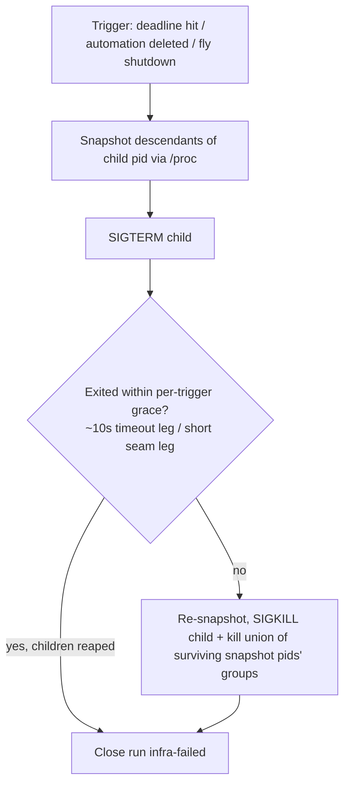

# feat: Headless monitor checks — claude -p stream-json dispatch

## Summary

Monitor checks stop dispatching as `claude` sessions in PTY panes and run instead as headless `claude -p --output-format stream-json --verbose` child processes owned entirely by the Rust backend: a new `automations/headless.rs` runner spawns the child in a clean env, reads the NDJSON stream, takes the `result` event's text as the run output, and feeds the existing verdict/retire/bundle/alert pipeline — no pane, no tab, no transcript-capture race. Regular agent automations stay pane-based; every user-visible monitor behavior is unchanged.

---

## Problem Frame

A monitor check is non-interactive by design, yet it currently rides the full interactive machinery: `stream::spawn_pane` in a background ephemeral tab, Stop-hook/pane-exit/deadline close, the KTD5 completion-raise suppression, and a transcript retry-read that exists only because Claude Code fires Stop before flushing the final turn (upstream issue #15813). All of that serves a run nobody watches. `claude -p` emits the final text directly in a `type:"result"` stream event, so the backend can own the whole check lifecycle race-free and the frontend never hears about it beyond the existing `automation://run-closed` refresh.

---

## Empirical Contract (claude 2.1.207, this box, 2026-07-11)

Pinned live per repo convention (the SessionStart-contract precedent). All probes ran with a cleaned env (no `FLY_PANE_TOKEN`, child-session markers stripped) in a scratch cwd.

- **Stream shape.** `claude -p --output-format stream-json --verbose` emits one JSON object per line. `type:"system", subtype:"init"` carries `session_id`, `model` (resolved), `cwd`. `type:"result"` carries `subtype` (`"success"` observed), `is_error`, `result` (the final assistant text), `session_id`, `num_turns`, usage/cost fields. Event types observed beyond these: `assistant`, `rate_limit_event`, and `system` subtypes `hook_started`, `hook_response`, `thinking_tokens`, `task_started`, `task_updated`, `task_notification`, `background_tasks_changed`. The full type set is officially undocumented (upstream issue #24612); events can follow `result` (a `task_notification` did). Only `init` and `result` may be depended on.
- **Transcript.** `claude -p` writes a normal transcript under `~/.claude/projects/<encoded-cwd>/<session-id>.jsonl` — FAIL bundles can point at it.
- **Kill behavior.** Claude's tool children run in their **own sessions and process groups** (a Bash tool's wrapper is a session leader), so killing claude's process group does not reach them. SIGKILL to claude orphaned a live tool child indefinitely (observed reparented and still running minutes later). SIGTERM to claude mid-tool made claude reap the child tree and exit within ~6 s; SIGTERM during the prompt phase exits fast and clean. Clean exit also reaps children, including backgrounded task processes.
- **Hook interplay.** With fly's hooks installed, a hook firing inside the check without `FLY_PANE_TOKEN` is harmless: `fly notify … --claude` exits 0 in ~27 ms with a one-line stderr skip ("not inside a fly pane") — no socket contact, no lockout pressure, no attention. Measured check overhead ~1.7 s beyond the API turn. The `-p` stream did not show fly's `Stop` hook events in-stream; nothing observed blocks the check. No `fly notify` change is needed.
- **Flags.** `-p` accepts `--model`, `--effort`, `--fallback-model`; the `init` event reports the resolved model (verified with `--model sonnet --effort low --fallback-model haiku`).
- **Quirk worth knowing.** A check's model can decide to background long work and emit `result` early; the text then reads "still running". Harmless here — the verdict parser abstains and the check reads as not-done.

---

## Requirements

**Dispatch & lifecycle**

- R1. A monitor check (scheduled, manual, or retry) runs as a backend-managed `claude -p --output-format stream-json --verbose --dangerously-skip-permissions` child: no pane, no tab, no `automation://agent-run` emission, no frontend involvement.
- R2. Claim-before-run and dispatch-off-the-store-lock invariants (automations plan R2/KTD-B) hold unchanged for headless dispatch.
- R3. The check resolves model/effort per automation exactly as pane dispatch does (`resolve_agent_launch`) and stamps the launched values on the run row.
- R4. The check is bounded by `RUN_DEADLINE_MS` (30 min); timeout kills the child (R5's discipline) and closes the run infra-failed.
- R5. Kill discipline everywhere (timeout, automation delete, app shutdown): SIGTERM to claude, a bounded per-trigger grace (long on the runner's own timeout leg; short on the delete/shutdown/backstop seam legs, which must stay fast), then SIGKILL plus a descendant-snapshot sweep — no zombies, no orphans (lifecycle bar).
- R6. Monitor automations are exempt from the claim-time frontend-ready deferral, for scheduled fires and retries.
- R7. A headless run row is exempt from the sweep's pane-oriented ack-timeout and deadline closes; a dead runner thread is caught by a kill-then-close backstop after deadline + slack, and a terminal-but-alive child is visible to the overlap check (`in_flight_widened`) through a headless in-flight probe so concurrent checks never fan out.

**Capture & verdict**

- R8. `RunRow.output` is the `result` event's text through the existing pipeline in the existing order — sanitize → scrub, tail-cap last at close — and the verdict parse sees the full cleaned text before capping. The same sanitize → scrub helper (plus a byte cap) wraps the Infra outcome's error text — the stderr tail and any child-derived reason string — before it lands on the row, a bundle, the dashboard, or an alert line; raw child stderr never crosses a surface unscrubbed.
- R9. Verdict, retire, FAIL bundle, alert ring, and the broken-monitor counter behave identically to today, driven through one shared close path with the pane route; the counter's derivation (`consecutive_infra_failures`, including near-miss fences and output-less Succeeded rows) is untouched.
- R10. Outcome classification is pure and unit-tested: spawn failure, nonzero exit without a clean result, timeout, malformed stream (EOF with no result), or a non-success result = infra-unreadable (Failed close); a success result with no verdict block = readable not-done (Succeeded close with output). A success result already seen stays Clean when the subsequent nonzero/signal exit is the runner's own lingering-exit kill — otherwise the observed backgrounding quirk (result early, claude lingers on a task) would falsely infra-fail healthy checks and ring "broken" in three; a *spontaneous* nonzero exit remains infra.
- R11. The stream parser depends only on `init` and `result`, ignores unknown event types/subtypes, and degrades any surprise to infra-unreadable — never a fabricated verdict. Lines over the per-line cap (1 MiB) are skipped without parsing; a skipped line that swallowed the `result` leaves the stream result-less → infra.
- R12. The check's `session_id` (from `init`) is stamped on the run row and rides the FAIL bundle, alongside the derived transcript path.

**Hygiene & compatibility**

- R13. Child env: `FLY_PANE_TOKEN` and `FLY_SOCKET_PATH` absent; the child-session markers fly already strips at pane spawn are stripped here too; cwd = the automation's cwd; stdin null.
- R14. New store fields are `#[serde(default)]` camelCase and legacy-JSON round-trip tested (the model crosses the store file, the socket, and the dashboard).
- R15. Regular agent automations keep the pane path and the transcript retry capture; monitor registration and pickup flows are untouched.
- R16. The frontend needs no changes: `automation://run-closed` for a run with no tab is a no-op (verified in `handleRunClosed`; `automationRunIdByLeaf` is populated only by `handleAgentRun`), and the full `automation://` listener set (`agent-run`, `run-closed`, `monitor-registered`, `alert-pending`, `changed`) carries no other monitor-run expectation — the dashboard's `infra_failures` is precomputed backend-side.
- R17. `CLAUDE.md`'s Monitors paragraph and `docs/plans/README.md` are updated when the work lands.

---

## Key Technical Decisions

- **SIGTERM-first kill, SIGKILL as swept fallback, per-trigger grace.** Empirically (2.1.207), claude's tool children live in their own sessions — group-kill cannot reach them, and SIGKILL provably orphans them — while SIGTERM triggers claude's own child reaping. The one kill sequence: snapshot descendants via /proc, SIGTERM the child pid, bounded grace, then re-snapshot and SIGKILL plus kill the union of surviving snapshot pids' groups (post-mortem discovery is impossible — orphans reparent; the second snapshot catches anything forked during the grace). The grace is per-trigger, mirroring `script.rs`'s split: the runner's own deadline kill affords ~10 s (observed clean exit ≤6 s); the delete/shutdown/backstop seam legs use a short grace on the `SEAM_KILL_GRACE` precedent ("the shutdown path must stay fast") — the snapshot sweep, not the grace, is the no-orphan guarantee there. Deaths between snapshot and kill are benign (ESRCH ignored). This deliberately diverges from `script.rs`'s pgid-kill (KTD-I), which remains correct for scripts.
- **Synchronous std::process + threads, no new crates.** The crate is deliberately non-async (the `tiny_http` precedent); the runner is one named thread per check with pipe-reader threads and a `try_wait` poll loop, mirroring `script.rs`.
- **One shared verdict close path.** The monitor verdict logic currently embedded in the pane close (`close_run_by_pane_with`: parse → `close_monitor_run_retiring` | ordinary close + escalation + run-closed emit) is extracted into a close-by-run-id entry that takes already-captured text. The pane path calls it after transcript capture; the headless path calls it with the result text. Retire semantics exist in exactly one place.
- **Row-level `headless` marker, derived at claim.** `RunRow.headless` is set by `Automation::claim` for monitor agent claims (no call-site signature churn). The sweep's two pane-oriented probes both exclude headless rows: the ack-timeout (they never link a pane, so every check over 30 s would force-fail) and the existing `RUN_DEADLINE_MS` close (its filter has no pane requirement, and it races the runner's own deadline — the sweep counts epoch time, the runner monotonic, so a laptop suspend would let the sweep close a healthy check first and discard its later verdict as AlreadyClosed). In their place, a headless backstop at deadline + slack (a named constant beside `RUN_DEADLINE_MS`, e.g. `HEADLESS_DEADLINE_SLACK_MS` ≈ 60 s) best-effort kills through the in-flight registry, then closes the row — so the runner's close normally wins and a dead runner thread's live child can't overlap the next occurrence. The backstop must not itself reintroduce the suspend race: it fires only when the epoch age exceeds deadline + slack AND the registry entry's *monotonic* deadline (the spawn `Instant` stored in the entry) has also lapsed — or the entry is gone entirely — so a suspend longer than the slack can never kill a healthy check. Startup recovery already closes any pre-upgrade Running rows, so no old pane-based monitor row survives into the new rules; child pids live only in the in-memory registry, never on the row, so recovery has nothing to clear (and an old binary rewriting a new store merely drops the marker on already-terminal rows — harmless).
- **Tolerant NDJSON parsing, abstain-to-infra.** Parse each line as loose JSON, key on `type`/`subtype` only, take the sole `result` — a second `result` event is a surprise → infra-unreadable — and ignore everything else (the observed wild types make this concrete, not hypothetical). Anything surprising — oversized line, unparsable line run, non-success result, EOF without result — classifies infra-unreadable, which the existing broken-monitor escalation already bounds at three.
- **Clean env via the existing strip list, not `env_clear`.** The child-session marker list at `src-tauri/src/pty/pane.rs` (`CLAUDE_CODE_CHILD_SESSION` etc.) is shared with the runner rather than duplicated; `FLY_PANE_TOKEN`/`FLY_SOCKET_PATH` are additionally removed. `script.rs`'s `env_clear` + allowlist was considered and rejected for claude children: claude legitimately consumes ambient env (HOME for `~/.claude` credentials, PATH, proxies/CA overrides), the pane spawn precedent for claude is inherit-minus-strip, and the probes validated exactly that posture. Without the pane env vars the child cannot reach the socket at all — the CLI's mutating ops hard-require `FLY_PANE_TOKEN`/`FLY_SOCKET_PATH` and the socket enforces token + `SO_PEERCRED` auth — so the automation-mutation surface is closed *before* the pane-keyed R22 registry check would even apply, and the no-token hook path is a measured 27 ms no-op. That single env property is load-bearing twice over — a leaked token would post a phantom pane's attention *and* re-open the automation-mutation surface — so U3 guards it with a refactor-proof test.
- **Timeout reuses `RUN_DEADLINE_MS`.** No argument was found for a different bound; one constant keeps the sweep backstop arithmetic honest.
- **Frontend-ready gate bypassed for monitors — at the claim gate.** The gate exists so `automation://agent-run` events aren't dropped before the frontend listens, and it bites at *claim* time: `sweep_once` defers every due agent-mode automation entirely (no claim, no advance) until `automations_frontend_ready` flips, and the retry-queue drain defers likewise. A headless check has no event to drop, so both gates carve out monitor automations.
- **Routing lives in the existing `CompositeDispatcher`.** `lib.rs`'s dispatcher grows a third arm: `dispatch_agent` for a `monitor` automation hands to the `HeadlessRunner` instead of emitting `automation://agent-run`; regular agent automations and scripts are untouched. The manager's `dispatch()` stays dispatcher-agnostic, dispatch failures keep feeding the existing monitor `infra_failed` escalation, and the runner is constructed with the manager closer exactly like `ScriptRunner`.
- **Scrub reuse by extraction.** The sanitize → scrub → non-empty composition inside `lib.rs`'s `OutputCapturer` closure becomes a named helper used by both that closure and the headless runner, so the order invariant (sanitize first, cap last) cannot drift between paths.

---

## High-Level Technical Design

A headless check, end to end:

```mermaid
sequenceDiagram
    participant Sweep as Sweep (store lock)
    participant Mgr as AutomationManager
    participant HR as HeadlessRunner (own thread)
    participant CC as claude -p (child)
    participant Store as Store

    Sweep->>Store: claim + flush (R2, persist-before-dispatch)
    Sweep->>Mgr: dispatch (lock released, KTD-B)
    Mgr->>HR: run(automation, run_id, resolved launch)
    HR->>CC: spawn: clean env, cwd, stdin null, stream-json argv
    HR->>HR: register child in in-flight registry
    CC-->>HR: NDJSON lines (init → … → result → …)
    HR->>HR: session_id from init; sole result (second → infra); ignore unknowns
    CC-->>HR: EOF + exit (or deadline → kill discipline)
    HR->>HR: classify (pure): clean result | infra
    HR->>Mgr: close by run id with cleaned text
    Mgr->>Store: verdict parse → retiring close | ordinary close (one mutation)
    Mgr-->>Mgr: bundle write + alert + escalation + run-closed emit (off lock)
```

Kill discipline (timeout, delete, shutdown — one sequence):



---

## Assumptions

Unvalidated bets, labeled per non-interactive planning; each is cheap to confirm during implementation and none blocks starting.

- Only `subtype:"success"` result events were observed live; non-success subtypes are treated as infra-unreadable on the abstain-on-surprise convention, not from observed behavior.
- A fly *crash* (not clean shutdown) orphans the child, which is assumed to self-terminate on a stream-write error against the closed pipe (claude is Node — libuv ignores SIGPIPE, so this is best-effort, and a child deep in a long tool call may not write for minutes). Monitors default `retry_on_interrupt` on, so the restarted app re-dispatches while the orphan may still live: state-wise benign (the orphan's row is already closed; its verdict goes nowhere) but it briefly doubles spend and could collide on cwd side effects. Accepted; U7 observes the self-termination once. **U7 observed (2026-07-11, 2.1.207): better than assumed — fly SIGKILLed while the check was mid-tool (`sleep 45`), and the orphaned claude exited within ~5 s (not at the tool's end), reaping its tool child with it; no survivor. The minutes-scale bound stands as the worst case, but the observed behavior is prompt exit on pipe closure.**
- A 1 MiB per-line cap is assumed sufficient for real `result` events; an over-cap line degrades to infra-unreadable rather than a wrong verdict.
- SIGTERM child-reaping was proven once live; the model's mid-check state varies, so the descendant sweep is kept as the guaranteed floor rather than trusting SIGTERM alone.

---

## Implementation Units

### U1. Stream event model and outcome classification (pure core)

- **Goal:** `headless.rs` gains the tolerant NDJSON event model and the pure infra-vs-readable classification, test-first.
- **Requirements:** R10, R11, R12 (foundations).
- **Dependencies:** none.
- **Files:** `src-tauri/src/automations/headless.rs` (new), unit tests in-module.
- **Approach:** A line parser producing a minimal event view (`Init { session_id }`, `Result { success, text }`, `Other`) keyed on `type`/`subtype` over loose JSON — unknown shapes are `Other`; lines are handled as bytes and parsed per line (never lossy-converted across a split UTF-8 char). A fold over events plus exit status / timeout / runner-initiated-kill flags yields `CheckOutcome::Clean { text, session_id } | Infra { reason }` per R10's table; a second `Result` event is a surprise → Infra (the verdict parser's two-blocks-abstain convention, applied to the stream). Keep both halves free of process/IO types so tests need no child process.
- **Execution note:** test-first, house style for pure state machines.
- **Test scenarios:**
  - The captured real stream (init + assistant + rate_limit_event + result) → Clean with the exact result text and session id.
  - Unknown event types/subtypes (including `thinking_tokens`, `task_notification` after `result`) are ignored; result-then-more-non-result-events still Clean; a second `result` event → Infra.
  - EOF with no result event + exit 0 → Infra("no result event"); nonzero exit with no result → Infra carrying the exit code and stderr tail; timeout flag → Infra("timed out …").
  - `is_error: true` or `subtype != "success"` result → Infra (abstain-on-surprise), never Clean.
  - Malformed JSON line mid-stream is skipped; a stream that is *only* garbage → Infra; over-cap line (>1 MiB) → skipped and the run ends Infra when it swallowed the result.
  - Success result seen, then the runner's lingering-exit kill (exit by signal) → still Clean; spontaneous nonzero exit with no result → Infra.
  - Control chars / ANSI in the stderr tail never reach the stored Infra reason (routed through the shared sanitize → scrub helper with a byte cap).
  - Empty `result` text → Clean with empty text; the shared cleaning helper then maps empty-to-None so the row reads *unreadable* in the derived counter — exact parity with a pane capture that came back empty (assert the end-to-end mapping in U4).
- **Verification:** classification tests enumerate every R10 row; `cargo test --offline` green.

### U2. Run-row model: headless marker, session id, sweep exemptions

- **Goal:** the store model distinguishes headless rows and the sweep's pane-oriented probes leave them alone.
- **Requirements:** R7, R12, R14.
- **Dependencies:** none (parallel with U1).
- **Files:** `src-tauri/src/automations/model.rs`, `src-tauri/src/automations/mod.rs` (probe call sites), tests in both.
- **Approach:** `RunRow.headless: bool` (`#[serde(default)]`) derived inside `Automation::claim` from `self.monitor` + agent mode — no claim-signature churn; `RunRow.session_id: Option<String>` (`#[serde(default)]`, camelCase, skip-serializing-if-none). Both pane-oriented sweep probes exclude headless rows (`ack_timed_out_agent_runs` and `deadline_expired_agent_runs` — see the KTD for the suspend-race rationale); a new `headless_deadline_expired_runs` returns Running headless rows past `RUN_DEADLINE_MS` + `HEADLESS_DEADLINE_SLACK_MS` (the KTD's named constant; the epoch leg only — U4's wiring adds the registry's monotonic gate), wired into the sweep as kill-then-close (U4 invokes the killer seam before the failed-close + escalation + run-closed flow). `consecutive_infra_failures` is untouched — headless closes land as Failed (infra) or Succeeded-with-output (readable), which the existing derivation already reads correctly.
- **Patterns to follow:** the monitor-handoff field additions and legacy round-trip tests; `deadline_expired_agent_runs`' shape and doc-comment style.
- **Test scenarios:**
  - Legacy store JSON without `headless`/`sessionId` round-trips with defaults, both directions.
  - Claim on a monitor derives `headless: true`; on a regular agent automation, false; manual and retry claims likewise.
  - Ack-timeout: a pane-less headless row at ack-timeout + 1 is NOT closed; a pane-less regular agent row still is.
  - Deadline exclusion: a Running headless row at deadline + 1 is not returned by `deadline_expired_agent_runs`; a pane-linked regular agent row still is.
  - Backstop: a Running headless row past deadline + slack is returned; at deadline + slack − 1 it is not; terminal rows never.
  - History eviction with the new fields present keeps existing guarantees (existing eviction tests extended).
- **Verification:** model tests green; a pre-change store file loads unchanged.

### U3. The headless runner: spawn, read, timeout, kill

- **Goal:** the process-owning half of `headless.rs`: spawn the child correctly, drive U1's parser, enforce the deadline, and kill without orphans.
- **Requirements:** R1 (process shape), R4, R5, R13.
- **Dependencies:** U1.
- **Files:** `src-tauri/src/automations/headless.rs`, `src-tauri/tests/headless_runner.rs` (new integration test), `src-tauri/tests/fixtures/headless/` (fake-claude fixture scripts), `src-tauri/src/pty/pane.rs` (export the marker strip list).
- **Approach:** `HeadlessRunner` holds the manager closer (the `ScriptRunner` wiring pattern), an in-flight registry (`run_id → child pid + start-time + spawn `Instant` + automation id`; also serves U4's overlap probe and the backstop's monotonic gate), and an injectable claude binary path (tests point it at fixture scripts). Registry semantics: the overlap probe tests child *liveness* via pid + start-time, never mere entry presence; the backstop evicts the entry after its kill; the registry lock is held only for map access, never across a kill grace (lookup, release, then signal); the backstop's kill also `waitpid`s the pid (bounded WNOHANG loop) when the owning runner thread is gone, so that path reaps as well as kills. Per check, one named thread (`fly-monitor-check`): build argv `-p --output-format stream-json --verbose --dangerously-skip-permissions [--model/--effort/--fallback-model] <prompt last>` (pane argv parity, `App.buildAgentArgv`; without skip-permissions every check would stall on its first tool ask into a deadline infra-fail); spawn with `process_group(0)` (isolates claude from fly's signal context; it does NOT reach tool children, which fork their own sessions per the Empirical Contract — the snapshot sweep is the real orphan guarantee), cwd = automation cwd, stdin null, env minus `FLY_PANE_TOKEN`/`FLY_SOCKET_PATH` and the shared pane.rs marker list; stdout reader with the per-line cap feeding U1, stderr drained concurrently to a small tail (a chatty child must never block on a full pipe and misread as timeout); deadline via monotonic `try_wait` poll (`script.rs` poll pattern). Stream-end policy: result seen then stdout EOF or lingering exit → bounded grace, then kill; EOF with no result → kill immediately, Infra — never wait out the deadline. `kill_and_reap(run_id)`: snapshot descendants via /proc *before* the first signal (post-mortem they reparent and a PPID walk misses them; pid + start-time pinning bounds reuse, cross-session residue accepted like `drain_captures`), SIGTERM, bounded grace, SIGKILL + kill surviving snapshot pids' groups — kill-confirm-then-close, so the runner's close beats the sweep backstop. Spawn failure closes immediately as Infra. The registry entry is removed on every exit path.
- **Test scenarios:** integration, against fixture scripts standing in for claude:
  - Happy verdict: fixture emits init + result with a PASS block → run closes Succeeded with the text, session id stamped.
  - No-verdict: success result without a block → Succeeded with output, monitor not retired.
  - Malformed stream: garbage lines, then exit 0 → Failed(infra).
  - Nonzero exit, no result → Failed carrying exit code + stderr tail.
  - Hang-until-timeout: fixture sleeps past a test-shortened deadline → killed, Failed("timed out"), no fixture processes left (assert on the process table).
  - Kill-and-reap: fixture spawns a `setsid` grandchild then hangs; timeout kill leaves no survivor from the snapshot.
  - Env hygiene (refactor-guard, the `script.rs` env-test pattern): fixture dumps its env; assert `FLY_PANE_TOKEN` and `FLY_SOCKET_PATH` are absent (this single property is what keeps installed hooks no-op AND blocks automation mutations from inside a check — the headless R22 equivalent), the child-session markers are stripped, and cwd is the automation's.
  - UTF-8 split across read chunks inside a line survives intact (bytes-per-line parsing).
- **Verification:** `cargo test --offline --test headless_runner` green; no stray fixture processes after the suite (the tests assert it).

### U4. Manager routing and the shared verdict close

- **Goal:** monitors dispatch to the runner instead of the pane path, and both paths close through one verdict pipeline.
- **Requirements:** R1, R2, R3, R6, R8 (parse-before-cap), R9, R15, R16.
- **Dependencies:** U1, U2, U3.
- **Files:** `src-tauri/src/automations/mod.rs`, tests in-module; `src/App.svelte` + `src/lib/automation-panes.ts` (verification only, no expected change).
- **Approach:** Routing rides the dispatcher seam (KTD above): the manager's `dispatch()` is unchanged — launch resolution + `set_run_launch` already happen there — and `lib.rs`'s `CompositeDispatcher.dispatch_agent` forks on `automation.monitor` to the runner (U5 wires it), so no `automation://agent-run` is emitted and dispatch failures keep feeding the existing monitor `infra_failed` escalation. Manager-side, this unit: (1) one run-id-keyed close-with-text entry (`close_run_with_capture`-shaped) that re-homes the THREE monitor behaviors living only on the pane-keyed close today — the `automation://run-closed` emit (plain `close_run` never emits it), the verdict-less-Succeeded escalation legs (plain `close_run` checks escalation only on Failed — without them a monitor emitting near-miss/empty results never rings broken), and the atomic close+verdict+retire via the existing private `close_monitor_run_retiring` with the `retired_at`/Succeeded parse gate re-checked — never a runner-side reimplementation. Today's parse input is the capturer's return, never the outcome's output slot, so no existing close entry substitutes; the pane path keeps its transcript capture and delegates to the same tail. (2) Carve monitors out of the claim-time frontend-ready deferral and the retry-drain gate. (3) Widen the delete and `shutdown()` kill gates beyond `RunMode::Script` and wire the U2 backstop kill-then-close, all through the headless killer seam. (4) Widen `in_flight_widened` with a headless in-flight probe (the runner registry): a terminal-but-alive child blocks the next claim and manual runs, like a deadline-failed pane that is still alive. The transcript retry (`CAPTURE_ATTEMPTS`) and the `sole_transcript_since` busy-cwd abstention become unreachable on the monitor path — they stay for regular agent automations.
- **Test scenarios:**
  - Dispatch routing: a due monitor invokes the headless seam and emits no agent-run; a due regular agent automation still routes to `Dispatcher::dispatch_agent`; manual run on a monitor routes headless.
  - Launch resolution: a monitor with per-automation model/effort dispatches headless with those values resolved and stamped on the row (`set_run_launch` parity with the pane path).
  - Shared close: headless close with verdict text retires in one mutation (verdict + `retiredAt` + bundle path), rings the alert sink, emits run-closed; pane-path behavior byte-identical to today's tests (existing suite stays green unmodified where possible).
  - Escalation parity: three headless infra closes ring "monitor broken" once; a readable not-done resets; dispatch-failure (seam returns Err) closes failed and counts; three Succeeded closes with near-miss openers (or empty-to-None output) ring broken — the Succeeded escalation legs live on the new entry.
  - Overlap probe: with a terminal headless row whose registry entry is still alive, the next scheduled claim skips and `manual_run` refuses, mirroring the pane alive-probe widening.
  - Empty result text end-to-end: Clean("") closes Succeeded with output None and reads unreadable in the derived counter (pane parity, from U1).
  - Frontend-ready gate: a due monitor is claimed and dispatched with the gate down; a due regular agent automation is still deferred un-claimed; a monitor retry does not requeue on the gate.
  - Backstop kill-then-close: a Running headless row past deadline + slack with a live registry entry gets the killer invoked before the Failed close (U2's model half returns the rows; this unit wires the kill).
  - Delete mid-check invokes the headless killer and closes the row deleted; shutdown closes it interrupted (extend the existing R5 shutdown test).
  - Retirement race: verdict close on a monitor retired by a concurrent path lands as the existing idempotent no-op.
- **Verification:** full `cargo test --offline` green; `pnpm check` + `pnpm test:unit` green (frontend untouched — this asserts it).

### U5. lib.rs wiring and scrub-pipeline reuse

- **Goal:** the runner is constructed and injected at startup, and both capture paths share one cleaning helper.
- **Requirements:** R8, R12, R5 (shutdown wiring).
- **Dependencies:** U3, U4.
- **Files:** `src-tauri/src/lib.rs`, `src-tauri/src/lifecycle.rs`, `src-tauri/src/automations/redact.rs` (or a sibling home for the shared helper), `src-tauri/src/automations/verdict.rs` (bundle body: the check-session block).
- **Approach:** Extract the `sanitize_multiline → scrub_secrets → non-empty` composition from the `OutputCapturer` closure into a named helper in `redact.rs` (returns `Option<String>`; tail-cap stays OUT of the helper — it remains at close inside `Automation::close`, always after the verdict parse, so R8's parse-before-cap holds by construction); the closure and the headless runner both call it, and the runner also routes the Infra stderr-tail/reason text through it (R8) — headless must not inherit `script.rs`'s unscrubbed capture pattern. `lib.rs` setup constructs `HeadlessRunner` with the manager closer (the `ScriptRunner` `Weak`-manager pattern) and adds the `CompositeDispatcher` third arm: `dispatch_agent` on a monitor automation → runner, everything else unchanged; the killer seam is injected for the delete/shutdown/backstop paths. `lifecycle.rs` ordering: the runner's in-flight kills ride `AutomationManager::shutdown()`, which already runs after the sweep join and before the PTY reap — verify the doc comment stays truthful. Session id from `Clean` outcomes is stamped on the row in the shared close and written into the FAIL bundle body with the derived transcript path (`~/.claude/projects/<encoded-cwd>/<session-id>.jsonl`, per the empirical contract) — rendered in `verdict.rs`'s bundle body under its own clearly-labeled block (e.g. "Check session"), distinct from the registration-time "Pickup pointers" block, so an operator triaging a FAIL never conflates the check's diagnostic session with the parent session pickup targets.
- **Test scenarios:** covered by U3/U4 suites plus:
  - The shared cleaning helper: control chars stripped before scrubbing (a control char inside a token cannot split it past the scrub), empty-after-scrub → None.
  - FAIL bundle content includes session id + transcript path (extend the existing bundle test).
- **Verification:** `cargo test --offline` green; a debug build boots with the runner wired (no unwired-seam panic on a monitor dispatch).

### U6. Docs

- **Goal:** the repo's self-description matches the new dispatch reality.
- **Requirements:** R17.
- **Dependencies:** U4 (final shape known).
- **Files:** `CLAUDE.md` (Monitors paragraph), `docs/plans/README.md` (new row), `skills/fly-monitor-handoff/SKILL.md` (accuracy pass only).
- **Approach:** Rewrite the Monitors paragraph's dispatch sentence (checks are headless `claude -p` children; pane dispatch retired for monitors; capture from the `result` event, no transcript race; a running check is visible only as its dashboard row); add the README row mapping this plan to its code. The skill's verdict contract is untouched (`VERDICT_BLOCK_SPEC` unchanged — the edit-only-together rule is not triggered); verify its prose makes no pane/tab promise about checks (registration prose stays). Note the deferred follow-up (headless for regular agent automations) in this plan's Scope Boundaries, not in CLAUDE.md.
- **Test scenarios:** Test expectation: none — documentation.
- **Verification:** CLAUDE.md and README accurately describe the shipped behavior; grep for stale "background ephemeral tab" claims about monitor checks.

### U7. Live validation (dev flavor)

- **Goal:** the acceptance bar: a real end-to-end headless check observed on this box.
- **Requirements:** R1, R4, R5, R9, R16 (observed, not just tested).
- **Dependencies:** U1–U5.
- **Files:** none (validation; findings recorded in the PR/commit and, if surprising, back into this plan's Empirical Contract).
- **Approach:** In `pnpm flavor:dev`: register a throwaway monitor from a pane (`fly automation create --monitor …`), force a manual run, and observe: run claimed → child spawned with **no tab appearing** → verdict parsed → retire + alert ring → dashboard retired state. Repeat with a FAIL-verdict prompt: bundle file exists, pickup works. Exercise one timeout/kill path (short prompt with an artificially long tool, or shutdown mid-check) and assert no orphaned processes. Observe the crash-orphan assumption once: kill dev fly hard mid-check and confirm the child dies on its next stream write.
- **Test scenarios:** Test expectation: none — live validation checklist (the automations-workspace LIVE-CHECKLIST precedent).
- **Verification:** every checklist item observed; any deviation from the Empirical Contract recorded there before merge.

---

## Acceptance Examples

- AE1. **Covers R1, R16.** Given a parked monitor due now, when the sweep claims and dispatches it, then no tab or pane appears for the check, `automation://agent-run` is never emitted, and the dashboard row updates via `automation://changed`/`run-closed` alone. (A verdict at close may still single-flight the shared Automations alerts-log tab via `automation://alert-pending` — existing behavior for every alert, unchanged by this plan.)
- AE2. **Covers R10, R9.** Given a check whose child exits 0 with a success `result` containing no verdict block, when the run closes, then the row is Succeeded with the cleaned text as output, the monitor stays parked, nothing rings, and the broken counter reads zero.
- AE3. **Covers R4, R5, R10.** Given a check still streaming at the 30-minute deadline, when the runner kills it, then SIGTERM precedes SIGKILL, no descendant survives, and the row closes Failed("timed out"), advancing the broken counter.
- AE4. **Covers R5.** Given fly shutting down mid-check, when `AutomationManager::shutdown()` runs, then the child tree is killed by the same discipline and the row closes interrupted — no zombies or orphans after exit.
- AE5. **Covers R11.** Given a stream carrying unknown event types before and after the `result`, when the run closes, then the outcome derives from the `result` alone and the unknowns change nothing.

---

## Scope Boundaries

- Regular (non-monitor) agent automations stay pane-based — no conversion, no config flag (YAGNI).
- Monitor registration (`create --monitor`, handoff qualification, `automation://monitor-registered`, residue close) and pickup (`monitor_pickup_check`, `buildMonitorPickupCommand`, `read_monitor_bundle`) are untouched.
- No Agent SDK; plain `claude -p` child process only.
- The verdict block contract (`VERDICT_BLOCK_SPEC` + skill text) is unchanged.

### Deferred to Follow-Up Work

- ~~Headless dispatch as an option for regular agent automations (per-automation or config-default flag)~~ — **done** (2026-07-31, `2026-07-31-001-feat-headless-agent-automations-plan.md`: the default, not just an option).
- ~~Surfacing the check's `session_id`/transcript path in the dashboard or CLI `runs` output~~ — **done** (same plan: `runs` prints the session id, `-v` the derived transcript path).
- Retiring the transcript-retry capture entirely — **half-closed** by the same plan: unreachable for headless runs (now the default), still live behind the explicit `--paned` path; full removal stays deferred there.

---

## Risks & Dependencies

- **Undocumented stream contract.** The stream-json type set is officially undocumented (issue #24612) and pinned here only against 2.1.207. Mitigation: R11's tolerant parser, fixture tests that replay the captured real stream, and the abstain-to-infra rule — a future claude that breaks the contract yields "monitor broken" within three checks, never a silent or wrong verdict.
- **Kill discipline rests on observed 2.1.207 behavior.** SIGTERM-reaps-children was proven live but is claude's behavior, not an API. The pre-kill descendant snapshot is the guaranteed floor; U3's kill tests enforce it against fixtures, U7 against the real binary.
- **Crash orphans.** A SIGKILLed fly cannot run kill discipline; the child is assumed to die on EPIPE at its next stream write (Assumptions). Bounded and observed once in U7; startup recovery closes the row interrupted and `retry_on_interrupt` re-runs the check.
- **Model non-compliance shapes** (backgrounding work, premature result) read as not-done checks — already bounded by the existing escalation; noted in the Empirical Contract quirk.
- **No headless concurrency cap.** N simultaneously-due monitors spawn N claude children (the sweep's capacity skip is script-only). Accepted: monitors are sparse by design (not-before floor + sparse cron); the KTD-D capacity pattern is available if real usage disproves this.
- **Pause does not kill an in-flight check**, and that check's verdict can still retire a paused monitor — existing semantics, but now with no tab there is nothing to see while it burns. Documented, not changed; the dashboard row remains the only surface.
- **Flush-failed retire + crash = double verdict delivery.** `close_monitor_run_retiring` is flush-tolerant; a crash before the next flush reloads an unretired monitor whose interrupted check re-runs via `retry_on_interrupt`. Pre-existing shape made automatic by headless retries; accepted — bundle names are automation+run keyed, so nothing overwrites.
- **Visibility regression, deliberate:** a running check no longer appears anywhere live (no pane, no activity signal, no feed-roster agent entry — external feed consumers see only the automations leg) — only the dashboard automation row. This is the point of the change, but it is a behavior users of pane-based monitors could notice; U6's CLAUDE.md wording states it.
- **Dispatch-timing change, minor and deliberate:** monitors no longer wait on the claim-time frontend-ready gate or the retry drain's deferral, so a startup-coincident or crash-retried check can fire earlier than it would today. The "user-visible behavior unchanged" promise is scoped to monitor *semantics* (verdicts, retire, bundles, alerts), not dispatch timing.
- Depends on existing subsystems as-built: claim/flush discipline (KTD-B), monitor verdict pipeline and escalation (monitor-handoff U3/R7), alert path, startup recovery + `retry_on_interrupt`, `script.rs` process-discipline precedent.

---

## Sources

- Empirical probes on this box, 2026-07-11, `claude --version` 2.1.207 (stream capture, transcript check, SIGTERM/SIGKILL orphan tests, no-token hook timing, flag acceptance) — recorded in the Empirical Contract above.
- Monitor mechanism as-built: `src-tauri/src/automations/{mod,model,verdict,script,redact}.rs` — dispatch `mod.rs::dispatch`, close `mod.rs::close_run_by_pane_with` / `close_monitor_run_retiring`, probes `ack_timed_out_agent_runs` / `deadline_expired_agent_runs`, counter `model.rs::consecutive_infra_failures`, process discipline `script.rs` (KTD-I).
- Capture pipeline: `src-tauri/src/lib.rs` `set_output_capturer` closure (sanitize → scrub → non-empty; order rationale in-comment), `session/transcript.rs::capture_final_assistant_since`.
- Dispatcher and alert wiring: `src-tauri/src/lib.rs` `CompositeDispatcher` (the third-arm routing home), `ScriptRunner` construction (the `Weak`-manager closer pattern), `surface_alert` + `raise_alert` (verdict alerts are process-agnostic `(name, line)` strings — nothing changes headless).
- Shutdown ordering: `src-tauri/src/lifecycle.rs`; manager `shutdown()` + delete-path script kills in `automations/mod.rs`.
- Frontend tolerance: `src/App.svelte::handleRunClosed` (unknown runId no-op), `src/lib/automation-panes.ts`.
- Env strip list: `src-tauri/src/pty/pane.rs` (child-session markers).
- Prior plans: `docs/plans/2026-07-10-002-feat-monitor-handoff-plan.md` (monitor semantics, IDs cited as "monitor-handoff"), `docs/plans/2026-07-01-002-feat-automations-plan.md` (R2/KTD-B), `docs/plans/2026-07-03-002-feat-automations-workspace-and-model-plan.md` (launch resolution, capture seam), `docs/plans/2026-07-05-001-feat-automations-interrupt-resilience-plan.md` (recovery/retry).
- Repo cautions from memory/docs: Stop-precedes-transcript-flush (the race this removes for monitors), child-session-no-livestate (why markers are stripped), release overflow-checks off (bound deadline arithmetic).
