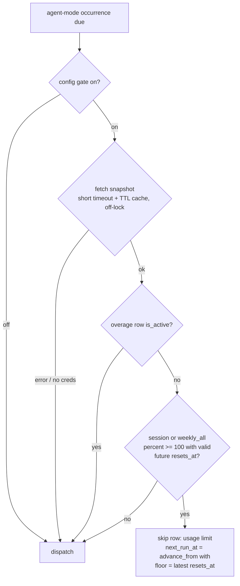

# feat: Automation usage-limit deferral

## Summary

When the Claude subscription plan is at its usage limit, a scheduled agent-mode
automation today dispatches blind: the sweep claims the occurrence, launches
`claude`, and the run burns against a wall. Nothing in the subsystem consults
plan usage or the limit's reset time — `next_run_at` is pure cron math — so the
automation keeps firing into the exhausted window on every occurrence. The
failure modes are worse than wasted dispatches:

- A **pane-mode** run's turn that dies at the limit still ends with a `Stop`
  hook, and `close_run_by_pane` closes any Stop **`Succeeded`** — the run
  history records a success whose "output" is the limit message (or nothing).
- A **headless monitor check** at the limit classifies infra-unreadable
  (non-success `result` → Failed close, `headless.rs` R10), so a weekend spent
  at the weekly cap can accumulate three consecutive infra failures and falsely
  ring **"monitor broken"** on a perfectly healthy monitor.

This plan adds a **usage gate**: before claiming a due agent-mode occurrence,
the sweep consults a plan-usage snapshot (the same `GET /api/oauth/usage` the
dashboard gauges already use, KTD-C of the dashboard plan); if a gating window
is confidently at 100%, the occurrence is recorded as a **pre-claim `Skipped`
row** (reason in `error`, exactly like the R7 overlap and U5 capacity skips of
the automations plan) and `next_run_at` is recomputed **with a floor of the
window's `resets_at`** — the existing not-before floor primitive in
`schedule::advance_from`. The automation literally "figures out the next point
in time at which it can run": one honest skip row per limit episode, then the
next fire lands at the first cron occurrence at-or-after the reset.

The gate is **fail-open by design**: it may only ever *delay* a run, and only
on a confident at-limit read. Missing credentials, a fetch error, active
overage billing, a stale or absurd `resets_at`, or any parse surprise all
dispatch normally. Scripts (no model spend) and manual runs (a user is
watching) are never gated.

No store-schema, socket, or frontend change is required: the skip row reuses
existing fields, and the dashboard/CLI already render both skipped rows and a
moved `next_run_at`.

---

## Problem Frame

What the code does today (all paths verified in-tree):

- **Scheduling is blind to usage.** `next_run_at` is always
  `schedule::advance_from(cron, tz, now, not_before)` — cron + timezone + the
  R1 min-gap clamp + the monitor not-before floor. No consumer of `usage/`
  exists outside the dashboard's `usage_snapshot` Tauri command.
- **The ingredients already exist, unwired.** `usage/mod.rs` fetches and
  parses per-window utilization (`UsageLimit { kind, percent, resets_at,
  is_active, .. }`) including `resets_at` — present on every window even when
  not at limit, so the gate needs no new endpoint contract. The dashboard
  feature live-verified the endpoint shape.
- **Skip machinery fits exactly.** `Automation::skip` (`model.rs`) records a
  born-terminal `Skipped` row with the reason in `error` — used by the sweep's
  pre-claim overlap gate (`SKIP_IN_FLIGHT`) and script-capacity gate
  (`SKIP_CAPACITY`) — and the caller then advances via `rollback_recompute`.
  A `Skipped` row is **neutral** in `consecutive_infra_failures` (tested), so
  a usage skip can never contribute to broken-monitor escalation.
- **The floor primitive fits exactly.** `advance_from` computes
  `effective_now = max(now, not_before)` — the one funnel every sweep-side
  recompute already goes through; a usage floor composes with a monitor's
  own `not_before_ms` by `max`.
- **`--retry-on-interrupt` is not this.** It covers app-restart interruption
  only.

**Goal:** an at-limit plan can no longer produce dishonest run rows, burn
monitor escalation budget, or thrash occurrences — a due agent run defers
itself to the first occurrence after the limit resets, visibly and auditable.

**Self-heal property worth stating:** mid-run exhaustion is *not* gated (the
run already started; it fails or mis-closes as today) — but the **next** due
fire hits the gate and defers, so the system converges one occurrence after
any in-flight exhaustion. The dispatch-time gate alone therefore meets the
resiliency goal; run-close honesty is the separable, empirically-gated U6.

---

## Endpoint contract (grounded, not newly pinned)

From `usage/mod.rs` (live-verified by the dashboard feature; fixture in its
tests): `GET https://api.anthropic.com/api/oauth/usage` with the OAuth bearer
from `~/.claude/.credentials.json` returns per-window rows mapped to
`UsageLimit`:

- `kind`: `session` (5-hour), `weekly_all` (7-day), `weekly_scoped`
  (per-model 7-day), `overage` (paid extra usage) — plus unknown future kinds.
- `percent`: utilization 0–100 (f64).
- `resets_at`: RFC3339 **with numeric offset** (e.g.
  `2026-06-30T12:49:59+00:00`) — note this is *not* the `Z`-suffixed form
  `session/transcript.rs::iso8601_to_ms` accepts today.
- `is_active`: relevant on `overage` rows — an active overage means hitting
  100% starts billing extra rather than blocking.

What has **not** been observed live (deliberately deferred to U6's checklist):
the endpoint's exact numbers *while actually at limit*, and claude's pane/
headless behavior at the limit. The gate's predicate depends only on the
shapes above; abstain-on-surprise covers drift.

---

## Key Technical Decisions

- **KTD1 — Gate as a pre-claim skip, never a claim-then-close.** `Skipped`
  rows are born terminal (no `Running → Skipped` edge), `RunOutcome` has no
  skip variant, and the R7 failure escalation keys on `Failed` closes — so
  gating after claim would either violate the state machine or pollute
  failure/escalation semantics. The gate sits with the existing pre-claim
  gates in `sweep_once` phase 1, ordered **after** the overlap check (an
  in-flight run should record `run in flight`, not `usage limit`) and after
  the script-capacity check (scripts are never usage-gated anyway):
  overlap → capacity(script) → **usage(agent)** → claim.
- **KTD2 — Fetch off the store lock, verdict carried into the tick.**
  KTD-B (automations plan) forbids slow work under the store lock, and the
  usage fetch is network I/O. `sweep_once` gains a cheap read-only pre-pass:
  if any enabled agent-mode automation is due, resolve the gate verdict
  (`Option<defer_floor_ms>`) **before** taking the mutate lock, then apply it
  as a cheap in-memory predicate inside. The TOCTOU (an automation becoming
  due between passes) is benign — it misses the gate for one 10s tick.
- **KTD3 — Fail-open posture, everywhere.** The gate may only delay. Every
  uncertainty — no credentials, fetch error/timeout, HTTP non-2xx, active
  overage row, missing/unparsable/past/absurdly-far `resets_at`, unknown
  window kinds, gate disabled by config — resolves to "dispatch normally".
  A wrongly-open gate costs one wasted run (today's behavior); a
  wrongly-closed gate would silently starve a schedule — asymmetric, so open.
- **KTD4 — Defer through the existing floor funnel.** The recompute after a
  usage skip is `advance_from(cron, tz, now, max(not_before_ms, usage_floor))`
  — the same call shape as every other sweep-side recompute, inheriting the
  R1 min-gap clamp, the snap-epsilon drift rule, and the fail-closed range
  check on huge floors. No second scheduling code path.
- **KTD5 — One shared request core, blocking variant for the gate.**
  `usage_snapshot()` is async (Tauri command, 30s timeout) and the sweep is a
  plain thread in a deliberately non-async crate. The HTTP request + parse is
  factored into a shared core; the gate calls a **blocking** variant with its
  own short timeout (named constant, ~5s — a stalled endpoint may only stall
  one tick's dispatch phase, never the lock) and a small TTL cache (~60s) as
  belt-and-suspenders against repeated ticks. KTD-C (dashboard plan) is
  preserved: still no timer anywhere — the gate fetches only when an
  agent-mode occurrence is actually due, which the deferral itself makes
  rare (once deferred, nothing is due until the reset).
- **KTD6 — Gate predicate: overall windows only, overage opens.** Gate when
  any `session` or `weekly_all` row has `percent >= 100.0` **and** a valid
  `resets_at` in `(now, now + MAX_DEFER]`; defer to the **latest** such
  `resets_at` (all exhausted windows must reset before a run can proceed).
  An `overage` row with `is_active` opens the gate unconditionally (usage
  continues on billing). `weekly_scoped` (per-model) windows are out of scope
  v1 — gating a sonnet automation on an opus scope (or vice versa) needs
  model-resolution logic that doesn't earn its complexity yet.
- **KTD7 — `resets_at` is untrusted remote input.** Release builds compile
  with `overflow-checks = false` (repo rule; it bit the transcript parser).
  The RFC3339-with-offset parse extends the existing checked-arithmetic
  discipline of `iso8601_to_ms` (year bound + `checked_mul`/`checked_add`),
  and the result is range-clamped: a floor not in `(now, now + MAX_DEFER]`
  (MAX_DEFER ≈ 8 days — the widest window is 7 days, plus slack) fails open.
- **KTD8 — Retry drains are gated, skip-closed, not re-queued.** A
  `Trigger::Retry` drain (interrupt-resilience KTD3) is unattended, so it is
  gated like a scheduled fire; at-limit it records a `Skipped` row (reason in
  `error`, no recompute — a retry consumes no occurrence, mirroring the
  retry dispatch-failure path) and is **not** re-enqueued (retry-once). The
  frontend-ready gate's re-queue-until-ready precedent was considered and
  rejected: readiness flips in seconds; a limit window can last days, and
  re-queueing would poll the endpoint every TTL for hours.
- **KTD9 — Run-close honesty is deferred behind an empirical pin (U6).** The
  pane-mode `Stop ⇒ Succeeded` misclassification at the limit can only be
  characterized when the account is actually exhausted (does Stop fire? does
  a final turn flush? what does the headless `result` carry?). U6 ships as a
  checklist; until pinned, close behavior is unchanged (abstain = today's
  behavior). The gate makes the window for this misclassification small: only
  mid-run exhaustion reaches a close at all.

---

## Gate decision (one glance)

---

## Requirements

**Gate scope & semantics**

- R1. The gate applies to **scheduled agent-mode claims** (pane and headless,
  monitors included — monitors bypass the frontend-ready gate, never this
  one) and to **retry drains**. It never applies to script runs (no model
  spend) or manual runs (`fly automation run` / dashboard — a user is present
  and sees the outcome).
- R2. At-limit resolution: any `session`/`weekly_all` window with
  `percent >= 100.0` and a valid `resets_at` in `(now, now + MAX_DEFER]`;
  the defer floor is the **latest** qualifying `resets_at`. An active
  `overage` row disables gating. Unknown kinds are ignored.
- R3. A gated scheduled occurrence records a pre-claim `Skipped` row via
  `Automation::skip` — `Trigger::Schedule`, reason constant
  `SKIP_USAGE_LIMIT = "usage limit"` in `error`, terse like its siblings
  (`"run in flight"`, `"capacity"`); the deferred time is visible as the
  automation's next run, not in the reason — then recomputes via
  `rollback_recompute(advance_from(cron, tz, now, max(not_before, floor)))`.
  A gated retry records the skip with `Trigger::Retry` and no recompute.
- R4. Fail-open (KTD3) is total: every error, absence, staleness, or surprise
  anywhere in the gate resolves to normal dispatch. The gate can starve
  nothing.

**Mechanics & hygiene**

- R5. The usage fetch never runs under the store lock (KTD-B) and never on a
  timer (KTD-C parity): it fires only from a sweep tick that has a due
  agent-mode automation, bounded by a short request timeout and a TTL cache.
- R6. `resets_at` parsing handles RFC3339 numeric offsets (`+HH:MM`) as well
  as `Z`, with the year bound + checked-arithmetic discipline of
  `iso8601_to_ms`, shared rather than duplicated with `session/transcript.rs`.
- R7. A usage skip is neutral to `consecutive_infra_failures` (inherited from
  the existing Skipped-neutrality — regression-tested here anyway), triggers
  no alert and no R7-escalation, and does not touch monitor retire state. It
  emits `automation://changed` like every other store mutation so an open
  dashboard refreshes.
- R8. No store-schema, socket-protocol, or frontend change: the skip row uses
  existing `RunRow` fields; the moved `next_run_at` and the skipped row render
  through existing dashboard/CLI paths (verified: `automations.ts` derives
  next-run purely from `nextRunAt`; `cli/automation.rs::run_line` prints a
  skipped row's `error` reason).
- R9. Config: one knob, default **on** — `AutomationDefaults.usage_gate: bool`
  (camelCase `usageGate` on the wire/file), following the struct's
  serde-default pattern; settable only via the config file in v1 (no
  SettingsMenu row, no CLI flag).
- R10. The gate seam is injected (`UsageGate` trait on the manager, real
  implementation wired in `lib.rs` — the `AlertSink`/`OutputCapturer`
  precedent) so every sweep test drives a fake with canned verdicts.
- R11. `CLAUDE.md` (automations section) and `docs/plans/README.md` are
  updated when the work lands.

**Deferred honesty (empirically gated — see U6)**

- R12. Until U6's contract is pinned live, run-close classification is
  unchanged. Any future reclassification must be abstain-on-surprise: an
  unrecognized at-limit shape keeps today's close.

---

## Units

- **U1 — timestamp parse** (`session/transcript.rs` or a shared home):
  extend/factor `iso8601_to_ms` to accept RFC3339 numeric offsets alongside
  `Z`, exposed for the usage gate; keep the year bound + checked arithmetic.
  Tests: offset forms, garbage, overflow-shaped input, the exact fixture
  strings the endpoint serves.
- **U2 — gate core** (`usage/` — e.g. `usage/gate.rs`): factor the request
  core out of `usage_snapshot()`; add the blocking short-timeout fetch; the
  **pure** predicate `defer_floor_ms(&UsageSnapshot, now_ms) -> Option<u64>`
  implementing R2/KTD6/KTD7; the TTL cache. Pure tests on fixture snapshots:
  at-limit session, at-limit weekly, both (latest wins), overage-active,
  past/absent/far `resets_at`, unknown kinds, sub-100 percent.
- **U3 — sweep integration** (`automations/mod.rs`): `UsageGate` seam +
  manager field; the off-lock pre-pass (KTD2); the pre-claim gate arm in
  `sweep_once` phase 1 ordered per KTD1, with the composed-floor recompute;
  the retry-drain gate arm (KTD8). Tests with a fake gate: defers to the
  floor (skip row + recomputed `next_run_at`), fail-open dispatches,
  scripts/manual untouched, monitor skip stays neutral to
  `consecutive_infra_failures`, retry skip-closed without recompute and not
  re-enqueued, changed-event emission.
- **U4 — config + wiring** (`config/schema.rs`, `lib.rs`): `usage_gate`
  default-on knob (R9); construct the real gate and inject it before
  `start_sweep`. Round-trip/partial-config tests per the schema's pattern.
- **U5 — docs**: CLAUDE.md automations section gains the gate paragraph;
  plans README row; this plan's status flip when landed.
- **U6 — at-limit close honesty (deferred; empirical checklist)**: to run
  opportunistically the next time this box's account is actually at a limit,
  before any code:
  1. Pane mode: launch `claude "<prompt>"` at the limit — does `Stop` fire?
     does a final assistant turn flush to the transcript? what text?
  2. Headless: `claude -p --output-format stream-json` at the limit — does a
     `result` event arrive, with what `subtype`/`is_error`/text? or does the
     process exit result-less?
  3. Endpoint: capture the at-limit `GET /api/oauth/usage` JSON verbatim
     (percent value, `resets_at`, overage rows) as a fixture.
  Then, and only then: decide whether pane-mode automation closes should
  reclassify an at-limit `Stop` (e.g. Failed-with-reason instead of
  `Succeeded`), per R12's abstain rule. Pinned findings land as a
  `docs/notes/` entry and a fixture, whatever the code decision.

---

## Out of scope

- **Per-model (`weekly_scoped`) window gating** — needs the automation's
  resolved model matched against scope labels; revisit if model-scoped limits
  bite in practice.
- **Near-limit throttling** (e.g. defer at 95%) — the gate is exact; a
  soft-threshold knob is easy to add to the R2 predicate later if wanted.
- **Gating manual runs or the mid-run path** — a user-initiated run and an
  already-started run both surface their own outcome; only unattended
  dispatch is gated.
- **Catching up missed occurrences** — unchanged; fly never backfills ticks.
- **Per-automation gate override** — one global knob in v1.
- **Why the plan is at its limit** — the gate treats exhaustion as a given.
