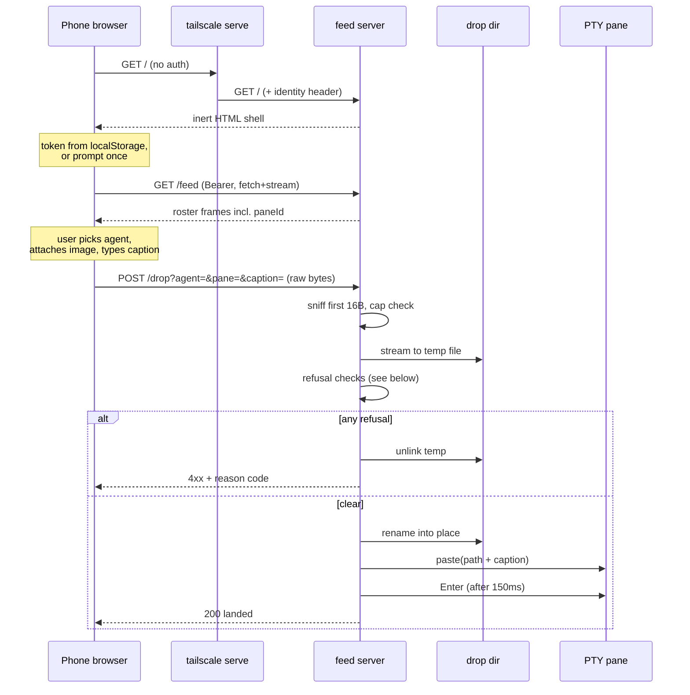
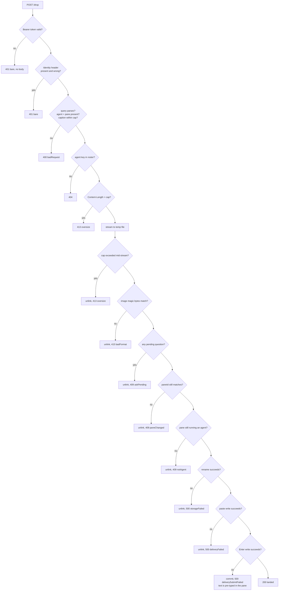
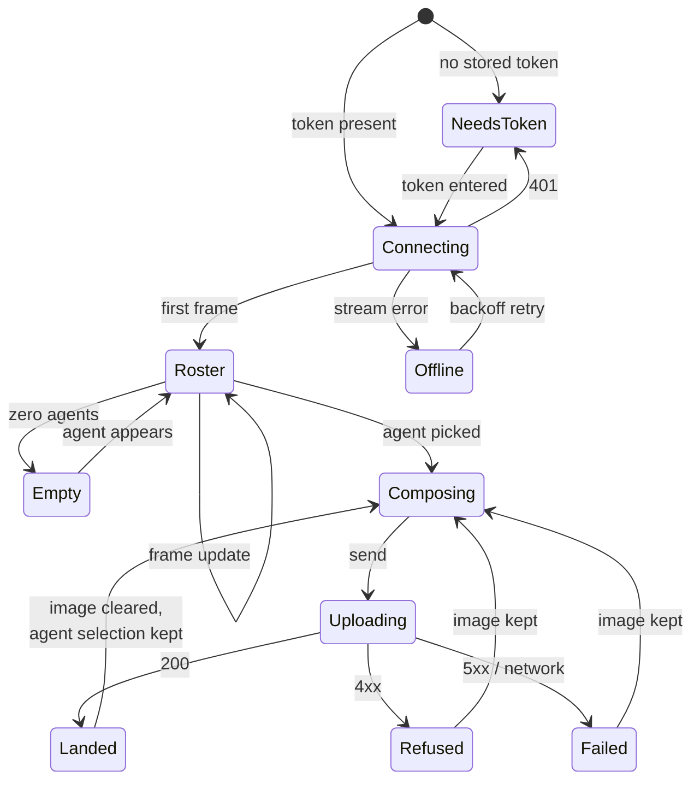

# feat: Phone screenshot drop

## Summary

fly serves a phone-facing upload page over the user's tailnet. From a phone the
user picks a target agent from fly's live roster, attaches a screenshot, writes
a caption, and sends. fly stores the image to a configured drop directory and
delivers its path plus the caption into that agent's pane as one bracketed-paste
submit, so the agent starts on the bug immediately.

The feature is built almost entirely inside `src-tauri/src/feed/` — the existing
bearer-authenticated loopback HTTP surface — and reaches the phone through
`tailscale serve` fronting that same loopback listener. fly never binds beyond
loopback.

Four mechanisms are genuinely new to the feed server: a non-JSON request body,
content-type-driven validation, an HTML response, and an unauthenticated route
that is not `/healthz`. Everything else reuses machinery that already ships —
the roster, the pending-question resolver, the bracketed-paste delivery path,
the atomic owner-only file writer.

Beyond the origin brief, this plan closes four gaps that research surfaced, each
of which the brief's happy path silently depends on: the agent's ability to read
the stored file at all, how a browser page authenticates when it cannot send a
bearer header, what happens when a drop lands on a non-permission question, and
what happens when the target pane is no longer the agent that was picked.

---

## Problem Frame

Bugs get caught on the phone, away from the desk. Today the screenshot travels
by email-to-self: send it, come back to the machine, download it, then type a
description of the wanted behavior change into a fly pane. Both the image and
the description are load-bearing — the description is doing real work, not just
labeling the picture.

The cost is the round trip. Everything waits until the user is physically back
at the machine, and by then the moment that produced the screenshot has to be
reconstructed from memory.

fly already carries most of the machinery. The feed publishes a live agent
roster over SSE and writes text into a chosen agent's PTY. It is text-only and
bound to loopback. The gap between it and this brief is an image-accepting
route and a way to reach the listener from a phone.

**What research changed about the frame.** The brief assumed the delivered path
would simply be readable by the agent. It is not, universally: Claude Code gates
reads outside the pane's working directory, and this repo already paid for that
lesson — `src/lib/handoff.ts` passes `--add-dir` precisely so a transcript read
outside cwd needs no approval. In bypass-permissions mode (this user's normal
posture) the gate does not apply and an absolute path just reads. In default
permission mode it prompts once. That is degraded, not broken, and the plan
states it rather than promising an unprompted read.

---

## Requirements

Requirements R1–R12 carry over from the origin document. R2 and R10 are amended
where research showed the original wording was unsatisfiable; R13–R19 are new.

### Capture and delivery

- **R1.** A drop carries an image and a caption. The caption is optional; the
  image is not. *(origin R1)*
- **R2.** fly persists the uploaded image to a configured directory on this
  machine that the target agent can read, and never deletes a **delivered**
  image. *(origin R2, amended — see KTD7: an image whose delivery is refused or
  fails is removed, so a refusal leaves no residue.)*
- **R3.** Delivery presents the stored image path and the caption together as
  one agent-visible input, composed as a fixed prompt that names the path as an
  image to read. *(origin R3)*

### Phone surface

- **R4.** The page lists the agents currently available to receive a drop, with
  enough identifying detail — working directory, status, workspace, and tab — to
  tell two sessions apart from a phone. *(origin R4, widened past cwd+status)*
- **R5.** The page reports the outcome of a send — landed, refused, or failed —
  rather than completing silently, and distinguishes each refusal reason.
  *(origin R5)*
- **R6.** The page works in a mobile browser without an installed app, and its
  image picker reaches the camera roll. *(origin R6)*
- **R7.** The roster the page shows reflects fly's live state, not a snapshot
  from page load. *(origin R7)*

### Reachability and authentication

- **R8.** The phone reaches fly over the tailnet without fly binding a listener
  beyond loopback. *(origin R8)*
- **R9.** Every data request from the phone is authenticated by the same bearer
  token that guards the rest of the feed. An unauthenticated request is refused
  without disclosing whether the agent key exists. *(origin R9, scoped to data
  requests — see R19)*
- **R18.** When a request carries a tailnet identity header, it must match the
  configured expected login or be refused. Absence of the header is not a
  refusal; the token remains the boundary. *(new — KTD2)*
- **R19.** The page shell itself is served unauthenticated and carries no roster,
  no agent data, and no token. It is inert until supplied with one. *(new —
  KTD3)*

### Failure behavior

- **R10.** A drop targeting an agent that is stopped at **any** pending question
  is refused rather than queued, and the refusal is distinguishable from an
  authentication failure or an unknown agent. Detection is best-effort. *(origin
  R10, widened from permission-prompts-only — see KTD5 and R13)*
- **R11.** A drop targeting an agent that is no longer running is refused with a
  reason the page can show. *(origin R11)*
- **R12.** An image larger than the accepted size is refused with a reason, not
  truncated. *(origin R12)*
- **R13.** The pending-question refusal covers choice pickers as well as
  permission prompts, and the plan documents that fly's detection chain has
  known blind spots — a missed detection delivers into an open dialog. *(new)*
- **R14.** The roster exposes a per-pane identity that the phone echoes back on
  the drop; delivery is refused when that identity no longer matches the pane
  the key resolves to. *(new — closes the origin's exits-mid-upload example)*
- **R15.** Delivery is refused when a fresh check shows the target pane is no
  longer running an agent, even though the pane itself is alive. *(new — a
  bracketed paste plus Enter into a bare shell executes the caption)*
- **R16.** The stored image's format is determined by sniffing its leading bytes,
  never by the client-declared content type, and the stored filename is minted
  by fly with no client-supplied component. *(new)*
- **R17.** A storage failure — unwritable directory, disk full — is a
  distinguishable outcome from a refusal, nothing reaches the pane, and no
  partial file remains. *(new)*

---

## Key Technical Decisions

### KTD1. Raw binary request body, not multipart

The upload is `POST /drop?agent=<leafKey>&pane=<paneId>&caption=<...>` with the
image as the raw request body and the caption percent-encoded in the query
string, not `multipart/form-data`.

`tiny_http` hands the handler a plain `Read`. For a body over 1 KiB it wraps the
socket in a length-bounded reader, so streaming that reader into a file keeps
fly's own buffers O(1). Multipart would mean either a new dependency or a
hand-rolled boundary-scanning state machine inside fly's most security-sensitive
listener — a poor trade for exactly one file. Base64-in-JSON was rejected
outright: it inflates the wire by a third and forces both ends to hold the whole
image in memory.

**The refusal paths must drain the body themselves.** `tiny_http`'s body reader
drains whatever is left when the `Request` drops, and it does so by allocating a
single buffer the size of the *client-declared* `Content-Length`, which the
crate parses with no cap of its own. Responding early therefore does not skip
the upload — it defers it to drop time and allocates at whatever size the client
claimed, so a hostile declared length is an allocation attack on a connection
thread of this listener. Every refusal path that leaves bytes unread must drain
the remainder through a fixed-size buffer into a sink before responding, so the
drop-time drain has nothing left to do. This is a correctness requirement, not
an optimization; U6 carries it as a test scenario.

The caption rides the query rather than a header. Headers are byte-oriented, so
an emoji or newline in a caption would need percent-encoding anyway, and a raw
newline in a hand-parsed header value is a header-injection shape. The query is
bounded before decoding and rejected — never lossily repaired — on invalid
encoding.

*(Corrected 2026-07-27, first live drop from a phone: the decoder is
`application/x-www-form-urlencoded`, not bare percent-decoding. The page builds
its query with `URLSearchParams`, which encodes a space as `+` and a literal
plus as `%2B`; decoding `+` as a literal plus studded every multi-word caption
with pluses. The two halves are lossless together. Strictness is unchanged — a
truncated or non-hex escape and any non-UTF-8 byte sequence are still refused
rather than repaired.)*

### KTD2. The bearer token stays the boundary; tailnet identity is additive

`tailscale serve` injects `Tailscale-User-Login` and deletes any inbound copy
first, so a value arriving through the proxy is authentic. It cannot replace the
token: `tailscaled` proxies *to* loopback, and loopback TCP carries no peer
credentials, so a proxied request and one from an arbitrary local process are
indistinguishable at the socket. Any local process could hand-write the header.

The threat this actually protects is narrower than it looks. A process running
as the user can already read the token out of the 0600 config, so the token never
defended against that. Its real value is against a *different* local user — who
can reach loopback but cannot read the config. Trusting the header alone would
give that case away.

So the token is required, and the identity header is an additional check:
refused when present and not matching `feed.expectedTailnetLogin`, ignored when
absent or unconfigured.

**Be precise about what this buys, because it is less than it first appears.**
`tailscale serve` stamps the header with the *tailnet user* who owns the device,
not the device itself. On a personal single-user tailnet every device the user
owns presents the same login, so the realistic leak path — the token pasted into
one of the user's own phones — passes the check unchanged. The identity check
defends against a token used from a device belonging to a *different tailnet
user*, which matters only in a shared-tailnet future, and it does nothing about
a forged header from a local process. It is cheap defense-in-depth against a
threat the origin brief did not raise, not a mitigation for the risk the brief
accepted.

It is also **off by default** (`expected_tailnet_login` defaults to unset), so
the shipped posture is the token alone. U8's operator documentation must
therefore list setting it as an explicit setup step alongside the `tailscale
serve` invocation, or the check ships inert for everyone who follows the
instructions.

### KTD3. Inert unauthenticated shell, `fetch`-based roster stream

Two facts make the obvious design impossible: a browser navigation sends no
`Authorization` header, and `EventSource` cannot set request headers.

`GET /` therefore serves the HTML shell unauthenticated, joining `/healthz` as
the second deliberate exception to the feed's auth-precedes-routing invariant.
The exception is safe for the same reason: the shell carries no roster, no agent
data, and no token, so serving it discloses nothing. Every data request from the
page carries the bearer header normally, preserving R9 unchanged.

The roster is read with `fetch` plus a stream reader rather than `EventSource`,
which lets the page set the header on the SSE request and — a real secondary
benefit — read the status code, so an expired token surfaces as a clear "re-enter
token" state instead of `EventSource`'s silent infinite reconnect.

The token lives in `localStorage`, entered once. WebKit purges script-writable
storage after roughly seven days without interaction, so the user re-pastes
occasionally. A server-issued `HttpOnly` cookie would survive that and keep the
credential out of reach of page scripts, but it needs a session-issuing route and
a revocation surface — too much machinery for a single-user tool. Deferred, not
rejected; the page's storage access is isolated behind one accessor so the swap
is local.

### KTD4. A configured drop directory, defaulting under the data root

`feed.dropDir` names where images land, defaulting to `<data root>/inbox` and
set to `~/projects/inbox` on this machine. Tilde expansion happens at config
read, since Rust does not expand it.

This diverges from every other durable store fly owns, which live under the
`FLY_APP_NAME` data root so a dev flavor stays isolated. The divergence is
deliberate: the brief's "no retention policy" decision means the user prunes by
hand, and a directory they already browse is far likelier to actually get pruned
than one buried in `~/.local/share`. Sharing the directory between the stable and
dev flavors is acceptable because filenames are globally unique by construction.

The permission consequence is stated rather than engineered around. In
bypass-permissions mode the agent reads an absolute path outside its cwd without
a prompt. In default permission mode it prompts once. Writing into the target
pane's own cwd would avoid the prompt universally but pollutes the user's repo
with screenshots, and the pane's cwd is nullable on the roster.

### KTD5. Refuse on any pending question, and say that detection is best-effort

The origin brief refused only on permission prompts. That line is in the wrong
place for a mechanical reason: `feed/io.rs::paste_payload` produces a payload
that *begins* with `ESC[200~`, and at an unfocused Claude picker that leading ESC
reads as a bare Escape and cancels the dialog. The caption then lands in the
composer as an ordinary message.

So a drop onto a choice picker does not fail — it silently destroys a question
the user never saw, and the agent proceeds as though it was never asked. The
existing `askPending` guard in `feed/server.rs` fires only for
`kind == "permission"`, so a choice picker falls straight through it today.

A refusal is visible and recoverable; silent picker destruction is neither.
Mechanically this widens a gate that already exists rather than adding detection.

The honest caveat rides with it: fly's blocked-agent detection is a layered
abstain-on-surprise chain with documented blind spots — the transcript walk is
blind at ask time on Claude Code ≥ 2.1.206, and the screen fallback needs a
sessions file that a child-session claude never writes. When detection misses,
the drop lands into an open dialog and its Enter confirms whatever is
highlighted. The acceptance example is worded as best-effort accordingly.

An agent that is merely *working* still receives the drop. Claude's composer
queues mid-turn input, which is normal behavior and is presumably what the user
wants when they deliberately pick a busy agent. Only questions block.

### KTD6. Two delivery guards, because pane identity alone is insufficient

Leaf keys are stable across respawn and `PtyManager::pane_by_leaf` resolves a key
to the newest *live* pane, so a leaf whose agent exited and was replaced resolves
to the replacement. Two distinct failures follow, and they need different guards.

**Guard one — pane identity.** `AgentEntry` gains `paneId`; the phone echoes it
on the drop; delivery re-checks it against the pane the key resolves to
immediately before writing. Pane ids are monotonic and never reused, so a
respawned session fails the check. This is deliberately *not* the fragile shape
the codebase was burned by in `feed-askedat-restamp-409` — that failure was a
*freshness* stamp the server kept re-stamping under an open dialog. A pane id is
identity, not freshness; it never moves, so a slow phone flow cannot invalidate
it.

Guard one's correctness does, however, depend on the roster being live. The
roster is webview-pushed and `FeedState` never clears its cache on webview
teardown, so a frozen webview serves a stale agent list that the page cannot
distinguish by frame cadence. Every drop would then echo a dead pane id and be
refused `paneChanged` forever with no diagnosis — a drift analog to the bug
above, by a different mechanism. This is why the roster carries an explicit
publish-time stamp (U4) rather than leaving staleness to inference.

**Guard two — a fresh foreground-process probe.** Guard one cannot catch the
worse case: `claude` exits and leaves a bash prompt in the *same* pane. The pane
id is unchanged, the roster keeps listing it as an agent for up to the 1.5s poll
interval, and the delivery is a paste followed by Enter — so the image path and
the caption get **executed as a shell command**. Delivery therefore calls the
existing `PtyManager::is_agent` immediately before writing and refuses if the
pane's foreground process is not an agent. Delivery already runs on the HTTP
connection thread with a deliberate 150ms sleep in it, so the `/proc` read is
affordable.

**Both guards are check-then-act, and the plan does not pretend otherwise.**
Neither can run atomically with the PTY write — `is_agent` resolves the
foreground pid and reads `/proc` with no registry lock held, which is a
deliberate lock-discipline invariant in the pty layer, not an oversight to fix
here. Worse, delivery is *two* writes 150ms apart: if `claude` exits in that
window, the pasted bytes already sitting in the tty buffer are inherited by the
shell and the delayed Enter runs them. The guards narrow the exposure from the
1.5s roster-poll interval to that 150ms gap; they do not close it. Mitigation:
re-run `is_agent` immediately before the Enter write and abandon the submit if
it now fails, leaving unsubmitted text in a shell rather than an executed
command. AE5 is worded as best-effort accordingly.

### KTD7. Store, then check, then deliver — and unlink on refusal

Ordering is forced by a conflict the origin brief did not resolve: the
blocked-agent example requires that no image be retained on refusal, but the
checks that most need to be last (pane identity, foreground probe) are best run
immediately before the write, by which time the file exists.

The resolution: stream to a temp file in the destination directory, run every
refusal check, then atomically rename into place and deliver. A refusal unlinks
the temp file, so nothing partial is ever visible. R2's never-delete promise is
amended to cover *delivered* images only, which is what it was actually
protecting.

**Delivery failure splits, because delivery is two writes.** If the *paste*
write fails, nothing reached the pane and the file is unlinked. If the paste
succeeded and the *Enter* failed, the composed prompt is already sitting in the
agent's composer — unlinking then would leave the user hitting Enter at the desk
against a path that no longer exists. So a failed submit **commits** the file
and returns a distinct code telling the user the text is pre-typed and needs an
Enter at the machine. Treating delivery as one boolean would guarantee the
confusing case.

**Crash residue is swept, not prevented.** The unlink-on-drop covers early
returns, not SIGKILL, a panic-abort, or the user quitting fly mid-upload; in
those a partial temp file survives in a directory KTD4 deliberately points at
somewhere the user browses. Temp files therefore carry a distinctive fly-owned
prefix, and `DropStore` construction sweeps prefixed temps older than a few
minutes. The honest claim is that nothing is orphaned by a refusal or an
in-process failure, and crash residue is cleaned at next start.

### KTD8. Cap enforced twice, format sniffed from the first bytes

`feed.dropMaxBytes` defaults to 25 MiB — comfortably above a full-resolution
phone screenshot (2–5 MB PNG) and low enough that a runaway upload cannot fill
the disk. Enforcement happens twice, because `Content-Length` is client-supplied:
an early `413` when the declared length exceeds the cap, and a
`reader.take(cap + 1)` during the stream that aborts, unlinks, and `413`s if the
extra byte materializes.

The declared-length check saves the **disk write**, not the transfer. Because
the body is drained on the refusal path (KTD1), an oversize upload still crosses
the wire before the phone sees its `413`. Failing before the bytes move would
require a `100-continue` negotiation that `tiny_http` does not expose, so the
honest contract is that oversize is refused promptly and cheaply on fly's side,
and the page's own pre-send `file.size` check is what actually spares the user
the upload.

Format comes from sniffing the first 16 bytes against the WHATWG image patterns
— PNG, JPEG, GIF, WebP, HEIC/HEIF, AVIF — never from the declared content type,
which is attacker-controlled and on iOS sometimes simply wrong. The sniffed type
picks the stored extension from a fixed set of literals, so no client string ever
reaches the path. A non-match drains and returns `415`.

HEIC is stored, not rejected. iOS screenshots are PNG, so the common path is
unaffected, but a camera photo may arrive as HEIC and the agent's image reader
may not open it. The page warns on a HEIC selection rather than refusing —
refusing a file fly can perfectly well store, on a guess about what the agent
supports, is the wrong call.

### KTD9. A dedicated HTTPS port, not a subpath mount

Setup is `tailscale serve --bg --https=8443 http://127.0.0.1:<feed port>`.

`--bg` is mandatory; without it the mount is a foreground session that dies with
the terminal. A dedicated port rather than `--set-path` on 443 for two reasons:
443's root mount is already claimed on this machine by another service, and a
`--set-path` mount **strips the prefix** before proxying, which would silently
break any root-absolute URL in the page. A root mount on its own port removes
that whole class of bug.

`tailscale funnel` must never appear in fly's docs or UI — the same port cannot
be Serve and Funnel simultaneously, last command wins, and a stray funnel
invocation converts the private mount to public.

### KTD10. The page is embedded in the binary

`include_str!` of a single self-contained HTML file. This matches fly's
single-binary posture, needs no runtime asset lookup or data-root dependency, and
keeps the page versioned with the server that speaks to it. The page is one file
with inline CSS and JS — no build step, no bundler entry, no dependency on the
Vite pipeline that builds fly's own webview.

---

## High-Level Technical Design

### The drop, end to end

### Refusal precedence

Ordered so that the cheapest and least disclosing checks run first, and so that
nothing is written before a decision that does not need the bytes.

Every 4xx/5xx after the 401s carries a JSON `{"error": "<code>"}` discriminator,
following the existing route's `askPending` precedent, so R5 can render a
distinct message per reason. The 401s stay bare and bodyless, preserving the
non-disclosure posture — including the identity-header refusal, which is
deliberately indistinguishable on the wire from a bad token. Because that makes
a mistyped `expectedTailnetLogin` look exactly like a wrong token, the identity
refusal must emit a server-side log line naming the received and expected
logins, and U8's docs point the operator at it when the page loops on token
entry.

### Page states

The retained-vs-cleared distinction matters on a phone: after a landed drop the
image is cleared but the agent selection persists, so a second screenshot to the
same agent is one tap. After a refusal the image is kept, so a retry against a
different agent does not mean re-picking from the camera roll.

---

## Implementation Units

### U0. Premise spike (manual, before any code)

**Goal.** Settle the two assumptions the design rests on, before seven units are
built on them.

**Requirements.** KTD3, KTD4, R3, R7.

**Dependencies.** None. Everything else depends on this.

**Files.** `docs/notes/2026-07-24-phone-drop-live-check.md` (results only).

**Approach.** Neither check needs the route or the page, and both are minutes of
manual work:

1. **The unprompted read.** Place an image by hand in the intended drop
   directory, then type a candidate U3 prompt into a live bypass-permissions
   pane. Confirm the read happens with no permission prompt, *and* that the
   wording actually makes Claude open the file rather than treat the path as a
   string. If the read prompts, KTD4's directory choice is wrong and must be
   revisited before U1.
2. **SSE through the proxy.** Put `tailscale serve --bg` in front of the
   existing feed port and read `/feed` from another tailnet device. Confirm
   frames arrive incrementally rather than buffering to completion. If they
   buffer, the live roster (R7) has no transport and U4/U7 need redesign.

The iOS-PNG-versus-HEIC question stays in U8 — it genuinely needs the page's
file input to answer, and its failure mode is a warning banner, not a redesign.

**Execution note.** This is a spike, not a deliverable. Record what happened,
including the exact Claude Code version, and stop. No production code.

**Test scenarios.** *Test expectation: none — this unit produces a recorded
finding, not behavior.*

**Verification.** Both answers written to the notes file, with the prompt wording
that worked carried into U3.

---

### U1. Config surface for the drop

**Goal.** Add the knobs the rest of the plan reads, with back-compatible defaults.

**Requirements.** R2, R12, R18, KTD2, KTD4, KTD8.

**Dependencies.** None.

**Files.**
- `src-tauri/src/config/schema.rs` — extend `FeedConfig`, validate `drop_dir`'s shape
- `src-tauri/src/feed/drop.rs` — the pure `expand_tilde` helper (applied in `lib.rs`)
- `src/lib/config.ts` — mirror the new fields

**Approach.** Three new fields on the existing `FeedConfig`, keeping the single
`feed` block rather than introducing a second top-level section: `drop_dir:
Option<String>` (None ⇒ `<data root>/inbox`), `drop_max_bytes: u32` (default
`25 * 1024 * 1024`), `expected_tailnet_login: Option<String>` (default None ⇒
identity check disabled).

`Config` derives `Eq`, so the size cap is a `u32`, not a float.

**Tilde expansion happens at `DropStore` construction, not at deserialization.**
`set_config` round-trips the whole `Config` struct back to disk, so an expansion
baked into the in-memory struct would be persisted the first time the settings
menu saves anything — silently rewriting the user's `~/projects/inbox` to an
absolute path and freezing `$HOME` into their config file. `drop_dir` therefore
stays the raw user string in `Config`, validated at read (absolute or
tilde-prefixed, else rejected rather than silently resolved against the process
cwd), and a pure `expand_tilde` helper is applied where `lib.rs` builds the
store.

**Patterns to follow.** `FeedConfig`'s existing struct-level `#[serde(default)]`
plus the parent `Config` container default — both are required for a partial
`{"feed":{"port":5000}}` to fill siblings. `AutomationDefaults` is the nearest
precedent for a nested optional block. The frontend mirror uses `string | null`
for `Option<String>`, and `setConfig` merges onto the cached raw object so
unknown backend fields survive.

**Test scenarios.**
- An empty config yields `drop_dir: None`, `drop_max_bytes: 26214400`,
  `expected_tailnet_login: None`.
- A config specifying only `feed.port` retains all three drop defaults.
- A config file written before this change parses without error.
- Tilde expansion: `~/projects/inbox` resolves against `$HOME`; `~` alone
  resolves to `$HOME`; an absolute path passes through unchanged; a bare relative
  path is rejected.
- Round-trip: a config with all three fields set serializes and re-parses equal.

**Verification.** `cargo test` covers the defaults and back-compat; `pnpm check`
type-checks the frontend mirror.

---

### U2. Image sniffing and durable storage

**Goal.** A pure format sniffer plus a streaming, atomic, owner-only writer that
never lets client input reach the path.

**Requirements.** R2, R12, R16, R17, KTD7, KTD8.

**Dependencies.** U1.

**Files.**
- `src-tauri/src/feed/drop.rs` — new module: `sniff_image`, `mint_filename`,
  `DropStore`
- `src-tauri/src/feed/mod.rs` — declare the module
- `src-tauri/tests/fixtures/images/` — real captured sample files

**Approach.** `sniff_image(&[u8]) -> Option<ImageKind>` matches the WHATWG image
patterns over the first 16 bytes. It is total and abstains on surprise: an
unrecognized prefix returns `None` rather than guessing. `ImageKind` maps to a
`&'static str` extension via an exhaustive match, so the extension is one of a
fixed set of literals.

`mint_filename(now, rand) -> String` produces
`<UTC timestamp>-<8 hex bytes CSPRNG>.<ext>`. Both inputs are injected so the
function is deterministic under test. Nothing client-supplied participates.

`DropStore` owns the destination directory, canonicalized once at construction.
`store(reader, cap) -> Result<StoredImage, DropError>` buffers the first 16
bytes to sniff, creates the temp file only after a successful match, then streams
the remainder through a `take(cap + 1)` bound. It returns a handle holding the
temp path; `commit()` renames into place and `discard()` unlinks. `Drop` on an
uncommitted handle unlinks, so an early return in the caller cannot orphan a
file.

`DropStore::new` creates the directory `0700` if absent, canonicalizes it, and
sweeps stale prefixed temp files (KTD7). A construction failure is **retained
and reported per request** as `storageFailed` — it never blocks the feed
listener from starting, which AE8 depends on.

Writes follow the established durable-file discipline: directory `0700`, file
`0600`, temp-in-same-directory then rename, `sync_all` before rename and a
best-effort parent-directory fsync after — the agent will read the path
immediately, so durability before delivery is not optional.

**Note the streaming constraint.** `automations::store::write_atomic_owner_only`
takes a fully-materialized `&[u8]` and must **not** be called with an image
body — doing so reintroduces the 25 MiB buffer KTD1 exists to avoid. `DropStore`
writes its own streaming temp file (mode-0600 `OpenOptions`, chunked copy,
`sync_all`, rename) while reusing that module's `create_private_dir` and
`sync_parent_dir` directly. The atomic writer is the *discipline* precedent
here, not the primitive.

**Patterns to follow.** `automations::store::{create_private_dir,
sync_parent_dir}` are `pub(crate)` and reusable directly.
`automations/mod.rs::read_bundle_scoped` is the precedent for
canonicalize-and-scope. `session/mod.rs::safe_key` is the precedent for
filtering a string that becomes a path component — though here the stronger
invariant applies: no client string is a path component at all.

**Test scenarios.**
- Sniff returns the right kind for each of PNG, JPEG, GIF, WebP, HEIC, AVIF using
  real fixture files.
- Sniff returns `None` for: an empty slice, a 3-byte slice, a text file, a PDF,
  and a WebP-length RIFF whose bytes 8–12 are not `WEBP`.
- A file whose declared content type is `image/png` but whose bytes are JPEG is
  stored with a `.jpg` extension — the sniff wins.
- `mint_filename` with fixed inputs is deterministic; two calls with different
  random bytes differ; the output contains no path separator and no `..`.
- `store` with a body one byte over the cap returns an oversize error and leaves
  no file in the directory.
- `store` with a body exactly at the cap succeeds.
- `store` on a non-image body returns a format error, and no temp file remains.
- An uncommitted `StoredImage` dropped without `commit()` leaves no file.
- `commit()` produces a file with mode `0600` in a directory with mode `0700`.
- Storing into a read-only directory returns a storage error, not a panic.
- The canonicalized stored path is inside the configured directory.

**Verification.** Unit tests run without a Tauri app; the directory is a
`tempfile::TempDir` in every case.

---

### U3. Prompt composition

**Goal.** Pin the exact text that reaches the composer, including the
caption-less case.

**Requirements.** R1, R3.

**Dependencies.** None.

**Files.**
- `src-tauri/src/feed/drop.rs` — `compose_drop_prompt`

**Approach.** A single pure function taking the stored path and the optional
caption and returning the submit text. The framing must name the path as an
image to read — a bare path followed by a caption reads ambiguously and may not
prompt the agent to actually open the file, which would make the whole feature
silently useless.

The caption is untrusted text bound for a PTY, so it goes through the existing
`sanitize → scrub → truncate` pipeline before composition, in that order. The
ordering is not incidental: scrubbing before sanitizing lets a zero-width
character inside a token-shaped string defeat the prefix match. The composed
result is then handed to `paste_payload`, which strips remaining control
characters including ESC, so a caption cannot forge paste markers.

The path is fly-minted and needs no sanitizing, but it is emitted in a position
where surrounding whitespace cannot split it — the minted filename contains no
spaces by construction, and a test pins that.

**Patterns to follow.** `src/lib/handoff.ts::handoffPrompt` is the precedent for
a stock, tested prompt string. `feed/io.rs::clean` is the sanitize/scrub/truncate
pipeline and its doc comment explains the ordering.

**Test scenarios.**
- With a caption, the output contains the path and the caption, and names the
  path as an image.
- With no caption, the output is the path framing alone and is non-empty.
- With a whitespace-only caption, the result is identical to the no-caption case.
- A caption containing an ESC byte produces output with no ESC byte.
- A caption containing a token-shaped secret is scrubbed.
- A caption longer than the cap is truncated, and truncation happens after
  scrubbing.
- A caption containing newlines survives as a single submit (newlines preserved
  in the paste, which is what bracketed paste is for).

**Verification.** Pure unit tests.

---

### U4. Pane identity on the roster

**Goal.** Carry a per-pane identity from fly's own dashboard model out to the
phone, so the drop can pin it.

**Requirements.** R4, R14, KTD6.

**Dependencies.** None.

**Files.**
- `src-tauri/src/feed/wire.rs` — add `pane_id` to `AgentEntry`
- `src/lib/feed.ts` — carry `paneId` through `buildFeedPayload`
- `src/lib/feed.test.ts` — cover the new field
- `src/App.svelte` — supply the pane id into the dashboard-derived roster

**Approach.** `pane_id: Option<u32>` on `AgentEntry`, `#[serde(default)]` so an
older consumer and an older stored payload both still parse. The field is
additive and nullable, matching how `lastReplyAt` and `questionPendingAt` were
introduced. Null is transient — `App.svelte` populates the leaf→pane map on
spawn — but it is reachable, so U7 renders such a row disabled rather than
letting the user upload into a guaranteed 400.

A second additive field, `published_at`, carries the **webview's** publish time,
distinct from the frame's emit stamp. Without it a frozen webview yields
fresh-looking frames over a dead roster and every drop is refused `paneChanged`
with no diagnosis (KTD6). `FeedState::publish` stamps it; the page shows the
stale state and disables send when it ages past a small multiple of the poll
interval.

The frontend already owns the leaf→pane mapping that `App.svelte` uses to route
PTY writes; `buildFeedPayload` gains that map as an argument rather than reaching
for global state, keeping the module framework-free and testable.

R4's widening is folded in here: `workspace`, `tab`, and the stable jump `num`
are already on `AgentEntry` and simply need to be rendered by the page (U7). No
new fields are required for the two-same-cwd case.

**Patterns to follow.** The additive-nullable-field convention used by the last
two feed plans. `lib/feed.ts` stays a pure mirror of `wire.rs` with vitest
coverage, and reuses the dashboard's own status values so the feed cannot drift
from what fly displays.

**Test scenarios.**
- A roster built from a group with a known leaf→pane map carries the matching
  `paneId` on each entry.
- A leaf with no pane id yields `paneId: null` rather than omitting the entry.
- `publishedAt` reflects the publish call, not the frame emit — two frames
  emitted from one publish carry the same `publishedAt` and differing
  `emittedAt`.
- An `AgentEntry` JSON payload without `paneId` deserializes with `pane_id: None`
  (Rust back-compat).
- Two agents sharing a cwd produce entries distinguishable by `workspace`, `tab`,
  and `num`.
- `buildFeedPayload` output is unchanged in every other field — a snapshot guard
  against accidental drift.

**Verification.** `pnpm vitest run src/lib/feed.test.ts` and the Rust serde
round-trip test.

---

### U5. Delivery guards and the widened question refusal

**Goal.** Make the two guards and the any-question refusal real, at the point of
delivery.

**Requirements.** R10, R13, R14, R15, KTD5, KTD6.

**Dependencies.** U4.

**Files.**
- `src-tauri/src/feed/server.rs` — widen the pending-question gate for the drop
  route; add the refusal discriminators
- `src-tauri/src/lib.rs` — the drop delivery closure wiring both guards

**Approach.** A new `DropFn` seam alongside the existing `InputFn`, following the
established `Arc<dyn Fn>` pattern so `server.rs` keeps no dependency on
`PtyManager` or `AppHandle` and stays unit-testable with fakes. The closure
performs, in order: resolve the leaf to a live pane; compare the resolved pane id
against the echoed one; probe `/proc` for the pane's foreground process; then
paste and submit.

The question gate reuses `FallbackResolver::resolve_io` — the one source for
every per-agent surface — rather than a new predicate, which would drift. The
widening is to treat *any* exposed pending question as blocking for this route,
where the existing input route blocks only on `kind == "permission"`. The
existing route's behavior is deliberately left alone; this is a drop-route rule.

The foreground probe is the **existing** `PtyManager::is_agent(pane)`, which
already resolves the foreground pid and routes through `cwd::is_claude` with no
registry lock held. No pty-layer change is required — adding a second,
near-duplicate probe is the mistake to avoid here. It is called twice: once with
the other guards, and once more immediately before the Enter write, per KTD6's
residual-race mitigation.

**Execution note.** Both guards are refusal paths whose failure mode is silent
and destructive — write the refusing tests before the delivery path, so a
regression that skips a guard fails loudly rather than delivering.

**Patterns to follow.** The `InputFn` seam and its `InputOutcome` enum;
`pane_by_leaf`'s live-gated newest-id-wins resolution; the existing 409
`askPending` discriminator shape.

**Test scenarios.**
- Delivery with a matching pane id and an agent foreground succeeds and the
  composed text reaches the fake PTY log.
- Delivery whose echoed pane id is lower than the resolved pane's is refused with
  `paneChanged`, and nothing reaches the PTY.
- Delivery to a leaf with no live pane is refused as unknown, not as
  `paneChanged`.
- Delivery to a pane whose foreground process is not an agent is refused with
  `notAgent`, and nothing reaches the PTY.
- A pending **permission** question refuses with `askPending`.
- A pending **choice** question refuses with `askPending` — the regression this
  plan exists to prevent.
- An agent in `working` status with no pending question is delivered to.
- An agent whose question resolution abstains entirely is delivered to (the gate
  fails open, matching the abstain-on-surprise posture, and the plan documents
  the consequence).
- The paste and the Enter arrive as two separate PTY writes, not one.

**Verification.** Fake seams in the integration harness; no running app required.

---

### U6. The upload route

**Goal.** Wire U2, U3, and U5 into `POST /drop` with the full refusal precedence.

**Requirements.** R1, R5, R9, R11, R12, R16, R17, R18, KTD1, KTD7, KTD8.

**Dependencies.** U1, U2, U3, U5.

**Files.**
- `src-tauri/src/feed/server.rs` — route parsing, body streaming, precedence,
  the identity-header check
- `src-tauri/src/lib.rs` — construct the `DropStore` and inject it

**Approach.** `POST /drop?agent=<leafKey>&pane=<paneId>&caption=<...>` — the
existing dispatcher strips the query before matching, so query parsing is new and
needs a small pure helper with its own tests. The caption arrives
form-urlencoded in the query (see the KTD1 correction above) rather than as a
second request, revising KTD1's
follow-up-request sketch downward: a second request would need its own identity
and lifetime, and the caption is small enough that the query carries it with
`OTHER_MAX_CHARS`-style bounding. Query decoding is the one place client text
becomes a Rust string, so it is bounded before decoding and rejected on invalid
encoding rather than lossily repaired.

Body handling streams through `DropStore::store`; the route never holds the image
in memory. The early `Content-Length` check happens before the reader is touched.

**Every refusal path drains before responding** (KTD1). A shared
`drain_and_refuse(req, status, code)` helper copies the unread remainder through
a fixed-size buffer into a sink, then responds — so `tiny_http`'s drop-time
drain never allocates at the client's declared length. Routing every refusal
through the one helper is what keeps this from being forgotten on the path added
next year.

Two new response helpers join the existing trio: `html_response` for U7 and a
`json_error(status, code)` that is just `json_status` with a fixed body shape, so
every refusal discriminator is minted one way.

The identity-header check is a small pure function — given the header value and
the configured expectation, decide allow/refuse — so the RFC-2047 encoded-value
case is testable without a proxy.

**Test scenarios.**
- A well-formed drop to a known agent returns 200 and the composed text reaches
  the fake PTY.
- No `Authorization` header returns a bare 401 with no body, for both a known and
  an unknown agent key — identical responses, pinning the non-disclosure clause.
- A wrong token returns the same bare 401.
- A correct token plus a mismatched identity header returns 401; a matching one
  passes; an absent one passes when unconfigured.
- An unknown agent key returns 404 without the image being stored.
- `Content-Length` above the cap returns 413 and no file is written.
- A request declaring a `Content-Length` far above the cap does not cause an
  allocation proportional to the declared length — the regression guard on
  KTD1's drain requirement.
- Every refusal path leaves the connection reusable (the body was fully drained),
  asserted by issuing a second request on the same connection after a refusal.
- A body that exceeds the cap despite a small declared `Content-Length` returns
  413 and leaves no file.
- A non-image body returns 415 and leaves no file.
- A drop with a missing `pane` parameter returns 400.
- A caption with invalid percent-encoding returns 400.
- A caption's `+` decodes to a space and `%2B` to a literal plus (the
  `URLSearchParams` contract the page actually emits — added 2026-07-27).
- A caption over the cap returns 400 rather than being truncated.
- Each refusal returns its distinct `error` code, and the set of codes is
  exhaustive over the precedence flowchart.
- A delivery failure after a successful store leaves no file behind.
- A `GET /drop` returns 405, matching the existing known-route-wrong-verb rule.

**Verification.** `cargo test --offline --manifest-path src-tauri/Cargo.toml
--test feed_server`.

---

### U7. The phone page

**Goal.** The surface the user actually touches.

**Requirements.** R4, R5, R6, R7, R19, KTD3, KTD10.

**Dependencies.** U4, U6.

**Files.**
- `src-tauri/src/feed/drop-page.html` — the whole page, inline CSS and JS
- `src-tauri/src/feed/server.rs` — `GET /` serving it unauthenticated

**Approach.** One self-contained file, `include_str!`-embedded. No build step and
no bundler entry: it is not part of the Vite pipeline that builds fly's webview,
and it must not acquire a dependency on it.

The file input is `<input type="file" accept="image/*">` and deliberately carries
**no** `capture` attribute — `capture` opens the camera directly and denies the
photo library, the exact opposite of picking a screenshot. `accept` stays broad
rather than enumerating types: a narrow accept greys out camera-roll assets with
no explanation, and Safari has been observed transcoding PNGs *into* HEIC when
`image/heic` appears in the accept list. No `multiple`.

The roster is read with `fetch` plus a stream reader so the bearer header can be
set and the status code observed. A 401 routes to the token-entry state with the
picked image and caption preserved in memory, and explicitly does **not**
auto-retry — a retry storm against a shell-writing endpoint is the wrong failure
mode. Stream errors back off and reconnect; a 401 does not.

All URLs are relative to the document, so the page survives being mounted at a
subpath even though KTD9 chooses a root mount.

Upload progress is omitted. `fetch` cannot report it, streaming request bodies
are unsupported in Safari, and the portable fallback would mean rewriting the
send on `XMLHttpRequest` for a transfer that takes about a second on a tailnet.
An indeterminate spinner with a disabled send button is the better spend.

The page renders `workspace`, `tab`, `num`, `cwd`, and `status` per agent (R4),
warns on a HEIC selection without blocking it (KTD8), and shows the empty-roster
and stale-roster states from the state diagram — the latter driven by U4's
`publishedAt`, which also disables send. A row whose `paneId` is null renders
disabled with a "still starting" label rather than being selectable, since
sending to it would return a bare 400 after a full upload.

`GET /` is served with `Content-Security-Policy: frame-ancestors 'none'`. The
page holds a live token and a PTY-write action, and nothing else prevents
another site the phone has open from framing it.

**Test scenarios.** The page is a static asset with no test harness in this repo;
its logic is deliberately thin and its behaviors are verified through U6's route
contract and the U8 live check. What *is* tested here:
- `GET /` returns 200 with `Content-Type: text/html` and no `Authorization`
  header.
- The served body contains no token and no agent data — a substring assertion
  pinning R19's inertness.
- `GET /` while the roster is populated returns a byte-identical body to `GET /`
  with an empty roster, proving the shell is not templated with state.

**Verification.** Route-level assertions in the integration test; visual and
interaction behavior verified live in U8.

---

### U8. Integration contract, operator docs, and the live check

**Goal.** Pin the full status contract in one place, document the tailscale
setup, and verify the parts that cannot be tested in-process.

**Requirements.** R5, R6, R8, R13, KTD9.

**Dependencies.** U6, U7.

**Files.**
- `src-tauri/tests/feed_server.rs` — the consolidated contract test
- `docs/plans/README.md` — index row for this plan
- `CLAUDE.md` — extend the `feed/` module description
- `docs/notes/2026-07-24-phone-drop-live-check.md` — the live-check record

**Approach.** The integration test consolidates the per-unit route assertions
into one exhaustive table over the refusal precedence, mirroring how the
other-answer plan pinned its status contract — the goal is that a future change
which reorders precedence fails a test that reads like the flowchart.

`binds_loopback_only` must remain meaningful: this plan adds reachability without
adding a bind, and that test is the guard on that claim. Extend it to assert the
drop route is reachable only on the loopback address.

Operator documentation covers the exact `tailscale serve --bg --https=8443`
invocation, that `--bg` is required for persistence, that MagicDNS and HTTPS
certificates must be enabled, and that the machine and tailnet names appear in
public Certificate Transparency logs. It states plainly that `tailscale funnel`
must never be used, and why: the same port cannot be both, last command wins, and
a stray funnel converts the private mount to public.

Three further steps are **required**, not optional asides, because each is
load-bearing for a claim made elsewhere in this plan:
- **Set `feed.expectedTailnetLogin`.** KTD2's check is off until it is set, and
  the Risks section's residual-risk framing assumes it is on.
- **Retrieve the bearer token.** There is no in-app surface that displays
  `feed.token` today; the docs must say where to read it from, since pasting it
  into the phone is step one of using the feature at all.
- **Diagnose a token-entry loop** by checking fly's stderr for the identity
  mismatch log line, since the wire response is deliberately identical to a bad
  token.

**Execution note.** U0 already settled the unprompted read and SSE-through-proxy.
What remains for the live check here needs the built surface: that an iOS camera
roll pick of a screenshot arrives as PNG rather than HEIC, that the whole path
works end-to-end from an actual phone, and that a refusal renders legibly on a
small screen outdoors.

**Test scenarios.**
- The full precedence table, one case per terminal node of the refusal
  flowchart, asserting both status and `error` code.
- Loopback-only binding still holds with the new routes registered.
- Two drops in flight to the same agent do not interleave in the PTY log — they
  serialize or the second refuses, but the composer never receives a spliced
  line.
- A drop immediately following a landed drop to the same agent succeeds, pinning
  that nothing latches per-leaf in a way that blocks repeat sends.

**Verification.** The Rust suite is green; the live check is recorded in
`docs/notes/` with the Claude Code version pinned, following the precedent of
the question-detection and monitor-enrichment notes.

---

## Scope Boundaries

### Carried from the origin brief

- Reading agent replies, the conversation tail, or pending questions from the
  phone. The feed already serves all of it; the page deliberately does not.
- Sending free text from the phone. The caption rides an image; there is no
  text-only send.
- Answering permission prompts remotely. `feed.allowPermissionAnswers` stays off.
- Dispatching a new agent or automation run from a screenshot. Drops go to a live
  pane only.
- A self-hosted collaboration relay. Running Postgres, Redis, and object storage
  to move one screenshot is the wrong trade.
- A file-sync watcher (Taildrop into a watched folder). Cheaper, but a dropped
  file carries no target selection, which is the requirement that drove the
  design.

### Deferred to follow-up work

- **A server-issued session cookie** replacing the `localStorage` token (KTD3).
  Survives WebKit's seven-day purge and keeps the credential out of page scripts.
  Deferred for a session-issuing route and revocation surface, not rejected; the
  page isolates storage access behind one accessor so the swap stays local.
- **Retention and pruning.** The brief chose no retention policy, and R2 honors
  it. A daily-uploading phone will accumulate indefinitely. A startup prune by
  age or total directory size is the obvious follow-up once real usage shows
  whether it matters.
- **Passing `--add-dir <drop dir>` when fly spawns agent panes.** Would make the
  default-permission-mode read unprompted too, but only for panes spawned after
  the change — not the live panes this feature targets.
- **Client-side HEIC transcoding.** WebKit decodes HEIC natively, so
  `createImageBitmap` into a canvas could produce a JPEG before upload. It would
  silently fail on desktop browsers and needs a decode-success gate; the page
  warns instead (KTD8).
- **A revocation path for the feed token.** There is no rotate action anywhere in
  the codebase today. The identity check (KTD2) blunts the loss, and tailnet
  device removal is the real revocation, but an in-app rotate is the honest
  eventual answer.
- **Widening the existing input route's question gate** to match the drop route's
  any-question rule. The same silent-picker-cancellation hazard applies there,
  but changing it is a behavior change for the existing consumer and belongs in
  its own change.

---

## Acceptance Examples

Origin AE1–AE3 are carried with AE1 reworded for best-effort detection; AE4–AE12
are new.

- **AE1. Blocked agent.** *Covers R10, R13.* **Given** the target agent is
  stopped at a permission prompt that fly's detection chain has resolved,
  **when** the user sends a screenshot to it, **then** nothing reaches the pane,
  no image is retained, and the page says that agent is waiting on an answer at
  the machine. Detection is best-effort: when the chain abstains, the drop is
  delivered and its Enter may confirm the open dialog.

- **AE2. Agent replaced mid-upload.** *Covers R11, R14.* **Given** the user
  selected an agent whose session has since exited and been replaced in the same
  slot, **when** the upload completes, **then** the send is refused as
  `paneChanged` and no image is retained, rather than delivering into the
  replacement session.

- **AE3. Caption omitted.** *Covers R1, R3.* **Given** the user attaches an image
  and leaves the caption empty, **when** they send, **then** the agent receives
  the image path framed as an image to read, and the drop is not refused for the
  missing caption.

- **AE4. Choice picker.** *Covers R13.* **Given** the target agent is sitting on
  a multiple-choice picker, **when** the user sends, **then** the drop is refused
  and the picker survives — rather than the paste's leading escape cancelling it
  and the caption landing in the composer as an ordinary message.

- **AE5. Pane is no longer an agent.** *Covers R15.* **Given** the target pane's
  `claude` has exited leaving a shell prompt, and the roster has not yet caught
  up, **when** the user sends, **then** the drop is refused as `notAgent` and
  nothing is typed — rather than the path and caption executing as a shell
  command. Best-effort: the guards are check-then-act, so an exit inside the
  150ms paste-to-Enter window can still leave unsubmitted text in the shell. The
  pre-Enter re-probe means it is not *executed*.

- **AE6. Oversize.** *Covers R12.* **Given** an image above the cap, **when** the
  user sends, **then** the send is refused with a reason distinct from blocked,
  gone, and unauthenticated, and no partial file remains. The page's own
  pre-send size check is what spares the user the upload; fly's refusal is
  prompt but still reads the body (KTD1).

- **AE7. Non-image.** *Covers R16.* **Given** a file whose bytes are not an
  image, regardless of its declared content type, **when** the user sends,
  **then** the send is refused with a format reason and nothing is stored.

- **AE8. Storage failure.** *Covers R17.* **Given** the drop directory is
  unwritable, **when** the user sends, **then** the page reports a failure
  distinguishable from a refusal, nothing reaches the pane, and no partial file
  remains.

- **AE9. Delivery failure after store.** *Covers R2, R17.* **Given** the image
  stores successfully but the **paste** write fails, **when** the send completes,
  **then** the page reports failure and no orphaned file is left in the drop
  directory. **And given** instead that the paste succeeded but the **Enter**
  write failed, **then** the file is kept and the page says the text is
  pre-typed in the pane and needs an Enter at the machine — because unlinking
  would strand a path the agent is about to be asked to read.

- **AE10. Unauthenticated non-disclosure.** *Covers R9.* **Given** a request with
  a missing or wrong token, **when** it targets a known agent key and when it
  targets an unknown one, **then** both are refused identically — bare 401, no
  body — so the response cannot be used to probe which agents exist.

- **AE11. Repeat send.** *Covers R5.* **Given** a drop has just landed, **when**
  the user picks a second image, **then** they can send it to the same or a
  different agent without reloading the page or re-entering the token, and the
  agent selection from the previous send is still in place.

- **AE12. Empty roster.** *Covers R7.* **Given** no agents are running, **when**
  the page loads, **then** it says so explicitly and the send path is
  unavailable, rather than presenting an empty picker that appears broken.

---

## Risks & Dependencies

**The token now leaves the machine.** Accepted in the origin brief on the grounds
that the tailnet is personal and single-user. It grants PTY write access to every
running agent from any tailnet device. The identity check (KTD2) means a leaked
token alone is insufficient from another device, and the absence of any rotate
path (deferred above) is the residual gap. This should be revisited if fly is
ever distributed more broadly — the feed's own original plan already flagged that
an always-on local listener should flip to opt-in in that case.

**Blocked-agent detection has known blind spots.** Documented in KTD5 and worded
into AE1. The transcript walk is blind at ask time on Claude Code ≥ 2.1.206, the
screen fallback needs a sessions file that child sessions never write, and
AskUserQuestion fires no attention hook. This is a best-effort guarantee and the
plan does not pretend otherwise.

**A multi-megabyte upload parks a connection thread.** The server is
thread-per-connection with a 64-slot cap, and a cellular upload holds a slot for
its duration. At 64 slots for a single-user tool this is acceptable, but it is a
real change in the shape of traffic this listener sees. The SSE path must not
acquire buffering or shared locks as a side effect — the 2026-07-23 performance
audit explicitly marked the feed SSE core as verified-efficient.

**`tailscale serve` is assumed, not verified in this repo.** The setup is an
operator step, not something fly configures or detects. If the mount is absent
the phone simply cannot connect, with no diagnostic from fly. Adding a
reachability check is out of scope but is a natural follow-up if this bites.

**Unverified externals to settle during U8.** SSE streaming through the proxy
without buffering; iOS delivering a screenshot as PNG rather than HEIC; and the
premise itself — a bypass-permissions agent reading the dropped path without a
prompt. The third governs KTD4 and should be checked first.

**Dependency: `feed.enabled` defaults on and the token is minted on first run.**
No new secret-provisioning surface is required. If the token flush fails at
startup, fly already declines to start the feed rather than serving an unreadable
secret, and the phone surface inherits that behavior.

---

## Alternatives Considered

**Trust the tailnet identity header instead of the bearer token.** Would remove
the token from the phone entirely and make revocation a tailnet device removal.
Rejected because `tailscaled` proxies to loopback and loopback TCP carries no
peer credentials, so any local process could forge the header. It weakens the
boundary against a different local user, which is the case the existing design
defends. Retained as an additive check (KTD2).

**Write the image into the target pane's own working directory.** Would make the
read unprompted in every permission mode, not just bypass. Rejected because it
scatters screenshots through the user's repos and the pane's cwd is nullable on
the roster. The configured directory (KTD4) plus the bypass-mode posture covers
the actual usage, and the follow-up `--add-dir` item covers the rest.

**A share-sheet shortcut posting to a fixed agent.** Considered and rejected in
the origin brief: smaller, but iOS-only, with no target selection from the live
roster and no way to report back that the drop landed.

**`multipart/form-data` with a parser crate.** The conventional upload shape.
Rejected in KTD1 — a boundary-scanning state machine in fly's most
security-sensitive listener, or a new dependency, to carry exactly one file whose
metadata fits in a query string.

**A share of the existing `POST /agents/{key}/input` route with a new mode.**
Would reuse the refusal precedence wholesale. Rejected because that route's
contract is JSON-bodied and 64 KiB-capped, and widening it to a streaming binary
body would complicate a route that three consumers already depend on. A separate
route keeps the blast radius at zero for existing behavior — which is also why
the widened question gate (KTD5) applies to the drop route alone.

---

## Open Questions

Deferred to implementation, not blocking:

- The exact prompt wording in U3. The shape is pinned (name the path as an image
  to read, then the caption); the precise sentence should be settled against a
  live agent during U8's check, since it determines whether Claude actually opens
  the file.
- Whether the drop should serialize per-leaf. U8's concurrency test scenario
  asserts no interleaving but leaves the mechanism open — a per-leaf delivery
  mutex and a "one drop in flight, second refuses" rule both satisfy it. Note the
  interaction with two-write delivery: a second drop's paste arriving between the
  first drop's paste and its Enter is exactly the spliced-line case. Pick during
  U5 based on which reads better at the call site.
- Whether `GET /` should also be reachable at `/drop` for a memorable URL. Purely
  cosmetic, decide during U7.

---

## Sources & Research

**Origin.** `docs/brainstorms/2026-07-24-phone-screenshot-drop-requirements.md`

**Repo precedent.**
- `src-tauri/src/feed/server.rs` — routes, the loopback bind, auth-precedes-routing,
  the 64 KiB cap, the refusal precedence this plan mirrors
- `src-tauri/src/feed/io.rs` — `paste_payload` and the leading-ESC hazard behind
  KTD5; the `clean` sanitize→scrub→truncate ordering
- `src-tauri/src/pty/mod.rs` — `pane_by_leaf`'s live-gated newest-id-wins
  resolution, the basis for KTD6's first guard
- `src-tauri/src/automations/store.rs` — `write_atomic_owner_only`, the durable
  write primitive U2 reuses
- `src-tauri/src/automations/mod.rs` — the monitor-bundle directory scoping
  precedent
- `src/lib/handoff.ts` — the verified outside-cwd permission finding that drove
  KTD4
- `docs/plans/2026-07-04-001-feat-agent-state-local-feed-plan.md` — the feed's
  token-is-the-boundary reasoning
- `docs/plans/2026-07-17-001-fix-audit-remediation-plan.md` — the `askPending`
  gate this plan widens
- `docs/notes/2026-07-11-fix-feed-question-detection-gaps.md` — the detection
  blind spots behind R13

**External research** (load-bearing on KTD1, KTD2, KTD3, KTD8, KTD9):
- [tailscale serve](https://tailscale.com/kb/1242/tailscale-serve) ·
  [Serve feature docs](https://tailscale.com/docs/features/tailscale-serve) ·
  [Funnel](https://tailscale.com/kb/1223/funnel) ·
  [Enabling HTTPS](https://tailscale.com/kb/1153/enabling-https) — proxy
  semantics, `--bg` persistence, identity-header injection and anti-spoof
  stripping, prefix stripping on `--set-path`
- `tailscale/tailscale ipn/ipnlocal/serve.go` and Go's
  `net/http/httputil/reverseproxy.go` — header pass-through, no body cap, no
  proxy timeout, immediate flush for `text/event-stream`
- [MDN: capture](https://developer.mozilla.org/en-US/docs/Web/HTML/Reference/Attributes/capture)
  — why the attribute is omitted (KTD8, U7)
- [WHATWG MIME Sniffing](https://mimesniff.spec.whatwg.org/#matching-an-image-type-pattern)
  — the image magic-byte patterns U2 implements
- [WebKit: Full Third-Party Cookie Blocking and More](https://webkit.org/blog/10218/full-third-party-cookie-blocking-and-more/)
  — the seven-day script-storage purge behind KTD3's deferred cookie
- [OWASP Session Management](https://cheatsheetseries.owasp.org/cheatsheets/Session_Management_Cheat_Sheet.html)
  — the cookie-over-localStorage guidance KTD3 defers rather than dismisses
- [Jake Archibald: Fetch streams are great, but not for measuring progress](https://jakearchibald.com/2025/fetch-streams-not-for-progress/)
  — why U7 omits an upload progress bar
- [Apple Developer Forums 743049](https://developer.apple.com/forums/thread/743049)
  — Safari transcoding PNGs to HEIC when `image/heic` appears in `accept`
